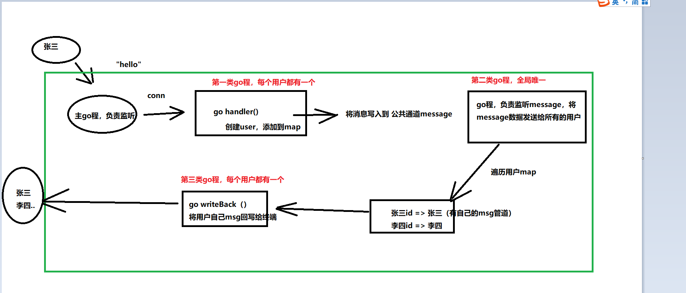
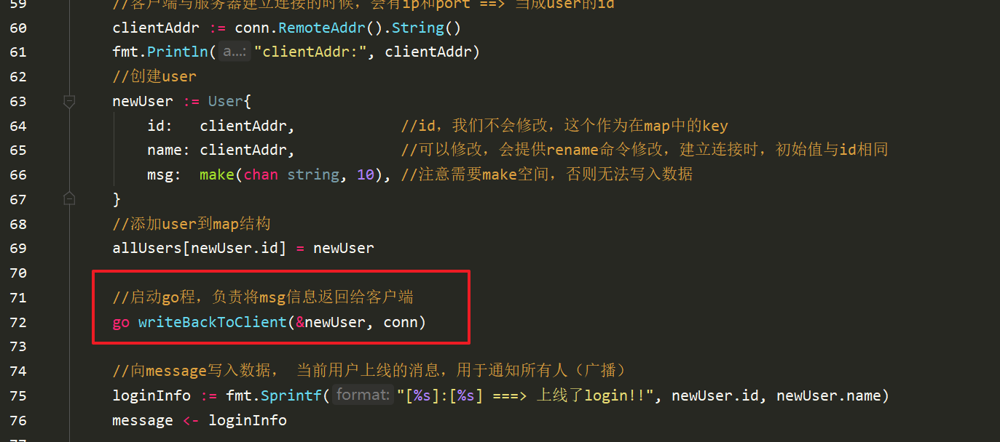

[[toc]]

# 一、概述

实现一个网络聊天室（群），

功能分析：

1. 上线下线
2. 聊天，其他人、自己都可以看到聊天消息
3. 查询当前聊天室用户名字 who
4. 可以修改自己名字rename|Duke
5. 超时踢出

效果展示：


技术点分析：

1. sockt tcp编程
2. map结构，
   1. 存储所有的用户
   2. map遍历
   3. map删除

3. go程、channel
4. select（超时退出，主动退出）
5. timer 定时器


# 二、实现基础

第一阶段：

1. 思路分析

## 1.tcp socket，建立多个连接

```go
package main

import (
	"fmt"
	"net"
)

//将所有的代码写在一个文件中，不做代码整理

func main() {
	//创建服务器
	listener, err := net.Listen("tcp", ":8080")
	if err != nil {
		fmt.Println("net.Listen err:", err)
		return
	}
	fmt.Println("服务器启动成功!")

	for {
		fmt.Println("=====> 主go程监听中...")

		//监听
		conn, err := listener.Accept()
		if err != nil {
			fmt.Println("listener.Accept err:", err)
			return
		}

		//建立连接
		fmt.Println("建立连接成功!")

		//启动处理业务的go程
		go handler(conn)
	}
}

//处理具体业务
func handler(conn net.Conn) {
	for {
		fmt.Println("启动业务...")
		//TODO  //代码这里以后再具体实现，当前保留
		buf := make([]byte, 1024)

		//读取客户端发送过来的请求数据
		cnt, err := conn.Read(buf)
		if err != nil {
			fmt.Println("conn.Read err:", err)
			return
		}

		fmt.Println("服务器接收客户端发送过来的数据为: ", string(buf[:cnt-1]), ", cnt:", cnt)
	}
}
```

go run chatroom.go

启动nc


## 2.分析


数据流向：




## 3. 定义User/map结构

```go
type User struct {
	//名字
	name string
	//唯一的id
	id string
	//管道
	msg chan string
}

//创建一个全局的map结构，用户保存所有的用户
var allUsers = make(map[string]User)
```

在handler中调用（建立连接之后）


## 4. 定义message通道


创建监听广播go程函数


启动，全局唯一：


写入上线数据：


bug修复：


效果：


## 5. user监听通道go程

每个用户应该还有一个用来监听自己msg管道的go程，负责将数据返回给客户端

```go

//每个用户应该还有一个用来监听自己msg管道的go程，负责将数据返回给客户端
func writeBackToClient(user *User, conn net.Conn) {
	fmt.Printf("user : %s 的go程正在监听自己的msg管道:\n", user.name)
	for data := range user.msg {
		fmt.Printf("user : %s 写回给客户端的数据为:%s\n", user.name, data)

		//Write(b []byte) (n int, err error)
		_, _ = conn.Write([]byte(data))
	}
}
```




效果：


当前整体代码：

```go
package main

import (
	"fmt"
	"net"
)

//将所有的代码写在一个文件中，不做代码整理

type User struct {
	//名字
	name string
	//唯一的id
	id string
	//管道
	msg chan string
}

//创建一个全局的map结构，用户保存所有的用户
var allUsers = make(map[string]User)

//定义一个message全局通道，用于接收任何人发送过来消息
var message = make(chan string, 10)

func main() {
	//创建服务器
	listener, err := net.Listen("tcp", ":8080")
	if err != nil {
		fmt.Println("net.Listen err:", err)
		return
	}
	//启动全局唯一的go程，负责监听message通道，写给所有的用户
	go broadcast()

	fmt.Println("服务器启动成功!")

	for {
		fmt.Println("=====> 主go程监听中...")

		//监听
		conn, err := listener.Accept()
		if err != nil {
			fmt.Println("listener.Accept err:", err)
			return
		}

		//建立连接
		fmt.Println("建立连接成功!")

		//启动处理业务的go程
		go handler(conn)
	}
}

//处理具体业务
func handler(conn net.Conn) {
	fmt.Println("启动业务...")

	//客户端与服务器建立连接的时候，会有ip和port ==> 当成user的id
	clientAddr := conn.RemoteAddr().String()
	fmt.Println("clientAddr:", clientAddr)
	//创建user
	newUser := User{
		id:   clientAddr,            //id，我们不会修改，这个作为在map中的key
		name: clientAddr,            //可以修改，会提供rename命令修改，建立连接时，初始值与id相同
		msg:  make(chan string, 10), //注意需要make空间，否则无法写入数据
	}
	//添加user到map结构
	allUsers[newUser.id] = newUser

	//启动go程，负责将msg信息返回给客户端
	go writeBackToClient(&newUser, conn)

	//向message写入数据， 当前用户上线的消息，用于通知所有人（广播）
	loginInfo := fmt.Sprintf("[%s]:[%s] ===> 上线了login!!", newUser.id, newUser.name)
	message <- loginInfo

	for {
		//具体业务逻辑
		buf := make([]byte, 1024)

		//读取客户端发送过来的请求数据
		cnt, err := conn.Read(buf)
		if err != nil {
			fmt.Println("conn.Read err:", err)
			return
		}

		fmt.Println("服务器接收客户端发送过来的数据为: ", string(buf[:cnt-1]), ", cnt:", cnt)
	}
}

//向所有的用户广播消息,启动一个全局唯一go程
func broadcast() {
	fmt.Println("广播go程启动成功...")
	defer fmt.Println("broadcast 程序退出!")

	for {
		//1. 从message中读取数据
		fmt.Println("broadcast监听message中...")
		info := <-message

		fmt.Println("message 接收到消息:", info)

		//2. 将数据写入到每一个用户的msg管道中
		for _, user := range allUsers {
			//如果msg是非缓冲的，那么会在这里阻塞
			user.msg <- info
		}
	}
}

//每个用户应该还有一个用来监听自己msg管道的go程，负责将数据返回给客户端
func writeBackToClient(user *User, conn net.Conn) {
	fmt.Printf("user : %s 的go程正在监听自己的msg管道:\n", user.name)
	for data := range user.msg {
		fmt.Printf("user : %s 写回给客户端的数据为:%s\n", user.name, data)

		//Write(b []byte) (n int, err error)
		_, _ = conn.Write([]byte(data))
	}
}

```


# 三、增加功能

## 1. 查询用户

查询命令：who   ==》 将当前所有的登陆的用户，展示出来， id，name  ， 返回给当前用户

在handler中，处理业务逻辑：

```go
		fmt.Println("服务器接收客户端发送过来的数据为: ", string(buf[:cnt-1]), ", cnt:", cnt)
		//-------- 业务逻辑处理  开始----------
		//1. 查询当前所有的用户 who
		//	a. 先判断接收的数据是不是who  ==> 长度&&字符串
		userInput := string(buf[:cnt-1]) //这是用户输入的数据,最后一个是回车，我们去掉它
		if len(userInput) == 3 && userInput == "who" {
			//  b. 遍历allUsers这个map (key : userid  value: user本身)，将id和name拼接成一个字符串，返回给客户端
			fmt.Println("用户即将查询所有用户信息!")

			//这个切片包含所有的用户信息
			var userInfos []string

			//[]string{"userid:z3, username:z3", "userid:l4, username:l4","userid:w5, username:w5"}
			for _, user := range allUsers {
				userInfo := fmt.Sprintf("userid:%s, username:%s", user.id, user.name)
				userInfos = append(userInfos, userInfo)
			}

			//最终写到管道中，一定是一个字符串
			r := strings.Join(userInfos, "\n") //连接数字切片，生成字符串
			//strings.Split() //分割字符串
			//`
			//	"userid:z3, username:z3"
			//	"userid:l4, username:l4"
			//	"userid:w5, username:w5"
			//`

			//将数据返回给查询的客户端
			newUser.msg <- r

		} else {
			//如果用户输入的不是命令，只是普通的聊天信息，那么只需要写到广播通道中即可，由其他的go程进行常规转发
			message <- userInput
		}
		//-------- 业务逻辑处理  结束----------
```


## 2. 重命名

规则：  rename|Duke

1. 读取数据判断长度7，判断字符是rename
2. 使用|进行分割，获取|后面的部分，作为名字
3. 更新用户名字newUser.name = Duke
4. 通知客户端，更新成功


```go
else if len(userInput) > 9 && userInput[:7] == "\\rename" {
			//[:3]  // 0, 1, 2  ==> 左闭右开

			//	规则：  rename|Duke
			//1. 读取数据判断长度7，判断字符是rename
			//2. 使用|进行分割，获取|后面的部分，作为名字
			//func Split(s, sep string) []string
			//arry := strings.Split(userInput, "|")
			//name := arry[1]
			//3. 更新用户名字newUser.name = Duke
			newUser.name = strings.Split(userInput, "|")[1]
			allUsers[newUser.id] = newUser //更新map中的user

			//4. 通知客户端，更新成功
			newUser.msg <- "rename successfully!"
		} else {
			//如果用户输入的不是命令，只是普通的聊天信息，那么只需要写到广播通道中即可，由其他的go程进行常规转发
			message <- userInput
		}
```

效果：


## 3. 主动退出

两种形式：==》 quit，ctrl+c

用户退出：清理工作

1. 从map中删除
2. 对应的conn要close


每个用户都有自己的watch go程，负责监听退出信号

```go
func watch(user *User, conn net.Conn, isQuit <-chan bool) {
	fmt.Println("222222 启动监听退出信号的go程....")
	defer fmt.Println("watch go程退出!")
	for {
		select {
		case <-isQuit:
			logoutInfo := fmt.Sprintf("%s exit already!", user.name)
			fmt.Println("删除当前用户:", user.name)
			delete(allUsers, user.id)
			message <- logoutInfo

			conn.Close()
			return
		}
	}

}
```

在handler中启动go watch，同时传入相应信息：


在read之后，通过读取的cnt判断用户退出，向isQuit中写入信号：


测试结果：


## 4. 超时退出

使用定时器来进行超时管理

如果60s每没有发送任何数据，那么直接将这个连接关闭掉：

```go
<- time.After(60 *time.second)   //chan time
```

```go
更新watch函数

//i,j int
//启动一个go程，负责监听退出信号，触发后，进行清零工作: delete map, close conn都在这里处理
func watch(user *User, conn net.Conn, isQuit, restTimer <-chan bool) {
	fmt.Println("222222 启动监听退出信号的go程....")
	defer fmt.Println("watch go程退出!")
	for {
		select {
		case <-isQuit:
			logoutInfo := fmt.Sprintf("%s exit already!\n", user.name)
			fmt.Println("删除当前用户:", user.name)
			delete(allUsers, user.id)
			message <- logoutInfo

			conn.Close()
			return
		case <-time.After(5 * time.Second):
			logoutInfo := fmt.Sprintf("%s timeout exit already!\n", user.name)
			fmt.Println("删除当前用户:", user.name)
			delete(allUsers, user.id)
			message <- logoutInfo

			conn.Close()
			return
		case <-restTimer:
			fmt.Printf("连接%s 重置计数器!\n", user.name)
		}
	}
}


```

创建并传入restTimer管道，


效果：


## 5. map

```go
package main

import (
	"fmt"
	"sync"
	"time"
)

var idnames = make(map[int]string)
var lock sync.RWMutex

//map不允许同时读写，如果有不同go程同时操作map，需要对map上锁
// concurrent map read and map write
func main() {
	go func() {
		for {
			fmt.Println("111111")
			lock.Lock()
			fmt.Println("2222222")
			idnames[0] = "duke"
			fmt.Println("3333333")
			lock.Unlock()
		}
	}()

	go func() {
		for {
			fmt.Println("aaaaaaa")
			lock.Lock()
			fmt.Println("bbbbbb")
			name := idnames[0]
			fmt.Println("name :", name)
			lock.Unlock()
		}
	}()

	for {
		fmt.Println("OVER")
		time.Sleep(1 * time.Second)
	}
}
```


