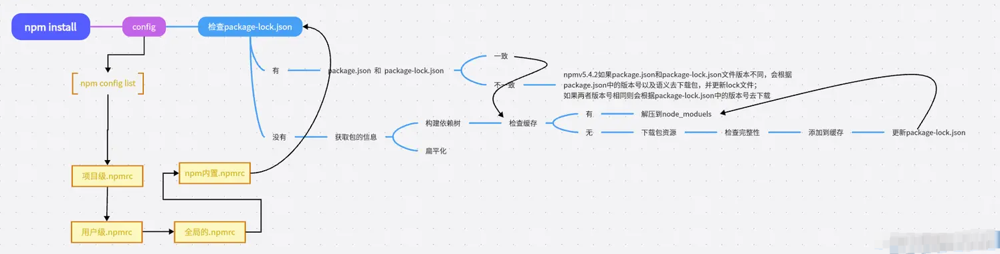

1. `npm install`执行后，会检查并获取npm配置，优先级为：

   项目级别的`.npmrc`文件 > 用户级别的`.npmrc`文件 > 全局的`.npmrc`文件 > npm内置的`.npmrc`文件

```bash
# 查看 npm 配置
npm config ls -l

# 查看 npm 安装的日志
npm install --timing=true --loglevel=verbose

# 查看 yarn 安装的日志
yarn --verbose

# 查看 pnpm 安装的日志
# What level of logs to report. Any logs at or higher than the given level will be shown. Levels (lowest to highest):
#    debug, info, warn, error. 
#    Or use
#    "--silent" to turn off all logging.
pnpm install --loglevel info
```

2. 检查项目中是否有`package-lock.json`文件。

从npm 5.x开始，执行`npm install`时会自动生成一个 `package-lock.json` 文件。

`package-lock.json` 文件精确描述了`node_modules` 目录下所有的包的树状依赖结构，每个包的版本号都是完全精确的。

因此npm会先检查项目中是否有 `package-lock.json` 文件，分为两种情况：

+ 如果有，检查`package-lock.json`和`package.json`中声明的依赖是否一致

  - 一致：直接使用 `package-lock.json` 中声明的依赖，从缓存或者网络中加载依赖

  - 不一致：各个版本的npm处理方式如上图


+ 如果没有，根据`package.json`递归构建依赖树，然后根据依赖树下载完整的依赖资源，在下载时会检查是否有相关的资源缓存

    - 存在：将缓存资源解压到 `node_modules` 中
    - 不存在：从远程仓库下载资源包，并校验完整性，并添加到缓存，同时解压到 `node_modules` 中


3. 最终将下载资源包，存放在缓存目录中；解压资源包到当前项目的`node_modules`目录；并生成 `package-lock.json` 文件。

构建依赖树时，不管是直接依赖还是子依赖，都会按照**扁平化**的原则，优先将其放置在 `node_modules` 根目录中(最新的npm规范),
在这个过程中，如果遇到相同的模块，会检查已放置在依赖树中的模块是否符合新模块的版本范围，如果符合，则跳过，不符合，则在当前模块的 `node_modules`
下放置新模块。


**扁平化**


> 下载的依赖在项目的`node_modules`目录放置的排序规则：`.bin` ---> `@系列` ---> **首字母排序abcd**等，

> 使用的算法是**广度优先遍历**，在遍历依赖树时，npm会首先处理项目根目录下的依赖，然后逐层处理每个依赖包的依赖，直到所有依赖都被处理完毕。


4. 在执行 `npm install` 或 `npm update` 命令下载依赖后，除了将依赖包安装在 `node_modules` 目录下外，还会在本地的缓存目录缓存一份。

```bash
// 获取缓存位置
npm config get cache

// 清除缓存
npm cache clean --force

// 删除全局安装包
npm uninstall -g <package>
```


