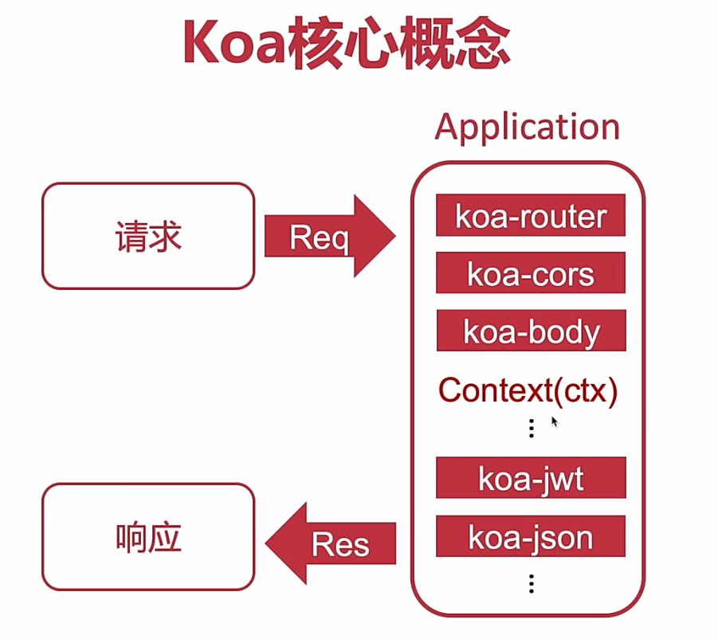

> [koa2 源码解析](https://blog.shenfq.com/2018/koa2-%E6%BA%90%E7%A0%81%E8%A7%A3%E6%9E%90/)

# Koa框架学习笔记

## 一、什么是Koa?

+ [Koa中文网](https://koa.bootcss.com/)
+ [Koa英文网](https://koajs.com/)

Koa是一个新的web框架，致力于成为web应用和API开发领域中一个更小、更富有表现力、更健壮的基石。

它利用**async函数**(以同步的方式写异步代码)丢弃回调函数，并增强错误处理。Koa没有任何预置的中间件，可快速而愉快地编写服务端应用程序。


## 二、Koa核心概念

### 1.Koa Application(应用程序)

### 2.Context（上下文）

### 3.Request(请求)、Response(响应)



```js
const Koa = require('koa');
const app = new Koa();

// context中有request和response参数
app.use(async ctx => {
  ctx.set('Cache-Control', 'no-cache');
  ctx.body = 'Hello World Koa !!'
})

app.listen(3333);
console.log('Server is listening at http://localhost:3333');
```

`ctx`中包含了当前请求的`request`、`method`、`response`

### 4.koa中间件简单使用

```js
const Koa = require('koa');
const app = new Koa({ proxy: true });

app.use(async (ctx, next) => {
    await next();
    
    ctx.assert.equal('object', typeof ctx, 500, 'some dev did something wrong')
})
```


+ 使用`koa-router`创建路由：

```bash
yarn add koa-router
```

```js
const Koa = require('koa');
const Router = require('koa-router');

const app = new Koa();
const router = new Router();

router.get('/admin', ctx => {
    console.log(ctx);
    console.log(ctx.request);
    ctx.body = 'hello admin!'
});

router.get('/api', ctx => {
    console.log(ctx);
    console.log(ctx.request);
    ctx.body = 'hello api!'
});

app.use(router.routes()).use(router.allowedMethods());

app.listen(3001);

console.log('Server is running at http://localhost:3001');
```

+ 使用`koa-static配置静态资源目录`
+ 使用`koa-server-http-proxy`实现服务端代理（**正向代理**）

目的：绕开浏览器同源策略，通过后端代理实现跨域获取数据：

```bash
yarn add koa-server-http-proxy
```

后端一个服务监听5000端口：

```js
const Koa = require("koa");
const static = require("koa-static");
const Router = require("koa-router");

let app = new Koa();
let router = new Router();
app.use(static(__dirname+"/static"));

router.get("/",ctx=>{
    ctx.body = "5000端口"
});

router.post("/Serverpost",ctx=>{
    ctx.body = "5000端口--同源"
})

app.use(router.routes());
app.listen(5000)
```

另一个服务监听4000端口：

```js
const Koa = require("koa");
const static = require("koa-static");
const path = require("path");
const Router = require("koa-router");
const koaServerHttpProxy = require("koa-server-http-proxy");

let app = new Koa();
let router = new Router();
// 配置静态资源目录
app.use(static(path.join(__dirname + "/static")));

router.get("/index", ctx => {
    ctx.body = "4000端口"
});

router.post("/Serverpost",ctx=>{
    ctx.body = "小点声，我偷摸来的"
})

app.use(router.routes());
app.listen(4000)

app.use(koaServerHttpProxy("/api",{
    target:"http://localhost:4000",
    pathRewrite:{'^/api':''},
    changeOrigin:true
}));
```

+ 同时开启http和https:

```js
const http = require('http');
const https = require('https');
const Koa = require('koa');
const app = new Koa();
http.createServer(app.callback()).listen(3000);
https.createServer(app.callback()).listen(3001);
```


### 5.koa工作原理

洋葱模型：


```js
const Koa = require('koa');
const app = new Koa({ proxy: true });

const middleware1 = function async(ctx, next) => {
    // 做一些操作
    console.log('middleware1');
    next();
     console.log('middleware1 ending');
}

const middleware2 = function async(ctx, next) {
    // 做一些操作
    console.log('middleware2');
    // next();
    console.log('middleware2 ending');
}


const middleware3 = function async(ctx, next) => {
    // 做一些操作
    console.log('middleware3');
    next();
    console.log('middleware3 ending');
}
app.use(middleware1).use(middleware2).use(middleware3)

app.listen(3333);
console.log('Server is running at http://localhost:3333');
```

 结果：

```
middleware1
middleware2
middleware2 ending
middleware1 ending
```


**`next()`表示如果还有后续的中间件，那么就继续执行；如果没有next那么请求就终止，后面的中间件也不会执行了。**

## 三、Koa的应用

+ 路由处理：`koa-router`
+ 协议解析：`koa-body`
+ 跨域处理：`@koa/cors`
+ 静态资源：`koa-static`
+ 代理处理：`koa-server-http-proxy`
+ 路由压缩：`koa-combine-routers`
+ 安全headers：`koa-`

### 1.kao开发restful接口

```js
const Koa = require("koa");
const Static = require("koa-static");
const Router = require("koa-router");
const json = require("koa-json");
const cors = require('@koa/cors');
const helmet = require('koa-helmet');

// 为每个接口添加前缀
router.prefix('/api');

router.get("/index", ctx => {
    ctx.body = "4000端口"
});

//get?name=xx&age=17

router.get("/get", ctx => {
    const params = ctx.request.query;
    console.log(params);
   	console.log(params.name);
    ctx.body = { ...params };
});

router.post("/post", async ctx => {
    let { body } = ctx.request;
    console.log(body);
    ctx.body = { ...body };
})

app.use(koaBody());
app.use(helmet());
// 处理跨域
app.use(cors());
//get?name=xx&age=17&pretty
app.use(json({ pretty: false, param: 'pretty' }));
app.use(router.routes()).use(router.allowedMethods());

app.listen(3000)

console.log('Server is running at http://localhost:3000');
```

### 2.模块化拆分

为了便于项目管理，我们需要把路由、api以及业务处理模块拆分出来， 比如定义以下目录结构：

```js
|-app
|	|--node_modules		npm包
|	|--package.json		package文件
|	|--src				
|	|	|--static		静态资源
|	|	|	|--images	图片
|	|	|	|--font		字体	
|	|	|	|--css		样式
|	|	|	|--html		模板
|	|	|--api			接口模块
|	|	|	|-a.js	 	接口a
|	|	|	|-b.js		接口b
|	|	|--routes		路由模块
|	|	|	|-index.js  路由出口 
|	|	|	|-a.js		a路由
|	|	|	|-a.js		b路由
|	|	|--index.js		项目入口
|	|	|--utils		工具库
...	...	...				其他配置文件，比如： eslint、webpack等
```

+ `api/a.js`:

  ```js
  function a(ctx) {
      ctx.body = {
          msg: 'hello from a'
      }
      // 其他处理
  }
  module.exports = a;
  ```

+ `routes/a`:

  ```js
  const Router = require('koa-router');
  const a = require('../api/a');
  
  const router = new Router();
  
  router.get('/a', a);
  
  module.exports = router;
  
  ```

+ `routes/index`：

  ```js
  const combineRouters = require('koa-combine-routers');
  
  const aRoutes = require('./a');
  const bRoutes = require('./b');
  
  
  module.exports = combineRouters(aRoutes, bRoutes);
  
  ```

+ `src/index.js`:

  ```js
  const Koa = require('koa');
  const static = require("koa-static");
  const path = require("path");
  const cors = require('@koa/cors');
  const helmet = require('koa-helmet');
  
  const router = require('./routes/index');
  
  const app = new Koa();
  
  app.use(helmet());
  // 处理跨域
  app.use(cors());
  // 配置静态资源目录
  app.use(static(path.join(__dirname + "/static")));
  app.use(router());
  
  app.listen(3000);
  
  console.log('Server is running at http://localhost:3000');
  ```

### 3.配置热加载nodemon

+ 安装`nodemon`：

  ```bash
  yarn add nodemon -D
  ```

+ 启动时使用：

  ```
  npx nodemon src/index.js
  
  # 或者
  yarn run start # 需要下面的配置
  ```

+ 配置脚本`package.json`

  ```json
  {
      "script": {
          "start": "nodemon scr/index.js"
      }
  }
  ```

  

### 4.配置webpack

+ 安装依赖：

  ```bash
  # webpack相关
  yarn add webpack webpack-cli -D
  
  # es6相关
  yarn add babel-loader @babel/core @babel/node @babel/preset-env -D
  
  # 其他 cross-env 设置环境变量 
  yarn add clean-webpack-plugin webpack-node-externals cross-env -D
  ```

+ 配置`webpack.config.base.js`：

  ```js
  const webpack = require('webpack');
  const path = require('path');
  const nodeExternals = require('webpack-node-externals');
  const { CleanWebpackPlugin } = require('clean-webpack-plugin');
  
  const webpackConfig = {
      target: 'node',
  
      entry: {
          server: path.join(__dirname, 'src/index.js')
      },
  
      output: {
          filename: '[name].bundle.js', // 相对路径
          path: path.join(__dirname, './dist') // 绝对路径
      },
  
      module: {
          rules: [
              {
                  test: /\.jsx?$/,
                  use: {
                      loader: 'babel-loader',
                  },
                  exclude: path.join(__dirname, '/node_modules')
              }
          ]
      },
  
      externals: [nodeExternals()],
  
      plugins: [
          new CleanWebpackPlugin(),
          // 配置区分生产、开发环境的常量
          new webpcak.DefinePlugin({
              'process.env': {
                  NODE_ENV: (process.env.NODE_ENV === 'production' || process.env.NODE_ENV === 'prod') ? 'production' : 'develpoment'
              }
          })
      ],
  
      node: {
          global: true,
          __dirname: true,
          __filename: true,
      }
  };
  
  module.exports = webpackConfig;
  ```

+ 配置`webpack.config.prod.js`：

  ```bash
  # 压缩js代码
  yarn add terser-webpack-plugin -S
  ```

  

  ```js
  const webpackMerge = require('webpack-merge');
  const baseWebpackConfig = require('./webpack.config.base.js');
  // 压缩js
  const TerserWebpackPlugin = require('terser-webpack-plugin');
  
  const webpackConfig = webpackMerge(baseWebpackConfig, {
     // 生产环境webpack配置 
     mode: 'production',
     devtool: 'eval-source-map',
     stats: { children: false, warning: false },
     optimization: {
          minimize: true,
          minimizer: [
              new TerserWebpackPlugin({
                  treserOptions: {
                      warning: false,
                      compress: {
                          warning: false,
                          // 是否注释掉console
                          drop_console: false,
                          dead_code: true,
                          drop_debugger: true,
                      },
                      output: {
                          comments: false,
                          beautify: false,
                      },
                      mangle: true,
                  },
                  parallel: true,
                  sourceMap: false,
              })
          ],
         // 代码分割
         splitChunks: {
             cacheGroups: {
                 commons: {
                     name: 'commons',
                     chunks: 'initial',
                     minChunks: 3,
                     enforce: true,
                 }
             }
         }
      },
  });
  
  
  module.exports = webpackConfig;
  ```

+ 配置`webpack.config.dev.js`：

  ```bash
  yarn add webpack-merge -D
  ```

  

  ```js
  const webpackMerge = require('webpack-merge');
  
  const baseWebpackConfig = require('./webpack.config.base.js');
  
  const webpackConfig = webpackMerge(baseWebpackConfig, {
     // 开发环境webpack配置 
     mode: 'development',
     devtool: 'eval-source-map',
     stats: { children: false }
  });
  
  
  module.exports = webpackConfig;
  ```

+ 增加脚本：

  ```bash
  yarn add cross-env -D
  yan add rimraf -D
  ```

  

  ```json
  {
      "scripts": {
          "dev": "cross-env NODE_ENV=dev nodemon --exec babel-node --inspect ./src/index.js",
          "build": "cross-env NODE_ENV=prod webpack --condig config/webpack.config.prod.js",
          "clean": "rimraf dist"
      }
  }
  ```

  

+ 配置`.babelrc`：

  ```
  {
    "presets": [
      [
        "@babel/preset-env",
        {
          "targets": {
            "node": "current"
          }
        }
      ]
    ]
  }
  ```

  

+ 修改js文件使用ES6语法：比如`scr/index.js`

  ```js
  // const Koa = require('koa');
  // const router = require('./routes/index');
  
  import Koa from 'koa';
  import router from './routes/index';
  
  const app = new Koa();
  
  app.use(router());
  
  app.listen(3000);
  
  console.log('Server is running at http://localhost:3000');
  ```

+ 修改启动方式：

  ```js
  { 
      "scripts": {
          "start": "nodemon --exec babel-node src/index.js"
      }
  },
  ```

+ 运行项目：

  ```bash
  yarn run start
  ```

  

### 5.调试webpack

```bash
npx node --inspect-brk ./node_modules/.bin/webpack --config
# 执行脚本
npx node --inspect-brk ./node_modules/.bin/webpack --inline --progress
```

打开chrome，`chrome://inspect/#devices`,点击inspect进入浏览器调试webpack文件的窗口。

package.json中添加调试脚本：

```json
{ 
    "scripts": {
        "webpack:debug": "npx node --inspect-brk ./node_modules/.bin/webpack --inline --progress"
    }
},
```

### 6.配置npm包更新检测：

```bash
yarn add npm-check-updates -D
```

+ 执行命令

```bash
# 查看命令
ncu --help

# 更新package.json
ncu -u

# 安装依赖
yarn
```

### 7. 使用`koa-compose`集成中间件：

- 整合koa中间件：`compose[a,b,c,...]`

```bash
yarn add koa-compose -S

yarn add koa-compress -S
```

```js
import Koa from 'koa';
import path from 'path';
import helmet from 'koa-helmet';
import statics from 'koa-static';
import router from 'koa-router';
import koaBody from 'koa-body';
import cors from '@koa/cors';
import compose from 'koa-compose';
import compress from 'koa-compress';

const app = new Koa();

// 判断生产还是开发环境
const isProMode = process.env.NODE_ENV === 'production' ? true : false;
// 使用compose整合中间件
const middleware = compose([
	koaBody(),
    statics(path.join(__dirname + "/static")),
    cors(),
    jsonUtil({pretty: false, param: 'pretty'}),
    helmet()
]);

if(isProMode) {
    // 数据压缩
    app.use(compress())
}

app.use(middleware);
app.use(router());

app.listen(3000);

console.log('Server is running at http://localhost:3000');
```

+ svg-captcha生成图形验证码

+ vee-validate表单验证