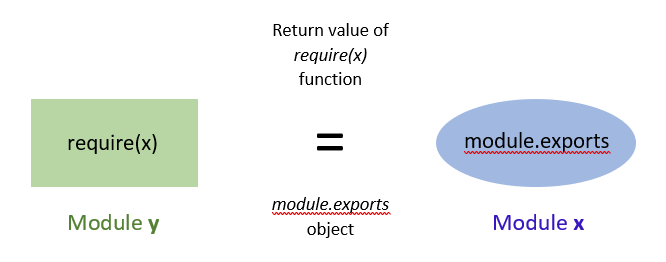

# NodeJS之module模块学习笔记



## 1.module模块简介

在NodeJS中，每个文件都被视为一个独立的模块。NodeJS默认支持`common.js`规范。

> [JavaScript模块化规范（CommonJs AMD CMD UMD ES6）](https://juejin.im/post/5dfef166518825126131ce0f#heading-0)
>
> [结合源码分析 Node.js 模块加载与运行原理](https://juejin.im/entry/5ac83dff5188255c4c1084fd)

## 2.访问主模块

当 Node.js 直接运行一个文件时， `require.main` 会被设为它的 `module`。 这意味着可以通过 `require.main === module` 来判断一个文件是否被直接运行：

对于 `foo.js` 文件，如果通过 `node foo.js` 运行则为 `true`，但如果通过 `require('./foo')` 运行则为 `false`。

因为 `module` 提供了一个 `filename` 属性（通常等同于 `__filename`），所以可以通过检查 `require.main.filename` 来获取当前应用程序的入口点。

## 3.缓存

模块是基于其解析的文件名进行缓存的。 由于调用模块的位置的不同，模块可能被解析成不同的文件名（比如从 `node_modules` 目录加载），这样就不能保证 `require('foo')` 总能返回完全相同的对象。

此外，在不区分大小写的文件系统或操作系统中，被解析成不同的文件名可以指向同一文件，但缓存仍然会将它们视为不同的模块，并多次重新加载。 例如， `require('./foo')` 和 `require('./FOO')` 返回两个不同的对象，而不会管 `./foo` 和 `./FOO` 是否是相同的文件。

## 4.核心模块

`require()` 总是会优先加载核心模块(核心模块定义在 Node.js 源代码的 `lib/` 目录下)。 例如， `require('http')` 始终返回内置的 HTTP 模块，即使有同名文件。

## 5.循环加载

当循环调用 `require()` 时，一个模块可能在未完成执行时被返回。

例如以下情况:

`a.js`:

```js
console.log('a 开始');
exports.done = false;
const b = require('./b.js');
console.log('在 a 中，b.done = %j', b.done);
exports.done = true;
console.log('a 结束');
```

`b.js`:

```js
console.log('b 开始');
exports.done = false;
const a = require('./a.js');
console.log('在 b 中，a.done = %j', a.done);
exports.done = true;
console.log('b 结束');
```

`main.js`:

```js
console.log('main 开始');
const a = require('./a.js');
const b = require('./b.js');
console.log('在 main 中，a.done=%j，b.done=%j', a.done, b.done);
```

当 `main.js` 加载 `a.js` 时， `a.js` 又加载 `b.js`。 此时， `b.js` 会尝试去加载 `a.js`。 为了防止无限的循环，会返回一个 `a.js` 的 `exports` 对象的 **未完成的副本** 给 `b.js` 模块。 然后 `b.js` 完成加载，并将 `exports` 对象提供给 `a.js` 模块。

当 `main.js` 加载这两个模块时，它们都已经完成加载。 因此，该程序的输出会是：

```console
$ node main.js
main 开始
a 开始
b 开始
在 b 中，a.done = false
b 结束
在 a 中，b.done = true
a 结束
在 main 中，a.done=true，b.done=true
```

需要仔细的规划, 以允许循环模块依赖在应用程序内正常工作.

## 6.文件模块

如果按确切的文件名没有找到模块，则 Node.js 会尝试带上 `.js`、 `.json` 或 `.node` 拓展名再加载。

`.js` 文件会被解析为 JavaScript 文本文件， `.json` 文件会被解析为 JSON 文本文件。 `.node` 文件会被解析为通过 `process.dlopen()` 加载的编译后的插件模块。

以 `'/'` 为前缀的模块是文件的绝对路径。 例如， `require('/home/marco/foo.js')` 会加载 `/home/marco/foo.js` 文件。

以 `'./'` 为前缀的模块是相对于调用 `require()` 的文件的。 也就是说， `circle.js` 必须和 `foo.js` 在同一目录下以便于 `require('./circle')` 找到它。

当没有以 `'/'`、 `'./'` 或 `'../'` 开头来表示文件时，这个模块必须是一个核心模块或加载自 `node_modules` 目录。

如果给定的路径不存在，则 `require()` 会抛出一个 `code` 属性为 `'MODULE_NOT_FOUND'` 的 [`Error`](http://nodejs.cn/s/FLTm19)。

## 7.从 node_modules 目录加载

如果传递给 `require()` 的模块标识符不是一个[核心模块](http://nodejs.cn/api/modules.html#modules_core_modules)，也没有以 `'/'` 、 `'../'` 或 `'./'` 开头，则 Node.js 会从当前模块的父目录开始，尝试从它的 `/node_modules` 目录里加载模块。 Node.js 不会附加 `node_modules` 到一个已经以 `node_modules` 结尾的路径上。

如果还是没有找到，则移动到再上一层父目录，直到文件系统的根目录。

例子，如果在 `'/home/ry/projects/foo.js'` 文件里调用了 `require('bar.js')`，则 Node.js 会按以下顺序查找：

- `/home/ry/projects/node_modules/bar.js`
- `/home/ry/node_modules/bar.js`
- `/home/node_modules/bar.js`
- `/node_modules/bar.js`

这使得程序本地化它们的依赖，避免它们产生冲突。

通过在模块名后包含一个路径后缀，可以请求特定的文件或分布式的子模块。 例如， `require('example-module/path/to/file')` 会把 `path/to/file` 解析成相对于 `example-module` 的位置。 后缀路径同样遵循模块的解析语法。

## 8.模块封装器

在执行模块代码之前，Node.js 会使用一个如下的匿名函数封装器将其封装：

```js
(function(exports, require, module, __filename, __dirname) {
// 模块的代码实际上在这里
});
```

通过这样做，Node.js 实现了以下几点：

- 它保持了顶层的变量（用 `var`、 `const` 或 `let` 定义）作用在模块范围内，而不是全局对象。
- 它有助于提供一些看似全局的但实际上是模块特定的变量，例如：
  - 实现者可以用于从模块中导出值的 `module` 和 `exports` 对象。
  - 包含模块绝对文件名和目录路径的快捷变量 `__filename` 和 `__dirname` 。

## 9.模块作用域

### 9.1 `__dirname`和`__filename`当前模块的目录名

 与 [`__filename`](http://nodejs.cn/s/RH6qCV) 的 [`path.dirname()`](http://nodejs.cn/s/7t4KCq) 相同。

示例，从 `/Users/mjr` 运行 `node example.js`：

```js
console.log(__dirname);
// 打印: /Users/mjr
console.log(path.dirname(__filename));
// 打印: /Users/mjr
```

### 9.2 exports 快捷方式

`exports` 变量是在模块的文件级作用域内可用的，且在**模块执行之前**赋值给 `module.exports`。

它允许使用快捷方式，因此 `module.exports.f = ...` 可以更简洁地写成 `exports.f = ...`。 但是，就像任何变量一样，如果为 `exports` 赋予了新值，则它将不再绑定到 `module.exports`：

```js
module.exports.hello = true; // 从模块的引用中导出。
exports = { hello: false };  // 不导出，仅在模块中可用。
```

当 `module.exports` 属性被新对象完全替换时，通常也会重新赋值 `exports`：

```js
module.exports = exports = function Constructor() {
  // ... 
};
```

为了说明这种行为，想象对 `require()` 的假设实现，它与 `require()` 的实际实现非常类似：

```js
function require(/* ... */) {
  const module = { exports: {} };
  ((module, exports) => {
    // 模块代码在这。在这个例子中，定义了一个函数。
    function someFunc() {}
    exports = someFunc;
    // 此时，exports 不再是一个 module.exports 的快捷方式，
    // 且这个模块依然导出一个空的默认对象。
    module.exports = someFunc;
    // 此时，该模块导出 someFunc，而不是默认对象。
  })(module, module.exports);
  return module.exports;
}
```

### 9.3 `module`对象

+  `module.children`：module[]  被该模块引用的模块对象。

+ `module.exports`: object`module.exports` 对象由 `Module` 系统创建。

+ `module.filename`: string模块的完全解析后的文件名。

+  `module.id`: string模块的标识符。 通常是完全解析后的文件名。

+ `module.loaded`：boolean模块是否已经加载完成，或正在加载中。

+  `module.parent`: moduls最先引用该模块的模块。

+  `module.paths`: string[]模块的搜索路径。

+ `module.require(id)`: id string, 返回: [any](http://nodejs.cn/s/6sTGdS) 导出的模块内容。

+ `module.require()` 方法提供了一种加载模块的方法，就像从原始模块调用 `require()` 一样。

  为了做到这个，需要获得一个 `module` 对象的引用。 因为 `require()` 会返回 `module.exports`，且 `module` 通常只在一个特定的模块代码中有效，所以为了使用它，必须显式地导出。

