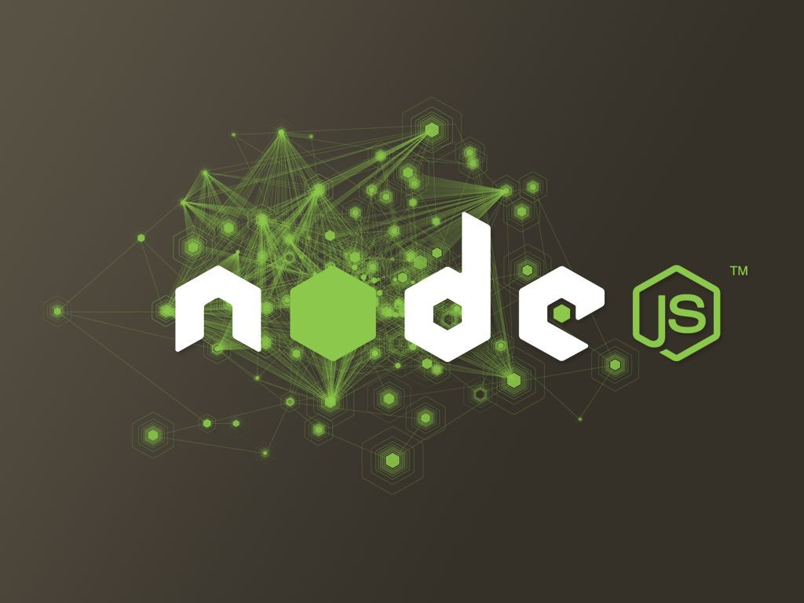
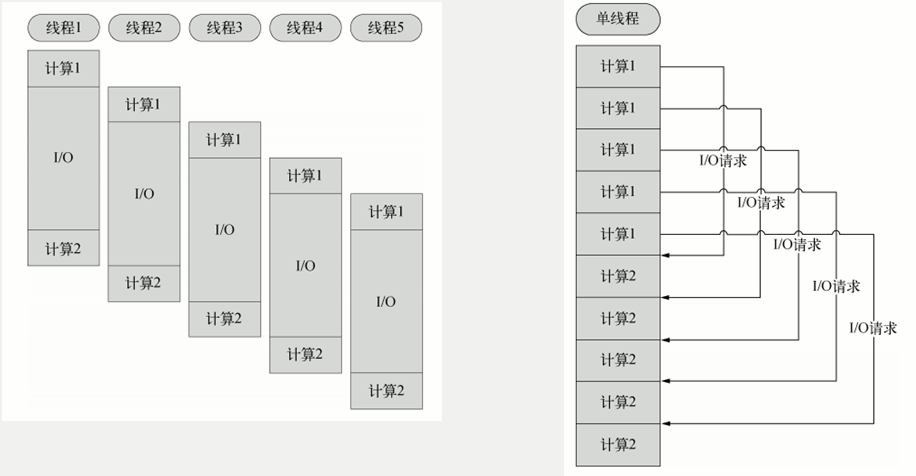
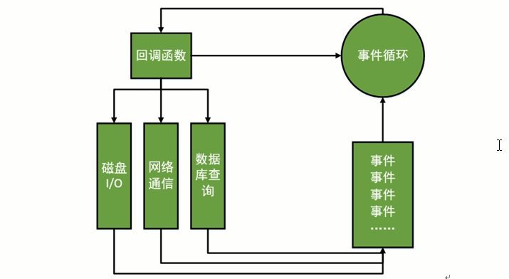

# NodeJS简介

## NodeJS之父——Ryan Dahl

 

+ 俄罗斯人

+ 2004，纽约罗彻斯特大学数学系博士

+ 2006，开始做网站开发

+ 2008，高性能web服务器专家：开发应用 ----> 解决性能问题 ---> 事件驱动，异步I/O

+ 2009年2月，NodeJS诞生，它基于[V8 引擎](https://www.jianshu.com/p/2d4532888cf5)

  

## NodeJS是什么？

NodeJS是一个让js运行在服务器端的开发平台，使js可以像PHP,JSP,Python,Ruby等一样作为服务端开发语言。

不同于其他脚本语言：

+ NodeJS不是一门独立的语言，而是js语言开发平台（其他既是语言也是平台）
+ NodeJS不需要依赖Apache\Nginx、IIS等HTTP服务器，没有web容器。

NodeJS自身设计哲学：**花最小的硬件成本，追求更高的并发，更高的处理性能**。

## NodeJS特性

### 单线程（Single Thread）

在Java，PHP等服务端语言中，会为每一个客户链接创建一个新的线程。每个线程需要耗费大约2MB内存，理论上，一个8GB的服务器可以同时连接的最大用户数为4000个左右。如果想让web应用程序支持更多的用户，就需要增加服务器的数量，那么，web应用程序的硬件成本自然就提升了。 

NodeJS不为每个客户连接创建一个新的线程，而仅仅使用一个线程。当有用户连接上了，就会触发一个内部事件，通过**非阻塞I/O**、**事件驱动**机制，让**NodeJS程序在宏观上也是并行**的。

使用NodeJS,一个8GB内存的web服务器，可以同时处理超过4万用户的连接。此外，使用单线程，操作系统不再有线程创建、销毁的事件开销。

### 

### 非阻塞I/O（Non-blocking I/O）

> [如何给女朋友解释什么是IO中的阻塞、非阻塞、同步、异步？](https://juejin.im/post/5b94e2995188255c5c45d0ec)

传统的单线程处理机制中，在访问数据库的时候，要等待数据返回之后再执行其他的操作，即I/O阻塞了代码的执行，极大地降低了代码执行效率。

由于NodeJS中采用了非阻塞I/O机制，因此在执行访问数据库的代码之后，将立即转而执行后面的代码，把数据库返回结果的处理代码放在回调函数中，从而提高了程序的执行下效率。

当某个I/O执行完毕时，将以事件的形式通知执行I/O操作的线程，线程执行这个时间的回调函数。那么怎么处理异步I/O呢？通过事件循环，不断地检查有没有未处理的事件，依次予以处理。

**阻塞模式下，一个线程只能处理一项任务；非阻塞模式下，一个线程一直在执行计算，线程的CPU核心利用率是100%**。

### 事件驱动（Event Driven）

在NodeJS中，客户端请求建立连接、提交数据等操作都会触发相应的事件。在node中，一个时刻只能执行一个事件回调函数，但是在执行一个时间回调函数的中途，可以转而处理其他事件，然后返回继续执行原事件的回调函数，这个机制成为**“事件环”**机制。

### 小结

**+ 单线程**，操作系统不再有线程创建、销毁的事件开销。但是如果某一事件进入了但是被I/O阻塞了，那么整个线程就瘫痪了。

**+ 非阻塞I/O**，解决了单线程被阻塞时的处理方式。通过非阻塞I/O，线程不会等待I/O执行完毕，而是转而执行后面的代码（NodeJS中所有的I/O都是异步的，回调函数）。那么怎么知道前面的一个或多个I/O执行完毕了呢？

**+ 事件驱动**，通过**事件环**机制，将I/O等操作以事件的形式加入到事件队列中，通过事件环依次调度。

三者相辅相成。

+ **NodeJS善于I/O密集型，不善于计算密集型**。

  当应用程序需要处理大量并发的I/O，而在客户端发出响应之前，应用程序内部并不需要进行非常复杂的处理的时候，NodeJS就非常适合。

  NodeJS也非常适合与web socket配合，开发长连接的实时交互应用程序。比如：

  + 用户表单收集
  + 考试系统
  + 聊天室
  + 图文直播
  + 提供JSON的API。
