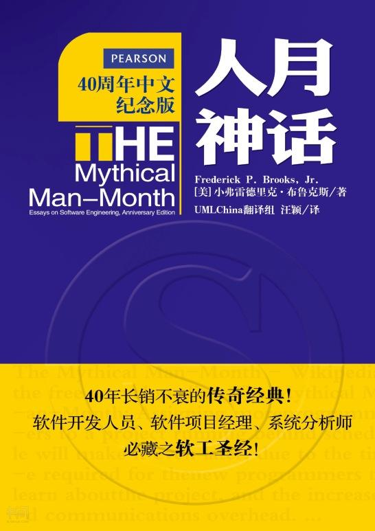

+ [第 1 章 焦油坑（The Tar Pit）](./ch01.md)
+ [第 2 章 人月神话（The Mythical Man-Month）](./ch02.md)
+ [第 3 章 外科手术队伍（The Surgical Team）](./ch03.md)
+ [第 4 章 贵族专制、民主政治和系统设计（Aristocracy, Democracy, and System Design）](./ch04.md)
+ [第 5 章 画蛇添足（The Second-System Effect）](./ch05.md)
+ [第 6 章 贯彻执行（Passing the Word）](./ch06.md)
+ [第 7 章 为什么巴比伦塔会失败？（Why Did theTower of Babel Fail?）](./ch07.md)
+ [第 8 章 胸有成竹（Calling the Shot）](./ch08.md)
+ [第 9 章 削足适履（Ten Pounds in a Five-Pound Sack）](./ch09.md)
+ [第 10 章 提纲挈领（The Documentary Hypothesis）](./ch10.md)
+ [第 11 章 未雨绸缪（Plan to Throw One Away）](./ch11.md)
+ [第 12 章 干将莫邪（Sharp Tools）](./ch12.md)
+ [第 13 章 整体部分（The Whole and the Parts）](./ch13.md)
+ [第 14 章 祸起萧墙（Hatching a Catastrophe）](./ch14.md)
+ [第 15 章 另外一面（The other face）](./ch15.md)
+ [第 16 章 没有银弹－软件工程中的根本和次要问题](./ch16.md)
+ [第 17 章 再论《没有银弹》 （"No Silver Bullet"Refired）](./ch17.md)
+ [第 18 章 《人月神话》的观点：是或非？（Propositions of the Mythical Man-Month: True or False？）](./ch18.md)
+ [第 19 章 20 年后的人月神话（The Mythical Man-Month after 20 Years）](./ch19.md)

> [《人月神话》书摘](https://zhuanlan.zhihu.com/p/27521161)
