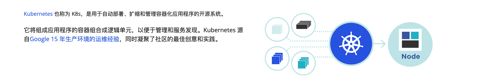
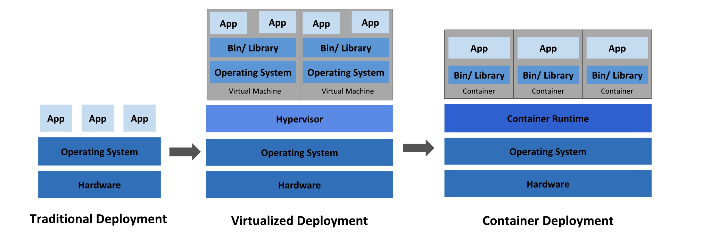
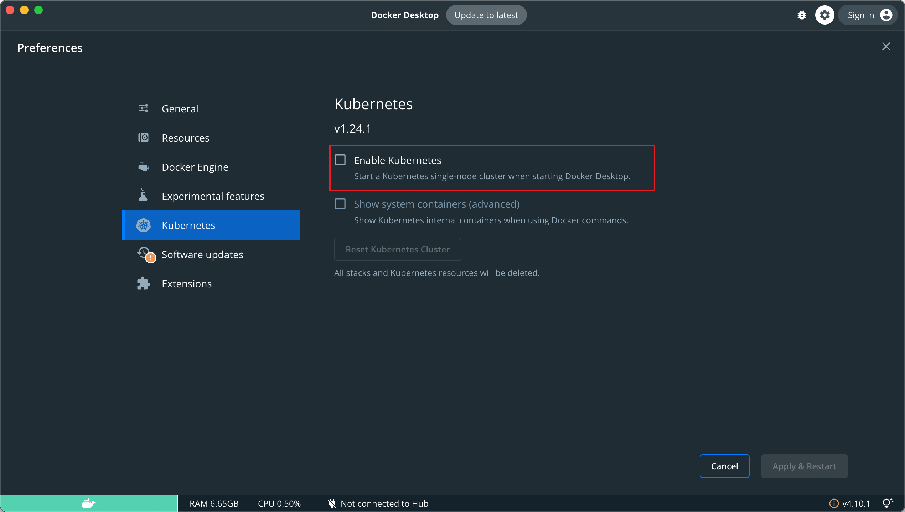
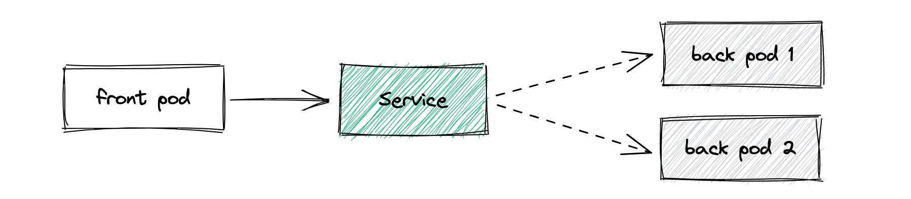
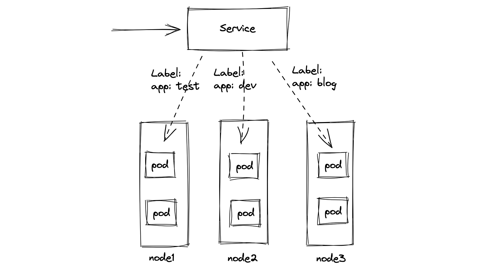
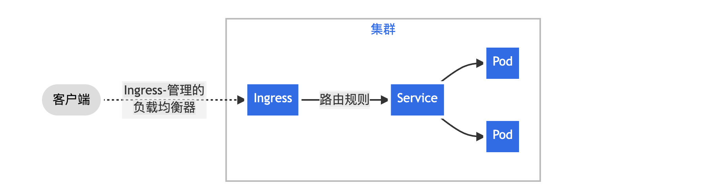

# Kubernetes

官网: https://kubernetes.io/zh-cn/

## 第一章 初识 Kubernetes

- Kubernetes 简介
- 为什么需要 Kubernetes
- Kubernetes 能做什么
- Kubernetes 不是什么?

### 1 简介

> 摘取官网: https://kubernetes.io/zh-cn/docs/concepts/overview/ 

**Kubernetes** 这个名字源于希腊语，意为`舵手`或`飞行员`。k8s 这个缩写是因为 k 和 s 之间有八个字符的关系。 Google 在 2014 年开源了 Kubernetes 项目。 Kubernetes 建立在 [Google 大规模运行生产工作负载十几年经验](https://research.google/pubs/pub43438)的基础上， 结合了社区中最优秀的想法和实践。



Kubernetes 是一个可移植、可扩展的开源平台，用于`管理容器化的工作负载和服务，可促进声明式配置和自动化`。 Kubernetes 拥有一个庞大且快速增长的生态，其服务、支持和工具的使用范围相当广泛。

从 2014 年第一个版本发布以来，Kuberetes 迅速获得开源社区的追捧，包括 Red Hat、VMware 在内的很多有影响力的公司加入到开发和推广的阵营。目前 Kubernetes 已经成为发展最快、市场占有率最高的容器编排引攀产品。

### 2 为什么需要 k8s

> 摘取官网: https://kubernetes.io/zh-cn/docs/concepts/overview/ 



**传统部署时代：**

早期，各个组织是在物理服务器上运行应用程序。`由于无法限制在物理服务器中运行的应用程序资源使用，因此会导致资源分配问题`。 例如，如果在同一台物理服务器上运行多个应用程序， 则可能会出现一个应用程序占用大部分资源的情况，而导致其他应用程序的性能下降。 `一种解决方案是将每个应用程序都运行在不同的物理服务器上， 但是当某个应用程式资源利用率不高时，剩余资源无法被分配给其他应用程式， 而且维护许多物理服务器的成本很高`。

**虚拟化部署时代：**

因此，虚拟化技术被引入了。虚拟化技术允许你在单个物理服务器的 CPU 上运行多台虚拟机（VM）。 `虚拟化能使应用程序在不同 VM 之间被彼此隔离，且能提供一定程度的安全性， 因为一个应用程序的信息不能被另一应用程序随意访问`。

虚拟化技术能够更好地利用物理服务器的资源，并且因为可轻松地添加或更新应用程序， 而因此可以具有更高的可扩缩性，以及降低硬件成本等等的好处。 通过虚拟化，你可以将一组物理资源呈现为可丢弃的虚拟机集群。

`每个 VM 是一台完整的计算机，在虚拟化硬件之上运行所有组件，包括其自己的操作系统`。

**容器部署时代：**

容器类似于 VM，但是更宽松的隔离特性，使容器之间可以共享操作系统（OS）。 因此，容器比起 VM 被认为是更轻量级的。且与 VM 类似，每个容器都具有自己的文件系统、CPU、内存、进程空间等。 由于它们与基础架构分离，因此可以跨云和 OS 发行版本进行移植。`容器的出现解决了应用和基础环境异构的问题，让应用可以做到一次构建，多次部署`。不可否认容器是打包和运行应用程序的好方式，因此容器方式部署变得流行起来。但随着容器部署流行，仅仅是基于容器的部署仍有一些问题没有解决:

- 生产环境中， 你需要管理运行着应用程序的容器，并确保服务不会下线。 例如，如果一个容器发生故障，则你需要启动另一个容器。
- 高并发时，你需要启动多个应用程序容器为系统提高高可用，并保证多个容器能负载均衡。
- 在维护、升级版本时，你需要将运行应用程序容器从新部署，部署时必须对之前应用容器备份，一旦出现错误，需要手动启动之前容器保证系统运行。

`如果以上行为交由给系统处理，是不是会更容易一些？那么谁能做到这些?`

### 3 k8s 能做什么?

> 摘取官网: https://kubernetes.io/zh-cn/docs/concepts/overview/ 

这就是 Kubernetes 要来做的事情！ `Kubernetes 为你提供了一个可弹性运行分布式系统的框架`。 Kubernetes 会满足你的扩展要求、故障转移你的应用、提供部署模式等。Kubernetes 为你提供：

- **服务发现和负载均衡**

  Kubernetes 可以使用 DNS 名称或自己的 IP 地址来暴露容器。 如果进入容器的流量很大， Kubernetes 可以负载均衡并分配网络流量，从而使部署稳定。

- **存储编排**

  Kubernetes 允许你自动挂载你选择的存储系统，例如本地存储、公共云提供商等。

- **自动部署和回滚**

  你可以使用 Kubernetes 描述已部署容器的所需状态， 它可以以受控的速率将实际状态更改为期望状态。 例如，你可以自动化 Kubernetes 来为你的部署创建新容器， 删除现有容器并将它们的所有资源用于新容器。

- **自动完成装箱计算/自动资源调度**

  你为 Kubernetes 提供许多节点组成的集群，在这个集群上运行容器化的任务。 你告诉 Kubernetes 每个容器需要多少 CPU 和内存 (RAM)。 Kubernetes 可以将这些容器按实际情况调度到你的节点上，以最佳方式利用你的资源。

- **自我修复/自愈能力**

  Kubernetes 将重新启动失败的容器、替换容器、杀死不响应用户定义的运行状况检查的容器， 并且在准备好服务之前不将其通告给客户端。

- **密钥与配置管理**

  Kubernetes 允许你存储和管理敏感信息，例如密码、OAuth 令牌和 ssh 密钥。 你可以在不重建容器镜像的情况下部署和更新密钥和应用程序配置，也无需在堆栈配置中暴露密钥。

### 4 k8s 不是什么?

`Kubernetes 不是传统的、包罗万象的 PaaS（平台即服务）系统`。 由于 Kubernetes 是在容器级别运行，而非在硬件级别，它提供了 PaaS 产品共有的一些普遍适用的功能， 例如部署、扩展、负载均衡，允许用户集成他们的日志记录、监控和警报方案。 但是，`Kubernetes 不是单体式（monolithic）系统`，那些默认解决方案都是可选、可插拔的。 Kubernetes 为构建开发人员平台提供了基础，但是在重要的地方保留了用户选择权，能有更高的灵活性。

Kubernetes：

- 不限制支持的应用程序类型。 Kubernetes 旨在支持极其多种多样的工作负载，包括无状态、有状态和数据处理工作负载。 如果应用程序可以在容器中运行，那么它应该可以在 Kubernetes 上很好地运行。
- 不部署源代码，也不构建你的应用程序。 持续集成（CI）、交付和部署（CI/CD）工作流取决于组织的文化和偏好以及技术要求。
- 不提供应用程序级别的服务作为内置服务，例如中间件（例如消息中间件）、 数据处理框架（例如 Spark）、数据库（例如 MySQL）、缓存、集群存储系统 （例如 Ceph）。这样的组件可以在 Kubernetes 上运行，并且/或者可以由运行在 Kubernetes 上的应用程序通过可移植机制（例如[开放服务代理](https://openservicebrokerapi.org/)）来访问。

- 不是日志记录、监视或警报的解决方案。 它集成了一些功能作为概念证明，并提供了收集和导出指标的机制。
- 不提供也不要求配置用的语言、系统（例如 jsonnet），它提供了声明性 API， 该声明性 API 可以由任意形式的声明性规范所构成。
- 不提供也不采用任何全面的机器配置、维护、管理或自我修复系统。
- 此外，Kubernetes 不仅仅是一个编排系统，实际上它消除了编排的需要。 编排的技术定义是执行已定义的工作流程：首先执行 A，然后执行 B，再执行 C。 而 Kubernetes 包含了一组独立可组合的控制过程，可以连续地将当前状态驱动到所提供的预期状态。 你不需要在乎如何从 A 移动到 C，也不需要集中控制，这使得系统更易于使用且功能更强大、 系统更健壮，更为弹性和可扩展。

----

## 第二章 组件&架构

- 集群组件
- 核心概念
- 集群安装

### 1 集群组件

- 集群 cluster : 将同一个软件服务多个节点组织到一起共同为系统提供服务过程称之为该软件的集群。redis 集群、es集群、mongo 等。
- k8s 集群: 多个节点: 3 个节点  角色:  1.master 节点/control plane 控制节点   2. work node: 工作节点(pod 容器:应用程序容器)

当部署完 Kubernetes，便拥有了一个完整的集群。一组工作机器，称为节点， 会运行容器化应用程序。`每个集群至少有一个工作节点`。工作节点会`托管 Pod `，而 Pod 就是作为应用负载的组件。 `控制平面管理集群中的工作节点和 Pod`。


#### 1.1 控制平面组件（Control Plane Components）

控制平面组件会为集群做出全局决策，比如`资源的调度。 以及检测和响应集群事件，例如当不满足部署的 replicas 字段时， 要启动新的 pod`）。

> 控制平面组件可以在集群中的任何节点上运行。 然而，为了简单起见，设置脚本通常会在同一个计算机上启动所有控制平面组件， 并且不会在此计算机上运行用户容器。

- **kube-apiserver**

  API server是 Kubernetes 控制平面的组件， `该组件负责公开了 Kubernetes API，负责处理接受请求的工作`。 API server 是 Kubernetes 控制平面的前端。Kubernetes API 服务器的主要实现是 kube-apiserver。 `kube-apiserver` 设计上考虑了水平扩缩，也就是说，它可通过部署多个实例来进行扩缩。 你可以运行 `kube-apiserver` 的多个实例，并在这些实例之间平衡流量。

- **etcd**

  `一致且高度可用的键值存储，用作 Kubernetes 的所有集群数据的后台数据库`。

- **kube-scheduler**

  `kube-scheduler` 是控制平面的组件， 负责监视新创建的、未指定运行节点 node 的 Pods， 并选择节点来让 Pod 在上面运行。调度决策考虑的因素包括单个 Pod 及 Pods 集合的资源需求、软硬件及策略约束、 亲和性及反亲和性规范、数据位置、工作负载间的干扰及最后时限。

- **kube-controller-manager**

  kube-controller-manager 是控制平面的组件， 负责运行控制器进程。从逻辑上讲， 每个控制器都是一个单独的进程， 但是为了降低复杂性，它们都被编译到同一个可执行文件，并在同一个进程中运行。

  这些控制器包括：

  - 节点控制器（Node Controller）：负责在节点出现故障时进行通知和响应
  - 任务控制器（Job Controller）：监测代表一次性任务的 Job 对象，然后创建 Pods 来运行这些任务直至完成
  - 端点分片控制器（EndpointSlice controller）：填充端点分片（EndpointSlice）对象（以提供 Service 和 Pod 之间的链接）。
  - 服务账号控制器（ServiceAccount controller）：为新的命名空间创建默认的服务账号（ServiceAccount）。

- **cloud-controller-manager** (optional 可选)

  一个 Kubernetes 控制平面组件， 嵌入了特定于云平台的控制逻辑。 云控制器管理器（Cloud Controller Manager）允许你将你的集群连接到云提供商的 API 之上， 并将与该云平台交互的组件同与你的集群交互的组件分离开来。`cloud-controller-manager` 仅运行特定于云平台的控制器。 因此如果你在自己的环境中运行 Kubernetes，或者在本地计算机中运行学习环境， 所部署的集群不需要有云控制器管理器。与 `kube-controller-manager` 类似，`cloud-controller-manager` 将若干逻辑上独立的控制回路组合到同一个可执行文件中， 供你以同一进程的方式运行。 你可以对其执行水平扩容（运行不止一个副本）以提升性能或者增强容错能力。

  下面的控制器都包含对云平台驱动的依赖：

  - 节点控制器（Node Controller）：用于在节点终止响应后检查云提供商以确定节点是否已被删除

  - 路由控制器（Route Controller）：用于在底层云基础架构中设置路由

  - 服务控制器（Service Controller）：用于创建、更新和删除云提供商负载均衡器

#### 1.2 Node 组件

> 节点组件会在每个节点上运行，负责维护运行的 Pod 并提供 Kubernetes 运行环境。

- **kubelet**

  kubelet 会在集群中每个节点（node）上运行。 它保证容器（containers）都运行在 Pods 中。

  kubelet 接收一组通过各类机制提供给它的 PodSpecs， 确保这些 PodSpecs 中描述的容器处于运行状态且健康。 kubelet 不会管理不是由 Kubernetes 创建的容器。

- **kube-proxy**

  kube-proxy是集群中每个节点（node）上所运行的网络代理， 实现 Kubernetes 服务（Service）概念的一部分。

  kube-proxy 维护节点上的一些网络规则， 这些网络规则会允许从集群内部或外部的网络会话与 Pod 进行网络通信。

  如果操作系统提供了可用的数据包过滤层，则 kube-proxy 会通过它来实现网络规则。 否则，kube-proxy 仅做流量转发。

- **容器运行时（Container Runtime）**

  容器运行环境是负责运行容器的软件。

  Kubernetes 支持许多容器运行环境，例如 containerd、 CRI-0、Docker 以及 Kubernetes CRI 的其他任何实现。

#### 1.3 插件 (Addons)

- **DNS**

  尽管其他插件都并非严格意义上的必需组件，但几乎所有 Kubernetes 集群都应该有集群 DNS因为很多示例都需要 DNS 服务。

- **Web 界面（仪表盘）**

  Dashboard 是 Kubernetes 集群的通用的、基于 Web 的用户界面。 它使用户可以管理集群中运行的应用程序以及集群本身， 并进行故障排除。

- **容器资源监控**

  容器资源监控将关于容器的一些常见的时间序列度量值保存到一个集中的数据库中， 并提供浏览这些数据的界面。

- **集群层面日志**

  集群层面日志机制负责将容器的日志数据保存到一个集中的日志存储中， 这种集中日志存储提供搜索和浏览接口。

### 2 集群架构详细


- **总结**
  - Kubernetes 集群由多个节点组成，节点分为两类：一类是属于管理平面的主节点/控制节点（Master Node）；一类是属于运行平面的工作节点（Worker Node）。显然，复杂的工作肯定都交给控制节点去做了，工作节点负责提供稳定的操作接口和能力抽象即可。

### 3 集群搭建[重点]

- **minikube**
  只是一个 K8S 集群模拟器，只有一个节点的集群，只为测试用，master 和 worker 都在一起。
- **裸机安装**
  至少需要两台机器（主节点、工作节点个一台），需要自己安装 Kubernetes 组件，配置会稍微麻烦点。
  缺点：配置麻烦，缺少生态支持，例如负载均衡器、云存储。
- **直接用云平台 Kubernetes**
  可视化搭建，只需简单几步就可以创建好一个集群。
  优点：安装简单，生态齐全，负载均衡器、存储等都给你配套好，简单操作就搞定
- **k3s**
  
  安装简单，脚本自动完成。
  
  优点：轻量级，配置要求低，安装简单，生态齐全。

#### 3.1 minikube



#### 3.2 裸机安装

##### 0 环境准备

- 节点数量: 3 台虚拟机 centos7
- 硬件配置: 2G或更多的RAM，2个CPU或更多的CPU，硬盘至少30G 以上
- 网络要求: 多个节点之间网络互通，每个节点能访问外网

##### 1 集群规划

- k8s-node1：10.15.0.5
- k8s-node2：10.15.0.6
- k8s-node3：10.15.0.7

##### 2 设置主机名

```shell
$ hostnamectl set-hostname k8s-node1  
$ hostnamectl set-hostname k8s-node2
$ hostnamectl set-hostname k8s-node3
```

##### 3 同步 hosts 文件

>  如果 DNS 不支持主机名称解析，还需要在每台机器的 `/etc/hosts` 文件中添加主机名和 IP 的对应关系：

```shell
cat >> /etc/hosts <<EOF
10.15.0.5 k8s-node1
10.15.0.6 k8s-node2
10.15.0.7 k8s-node3
EOF
```

##### 4 关闭防火墙

```shell
$ systemctl stop firewalld && systemctl disable firewalld
```

##### 5 关闭 SELINUX 

> 注意: ARM 架构请勿执行,执行会出现 ip 无法获取问题!

```shell
$ setenforce 0 && sed -i 's/SELINUX=enforcing/SELINUX=disabled/g' /etc/selinux/config
```

##### 6 关闭 swap 分区

```shell
$ swapoff -a && sed -ri 's/.*swap.*/#&/' /etc/fstab
```

##### 7 同步时间

```shell
$ yum install ntpdate -y
$ ntpdate time.windows.com
```

##### 8 安装 containerd

```shell
# 安装 yum-config-manager 相关依赖
$ yum install -y yum-utils device-mapper-persistent-data lvm2
# 添加 containerd yum 源
$ yum-config-manager --add-repo http://mirrors.aliyun.com/docker-ce/linux/centos/docker-ce.repo
# 安装 containerd
$ yum install  -y containerd.io cri-tools  
# 配置 containerd
$ cat >  /etc/containerd/config.toml <<EOF
disabled_plugins = ["restart"]
[plugins.linux]
shim_debug = true
[plugins.cri.registry.mirrors."docker.io"]
endpoint = ["https://frz7i079.mirror.aliyuncs.com"]
[plugins.cri]
sandbox_image = "registry.aliyuncs.com/google_containers/pause:3.2"
EOF
# 启动 containerd 服务 并 开机配置自启动
$ systemctl enable containerd && systemctl start containerd && systemctl status containerd 

# 配置 containerd 配置
$ cat > /etc/modules-load.d/containerd.conf <<EOF
overlay
br_netfilter
EOF

# 配置 k8s 网络配置
$ cat  > /etc/sysctl.d/k8s.conf <<EOF
net.bridge.bridge-nf-call-ip6tables = 1
net.bridge.bridge-nf-call-iptables = 1
net.ipv4.ip_forward = 1
EOF

# 加载 overlay br_netfilter 模块
$ modprobe overlay
$ modprobe br_netfilter

# 查看当前配置是否生效
$ sysctl -p /etc/sysctl.d/k8s.conf
```

##### 9 添加源

- 查看源

```shell
$ yum repolist
```

- 添加源 x86

```shell
$ cat <<EOF > kubernetes.repo
[kubernetes]
name=Kubernetes
baseurl=https://mirrors.aliyun.com/kubernetes/yum/repos/kubernetes-el7-x86_64
enabled=1
gpgcheck=0
repo_gpgcheck=0
gpgkey=https://mirrors.aliyun.com/kubernetes/yum/doc/yum-key.gpg https://mirrors.aliyun.com/kubernetes/yum/doc/rpm-package-key.gpg
EOF
$ mv kubernetes.repo /etc/yum.repos.d/
```

- 添加源 ARM

```shell
$ cat << EOF > kubernetes.repo 
[kubernetes]
name=Kubernetes
baseurl=https://mirrors.aliyun.com/kubernetes/yum/repos/kubernetes-el7-aarch64
enabled=1
gpgcheck=0
repo_gpgcheck=0
gpgkey=https://mirrors.aliyun.com/kubernetes/yum/doc/yum-key.gpg https://mirrors.aliyun.com/kubernetes/yum/doc/rpm-package-key.gpg
EOF

$ mv kubernetes.repo /etc/yum.repos.d/
```

##### 11 安装 k8s

```shell
# 安装最新版本
$ yum install -y kubelet kubeadm kubectl

# 指定版本安装
# yum install -y kubelet-1.26.0 kubectl-1.26.0 kubeadm-1.26.0

# 启动 kubelet
$ sudo systemctl enable kubelet && sudo systemctl start kubelet && sudo systemctl status kubelet
```

##### 12 初始化集群

- **`注意: 初始化 k8s 集群仅仅需要再在 master 节点进行集群初始化!`**

```shell
$ kubeadm init \
--apiserver-advertise-address=10.15.0.5 \
--pod-network-cidr=10.244.0.0/16 \
--image-repository registry.aliyuncs.com/google_containers \
--cri-socket=unix:///var/run/containerd/containerd.sock

# 添加新节点
$ kubeadm token create --print-join-command --ttl=0
$ kubeadm join 10.15.0.21:6443 --token xjm7ts.gu3ojvta6se26q8i --discovery-token-ca-cert-hash sha256:14c8ac5c04ff9dda389e7c6c505728ac1293c6aed5978c3ea9c6953d4a79ed34 
```

##### 13 配置集群网络

> 创建配置: kube-flannel.yml ,执行 kubectl apply -f kube-flannel.yml

- `注意: 只在主节点执行即可!`

```yml
---
kind: Namespace
apiVersion: v1
metadata:
  name: kube-flannel
  labels:
    pod-security.kubernetes.io/enforce: privileged
---
kind: ClusterRole
apiVersion: rbac.authorization.k8s.io/v1
metadata:
  name: flannel
rules:
- apiGroups:
  - ""
  resources:
  - pods
  verbs:
  - get
- apiGroups:
  - ""
  resources:
  - nodes
  verbs:
  - get
  - list
  - watch
- apiGroups:
  - ""
  resources:
  - nodes/status
  verbs:
  - patch
---
kind: ClusterRoleBinding
apiVersion: rbac.authorization.k8s.io/v1
metadata:
  name: flannel
roleRef:
  apiGroup: rbac.authorization.k8s.io
  kind: ClusterRole
  name: flannel
subjects:
- kind: ServiceAccount
  name: flannel
  namespace: kube-flannel
---
apiVersion: v1
kind: ServiceAccount
metadata:
  name: flannel
  namespace: kube-flannel
---
kind: ConfigMap
apiVersion: v1
metadata:
  name: kube-flannel-cfg
  namespace: kube-flannel
  labels:
    tier: node
    app: flannel
data:
  cni-conf.json: |
    {
      "name": "cbr0",
      "cniVersion": "0.3.1",
      "plugins": [
        {
          "type": "flannel",
          "delegate": {
            "hairpinMode": true,
            "isDefaultGateway": true
          }
        },
        {
          "type": "portmap",
          "capabilities": {
            "portMappings": true
          }
        }
      ]
    }
  net-conf.json: |
    {
      "Network": "10.244.0.0/16",
      "Backend": {
        "Type": "vxlan"
      }
    }
---
apiVersion: apps/v1
kind: DaemonSet
metadata:
  name: kube-flannel-ds
  namespace: kube-flannel
  labels:
    tier: node
    app: flannel
spec:
  selector:
    matchLabels:
      app: flannel
  template:
    metadata:
      labels:
        tier: node
        app: flannel
    spec:
      affinity:
        nodeAffinity:
          requiredDuringSchedulingIgnoredDuringExecution:
            nodeSelectorTerms:
            - matchExpressions:
              - key: kubernetes.io/os
                operator: In
                values:
                - linux
      hostNetwork: true
      priorityClassName: system-node-critical
      tolerations:
      - operator: Exists
        effect: NoSchedule
      serviceAccountName: flannel
      initContainers:
      - name: install-cni-plugin
       #image: flannelcni/flannel-cni-plugin:v1.1.0 for ppc64le and mips64le (dockerhub limitations may apply)
        image: docker.io/rancher/mirrored-flannelcni-flannel-cni-plugin:v1.1.0
        command:
        - cp
        args:
        - -f
        - /flannel
        - /opt/cni/bin/flannel
        volumeMounts:
        - name: cni-plugin
          mountPath: /opt/cni/bin
      - name: install-cni
       #image: flannelcni/flannel:v0.20.2 for ppc64le and mips64le (dockerhub limitations may apply)
        image: docker.io/rancher/mirrored-flannelcni-flannel:v0.20.2
        command:
        - cp
        args:
        - -f
        - /etc/kube-flannel/cni-conf.json
        - /etc/cni/net.d/10-flannel.conflist
        volumeMounts:
        - name: cni
          mountPath: /etc/cni/net.d
        - name: flannel-cfg
          mountPath: /etc/kube-flannel/
      containers:
      - name: kube-flannel
       #image: flannelcni/flannel:v0.20.2 for ppc64le and mips64le (dockerhub limitations may apply)
        image: docker.io/rancher/mirrored-flannelcni-flannel:v0.20.2
        command:
        - /opt/bin/flanneld
        args:
        - --ip-masq
        - --kube-subnet-mgr
        resources:
          requests:
            cpu: "100m"
            memory: "50Mi"
          limits:
            cpu: "100m"
            memory: "50Mi"
        securityContext:
          privileged: false
          capabilities:
            add: ["NET_ADMIN", "NET_RAW"]
        env:
        - name: POD_NAME
          valueFrom:
            fieldRef:
              fieldPath: metadata.name
        - name: POD_NAMESPACE
          valueFrom:
            fieldRef:
              fieldPath: metadata.namespace
        - name: EVENT_QUEUE_DEPTH
          value: "5000"
        volumeMounts:
        - name: run
          mountPath: /run/flannel
        - name: flannel-cfg
          mountPath: /etc/kube-flannel/
        - name: xtables-lock
          mountPath: /run/xtables.lock
      volumes:
      - name: run
        hostPath:
          path: /run/flannel
      - name: cni-plugin
        hostPath:
          path: /opt/cni/bin
      - name: cni
        hostPath:
          path: /etc/cni/net.d
      - name: flannel-cfg
        configMap:
          name: kube-flannel-cfg
      - name: xtables-lock
        hostPath:
          path: /run/xtables.lock
          type: FileOrCreate
```

##### 14 查看集群状态

```shell
# 查看集群节点状态 全部为 Ready 代表集群搭建成功
$ kubectl get nodes
NAME        STATUS   ROLES           AGE   VERSION
k8s-node1   Ready    control-plane   21h   v1.26.0
k8s-node2   Ready    <none>          21h   v1.26.0
k8s-node3   Ready    <none>          21h   v1.26.0

# 查看集群系统 pod 运行情况,下面所有 pod 状态为 Running 代表集群可用
$ kubectl get pod -A
NAMESPACE      NAME                                READY   STATUS    RESTARTS   AGE
default        nginx                               1/1     Running   0          21h
kube-flannel   kube-flannel-ds-gtq49               1/1     Running   0          21h
kube-flannel   kube-flannel-ds-qpdl6               1/1     Running   0          21h
kube-flannel   kube-flannel-ds-ttxjb               1/1     Running   0          21h
kube-system    coredns-5bbd96d687-p7q2x            1/1     Running   0          21h
kube-system    coredns-5bbd96d687-rzcnz            1/1     Running   0          21h
kube-system    etcd-k8s-node1                      1/1     Running   0          21h
kube-system    kube-apiserver-k8s-node1            1/1     Running   0          21h
kube-system    kube-controller-manager-k8s-node1   1/1     Running   0          21h
kube-system    kube-proxy-mtsbp                    1/1     Running   0          21h
kube-system    kube-proxy-v2jfs                    1/1     Running   0          21h
kube-system    kube-proxy-x6vhn                    1/1     Running   0          21h
kube-system    kube-scheduler-k8s-node1            1/1     Running   0          21h
```

---

## 第三章 Pod & Container

- 什么是 Pod
- Pod 基本操作
- Pod 的 Labels
- Pod 的 生命周期
- Container 特性
- Pod 的资源限制
- Pod 中 Init 容器
- 节点亲和性分配 Pod

### 1 什么是 Pod

> 摘取官网: https://kubernetes.io/zh-cn/docs/concepts/workloads/pods/#working-with-pods

#### 1.1 **简介**

Pod 是可以在 Kubernetes 中**创建和管理的、最小的可部署的计算单元**。**Pod**（就像在鲸鱼荚或者豌豆荚中）**是一组（一个或多个）容器**； 这些容器共享存储、网络、以及怎样运行这些容器的声明。 Pod 中的**内容总是并置（colocated）的并且一同调度，在共享的上下文中运行**。简言之如果用 Docker 的术语来描述，**Pod 类似于共享名字空间并共享文件系统卷的一组容器。**

`定义: Pod 就是用来管理一组(一个|多个)容器的集合 特点: 共享网络 共享存储 共享上下文环境`

#### 1.2 Pod 怎样管理多个容器?

Pod 中的容器被自动安排到集群中的同一物理机或虚拟机上，并可以一起进行调度。 容器之间可以共享资源和依赖、彼此通信、协调何时以及何种方式终止自身。例如，你可能有一个容器，为共享卷中的文件提供 Web 服务器支持，以及一个单独的 "边车 (sidercar)" 容器负责从远端更新这些文件，如下图所示：


#### 1.3 如何使用 Pod?

通常你不需要直接创建 Pod，甚至单实例 Pod。 相反，你会使用诸如 Deployment 或 Job 这类工作负载资源来创建 Pod。 如果 Pod 需要跟踪状态，可以考虑 StatefulSet 资源。

Kubernetes 集群中的 Pod 主要有两种用法：

- **运行单个容器的 Pod**。"每个 Pod 一个容器" 模型是最常见的 Kubernetes 用例； 在这种情况下，可以将 Pod 看作单个容器的包装器，并且 Kubernetes 直接管理 Pod，而不是容器。
- **运行多个协同工作的容器 的 Pod**。 Pod 可能封装由多个紧密耦合且需要共享资源的共处容器组成的应用程序。 这些位于同一位置的容器可能形成单个内聚的服务单元 —— 一个容器将文件从共享卷提供给公众， 而另一个单独的 “边车”（sidecar）容器则刷新或更新这些文件。 Pod 将这些容器和存储资源打包为一个可管理的实体。

**说明: **

- 将多个并置、同管的容器组织到一个 Pod 中是一种相对高级的使用场景。 只有在一些场景中，容器之间紧密关联时你才应该使用这种模式。
- 每个 Pod 都旨在运行给定应用程序的单个实例。如果希望横向扩展应用程序 （例如，运行多个实例以提供更多的资源），则应该使用多个 Pod，每个实例使用一个 Pod。 在 Kubernetes 中，这通常被称为**副本（Replication）**。 通常使用一种工作负载资源及其控制器来创建和管理一组 Pod 副本。

### 2 Pod 基本操作

#### 2.1 查看 pod

```shell
# 查看默认命名空间的 pod
$ kubectl get pods|pod|po

# 查看所有命名空间的 pod
$ kubectl get pods|pod -A
$ kubectl get pods|pod|po -n 命名空间名称

# 查看默认命名空间下 pod 的详细信息
$ kubectl get pods -o wide 

# 查看所有命名空间下 pod 的详细信息
$ kubectl get pods -o wide -A

# 实时监控 pod 的状态
$ kubectl get pod -w
```

#### 2.2 创建 pod

pod      :  kubectl run nginx(pod名称) --image=nginx:1.19

container:  docker run --name nginx nginx:1.19

> 官网参考地址: https://kubernetes.io/zh-cn/docs/reference/kubernetes-api/workload-resources/pod-v1/

```yml
# nginx-pod.yml
apiVersion: v1
kind: Pod
metadata:
  name: nginx
spec:
  containers:
    - name: nginx
      image: nginx:1.19
      ports:
    		- containerPort: 80
```

```shell
# 使用 kubectl apply/create -f 创建 pod
$ kubectl create -f nginx-pod.yml
$ kubectl apply -f nginx-pod.yml
```

> `注意: create 仅仅是不存在时创建,如果已经存在则报错！apply 不存在创建，存在更新配置。推荐使用 apply！`

#### 2.3 删除 pod

```shell
$ kubectl delete pod  pod名称
$ kubectl delete -f pod.yml
```

#### 2.4 进入 pod 中容器

```shell
# 注意: 这种方式进入容器默认只会进入 pod 中第一个容器
$ kubectl exec -it nginx(pod名称) --(固定写死) bash(执行命令)
# 注意: 进入指定 pod 中指定容器
$ kubectl exec -it pod名称 -c 容器名称 --(固定写死) bash(执行命令)
```

#### 2.5 查看 pod 日志

```shell
# 注意: 查看 pod 中第一个容器日志
$ kubectl logs -f(可选,实时) nginx(pod 名称)
# 注意: 查看 pod 中指定容器的日志
$ kubect logs -f pod名称 -c 容器名称
```

#### 2.6 查看 pod 描述信息

```shell
$ kubectl describe pod nginx(pod名称)
```

### 3 Pod 运行多个容器

#### 3.1 创建 pod

```yml
# myapp-pod.yml
apiVersion: v1
kind: Pod
metadata:
  name: myapp
spec:
  containers:
    - name: nginx
      image: nginx:1.19
      ports:
    		- containerPort: 80
      imagePullPolicy: IfNotPresent

    - name: redis
      image: redis:5.0.10
      ports:
    		- containerPort: 6379
      imagePullPolicy: IfNotPresent
```

```shell
$ kubectl apply -f myapp-pod.yml
```

#### 3.2 查看指定容器日志

```shell
# 查看日志 (默认只查看第一个容器日志，这里是展示 nginx 日志)
$ kubectl logs -f myapp

# 查看 pod 中指定容器的日志
$ kubectl logs -f myapp -c nginx(容器名称)
$ kubectl logs -f myapp -c redis(容器名称)
```

#### 3.3 进入容器

```shell
# 进入 pod 的容器 (默认进入第一个容器内部，这里会进入 nginx 容器内部)
$ kubectl exec -it myapp -- sh

# 进入 pod 中指定容器内部
$ kubectl exec -it myapp -c nginx -- sh
$ kubectl exec -it myapp -c redis -- sh
```

### 4 Pod 的 Labels(标签)

`标签（Labels）` 是附加到 Kubernetes 对象（比如 Pod）上的键值对。 标签旨在用于指定对用户有意义且相关的对象的标识属性。标签可以在创建时附加到对象，随后可以随时添加和修改。每个对象都可以定义一组键(key)/值(value)标签，但是每个键(key)对于给定对象必须是唯一的。

标签作用: 就是用来给 k8s 中对象起别名, 有了别名可以过滤和筛选

#### 4.1 语法

`标签由键值对组成`，其有效标签值：

- 必须为 63 个字符或更少（可以为空）
- 除非标签值为空，必须以字母数字字符（`[a-z0-9A-Z]`）开头和结尾
- 包含破折号（`-`）、下划线（`_`）、点（`.`）和字母或数字

#### 4.2 示例

```yml
apiVersion: v1
kind: Pod
metadata:
  name: myapp
  labels:
    name: myapp #创建时添加
spec:
  containers:
    - name: nginx
      image: nginx:1.21
      imagePullPolicy: IfNotPresent

    - name: redis
      image: redis:5.0.10
      imagePullPolicy: IfNotPresent
  restartPolicy: Always
```

#### 4.3 标签基本操作

```shell
# 查看标签
$ kubectl get pods --show-labels

# kubectl label pod pod名称 标签键值对
$ kubectl label pod myapp env=prod

# 覆盖标签 --overwrite
$ kubectl label --overwrite pod myapp env=test

# 删除标签 -号代表删除标签
$ kubectl label pod myapp env-

# 根据标签筛选 env=test/env  > = < 
$ kubectl get po -l env=test
$ kubectl get po -l env
$ kubectl get po -l '!env' # 不包含的 pod
$ kubectl get po -l 'env in (test,prod)' #选择含有指定值的 pod
$ kubectl get po -l 'env notin (test,prod)' #选择含有指定值的 pod
```

### 5 Pod 的生命周期

> 摘自官网: https://kubernetes.io/zh-cn/docs/concepts/workloads/pods/pod-lifecycle/

 Pod 遵循预定义的生命周期，起始于 `Pending` 阶段， 如果至少其中有一个主要容器正常启动，则进入 `Running`，之后取决于 Pod 中是否有容器以失败状态结束而进入 `Succeeded` 或者 `Failed` 阶段。与此同时Pod 在其生命周期中只会被调度一次。 一旦 Pod 被调度（分派）到某个节点，Pod 会一直在该节点运行，直到 Pod 停止或者被终止。

#### 5.1 生命周期

和一个个独立的应用容器一样，Pod 也被认为是相对临时性（而不是长期存在）的实体。 Pod 会被创建、赋予一个唯一的 ID(UID)， 并被调度到节点，并在终止（根据重启策略）或删除之前一直运行在该节点。如果一个节点死掉了，调度到该节点的 Pod 也被计划在给定超时期限结束后删除。

Pod 自身不具有自愈能力。如果 Pod 被调度到某节点而该节点之后失效， Pod 会被删除；类似地，Pod 无法在因节点资源耗尽或者节点维护而被驱逐期间继续存活。 Kubernetes 使用一种高级抽象来管理这些相对而言可随时丢弃的 Pod 实例， 称作控制器。

任何给定的 Pod （由 UID 定义）从不会被“重新调度（rescheduled）”到不同的节点； 相反，这一 Pod 可以被一个新的、几乎完全相同的 Pod 替换掉。 如果需要，新 Pod 的名字可以不变，但是其 UID 会不同。

如果某物声称其生命期与某 Pod 相同，例如存储卷， 这就意味着该对象在此 Pod （UID 亦相同）存在期间也一直存在。 如果 Pod 因为任何原因被删除，甚至完全相同的替代 Pod 被创建时， 这个相关的对象（例如这里的卷）也会被删除并重建。

#### 5.2 pod 阶段

Pod 阶段的数量和含义是严格定义的。 除了本文档中列举的内容外，不应该再假定 Pod 有其他的 `phase` 值。

| 取值                | 描述                                                         |
| :------------------ | :----------------------------------------------------------- |
| `Pending`（悬决）   | Pod 已被 Kubernetes 系统接受，但有一个或者多个容器尚未创建亦未运行。此阶段包括等待 Pod 被调度的时间和通过网络下载镜像的时间。 |
| `Running`（运行中） | Pod 已经绑定到了某个节点，Pod 中所有的容器都已被创建。至少有一个容器仍在运行，或者正处于启动或重启状态。 |
| `Succeeded`（成功） | Pod 中的所有容器都已成功终止，并且不会再重启。               |
| `Failed`（失败）    | Pod 中的所有容器都已终止，并且至少有一个容器是因为失败终止。也就是说，容器以非 0 状态退出或者被系统终止。 |
| `Unknown`（未知）   | 因为某些原因无法取得 Pod 的状态。这种情况通常是因为与 Pod 所在主机通信失败。 |

> **说明：**
>
> 1. 当一个 Pod 被删除时，执行一些 kubectl 命令会展示这个 Pod 的状态为 `Terminating`（终止）。 这个 `Terminating` 状态并不是 Pod 阶段之一。 Pod 被赋予一个可以体面终止的期限，默认为 30 秒。 你可以使用 `--force` 参数来强制终止 Pod。
>
> 2. 如果某节点死掉或者与集群中其他节点失联，Kubernetes 会实施一种策略，将失去的节点上运行的所有 Pod 的 `phase` 设置为 `Failed`。

### 6 Contrainer 特性

#### 6.1 容器生命周期

Kubernetes 会跟踪 Pod 中每个容器的状态，就像它跟踪 Pod 总体上的阶段一样。 你可以使用容器生命周期回调来在容器生命周期中的特定时间点触发事件。

一旦调度器将 Pod 分派给某个节点，`kubelet` 就通过容器运行时开始为 Pod 创建容器。容器的状态有三种：`Waiting`（等待）、`Running`（运行中）和 `Terminated`（已终止）。

要检查 Pod 中容器的状态，你可以使用 `kubectl describe pod <pod 名称>`。 其输出中包含 Pod 中每个容器的状态。

每种状态都有特定的含义：

- `Waiting` （等待）

如果容器并不处在 `Running` 或 `Terminated` 状态之一，它就处在 `Waiting` 状态。 处于 `Waiting` 状态的容器仍在运行它完成启动所需要的操作：例如， 从某个容器镜像仓库拉取容器镜像，或者向容器应用 Secret 数据等等。 当你使用 `kubectl` 来查询包含 `Waiting` 状态的容器的 Pod 时，你也会看到一个 Reason 字段，其中给出了容器处于等待状态的原因。

- `Running`（运行中）

`Running` 状态表明容器正在执行状态并且没有问题发生。 如果配置了 `postStart` 回调，那么该回调已经执行且已完成。 如果你使用 `kubectl` 来查询包含 `Running` 状态的容器的 Pod 时， 你也会看到关于容器进入 `Running` 状态的信息。

- `Terminated`（已终止）

处于 `Terminated` 状态的容器已经开始执行并且或者正常结束或者因为某些原因失败。 如果你使用 `kubectl` 来查询包含 `Terminated` 状态的容器的 Pod 时， 你会看到容器进入此状态的原因、退出代码以及容器执行期间的起止时间。

如果容器配置了 `preStop` 回调，则该回调会在容器进入 `Terminated` 状态之前执行。

#### 6.2 容器生命周期回调/事件/钩子

类似于许多具有生命周期回调组件的编程语言框架，例如 Angular、Vue、Kubernetes 为容器提供了生命周期回调。 回调使容器能够了解其管理生命周期中的事件，并在执行相应的生命周期回调时运行在处理程序中实现的代码。

有两个回调暴露给容器：

- `PostStart` 这个回调在容器被创建之后立即被执行。 但是，不能保证回调会在容器入口点（ENTRYPOINT）之前执行。 没有参数传递给处理程序。

- `PreStop` 在容器因 API 请求或者管理事件（诸如存活态探针、启动探针失败、资源抢占、资源竞争等） 而被终止之前，此回调会被调用。 如果容器已经处于已终止或者已完成状态，则对 preStop 回调的调用将失败。 在用来停止容器的 TERM 信号被发出之前，回调必须执行结束。 Pod 的终止宽限周期在 `PreStop` 回调被执行之前即开始计数， 所以无论回调函数的执行结果如何，容器最终都会在 Pod 的终止宽限期内被终止。 没有参数会被传递给处理程序。

- **使用容器生命周期回调**

```yaml
# nginx-pod.yml
apiVersion: v1
kind: Pod
metadata:
  name: nginx
spec:
  containers:
    - name: nginx
      image: nginx:1.19
      lifecycle:
        postStart: #容器创建过程中执行
          exec:
            command: ["/bin/sh","-c","echo postStart >> /start.txt"]
        preStop:  #容器终止之前执行
          exec:
            command: ["/bin/sh","-c","echo postStop >> /stop.txt && sleep 5"]
      ports:
    		- containerPort: 80
```

#### 6.3 容器重启策略

Pod 的 `spec` 中包含一个 `restartPolicy` 字段，其可能取值包括 `Always(总是重启)、OnFailure(容器异常退出状态码非 0,重启) 和 Never`。默认值是 `Always`。

`restartPolicy` 适用于 Pod 中的所有容器。`restartPolicy` 仅针对同一节点上 `kubelet` 的容器重启动作。当 Pod 中的容器退出时，`kubelet` 会按指数回退方式计算重启的延迟（10s、20s、40s、...），其最长延迟为 5 分钟。 一旦某容器执行了 10 分钟并且没有出现问题，`kubelet` 对该容器的重启回退计时器执行重置操作。

```yaml
apiVersion: v1
kind: Pod
metadata:
  name: nginx
  labels:
    app: nginx
spec:
  containers:
    - name: nginx
      image: nginx:1.19
      imagePullPolicy: IfNotPresent
  restartPolicy: Always # OnFailure Never
```

#### 6.4 自定义容器启动命令

和 Docker 容器一样,k8s中容器也可以通过command、args 用来修改容器启动默认执行命令以及传递相关参数。**但一般推荐使用 command 修改启动命令，使用 args 为启动命令传递参数。**

```yaml
apiVersion: v1
kind: Pod
metadata:
  name: redis
  labels:
    app: redis
spec:
  containers:
    - name: redis
      image: redis:5.0.10
      command: ["redis-server"] #用来指定启动命令
      args: ["--appendonly yes"] # 用来为启动命令传递参数
      #args: ["redis-server","--appendonly yes"] # 单独使用修改启动命令并传递参数
      #args:                                     # 另一种语法格式
      #  - redis-server
      #  - "--appendonly yes"
      imagePullPolicy: IfNotPresent
  restartPolicy: Always
```

#### 6.5 容器探针

probe 是由 kubelet对容器执行的定期诊断。 要执行诊断，kubelet 既可以在容器内执行代码，也可以发出一个网络请求。

定义: 容器探针 就是用来定期对容器进行健康检查的。

**探测类型**

针对运行中的容器，`kubelet` 可以选择是否执行以下三种探针，以及如何针对探测结果作出反应：

- `livenessProbe` **指示容器是否正在运行**。如果存活态探测失败，则 kubelet 会杀死容器， 并且容器将根据其重启策略决定未来。如果容器不提供存活探针， 则默认状态为 `Success`。
- `readinessProbe`**指示容器是否准备好为请求提供服**。如果就绪态探测失败， 端点控制器将从与 Pod 匹配的所有服务的端点列表中删除该 Pod 的 IP 地址。 初始延迟之前的就绪态的状态值默认为 `Failure`。 如果容器不提供就绪态探针，则默认状态为 `Success`。
- `startupProbe 1.7+`**指示容器中的应用是否已经启动**。如果提供了启动探针，则所有其他探针都会被 禁用，直到此探针成功为止。如果启动探测失败，`kubelet` 将杀死容器， 而容器依其重启策略进行重启。 如果容器没有提供启动探测，则默认状态为 `Success`。

**探针机制**

使用探针来检查容器有四种不同的方法。 每个探针都必须准确定义为这四种机制中的一种：

- `exec`

  在容器内执行指定命令。如果命令退出时返回码为 0 则认为诊断成功。

- `grpc`

  使用 gRPC 执行一个远程过程调用。 目标应该实现 gRPC健康检查。 如果响应的状态是 "SERVING"，则认为诊断成功。 gRPC 探针是一个 Alpha 特性，只有在你启用了 "GRPCContainerProbe" 特性门控时才能使用。

- `httpGet`

  对容器的 IP 地址上指定端口和路径执行 HTTP `GET` 请求。如果响应的状态码大于等于 200 且小于 400，则诊断被认为是成功的。

- `tcpSocket`

  对容器的 IP 地址上的指定端口执行 TCP 检查。如果端口打开，则诊断被认为是成功的。 如果远程系统（容器）在打开连接后立即将其关闭，这算作是健康的。

**探针结果**

每次探测都将获得以下三种结果之一：

- `Success`（成功）容器通过了诊断。
- `Failure`（失败）容器未通过诊断。
- `Unknown`（未知）诊断失败，因此不会采取任何行动。

**探针参数**

```yml
initialDelaySeconds: 5   #初始化时间5s
periodSeconds: 4    		 #检测间隔时间4s
timeoutSeconds: 1  			 #默认检测超时时间为1s
failureThreshold: 3  		 #默认失败次数为3次，达到3次后重启pod
successThreshold: 1   	 #默认成功次数为1次，1次监测成功代表成功
```

**使用探针**

- **exec**

```yaml
apiVersion: v1
kind: Pod
metadata:
  name: liveness-exec
  labels:
    exec: exec
spec:
  containers:
  - name: nginx
    image: nginx:1.19
    ports:
    - containerPort: 80
    args:
    - /bin/sh
    - -c
    - sleep 7;nginx -g "daemon off;" #这一步会和初始化同时开始运行，也就是在初始化5s后和7秒之间，会检测出一次失败，7秒后启动后检测正常，所以pod不会重启
    imagePullPolicy: IfNotPresent
    livenessProbe:
      exec:    #这里使用 exec 执行 shell 命令检测容器状态
        command:  
        - ls
        - /var/run/nginx.pid  #查看是否有pid文件
      initialDelaySeconds: 5   #初始化时间5s
      periodSeconds: 4    #检测间隔时间4s
      timeoutSeconds: 1   #默认检测超时时间为1s
      failureThreshold: 3   #默认失败次数为3次，达到3次后重启pod
      successThreshold: 1   #默认成功次数为1次，1 次代表成功
```

> `说明：`
>
> 	1. 如果 sleep 7s，第一次检测发现失败，但是第二次检测发现成功后容器就一直处于健康状态不会重启。
> 	1. 如果 sleep 30s，第一次检测失败，超过 3 次检测同样失败，k8s 就回杀死容器进行重启，反复循环这个过程。

- **tcpSocket**

```yaml
apiVersion: v1
kind: Pod
metadata:
  name: liveness-tcpsocket
  labels:
    tcpsocket: tcpsocket
spec:
  containers:
  - name: nginx
    image: nginx:1.19
    ports:
    - containerPort: 80
    args:
    - /bin/sh
    - -c
    - sleep 7;nginx -g "daemon off;"  #这一步会和初始化同时开始运行，也就是在初始化5s后和7秒之间，会检测出一次失败，7秒后启动后检测正常，所以pod不会重启
    imagePullPolicy: IfNotPresent
    livenessProbe:
      tcpSocket:
        port: 80
      initialDelaySeconds: 5   #初始化时间5s
      periodSeconds: 4    #检测间隔时间4s
      timeoutSeconds: 1   #默认检测超时时间为1s
      failureThreshold: 3   #默认失败次数为3次，达到3次后重启pod
      successThreshold: 1   #默认成功次数为1次，1 次代表成功
```

- **httpGet**

```yaml
# probe-liveness-httget.yml
apiVersion: v1
kind: Pod
metadata:
  name: liveness-httpget
  labels:
    httpget: httpget
spec:
  containers:
  - name: nginx
    image: nginx:1.19
    ports:
    - containerPort: 80
    args:
    - /bin/sh
    - -c
    - sleep 7;nginx -g "daemon off;" #这一步会和初始化同时开始运行，也就是在初始化5s后和7秒之间，会检测出一次失败，7秒后启动后检测正常，所以pod不会重启
    imagePullPolicy: IfNotPresent
    livenessProbe:
      httpGet:     #httpget
        port: 80   #访问的端口
        path: /index.html   #访问的路径
      initialDelaySeconds: 5   #初始化时间5s
      periodSeconds: 4    #检测间隔时间4s
      timeoutSeconds: 1   #默认检测超时时间为1s
      failureThreshold: 3   #默认失败次数为3次，达到3次后重启pod
      successThreshold: 1   #默认成功次数为1次，1 次代表成功
```

- GRPC 探针

  >  官方参考地址: https://kubernetes.io/zh-cn/docs/tasks/configure-pod-container/configure-liveness-readiness-startup-probes/

#### 6.6 资源限制

在k8s中对于容器资源限制主要分为以下两类:

- 内存资源限制: 内存**请求**（request）和内存**限制**（limit）分配给一个容器。 我们保障容器拥有它请求数量的内存，但不允许使用超过限制数量的内存。
  - 官网参考地址: https://kubernetes.io/zh-cn/docs/tasks/configure-pod-container/assign-memory-resource/
- CPU 资源限制: 为容器设置 CPU **request（请求）** 和 CPU **limit（限制）**。 容器使用的 CPU 不能超过所配置的限制。 如果系统有空闲的 CPU 时间，则可以保证给容器分配其所请求数量的 CPU 资源。
  - 官网参考地址: https://kubernetes.io/zh-cn/docs/tasks/configure-pod-container/assign-cpu-resource/

请求 request memory cpu :可以使用的基础资源  100M

限制 limit   memory cpu :可以使用的最大资源  200M 超过最大资源之后容器会被 kill , OOM 错误

##### **1 metrics-server**

> 官网地址: https://github.com/kubernetes-sigs/metrics-server

**Kubernetes Metrics Server** (Kubernetes指标服务器)，它是一个**可扩展的、高效的容器资源度量源**。Metrics Server 用于监控每个 Node 和 Pod 的负载（用于Kubernetes内置自动扩缩管道）。Metrics Server 从Kubelets 收集资源指标，并通过 Metrics API 在Kubernetes apiserver中公开，供 Horizontal Pod Autoscaler 和 Vertical Pod Autoscaler 使用。Metrics API 也可以通过 kubectl top 访问，使其更容易调试自动扩缩管道。

- 查看 metrics-server（或者其他资源指标 API `metrics.k8s.io` 服务提供者）是否正在运行， 请键入以下命令：

```shell
kubectl get apiservices
```

- 如果资源指标 API 可用，则会输出将包含一个对 `metrics.k8s.io` 的引用。

```
NAME
v1beta1.metrics.k8s.io
```

- 安装 metrics-server

```yaml
# components.yaml
apiVersion: v1
kind: ServiceAccount
metadata:
  labels:
    k8s-app: metrics-server
  name: metrics-server
  namespace: kube-system
---
apiVersion: rbac.authorization.k8s.io/v1
kind: ClusterRole
metadata:
  labels:
    k8s-app: metrics-server
    rbac.authorization.k8s.io/aggregate-to-admin: "true"
    rbac.authorization.k8s.io/aggregate-to-edit: "true"
    rbac.authorization.k8s.io/aggregate-to-view: "true"
  name: system:aggregated-metrics-reader
rules:
  - apiGroups:
      - metrics.k8s.io
    resources:
      - pods
      - nodes
    verbs:
      - get
      - list
      - watch
---
apiVersion: rbac.authorization.k8s.io/v1
kind: ClusterRole
metadata:
  labels:
    k8s-app: metrics-server
  name: system:metrics-server
rules:
  - apiGroups:
      - ""
    resources:
      - nodes/metrics
    verbs:
      - get
  - apiGroups:
      - ""
    resources:
      - pods
      - nodes
    verbs:
      - get
      - list
      - watch
---
apiVersion: rbac.authorization.k8s.io/v1
kind: RoleBinding
metadata:
  labels:
    k8s-app: metrics-server
  name: metrics-server-auth-reader
  namespace: kube-system
roleRef:
  apiGroup: rbac.authorization.k8s.io
  kind: Role
  name: extension-apiserver-authentication-reader
subjects:
  - kind: ServiceAccount
    name: metrics-server
    namespace: kube-system
---
apiVersion: rbac.authorization.k8s.io/v1
kind: ClusterRoleBinding
metadata:
  labels:
    k8s-app: metrics-server
  name: metrics-server:system:auth-delegator
roleRef:
  apiGroup: rbac.authorization.k8s.io
  kind: ClusterRole
  name: system:auth-delegator
subjects:
  - kind: ServiceAccount
    name: metrics-server
    namespace: kube-system
---
apiVersion: rbac.authorization.k8s.io/v1
kind: ClusterRoleBinding
metadata:
  labels:
    k8s-app: metrics-server
  name: system:metrics-server
roleRef:
  apiGroup: rbac.authorization.k8s.io
  kind: ClusterRole
  name: system:metrics-server
subjects:
  - kind: ServiceAccount
    name: metrics-server
    namespace: kube-system
---
apiVersion: v1
kind: Service
metadata:
  labels:
    k8s-app: metrics-server
  name: metrics-server
  namespace: kube-system
spec:
  ports:
    - name: https
      port: 443
      protocol: TCP
      targetPort: https
  selector:
    k8s-app: metrics-server
---
apiVersion: apps/v1
kind: Deployment
metadata:
  labels:
    k8s-app: metrics-server
  name: metrics-server
  namespace: kube-system
spec:
  selector:
    matchLabels:
      k8s-app: metrics-server
  strategy:
    rollingUpdate:
      maxUnavailable: 0
  template:
    metadata:
      labels:
        k8s-app: metrics-server
    spec:
      containers:
        - args:
            - --cert-dir=/tmp
            - --secure-port=4443
            - --kubelet-preferred-address-types=InternalIP,ExternalIP,Hostname
            - --kubelet-use-node-status-port
            - --metric-resolution=15s
            - --kubelet-insecure-tls #修改去掉证书验证
          image: dyrnq/metrics-server:v0.6.2 #修改官方无法下载
          imagePullPolicy: IfNotPresent
          livenessProbe:
            failureThreshold: 3
            httpGet:
              path: /livez
              port: https
              scheme: HTTPS
            periodSeconds: 10
          name: metrics-server
          ports:
            - containerPort: 4443
              name: https
              protocol: TCP
          readinessProbe:
            failureThreshold: 3
            httpGet:
              path: /readyz
              port: https
              scheme: HTTPS
            initialDelaySeconds: 20
            periodSeconds: 10
          resources:
            requests:
              cpu: 100m
              memory: 200Mi
          securityContext:
            allowPrivilegeEscalation: false
            readOnlyRootFilesystem: true
            runAsNonRoot: true
            runAsUser: 1000
          volumeMounts:
            - mountPath: /tmp
              name: tmp-dir
      hostNetwork: true  #必须指定这个才行
      nodeSelector:
        kubernetes.io/os: linux
      priorityClassName: system-cluster-critical
      serviceAccountName: metrics-server
      volumes:
        - emptyDir: {}
          name: tmp-dir
---
apiVersion: apiregistration.k8s.io/v1
kind: APIService
metadata:
  labels:
    k8s-app: metrics-server
  name: v1beta1.metrics.k8s.io
spec:
  group: metrics.k8s.io
  groupPriorityMinimum: 100
  insecureSkipTLSVerify: true
  service:
    name: metrics-server
    namespace: kube-system
  version: v1beta1
  versionPriority: 100
```

```shell
$ kubectl appply -f components.yaml
```

##### **2 指定内存请求和限制**

官网: https://kubernetes.io/zh-cn/docs/tasks/configure-pod-container/assign-memory-resource/

为容器指定内存请求，请在容器资源清单中包含 `resources：requests` 字段。 同理，要指定内存限制，请包含 `resources：limits`。

```yaml
# nginx-memory-demo.yaml
#内存资源的基本单位是字节（byte）。你可以使用这些后缀之一，将内存表示为 纯整数或定点整数：E、P、T、G、M、K、Ei、Pi、Ti、Gi、Mi、Ki。 例如，下面是一些近似相同的值：128974848, 129e6, 129M, 123Mi
apiVersion: v1
kind: Pod
metadata:
  name: nginx-memory-demo
spec:
  containers:
  - name: nginx-memory-demo
    image: nginx:1.19
    resources:
      requests:
        memory: "100Mi" 
      limits:
        memory: "200Mi"
```

- `查看容器内存使用情况`

```shell
$ kubectl get pod nginx-memory-demo --output=yaml
```

- `查看容器正在使用内存情况`

```shell
$ kubectl top pod nginx-memory-demo 
```

- `内存请求和限制的目的`

  通过为集群中运行的容器配置内存请求和限制，你可以有效利用集群节点上可用的内存资源。 通过将 Pod 的内存请求保持在较低水平，你可以更好地安排 Pod 调度。 通过让内存限制大于内存请求，你可以完成两件事：

  - Pod 可以进行一些突发活动，从而更好的利用可用内存。
  - Pod 在突发活动期间，可使用的内存被限制为合理的数量。

- `没有指定内存限制`

  如果你没有为一个容器指定内存限制，则自动遵循以下情况之一：

  - 容器可无限制地使用内存。容器可以使用其所在节点所有的可用内存， 进而可能导致该节点调用 OOM Killer。 此外，如果发生 OOM Kill，没有资源限制的容器将被杀掉的可行性更大。
  - 运行的容器所在命名空间有默认的内存限制，那么该容器会被自动分配默认限制。

##### **3 指定 CPU 请求和限制**

官网: https://kubernetes.io/zh-cn/docs/tasks/configure-pod-container/assign-cpu-resource/

为容器指定 CPU 请求，请在容器资源清单中包含 `resources: requests` 字段。 要指定 CPU 限制，请包含 `resources:limits`。

```yaml
# nginx-cpu-demo.yaml
#CPU 资源以 CPU 单位度量。小数值是可以使用的。一个请求 0.5 CPU 的容器保证会获得请求 1 个 CPU 的容器的 CPU 的一半。 你可以使用后缀 m 表示毫。例如 100m CPU、100 milliCPU 和 0.1 CPU 都相同。 CPU 请求只能使用绝对数量，而不是相对数量。0.1 在单核、双核或 48 核计算机上的 CPU 数量值是一样的。
apiVersion: v1
kind: Pod
metadata:
  name: nginx-cpu-demo
spec:
  containers:
  - name: nginx-cpu-demo
    image: nginx:1.19
    resources:
      limits:
        cpu: "1"
      requests:
        cpu: "0.5"
```

- 显示 pod 详细信息

```shell
$ kubectl get pod nginx-cpu-demo --output=yaml 
```

- 显示 pod 运行指标

```shell
$ kubectl top pod nginx-cpu-demo
```

- `CPU 请求和限制的初衷`

  通过配置你的集群中运行的容器的 CPU 请求和限制，你可以有效利用集群上可用的 CPU 资源。 通过将 Pod CPU 请求保持在较低水平，可以使 Pod 更有机会被调度。 通过使 CPU 限制大于 CPU 请求，你可以完成两件事：

  - Pod 可能会有突发性的活动，它可以利用碰巧可用的 CPU 资源。
  - Pod 在突发负载期间可以使用的 CPU 资源数量仍被限制为合理的数量。

- `如果不指定 CPU 限制`

  如果你没有为容器指定 CPU 限制，则会发生以下情况之一：

  - 容器在可以使用的 CPU 资源上没有上限。因而可以使用所在节点上所有的可用 CPU 资源。

  - 容器在具有默认 CPU 限制的名字空间中运行，系统会自动为容器设置默认限制。

- `如果你设置了 CPU 限制但未设置 CPU 请求`

​	如果你为容器指定了 CPU 限制值但未为其设置 CPU 请求，Kubernetes 会自动为其 设置与 CPU 限制相同的 CPU 请求值。类似的，如果容器设置了内存限制值但未设置 内存请求值，Kubernetes 也会为其设置与内存限制值相同的内存请求。

### 7 Pod 中 init 容器

Init 容器是一种特殊容器，在Pod 内的应用容器启动之前运行。Init 容器可以包括一些应用镜像中不存在的实用工具和安装脚本。

#### 7.1 init 容器特点

init 容器与普通的容器非常像，除了如下几点：

- 它们总是运行到完成。如果 Pod 的 Init 容器失败，kubelet 会不断地重启该 Init 容器直到该容器成功为止。 然而，如果 Pod 对应的 `restartPolicy` 值为 "Never"，并且 Pod 的 Init 容器失败， 则 Kubernetes 会将整个 Pod 状态设置为失败。
- 每个都必须在下一个启动之前成功完成。
- 同时 Init 容器不支持 `lifecycle`、`livenessProbe`、`readinessProbe` 和 `startupProbe`， 因为它们必须在 Pod 就绪之前运行完成。
- 如果为一个 Pod 指定了多个 Init 容器，这些容器会按顺序逐个运行。 每个 Init 容器必须运行成功，下一个才能够运行。当所有的 Init 容器运行完成时， Kubernetes 才会为 Pod 初始化应用容器并像平常一样运行。
- Init 容器支持应用容器的全部字段和特性，包括资源限制、数据卷和安全设置。 然而，Init 容器对资源请求和限制的处理稍有不同。

#### 7.2 使用 init 容器

> 官网地址: https://kubernetes.io/zh-cn/docs/concepts/workloads/pods/init-containers/

在 Pod 的规约中与用来描述应用容器的 `containers` 数组平行的位置指定 Init 容器。

```yaml
apiVersion: v1
kind: Pod
metadata:
  name: init-demo
spec:
  containers:
  - name: myapp-container
    image: busybox:1.28
    command: ['sh', '-c', 'echo The app is running! && sleep 3600']
  initContainers:
  - name: init-myservice
    image: busybox:1.28
    command: ['sh', '-c', 'echo init-myservice is running! && sleep 5']
  - name: init-mydb
    image: busybox:1.28
    command: ['sh', '-c', 'echo init-mydb is running! && sleep 10']
```

- 查看启动详细

```shell
$ kubectl describe pod init-demo

# 部分结果
Events:
  Type    Reason     Age    From               Message
  ----    ------     ----   ----               -------
  Normal  Scheduled  2m16s  default-scheduler  Successfully assigned default/init-demo to k8s-node2
  Normal  Pulling    2m16s  kubelet            Pulling image "busybox:1.28"
  Normal  Pulled     118s   kubelet            Successfully pulled image "busybox:1.28" in 17.370617268s (17.370620685s including waiting)
  Normal  Created    118s   kubelet            Created container init-myservice
  Normal  Started    118s   kubelet            Started container init-myservice
  Normal  Pulled     112s   kubelet            Container image "busybox:1.28" already present on machine
  Normal  Created    112s   kubelet            Created container init-mydb
  Normal  Started    112s   kubelet            Started container init-mydb
  Normal  Pulled     101s   kubelet            Container image "busybox:1.28" already present on machine
  Normal  Created    101s   kubelet            Created container myapp-container
  Normal  Started    101s   kubelet            Started container myapp-container
```

### 8 节点亲和性分配 Pod

>  官方地址: http://kubernetes.p2hp.com/docs/concepts/scheduling-eviction/assign-pod-node.html
>

你可以约束一个 Pod 以便 **限制** 其只能在特定的节点上运行， 或优先在特定的节点上运行。 有几种方法可以实现这点，推荐的方法都是用 **标签选择算符**来进行选择。 通常这样的约束不是必须的，因为调度器将自动进行合理的放置（比如，将 Pod 分散到节点上， 而不是将 Pod 放置在可用资源不足的节点上等等）。但在某些情况下，你可能需要进一步控制 Pod 被部署到哪个节点。例如，确保 Pod 最终落在连接了 SSD 的机器上， 或者将来自两个不同的服务且有大量通信的 Pods 被放置在同一个可用区。

你可以使用下列方法中的任何一种来选择 Kubernetes 对特定 Pod 的调度：

- 与节点标签匹配的 nodeSelector  **推荐**
- 亲和性与反亲和性 **推荐**
- nodeName
- Pod 拓扑分布约束 **推荐**

>  **`定义: 使用节点亲和性可以把 Kubernetes Pod 分配到特定节点。`**

#### 8.1 给节点添加标签

- 列出集群中的节点及其标签：

  ```shell
  $ kubectl get nodes --show-labels
  #输出类似于此：
  NAME        STATUS   ROLES           AGE   VERSION   LABELS
  k8s-node1   Ready    control-plane   10d   v1.26.0   beta.kubernetes.io/arch=arm64,beta.kubernetes.io/os=linux...
  k8s-node2   Ready    <none>          10d   v1.26.0   beta.kubernetes.io/arch=arm64,beta.kubernetes.io/os=linux...
  k8s-node3   Ready    <none>          10d   v1.26.0   beta.kubernetes.io/arch=arm64,beta.kubernetes.io/os=linux...
  ```

- 选择一个节点，给它添加一个标签：

  ```shell
  kubectl label nodes k8s-node1(节点名称) disktype=ssd
  ```

- 验证你所选节点具有 `disktype=ssd` 标签：

  ```shell
  $ kubectl get nodes --show-labels
  #输出类似于此：
  NAME        STATUS   ROLES           AGE   VERSION   LABELS
  k8s-node1   Ready    control-plane   10d   v1.26.0   beta.kubernetes.io/arch=arm64,beta.kubernetes.io/os=linux,disktype=ssd...
  k8s-node2   Ready    <none>          10d   v1.26.0   beta.kubernetes.io/arch=arm64,beta.kubernetes.io/os=linux...
  k8s-node3   Ready    <none>          10d   v1.26.0   beta.kubernetes.io/arch=arm64,beta.kubernetes.io/os=linux...
  ```

#### 8.2 根据选择节点标签指派 pod 到指定节点[nodeSelector]

```yml
apiVersion: v1
kind: Pod
metadata:
  name: nginx
  labels:
    env: nginx
spec:
  containers:
  - name: nginx
    image: nginx:1.19
    imagePullPolicy: IfNotPresent
  nodeSelector:
    disktype: ssd  # 选择节点为标签为 ssd 的节点
```

#### 8.3 根据节点名称指派 pod 到指定节点[nodeName]

```yml
apiVersion: v1
kind: Pod
metadata:
  name: nginx
spec:
  nodeName: worker1    # 调度 Pod 到特定的节点
  containers:
  - name: nginx
    image: nginx
    imagePullPolicy: IfNotPresent
```

#### 8.4 根据 亲和性和反亲和性 指派 pod 到指定节点

官网地址: http://kubernetes.p2hp.com/docs/concepts/scheduling-eviction/assign-pod-node.html

**说明**

`nodeSelector` 提供了一种最简单的方法来将 Pod 约束到具有特定标签的节点上。 亲和性和反亲和性扩展了你可以定义的约束类型。使用亲和性与反亲和性的一些好处有：

- 亲和性、反亲和性语言的表达能力更强。`nodeSelector` 只能选择拥有所有指定标签的节点。 亲和性、反亲和性为你提供对选择逻辑的更强控制能力。
- 你可以标明某规则是“软需求”或者“偏好”，这样调度器在无法找到匹配节点时仍然调度该 Pod。
- 你可以使用节点上（或其他拓扑域中）运行的其他 Pod 的标签来实施调度约束， 而不是只能使用节点本身的标签。这个能力让你能够定义规则允许哪些 Pod 可以被放置在一起。

**亲和性功能由两种类型的亲和性组成：**

- **节点亲和性**功能类似于 `nodeSelector` 字段，但它的表达能力更强，并且允许你指定软规则。
- Pod 间亲和性/反亲和性允许你根据其他 Pod 的标签来约束 Pod。


节点亲和性概念上类似于 `nodeSelector`， 它使你可以根据节点上的标签来约束 Pod 可以调度到哪些节点上。 节点亲和性有两种：

- `requiredDuringSchedulingIgnoredDuringExecution`： 调度器只有在规则被满足的时候才能执行调度。此功能类似于 `nodeSelector`， 但其语法表达能力更强。
- `preferredDuringSchedulingIgnoredDuringExecution`： 调度器会尝试寻找满足对应规则的节点。如果找不到匹配的节点，调度器仍然会调度该 Pod。

**注意：在上述类型中，`IgnoredDuringExecution` 意味着如果节点标签在 Kubernetes 调度 Pod 后发生了变更，Pod 仍将继续运行。**

```yml
apiVersion: v1
kind: Pod
metadata:
  name: with-node-affinity
spec:
  affinity:
    nodeAffinity:
    	#节点必须包含一个键名为 ssd 的标签， 并且该标签的取值必须为 fast 或 superfast。
      requiredDuringSchedulingIgnoredDuringExecution: 
        nodeSelectorTerms:
        - matchExpressions:
          - key: ssd
            operator: In
            values:
            - fast
            - superfast
  containers:
  - name: nginx
    image: nginx:1.19
```

**注意: 你可以使用 `In`、`NotIn`、`Exists`、`DoesNotExist`、`Gt` 和 `Lt` 之一作为操作符。`NotIn` 和 `DoesNotExist` 可用来实现节点反亲和性行为。**

#### 8.5 节点亲和性权重

你可以为 `preferredDuringSchedulingIgnoredDuringExecution` 亲和性类型的每个实例设置 `weight` 字段，其取值范围是 1 到 100。 

```yml
apiVersion: v1
kind: Pod
metadata:
  name: with-node-affinity
spec:
  affinity:
    nodeAffinity:
      #节点最好具有一个键名为 app 且取值为 fast 的标签。
      preferredDuringSchedulingIgnoredDuringExecution:
      - weight: 1 #取值范围是 1 到 100
        preference:
          matchExpressions:
          - key: ssd
            operator: In
            values:
            - fast
      - weight: 50
        preference:
          matchExpressions:
          - key: app
            operator: In
            values:
            - demo
  containers:
  - name: nginx
    image: nginx:1.19
```

#### 8.6 pod 间亲和性和反亲和性及权重

与节点亲和性类似，Pod 的亲和性与反亲和性也有两种类型：

- `requiredDuringSchedulingIgnoredDuringExecution`
- `preferredDuringSchedulingIgnoredDuringExecution`

例如，你可以使用 `requiredDuringSchedulingIgnoredDuringExecution` 亲和性来告诉调度器， 将两个服务的 Pod 放到同一个云提供商可用区内，因为它们彼此之间通信非常频繁。 类似地，你可以使用 `preferredDuringSchedulingIgnoredDuringExecution` 反亲和性来将同一服务的多个 Pod 分布到多个云提供商可用区中。

要使用 Pod 间亲和性，可以使用 Pod 规约中的 `spec.affinity.podAffinity` 字段。 对于 Pod 间反亲和性，可以使用 Pod 规约中的 `spec.affinity.podAntiAffinity` 字段。

```yml
apiVersion: v1
kind: Pod
metadata:
  name: redis
  labels:
    app: redis
spec:
  containers:
    - name: redis
      image: redis:5.0.10
      imagePullPolicy: IfNotPresent
  restartPolicy: Always
  affinity:
    podAffinity:
      requiredDuringSchedulingIgnoredDuringExecution:
        #更确切的说，调度器必须将 Pod 调度到具有 cpu 标签的节点上，并且集群中至少有一个位于该可用区的节点上运行着带有 app=nginx 标签的 Pod。
        - topologyKey: cpu
          labelSelector:
            matchExpressions:
              - key: app
                operator: In
                values:
                  - nginx
```

- **pod 间亲和性权重**

```yml
apiVersion: v1
kind: Pod
metadata:
  name: redis
  labels:
    app: redis
spec:
  containers:
    - name: redis
      image: redis:5.0.10
      imagePullPolicy: IfNotPresent
  restartPolicy: Always
  affinity:
    podAffinity:
      preferredDuringSchedulingIgnoredDuringExecution:
        #更确切的说，调度器必须将 Pod 调度到具有 cpu 标签的节点上，并且集群中至少有一个位于该可用区的节点上运行着带有 app=nginx 标签的 Pod。
        - podAffinityTerm:
            topologyKey: cpu
            labelSelector:
              matchExpressions:
                - key: app
                  operator: In
                  values:
                    - nginx
          weight: 1
        - podAffinityTerm:
            topologyKey: cpu
            labelSelector:
              matchExpressions:
                - key: app
                  operator: In
                  values:
                    - web
          weight: 30
```

#### 8.7 污点和容忍度

参考: http://kubernetes.p2hp.com/docs/concepts/scheduling-eviction/taint-and-toleration.html

#### 8.8 Pod 拓扑分布约束

参考: http://kubernetes.p2hp.com/docs/concepts/scheduling-eviction/topology-spread-constraints/

## 第四章 Controller 控制器

- 什么是 Controller 以及作用
- 常见的 Controller 控制器
- Controller 如何管理 Pod
- Deployment 基本操作与应用
- 通过控制器实现 Pod 升级回滚和弹性伸缩
- StatefulSet 基本操作与应用
- Daemonset 基本操作与应用
- Job 基本操作与应用
- Controller 无法解决问题

### 1 Controller 控制器

官网: http://kubernetes.p2hp.com/docs/concepts/architecture/controller.html

#### 1.1 什么是 Controller

`Kubernetes 通常不会直接创建 Pod， 而是通过 Controller 来管理 Pod 的。`**Controller 中定义了 Pod 的部署特性，比如有几个副本、在什么样的 Node 上运行等**。通俗的说可以认为 Controller 就是用来管理 Pod 一个对象。其核心作用可以通过一句话总结： **`通过监控集群的公共状态，并致力于将当前状态转变为期望的状态。`**

**通俗定义:  controller 可以管理 pod 让 pod 更具有运维能力**

#### 1.2 常见的 Controller 控制器

-  `Deployment` 是最常用的 Controller。Deployment 可以管理 Pod 的多个副本，并确保 Pod 按照期望的状态运行。
   -  ReplicaSet 实现了 Pod 的多副本管理。使用 Deployment 时会自动创建 ReplicaSet,也就是说 Deployment 是通过 ReplicaSet 来管理 Pod 的多个副本的，我们通常不需要直接使用 ReplicaSet。

-  `Daemonset` 用于每个Node 最多只运行一个 Pod 副本的场景。正如其名称所揭示的，DaemonSet 通常用于运行 daemon。
-  `Statefuleset` 能够保证 Pod 的每个副本在整个生命周期中名称是不变的，而其他Controller 不提供这个功能。当某个 Pod 发生故障需要删除并重新启动时，Pod 的名称会发生变化，同时 StatefuleSet 会保证副本按照固定的顺序启动、更新或者删除。
-  `Job`  用于运行结束就删除的应用，而其他 Controller 中的 Pod 通常是长期持续运行。

#### 1.3 Controller 如何管理 Pod

**`注意: Controller 通过 label 关联起来 Pods`**


### 2 Deployment

官方地址: http://kubernetes.p2hp.com/docs/concepts/workloads/controllers/deployment.html

一个 Deployment 为 Pod 和 ReplicaSet提供声明式的更新能力。

你负责描述 Deployment 中的 **目标状态**，而 Deployment 控制器（Controller）以受控速率更改实际状态， 使其变为期望状态。你可以定义 Deployment 以创建新的 ReplicaSet，或删除现有 Deployment， 并通过新的 Deployment 收养其资源。

#### 2.1 创建 deployment

```yml
apiVersion: apps/v1
kind: Deployment
metadata:
  name: nginx-deployment
  labels:
    app: nginx
spec:
  replicas: 3
  selector:
    matchLabels:
      app: nginx
  template:
    metadata:
      labels:
        app: nginx
    spec:
      containers:
        - name: nginx
          image: nginx:1.19
          ports:
            - containerPort: 80
```

#### 2.2 查看 deployment 

```shell
# 部署应用
$ kubectl apply -f app.yaml
# 查看 deployment
$ kubectl get deployment
# 查看 pod
$ kubectl get pod -o wide
# 查看 pod 详情
$ kubectl describe pod pod-name
# 查看 deployment 详细
$ kubectl describe deployment 名称
# 查看 log
$ kubectl logs pod-name
# 进入 Pod 容器终端， -c container-name 可以指定进入哪个容器。
$ kubectl exec -it pod-name -- bash
# 输出到文件
$ kubectl get deployment nginx-deployment -o yaml >> test.yaml
```

- `NAME` 列出了名字空间中 Deployment 的名称。
- `READY` 显示应用程序的可用的“副本”数。显示的模式是“就绪个数/期望个数”。
- `UP-TO-DATE` 显示为了达到期望状态已经更新的副本数。
- `AVAILABLE` 显示应用可供用户使用的副本数。
- `AGE` 显示应用程序运行的时间。

> 请注意期望副本数是根据 `.spec.replicas` 字段设置 3。

#### 2.3 扩缩 deployment

```shell
# 查询副本
$ kubectl get rs|replicaset
# 伸缩扩展副本
$ kubectl scale deployment nginx --replicas=5
```

#### 2.4 回滚 deployment

> **说明：**
>
> 仅当 Deployment Pod 模板（即 `.spec.template`）发生改变时，例如模板的标签或容器镜像被更新， 才会触发 Deployment 上线。其他更新（如对 Deployment 执行扩缩容的操作）不会触发上线动作。

```shell
# 查看上线状态
$ kubectl rollout status [deployment nginx-deployment | deployment/nginx]
# 查看历史
$ kubectl rollout history deployment nginx-deployment
# 查看某次历史的详细信息
$ kubectl rollout history deployment/nginx-deployment --revision=2
# 回到上个版本
$ kubectl rollout undo deployment nginx-deployment
# 回到指定版本
$ kubectl rollout undo deployment nginx-deployment --to-revision=2
# 重新部署
$ kubectl rollout restart deployment nginx-deployment
# 暂停运行，暂停后，对 deployment 的修改不会立刻生效，恢复后才应用设置
$ kubectl rollout pause deployment ngixn-deployment
# 恢复
$ kubectl rollout resume deployment nginx-deployment
```

#### 2.5 删除 deployment 

```shell
# 删除 Deployment
$ kubectl delete deployment nginx-deployment
$ kubect delete -f nginx-deployment.yml
# 删除默认命名空间下全部资源
$ kubectl delete all --all
# 删除指定命名空间的资源
$ kubectl delete all --all -n 命名空间的名称
```

### 3 StatefulSet

#### 3.1 什么是 StatefulSet

官方地址： https://kubernetes.io/zh-cn/docs/concepts/workloads/controllers/statefulset/

**StatefulSet 是用来管理`有状态应用`的工作负载 API 对象。**

**无状态应用: 应用本身不存储任何数据的应用称之为无状态应用。**

**有状态应用: 应用本身需要存储相关数据应用称之为有状态应用。**

博客: 前端vue  后端 java   mysql redis es ....

数据采集:  采集程序 有状态应用

StatefulSet 用来管理某 Pod 集合的部署和扩缩， **并为这些 Pod 提供持久存储和持久标识符。**

和 Deployment 类似， StatefulSet 管理基于相同容器规约的一组 Pod。但和 Deployment 不同的是， **StatefulSet 为它们的每个 Pod 维护了一个有粘性的 ID。这些 Pod 是基于相同的规约来创建的， 但是不能相互替换：无论怎么调度，每个 Pod 都有一个永久不变的 ID。**

如果希望使用存储卷为工作负载提供持久存储，可以使用 StatefulSet 作为解决方案的一部分。 尽管 StatefulSet 中的单个 Pod 仍可能出现故障， 但持久的 Pod 标识符使得将现有卷与替换已失败 Pod 的新 Pod 相匹配变得更加容易。

#### 3.2 StatefulSet 特点

StatefulSet 对于需要满足以下一个或多个需求的应用程序很有价值：

- 稳定的、唯一的网络标识符。
- 稳定的、持久的存储。
- 有序的、优雅的部署和扩缩。
- 有序的、自动的滚动更新。

在上面描述中，“稳定的”意味着 Pod 调度或重调度的整个过程是有持久性的。 如果应用程序不需要任何稳定的标识符或有序的部署、删除或扩缩， 则应该使用由一组无状态的副本控制器提供的工作负载来部署应用程序，比如 Deployment或者 ReplicaSet 可能更适用于你的无状态应用部署需要。

#### 3.3 限制

- 给定 Pod 的存储必须由 PersistentVolume Provisioner 基于所请求的 `storage class` 来制备，或者由管理员预先制备。
- 删除或者扩缩 StatefulSet 并**不会**删除它关联的存储卷。 这样做是为了保证数据安全，它通常比自动清除 StatefulSet 所有相关的资源更有价值。
- StatefulSet 当前需要[无头服务](https://kubernetes.io/zh-cn/docs/concepts/services-networking/service/#headless-services)来负责 Pod 的网络标识。你需要负责创建此服务。
- 当删除一个 StatefulSet 时，该 StatefulSet 不提供任何终止 Pod 的保证。 为了实现 StatefulSet 中的 Pod 可以有序且体面地终止，可以在删除之前将 StatefulSet 缩容到 0。
- 在默认 Pod 管理策略(`OrderedReady`) 时使用滚动更新， 可能进入需要人工干预才能修复的损坏状态。

#### 3.4 使用 StatefulSet

##### 1 搭建 NFS 服务

```shell
#安装nfs-utils
$ yum install -y rpcbind nfs-utils
#创建nfs目录
mkdir -p /root/nfs/data
#编辑/etc/exports输入如下内容 
# insecure:通过 1024 以上端口发送 rw: 读写 sync:请求时写入共享 no_root_squash:root用户有完全根目录访问权限
echo  "/root/nfs/data *(insecure,rw,sync,no_root_squash)" >> /etc/exports
#启动相关服务并配置开机自启动
systemctl start rpcbind
systemctl start nfs-server
systemctl enable rpcbind
systemctl enable nfs-server
#重新挂载 使 /etc/exports生效
exportfs -r
#查看共享情况
exportfs
```

##### 2 客户端测试

```shell
# 1.安装客户端 所有节点安装
$ yum install -y nfs-utils
# 2.创建本地目录
$ mkdir -p /root/nfs
# 3.挂载远程nfs目录到本地
$ mount -t nfs 10.15.0.9:/root/nfs /root/nfs
# 4.写入一个测试文件
$ echo "hello nfs server" > /root/nfs/test.txt
# 5.去远程 nfs 目录查看
$ cat /root/nfs/test.txt

# 挂取消载
$ umount -f -l nfs目录
```

##### 3 使用 statefulset

- class.yml

```yml
apiVersion: storage.k8s.io/v1
kind: StorageClass
metadata:
  name: nfs-client
provisioner: k8s-sigs.io/nfs-subdir-external-provisioner # or choose another name, must match deployment's env PROVISIONER_NAME'
parameters:
  archiveOnDelete: "false"
```

- nfs-client-provider

```yaml
apiVersion: apps/v1
kind: Deployment
metadata:
  name: nfs-client-provisioner
  labels:
    app: nfs-client-provisioner
  # replace with namespace where provisioner is deployed
  namespace: kube-system
spec:
  replicas: 1
  strategy:
    type: Recreate
  selector:
    matchLabels:
      app: nfs-client-provisioner
  template:
    metadata:
      labels:
        app: nfs-client-provisioner
    spec:
      serviceAccountName: nfs-client-provisioner
      containers:
        - name: nfs-client-provisioner
          image: chronolaw/nfs-subdir-external-provisioner:v4.0.2
          volumeMounts:
            - name: nfs-client-root
              mountPath: /persistentvolumes
          env:
            - name: PROVISIONER_NAME
              value: k8s-sigs.io/nfs-subdir-external-provisioner
            - name: NFS_SERVER
              value: 10.15.0.10
            - name: NFS_PATH
              value: /root/nfs/data
      volumes:
        - name: nfs-client-root
          nfs:
            server: 10.15.0.10
            path: /root/nfs/data
```

- rbac.yml

```yml
apiVersion: v1
kind: ServiceAccount
metadata:
  name: nfs-client-provisioner
  # replace with namespace where provisioner is deployed
  namespace: kube-system
---
kind: ClusterRole
apiVersion: rbac.authorization.k8s.io/v1
metadata:
  name: nfs-client-provisioner-runner
rules:
  - apiGroups: [""]
    resources: ["nodes"]
    verbs: ["get", "list", "watch"]
  - apiGroups: [""]
    resources: ["persistentvolumes"]
    verbs: ["get", "list", "watch", "create", "delete"]
  - apiGroups: [""]
    resources: ["persistentvolumeclaims"]
    verbs: ["get", "list", "watch", "update"]
  - apiGroups: ["storage.k8s.io"]
    resources: ["storageclasses"]
    verbs: ["get", "list", "watch"]
  - apiGroups: [""]
    resources: ["events"]
    verbs: ["create", "update", "patch"]
---
kind: ClusterRoleBinding
apiVersion: rbac.authorization.k8s.io/v1
metadata:
  name: run-nfs-client-provisioner
subjects:
  - kind: ServiceAccount
    name: nfs-client-provisioner
    # replace with namespace where provisioner is deployed
    namespace: kube-system
roleRef:
  kind: ClusterRole
  name: nfs-client-provisioner-runner
  apiGroup: rbac.authorization.k8s.io
---
kind: Role
apiVersion: rbac.authorization.k8s.io/v1
metadata:
  name: leader-locking-nfs-client-provisioner
  # replace with namespace where provisioner is deployed
  namespace: kube-system
rules:
  - apiGroups: [""]
    resources: ["endpoints"]
    verbs: ["get", "list", "watch", "create", "update", "patch"]
---
kind: RoleBinding
apiVersion: rbac.authorization.k8s.io/v1
metadata:
  name: leader-locking-nfs-client-provisioner
  # replace with namespace where provisioner is deployed
  namespace: kube-system
subjects:
  - kind: ServiceAccount
    name: nfs-client-provisioner
    # replace with namespace where provisioner is deployed
    namespace: kube-system
roleRef:
  kind: Role
  name: leader-locking-nfs-client-provisioner
  apiGroup: rbac.authorization.k8s.io
```

- mysql.yml

```YAML
apiVersion: v1
kind: Namespace
metadata:
  name: ems
---
apiVersion: storage.k8s.io/v1
kind: StorageClass
metadata:
  name: mysql-nfs-sc
  namespace: ems
provisioner: k8s-sigs.io/nfs-subdir-external-provisioner
parameters:
  onDelete: "remain"
---
apiVersion: apps/v1
kind: StatefulSet
metadata:
  name: mysql
  labels:
    app: mysql
  namespace: ems
spec:
  serviceName: mysql #headless 无头服务  保证网络标识符唯一  必须存在
  replicas: 1
  template:
    metadata:
      name: mysql
      labels:
        app: mysql
    spec:
      containers:
        - name: mysql
          image: mysql/mysql-server:8.0
          imagePullPolicy: IfNotPresent
          env:
            - name: MYSQL_ROOT_PASSWORD
              value: root
          volumeMounts:
            - mountPath: /var/lib/mysql #自己容器写入数据目录
              name: data    #保存到指定一个变量中 变量名字就是 data
          ports:
            - containerPort: 3306
      restartPolicy: Always
  volumeClaimTemplates:  #声明动态创建数据卷模板
    - metadata:
        name: data      # 数据卷变量名称
        namespace: ems  # 在哪个命名空间创建数据卷
      spec:
        accessModes:    # 访问数据卷模式是什么  
          - ReadWriteMany
        storageClassName: mysql-nfs-sc # 使用哪个 storage class 模板存储数据
        resources:
          requests:
            storage: 2G
  selector:
    matchLabels:
      app: mysql
---
```

### 4 DaemonSet

#### 4.1 什么是 DaemonSet

https://kubernetes.io/zh-cn/docs/concepts/workloads/controllers/daemonset/

**DaemonSet** 确保全部（或者某些）节点上运行一个 Pod 的副本。 当有节点加入集群时， 也会为他们新增一个 Pod 。 当有节点从集群移除时，这些 Pod 也会被回收。删除 DaemonSet 将会删除它创建的所有 Pod。

DaemonSet 的一些典型用法：

- 在每个节点上运行集群守护进程
- 在每个节点上运行日志收集守护进程
- 在每个节点上运行监控守护进程

一种简单的用法是为每种类型的守护进程在所有的节点上都启动一个 DaemonSet。 一个稍微复杂的用法是为同一种守护进程部署多个 DaemonSet；每个具有不同的标志， 并且对不同硬件类型具有不同的内存、CPU 要求。

#### 4.2 使用 DaemonSet

```yml
apiVersion: apps/v1
kind: DaemonSet
metadata:
  labels:
    app: nginx
  name: nginx
spec:
  selector:
    matchLabels:
      app: nginx
  template:
    metadata:
      labels:
        app: nginx
    spec:
      containers:
      - image: nginx:1.19
        imagePullPolicy: IfNotPresent
        name: nginx
        resources: {}
      restartPolicy: Always
```

### 5 Job

#### 5.1 什么是 Job

https://kubernetes.io/zh-cn/docs/concepts/workloads/controllers/job/

Job 会创建一个或者多个 Pod，并将继续重试 Pod 的执行，直到指定数量的 Pod 成功终止。 随着 Pod 成功结束，Job 跟踪记录成功完成的 Pod 个数。 当数量达到指定的成功个数阈值时，任务（即 Job）结束。 删除 Job 的操作会清除所创建的全部 Pod。 挂起 Job 的操作会删除 Job 的所有活跃 Pod，直到 Job 被再次恢复执行。

一种简单的使用场景下，你会创建一个 Job 对象以便以一种可靠的方式运行某 Pod 直到完成。 当第一个 Pod 失败或者被删除（比如因为节点硬件失效或者重启）时，Job 对象会启动一个新的 Pod。

你也可以使用 Job 以并行的方式运行多个 Pod。

#### 5.2 使用 Job

```yaml
apiVersion: batch/v1
kind: Job
metadata:
  name: pi
spec:
  template:
    spec:
      containers:
      - name: pi
        image: perl:5.34.0
        command: ["perl",  "-Mbignum=bpi", "-wle", "print bpi(2000)"]
      restartPolicy: Never
  # 当前任务出现失败 最大的重试次数
  backoffLimit: 4
```

#### 5.3 自动清理完成的 Job

完成的 Job 通常不需要留存在系统中。在系统中一直保留它们会给 API 服务器带来额外的压力。 如果 Job 由某种更高级别的控制器来管理，例如 [CronJob](https://kubernetes.io/zh-cn/docs/concepts/workloads/controllers/cron-jobs/)， 则 Job 可以被 CronJob 基于特定的根据容量裁定的清理策略清理掉。

- **已完成 Job 的 TTL 机制**
  - 自动清理已完成 Job （状态为 `Complete` 或 `Failed`）的另一种方式是使用由 TTL 控制器所提供的 TTL 机制。 通过设置 Job 的 `.spec.ttlSecondsAfterFinished` 字段，可以让该控制器清理掉已结束的资源。TTL 控制器清理 Job 时，会级联式地删除 Job 对象。 换言之，它会删除所有依赖的对象，包括 Pod 及 Job 本身。 注意，当 Job 被删除时，系统会考虑其生命周期保障，例如其 Finalizers。

```yaml
apiVersion: batch/v1
kind: Job
metadata:
  name: pi-with-ttl
spec:
  ttlSecondsAfterFinished: 100
  template:
    spec:
      containers:
      - name: pi
        image: perl:5.34.0
        command: ["perl",  "-Mbignum=bpi", "-wle", "print bpi(2000)"]
      restartPolicy: Never
```

Job `pi-with-ttl` 在结束 100 秒之后，可以成为被自动删除的对象。如果该字段设置为 `0`，Job 在结束之后立即成为可被自动删除的对象。 如果该字段没有设置，Job 不会在结束之后被 TTL 控制器自动清除。

### 6 控制器无法解决问题

- 如何为 Pod 提供网络服务
- 如何实现多个 Pod 间负载均衡

## 第五章 Service

- 什么是 Service 
- 为什么需要 Service
- Service 特性 
- Service 与 Pod 关联
- Service type 类型
- 如何使用 Service
- 多端口配置

### 1 什么是 Service

#### 1.1 定义

官网地址: https://kubernetes.io/zh-cn/docs/concepts/services-networking/service/

将运行在一个或一组 Pod 上的网络应用程序公开为网络服务的方法。

**通俗定义: Service 用来为 pod 提供网络服务的一种方式。**

#### 1.2 为什么需要 Service

问题:  如果一组 Pod（称为“后端”）为集群内的其他 Pod（称为“前端”）提供功能， 那么前端如何找出并跟踪要连接的 IP 地址，以便前端可以使用提供工作负载的后端部分？


如果这是一个图片处理后端，它运行了 3 个副本。这些副本是可互换的 —— 前端不需要关心它们调用了哪个后端副本。 然而组成这一组后端程序的 Pod 实际上可能会发生变化， 前端客户端不应该也没必要知道，而且也不需要跟踪这一组后端的状态。**Service 定义的抽象能够解耦这种关联**。



### 2 特性

- Service 通过 label 关联对应的 Pod
- Servcie 生命周期不跟 Pod 绑定，不会因为 Pod 重新创建而改变 IP
- 提供了负载均衡功能，自动转发流量到不同 Pod
- 可对集群外部提供访问端口
- 集群内部可通过服务名字访问

### 3 Service 和 Pod 关系



### 4 使用 Service

```yml
apiVersion: apps/v1
kind: Deployment
metadata:
  name: nginx
  labels:
    app: nginx
spec:
  replicas: 1
  template:
    metadata:
      name: nginx
      labels:
        app: nginx
    spec:
      containers:
        - name: nginx
          image: nginx:1.19
          imagePullPolicy: IfNotPresent
          ports:
            - containerPort: 80
      restartPolicy: Always
  selector:
    matchLabels:
      app: nginx
---
apiVersion: v1
kind: Service
metadata:
  name: nginx
spec:
  selector:
    app: nginx
  ports:
    - port: 8080 #service 端口
      targetPort: 80 #容器端口
      nodePort: 31001 #node 节点端口 固定在 30000-32767 之间
  type: NodePort
```

**`注意:节点端口固定在 30000-32767 之间`**

### 5 多端口

```yml
apiVersion: apps/v1
kind: Deployment
metadata:
  name: nginx
  labels:
    app: nginx
spec:
  replicas: 1
  template:
    metadata:
      name: nginx
      labels:
        app: nginx
    spec:
      containers:
        - name: nginx
          image: nginx:1.19
          imagePullPolicy: IfNotPresent
          ports:
            - containerPort: 80
      restartPolicy: Always
  selector:
    matchLabels:
      app: nginx
---
apiVersion: v1
kind: Service
metadata:
  name: nginx
spec:
  selector:
    app: nginx
  ports:
    - port: 8080 #service 端口
      name: write
      targetPort: 80 #容器端口
      nodePort: 31001 #node 节点端口 固定在 30000-32767 之间
    - port: 8081
      name: read
      targetPort: 80
      nodePort: 31002

  type: NodePort
```

### 6 类型 type

https://kubernetes.io/zh-cn/docs/concepts/services-networking/service/

对一些应用的某些部分（如前端），可能希望将其暴露给 Kubernetes 集群外部的 IP 地址。

Kubernetes `ServiceTypes` 允许指定你所需要的 Service 类型。

- `ClusterIP`：在集群内部暴露 Service，只能被集群内部的其他对象访问，通常用于内部服务发现，不会向集群外部暴露。
- `NodePort`：将 Service 暴露在 Node 的某个端口上，从而可以通过 Node 的 IP 地址和端口号来访问 Service，通常用于开发和测试环境。
- `LoadBalancer`：通过云服务商提供的负载均衡器来将 Service 暴露到公网上，使得外部用户可以访问 Service。
- `ExternalName`：将 Service 映射到一个 DNS 名称上，从而可以通过 DNS 名称来访问 Service，通常用于访问外部服务。

#### 6.1 ClusterIP 类型

- `这是最常用的 Service 类型之一`。在集群内部创建一个虚拟 IP 地址，它可以被其他在同一集群内的 Pod 访问，但不能被集群外部的请求所访问。这种类型的服务通常用于内部服务的暴露，例如数据库或者缓存服务。比如在一个 Web 应用中，你可能需要连接到一个数据库，但是这个数据库并不需要在应用之外暴露。这时候，你可以使用 ClusterIP 类型的 Service，让应用可以访问到数据库。

#### 6.2 NodePort 类型

- 这种类型的 Service 将会创建一个端口，并绑定到每个集群节点上，从而允许外部流量访问 Service。这个类型通常用于公共服务的暴露，例如 Web 应用或者 API。比如你需要在集群外部访问到一个运行在集群中的 Web 应用，你就可以创建一个 NodePort 类型的 Service，通过指定 Service 的 `nodePort` 字段，来将 Service 暴露给集群外部。

- 如果你将 `type` 字段设置为 `NodePort`，则 Kubernetes 控制平面将在 `--service-node-port-range` 标志指定的范围内分配端口（默认值：30000-32767）。 

#### 6.3 LoadBalancer 类型

- 这种类型的 Service 类似于 NodePort，但是会在云厂商中创建一个负载均衡器。这个类型通常用于在云平台上部署应用。云平台的负载均衡器将流量分发到集群中的节点。这个类型的 Service 只能在云平台上使用，并且需要云厂商提供支持。


#### 6.4 ExternalName 类型

- 这种类型的 Service 允许 Service 到任何需要访问的 CNAME DNS 条目的转发。与其它类型的 Service 不同，它并不会代理请求到任何 Pod。相反，它将请求转发到配置的外部地址。这种类型的 Service 通常用于将服务代理到集群外部的其他服务。比如你有一个运行在外部网络上的服务，你希望在 Kubernetes 集群中使用该服务，这时候你可以创建一个 ExternalName 类型的 Service，将服务的 DNS 解析到 Kubernetes 集群中。

### 7 内部通信

#### 7.1 创建 pod

```yml
apiVersion: apps/v1
kind: Deployment
metadata:
  name: mysql
  labels:
    app: mysql
spec:
  selector:
    matchLabels:
      app: mysql
  replicas: 1
  template:
    metadata:
      labels:
        app: mysql
    spec:
      containers:
      - name: mysql
        image: mysql/mysql-server:8.0
        env:
        - name: MYSQL_ROOT_PASSWORD
          value: root
        ports:
        - name: mysql
          containerPort: 3306
---
apiVersion: v1
kind: Service
metadata:
  name: mysql
spec:
  selector:
    app: mysql
  ports:
  - name: mysql
    port: 3306
    targetPort: 3306
	type: ClusterIP
```

```yml
apiVersion: apps/v1
kind: Deployment
metadata:
  name: nginx
  labels:
    app: nginx
spec:
  selector:
    matchLabels:
      app: nginx
  replicas: 1
  template:
    metadata:
      labels:
        app: nginx
    spec:
      hostNetwork: true
      containers:
      - name: nginx
        image: nginx:latest
        #command: ["/bin/sh", "-c"]
        #args:
        #- apt-get update && apt-get install -y mysql-client && nginx -g 'daemon off;'
        ports:
        - name: http
          containerPort: 80
---
apiVersion: v1
kind: Service
metadata:
  name: nginx
spec:
  selector:
    app: nginx
  ports:
  - name: http
    port: 8081
    targetPort: 80
	type: ClusterIP
```

#### 7.2 相互访问

```shell
# 进入 nginx 访问mysql
$ mysql -h mysql -uroot -ppassword
# 注意：这里的 mysql 是 MySQL Service 的名称，而不是 Pod 的名称。
```

## 第六章 存储

- 什么是卷 Volume
- 常用卷的类型
- 使用方式
- Persistent Volume 和 Persistent Volume Claim
- 静态供给
- 动态供给

### 1 卷 Volume

官网地址: https://kubernetes.io/zh-cn/docs/concepts/storage/volumes/

Container 中的文件在磁盘上是临时存放的，这给 Container 中运行的较重要的应用程序带来一些问题。 问题之一是当容器崩溃时文件丢失。 kubelet 会重新启动容器，但容器会以干净的状态重启。 第二个问题会在同一 `Pod` 中运行多个容器并共享文件时出现。 **`Kubernetes Volume 这一抽象概念能够解决这两个问题。`**

### 2 卷的类型

Kubernetes 支持很多类型的卷。 Pod 可以同时使用任意数目的卷类型。 临时卷类型的生命周期与 Pod 相同，但持久卷可以比 Pod 的存活期长。 当 Pod 不再存在时，Kubernetes 也会销毁临时卷；不过 Kubernetes 不会销毁持久卷。 对于给定 Pod 中任何类型的卷，在容器重启期间数据都不会丢失。

卷的核心是一个目录，其中可能存有数据，Pod 中的容器可以访问该目录中的数据。 所采用的不同卷的类型将决定该目录如何形成的、使用何种介质保存数据以及目录中存放的内容。常用的卷类型有 **configMap、emptyDir、local、nfs、secret** 等。

- ConfigMap：可以将配置文件以键值对的形式保存到 ConfigMap 中，并且可以在 Pod 中以文件或环境变量的形式使用。ConfigMap 可以用来存储不敏感的配置信息，如应用程序的配置文件。
- EmptyDir：是一个空目录，可以在 Pod 中用来存储临时数据，当 Pod 被删除时，该目录也会被删除。
- Local：将本地文件系统的目录或文件映射到 Pod 中的一个 Volume 中，可以用来在 Pod 中共享文件或数据。
- NFS：将网络上的一个或多个 NFS 共享目录挂载到 Pod 中的 Volume 中，可以用来在多个 Pod 之间共享数据。
- Secret：将敏感信息以密文的形式保存到 Secret 中，并且可以在 Pod 中以文件或环境变量的形式使用。Secret 可以用来存储敏感信息，如用户名密码、证书等。

### 3 使用方式

使用卷时, 在 `.spec.volumes` 字段中设置为 Pod 提供的卷，并在 `.spec.containers[*].volumeMounts` 字段中声明卷在容器中的挂载位置。 容器中的进程看到的文件系统视图是由它们的容器镜像的初始内容以及挂载在容器中的卷（如果定义了的话）所组成的。 其中根文件系统同容器镜像的内容相吻合。 任何在该文件系统下的写入操作，如果被允许的话，都会影响接下来容器中进程访问文件系统时所看到的内容。

```yml
apiVersion: v1
kind: Pod
metadata:
  name: configmap-pod
spec:
  containers:
    - name: test
      image: busybox:1.28
      volumeMounts:
     		..........
  volumes:
  	............
```

### 4 常见类型

#### 4.1 emptyDir

```yaml
apiVersion: v1
kind: Pod
metadata:
  name: emptydir-example
spec:
  containers:
    - name: writer
      image: busybox
      command: ["/bin/sh", "-c", "echo 'Hello World!' > /data/hello.txt ; sleep 3600"]
      volumeMounts:
        - name: shared-data
          mountPath: /data
    - name: reader
      image: busybox
      command: ["/bin/sh", "-c", "cat /data/hello.txt ; sleep 3600"]
      volumeMounts:
        - name: shared-data
          mountPath: /data
  volumes:
    - name: shared-data
      emptyDir: {}
```

`总结: emptyDir 是 Host 上创建的临时目录，其优点是能够方便地为 Pod 中的容器提供共享存储，不需要额外的配置。它不具备持久性，如果Pod 不存在了，emptyDir 也就没有了。根据这个特性，emptyDir 特别适合 Pod 中的容器需要临时共享存储空间的场景，比如前面的生产者消费者用例。`

#### 4.2 hostPath

```yaml
apiVersion: v1
kind: Pod
metadata:
  name: busybox-hostpath
spec:
  containers:
  - name: busybox
    image: busybox
    command: ["/bin/sh", "-c", "echo 'hello' > /data/data.txt && sleep 3600"]
    volumeMounts:
    - name: data
      mountPath: /data
  volumes:
  - name: data
    hostPath:
      path: /data/hostpath
```

`总结: 如果 Pod 被销毀了，hostPath 对应的目录还是会被保留，从这一点来看，hostPath 的持久性比emptyDir 强。不过一旦Host 崩溃，hostPath 也就无法访问了。但是这种方式也带来另外一个问题增加了 pod 与节点的耦合。`

#### 4.3 nfs

nfs: network filesystem : 网络文件存储系统

```yaml
apiVersion: v1
kind: Pod
metadata:
  name: nfs-test
spec:
  containers:
  - name: busybox
    image: busybox
    command: [ "/bin/sh", "-c", "while true; do sleep 3600; done" ]
    volumeMounts:
    - name: nfs-volume
      mountPath: /mnt/nfs
  volumes:
  - name: nfs-volume
    nfs:
      server: <NFS_SERVER_IP>
      path: /path/to/nfs/share
```

`总结: 相对于 emptyDir 和 hostPath，这种 volume 类型的最大特点就是不依赖 Kuberees Volume 的底层基础设施由独立的存储系统管理，与 Kubernetes 集群是分离的。数据被持久化后，即使整个 Kubernetes 崩溃也不会受损。当然，运维这样的存储系统通常不是一项简单的工作，特别是对可靠性、可用性和扩展性 有较高要求的时候。`

### 5 PV &  PVC

#### 5.1 问题

Volume 提供了非常好的数据持久化方案，不过在可管理性上还有不足。前面 nfs 例子来说，要使用 Volume， Pod 必须事先知道以下信息：

- 当前的 Volume 类型并明确 Volume 已经创建好。
- 必须知道 Volume 的具体地址信息。

但是 Pod 通常是由应用的开发人员维护，而 Volume 则通常是由存储系统的管理员维护。开发人员要获得上面的信息，要么询问管理员，要么自己就是管理员。这样就带来一个管理上的问题：应用开发人员和系统管理员的职责耦合在一起了。如果系统规模较小或者对于开发环境，这样的情况还可以接受，当集群规模变大，特别是对于生产环境，考虑到效率和安全性，这就成了必须要解决的问题。

#### 5.2 PV &  PVC

Kubernetes 给出的解决方案是 `Persistent Volume 和 Persistent Volume Claim`。

PersistentVolume(PV）是外部存储系统中的一块存储空间，由管理员创建和维护。与 Volume 一样，PV 具有持久性，生命周期独立于 Pod。

Persistent Volume Claim (PVC)是对 PV 的申请 (Claim）。PVC 通常由普通用户创建和维护。需要为 Pod 分配存储资源时，用户可以创建一个PVC，指明存储资源的容量大小和访问模式 （比如只读）等信息，Kubernetes 会查找并提供满足条件的 PV。有了 PersistentVolumeClaim，用户只需要告诉 Kubernetes 需要什么样的存储资源，而不必关心真正的空间从哪里分配、如何访问等底层细节信息。这些 Storage Provider 的底层信息交给管理员来处理，只有管理员才应该关心创建 PersistentVolume 的细节信息。

#### 5.3 基本使用

- 创建 PV

```yaml
apiVersion: v1
kind: PersistentVolume
metadata:
  name: nfs-pv
spec:
  capacity:
    storage: 1Gi #指定容量大小
  accessModes: # 访问模式 
    - ReadWriteMany
  persistentVolumeReclaimPolicy: Retain
  storageClassName: nfs
  nfs:
    path: /{nfs-server目录名称}
    server: {nfs-server IP 地址}
```

- **accessModes: ** 支持的访问模式有3种：

  - ReadWriteOnce 表示 PV 能以 readwrite 模式 mount 到单个节点
    - 这个PV只能被某个节点以读写方式挂载，意味着这个PV只能被一个Pod挂载到某个节点上，并且这个Pod可以对这个PV进行读写操作。如果尝试在其他节点上挂载这个PV，就会失败。
  - ReadOnlyMany  表示 PV 能以 read-only 模式 mount 到多个节点，
    - 这个PV能被多个节点以只读方式挂载，意味着这个PV可以被多个Pod挂载到多个节点上。
  - ReadWriteMany 表示 PV 能以 read-write 模式 mount 到多个节点。
    - 这个PV能被多个节点以读写方式挂载，意味着这个PV可以被多个Pod挂载到多个节点上。

- **persistentVolumeReclaimPolicy:** 指定当 PV 的回收策略支持的策略有3种：

  - Retain：在 PVC 被删除后，保留 PV 和其数据，手动清理 PV 中的数据。

  - Delete：在 PVC 被删除后，自动删除 PV 和其数据。

  - Recycle：在 PVC 被删除后，通过删除 PV 中的数据来准备 PV 以供重新使用。

    `值得注意的是，`persistentVolumeReclaimPolicy` 只适用于一些类型的 PV，如 NFS、HostPath、iSCSI 等。对于一些云平台提供的存储，如 AWS EBS 和 Azure Disk，由于底层提供商会自动处理 PV 的回收问题，因此该属性不适用。`

- **storageClassName:** 指定 PV 的class 为 nfs。相当于为 PV 设置了一个分类，PVC可以指定 class 申请相应 class 的 PV。

- 创建 PVC

```yaml
apiVersion: v1
kind: PersistentVolumeClaim
metadata:
  name: nfs-pvc
spec:
  accessModes:
    - ReadWriteMany
  resources:
    requests:
      storage: 1Gi
  storageClassName: nfs # 通过名字进行选择
  #selector:  通过标签形式
  #  matchLabels:
  #    pv-name: nfs-pv
```

- 使用 PVC

```yml
apiVersion: v1
kind: Pod
metadata:
  name: busybox-nfs
spec:
  containers:
  - name: busybox
    image: busybox
    command: ["/bin/sh"]
    args: ["-c", "while true; do echo 'Hello NFS!' >> /data/index.html; sleep 1; done"]
    volumeMounts:
    - name: nfs-volume
      mountPath: /data
  volumes:
  - name: nfs-volume
    persistentVolumeClaim:
      claimName: nfs-pvc
```

#### 5.4 动态供给

在前面的例子中，我们提前创建了PV，然后通过 PVC 申请 PV 并在Pod 中使用，这种方式叫作静态供给 ( Static Provision)与之对应的是动态供给 (Dynamical Provision），即如果没有满足PVC 条件的PV，会动态创建 PV。相比静态供给，动态供给有明显的优势：不需要提前创建 PV，减少了管理员
的工作量，效率高。动态供给是通过 StorageClass 实现的，StorageClass 定义了如何创建 PV，但需要注意的是每个 StorageClass 都有一个制备器（Provisioner），用来决定使用哪个卷插件制备 PV。 该字段必须指定。(https://kubernetes.io/zh-cn/docs/concepts/storage/storage-classes/) 才能实现动态创建，下面我们以 NFS 为例：

- 定义 NFS Provider

  ```yaml
  apiVersion: apps/v1
  kind: Deployment
  metadata:
    name: nfs-client-provisioner
    labels:
      app: nfs-client-provisioner
    # replace with namespace where provisioner is deployed
    namespace: kube-system
  spec:
    replicas: 1
    strategy:
      type: Recreate
    selector:
      matchLabels:
        app: nfs-client-provisioner
    template:
      metadata:
        labels:
          app: nfs-client-provisioner
      spec:
        serviceAccountName: nfs-client-provisioner
        containers:
          - name: nfs-client-provisioner
            image: chronolaw/nfs-subdir-external-provisioner:v4.0.2
            volumeMounts:
              - name: nfs-client-root
                mountPath: /persistentvolumes
            env:
              - name: PROVISIONER_NAME
                value: k8s-sigs.io/nfs-subdir-external-provisioner
              - name: NFS_SERVER
                value: 10.15.0.25
              - name: NFS_PATH
                value: /root/nfs/data
        volumes:
          - name: nfs-client-root
            nfs:
              server: 10.15.0.25
              path: /root/nfs/data
  ```

  ```yaml
  apiVersion: v1
  kind: ServiceAccount
  metadata:
    name: nfs-client-provisioner
    # replace with namespace where provisioner is deployed
    namespace: kube-system
  ---
  kind: ClusterRole
  apiVersion: rbac.authorization.k8s.io/v1
  metadata:
    name: nfs-client-provisioner-runner
  rules:
    - apiGroups: [""]
      resources: ["nodes"]
      verbs: ["get", "list", "watch"]
    - apiGroups: [""]
      resources: ["persistentvolumes"]
      verbs: ["get", "list", "watch", "create", "delete"]
    - apiGroups: [""]
      resources: ["persistentvolumeclaims"]
      verbs: ["get", "list", "watch", "update"]
    - apiGroups: ["storage.k8s.io"]
      resources: ["storageclasses"]
      verbs: ["get", "list", "watch"]
    - apiGroups: [""]
      resources: ["events"]
      verbs: ["create", "update", "patch"]
  ---
  kind: ClusterRoleBinding
  apiVersion: rbac.authorization.k8s.io/v1
  metadata:
    name: run-nfs-client-provisioner
  subjects:
    - kind: ServiceAccount
      name: nfs-client-provisioner
      # replace with namespace where provisioner is deployed
      namespace: kube-system
  roleRef:
    kind: ClusterRole
    name: nfs-client-provisioner-runner
    apiGroup: rbac.authorization.k8s.io
  ---
  kind: Role
  apiVersion: rbac.authorization.k8s.io/v1
  metadata:
    name: leader-locking-nfs-client-provisioner
    # replace with namespace where provisioner is deployed
    namespace: kube-system
  rules:
    - apiGroups: [""]
      resources: ["endpoints"]
      verbs: ["get", "list", "watch", "create", "update", "patch"]
  ---
  kind: RoleBinding
  apiVersion: rbac.authorization.k8s.io/v1
  metadata:
    name: leader-locking-nfs-client-provisioner
    # replace with namespace where provisioner is deployed
    namespace: kube-system
  subjects:
    - kind: ServiceAccount
      name: nfs-client-provisioner
      # replace with namespace where provisioner is deployed
      namespace: kube-system
  roleRef:
    kind: Role
    name: leader-locking-nfs-client-provisioner
    apiGroup: rbac.authorization.k8s.io
  ```

- 定义 StorageClass

  ```yaml
  apiVersion: storage.k8s.io/v1
  kind: StorageClass
  metadata:
    name: mysql-nfs-sc
  provisioner: k8s-sigs.io/nfs-subdir-external-provisioner
  parameters:
    onDelete: "remain"
  ```

- 使用 StorageClass 动态创建

  ```yaml
  apiVersion: apps/v1
  kind: StatefulSet
  metadata:
    name: mysql
    labels:
      app: mysql
  spec:
    serviceName: mysql #headless 无头服务  保证网络标识符唯一  必须存在
    replicas: 1
    template:
      metadata:
        name: mysql
        labels:
          app: mysql
      spec:
        containers:
          - name: mysql
            image: mysql/mysql-server:8.0
            imagePullPolicy: IfNotPresent
            env:
              - name: MYSQL_ROOT_PASSWORD
                value: root
            volumeMounts:
              - mountPath: /var/lib/mysql #自己容器写入数据目录
                name: data    #保存到指定一个变量中 变量名字就是 data
            ports:
              - containerPort: 3306
        restartPolicy: Always
    volumeClaimTemplates:  #声明动态创建数据卷模板
      - metadata:
          name: data      # 数据卷变量名称
        spec:
          accessModes:    # 访问模式
            - ReadWriteMany
          storageClassName: mysql-nfs-sc # 使用哪个 storage class 模板存储数据
          resources:
            requests:
              storage: 2G
    selector:
      matchLabels:
        app: mysql
  ```

## 第七章 ConfigMap & Secret

- ConfigMap 
- Secret

### 1 ConfigMap

#### 1.1 简介

在 Kubernetes 中，**ConfigMap 是一种用于存储非敏感信息的 Kubernetes 对象**。它用于存储配置数据，如键值对、整个配置文件或 JSON 数据等。ConfigMap 通常用于容器镜像中的配置文件、命令行参数和环境变量等。

ConfigMap 可以通过三种方式进行配置数据的注入：

1. 环境变量注入：将配置数据注入到 Pod 中的容器环境变量中。
2. 配置文件注入：将配置数据注入到 Pod 中的容器文件系统中，容器可以读取这些文件。
3. 命令行参数注入：将配置数据注入到容器的命令行参数中。

#### 1.2 优点

1. 避免了硬编码，将配置数据与应用代码分离。
2. 便于维护和更新，可以单独修改 ConfigMap 而不需要重新构建镜像。
3. 可以通过多种方式注入配置数据，更加灵活。
4. 可以通过 Kubernetes 的自动化机制对 ConfigMap 进行版本控制和回滚。
5. ConfigMap 可以被多个 Pod 共享，减少了配置数据的重复存储。

#### 1.3 定义 ConfigMap

- **基本操作**

  ```shell
  # 查看 configmap
  $ kubectl get configmap/cm  
  
  # 查看详细
  $ kubectl describe configmap/cm my-config
  
  # 删除 cm
  $ kubectl delete cm my-config
  ```

- **命令行创建**：

  - 可以使用`kubectl create configmap`命令来创建configmap，具体命令如下：

  - ```shell
    $ kubectl create configmap my-config --from-literal=key1=value1 --from-literal=key2=value2
    ```

- **通过配置文件创建**：**推荐**

  - 可以通过创建YAML文件的方式来定义configmap的内容。例如，创建一个名为`my-config`的configmap，内容如下：

  - ```yaml
    apiVersion: v1
    kind: ConfigMap
    metadata:
      name: my-config
    data:
      key1: value1
      key2: value2
    ```

  - ```yaml
    apiVersion: v1
    kind: ConfigMap
    metadata:
      name: app-config
    data:
      application.yml: |
        name: xiaochen
    ```

  - 然后使用`kubectl apply -f`命令来创建configmap。

- **通过文件创建:**

  - ```shell
    $ echo -n admin >./username
    $ echo -n 123456 > ./password
    $ kubectl create configmap myconfigmap --from-file=./username --from-file=./password
    ```

- **通过文件夹创建**：

  - 可以将多个配置文件放在同一个文件夹下，然后使用`kubectl create configmap`命令来创建configmap，例如：

  - ```shell
    $ kubectl create configmap my-config --from-file=config-files/
    ```

  - 这将创建一个名为`my-config`的configmap，其中包含`config-files/`文件夹下所有的文件内容作为键值对。

- **通过环境变量创建**：

  - 可以将环境变量的值转换为configmap。例如，使用以下命令将当前环境变量的值转换为configmap：

  - ```shell
    $ kubectl create configmap my-config --from-env-file=<(env)
    ```

#### 1.4 使用

- 环境变量中使用

```yml
apiVersion: v1
kind: Pod
metadata:
  name: my-pod
spec:
  containers:
  - name: my-container
    image: busybox
    command: ["/bin/sh", "-c", "echo $BUSY_NAME ; sleep 3600;"]
    env:
    # name: 是容器需要环境变量名称
    - name: BUSY_NAME
    # valueForm: value 来源与什么
      valueFrom:
        configMapKeyRef:  # 值来源与 configmap  来源与哪个 configmap 来源与哪个 configmap 中 key
          name: app-cm
          key: name
    # 一次性注入这个 configmap
    envFrom:
    - configMapRef:
        name: my-config
```

`注意: env 是指定 configmap 中某个 key 进行注入  envForm 将 configmap 中内容全部注入`

- 通过 Volume 使用配置

```yaml
apiVersion: v1
kind: Pod
metadata:
  name: myapp-pod
spec:
  containers:
    - name: myapp-container
      image: busybox
      command: ["/bin/sh","-c","sleep 3600"]
      volumeMounts:
        - name: data-volume
          mountPath: /data
  volumes:
    - name: data-volume
      configMap:
        name: application-cm
```

### 2 Secret

#### 2.1 简介

在 Kubernetes 中，Secret 是一种用于存储和管理敏感信息的对象类型，如密码、API密钥、证书等等。它们与 ConfigMap 相似，但在处理敏感信息时，Secret 会提供更高的安全性和保密性。

Secret 可以用于将这些敏感信息注入到容器中，并确保这些信息在运行时不会被意外泄漏或暴露给其他人。Secret 可以通过多种方式定义和使用，例如直接定义、从文件中加载、从环境变量中加载等。

在 Kubernetes 中，Secrets 通常被用于以下场景：

- 作为卷挂载到 Pod 中，用于存储证书、密钥等敏感文件
- 在 Pod 中使用环境变量，用于存储用户名和密码等敏感信息
- 用于存储 Docker 镜像仓库的登录信息
- 用于存储外部服务的 API 密钥

Secrets 可以在 Pod 的 spec 中通过 volume 和环境变量的方式引用。当容器使用 volume 来引用 Secret 时，Secret 会以文件的形式挂载到容器中。当容器使用环境变量来引用 Secret 时，Secret 中的数据会以 base64 编码后，以键值对的形式注入到容器的环境变量中。

`需要注意的是，Secret 并不提供强大的安全保证，只是简单地将数据存储在 base64 编码的形式下，并不提供加密或其他安全措施，因此不要将高度敏感的信息存储在 Secret 中。在处理高度敏感的信息时，需要使用更高级别的保护机制，如使用加密数据的 Volume 类型，或者使用第三方加密解决方案等。`

#### 2.1 定义 Secret

- **使用命令行创建**：

  - 可以使用 kubectl create secret 命令来创建 secret，例如：

  - ```shell
    $ kubectl create secret generic my-secret --from-literal=username=admin --from-literal=password=admin123
    ```

- **使用 YAML 文件定义**：

  - 可以创建一个 YAML 文件来定义 Secret 对象，例如：

  - ```yaml
    apiVersion: v1
    kind: Secret
    metadata:
      name: my-secret
    type: Opaque
    data:
      username: YWRtaW4= # base64 编码后的用户名 admin
      password: MWYyZDFlMmU2N2Rm # base64 编码后的密码 1f2d1e2e67df
    ```

  - `注意: 这个 YAML 文件定义了一个名为 my-secret 的 Secret 对象，其中包含了两个 base64 编码后的 key-value 对：username 和 password。`

- **使用文件创建:**

  - ```shell
    $ echo -n admin >./username
    $ echo -n 123456 > ./password
    $ kubectl create secret generic mysecret --from-file=./username --from-file=./password
    ```

- **通过环境变量创建**：

  - 可以将环境变量的值转换为secret。例如，使用以下命令将当前环境变量的值转换为secret：

  - ```shell
    $ kubectl create secret generic  my-config --from-env-file=<(env)
    ```

#### 2.2 使用

-  环境变量,命令行参数使用 Secret

```yaml
apiVersion: v1
kind: Pod
metadata:
  name: my-pod
spec:
  containers:
    - name: myapp-container
      image: busybox
      command: ["/bin/sh","-c","sleep 3600"]
      env:
        - name: USERNAME
          valueFrom:
            secretKeyRef:
              name: my-secret
              key: username
        - name: PASSWORD
          valueFrom:
            secretKeyRef:
              name: my-secret
              key: password
      # 一次性注入这个 secret
      envFrom:
        - secretRef:
        	  name: my-secret
  restartPolicy: Never
```

- volume 使用

```yaml
apiVersion: v1
kind: Pod
metadata:
  name: myapp-pod
spec:
  containers:
    - name: myapp-container
      image: busybox
      command: ["/bin/sh","-c","sleep 3600"]
      volumeMounts:
        - name: secret-volume
          mountPath: /data
  volumes:
    - name: secret-volume
      secret:
        secretName: aaa
```

## 第八章 Ingress 

- 什么是 Ingress
- Ingress 和 Service 区别
- Ingress 控制器 Traefik 使用
- Ingress Route的定义

### 1 简介

https://kubernetes.io/zh-cn/docs/concepts/services-networking/ingress/

**Ingress 是一种 Kubernetes 资源类型，它允许在 Kubernetes 集群中暴露 HTTP 和 HTTPS 服务**。通过 Ingress，您可以将流量路由到不同的服务和端点，而无需使用不同的负载均衡器。Ingress 通常使用 Ingress Controller 实现，它是一个运行在 Kubernetes 集群中的负载均衡器，它根据Ingress 规则配置路由规则并将流量转发到相应的服务。


在 Kubernetes 中，一个 Ingress 资源定义了一组规则，这些规则用于指定外部流量如何到达集群中的服务。Ingress 资源定义包括域名、服务、路径和其他信息，通过这些信息，Ingress Controller 就能够将请求路由到正确的服务。同时，Ingress 还提供了 TLS 选项，可以使用 SSL/TLS 来加密传输数据。

总之，Ingress 是一种强大的 Kubernetes 资源类型，可以帮助您在 Kubernetes 集群中轻松地管理 HTTP 和 HTTPS 服务，并提供灵活的路由和负载均衡选项。

Ingress 简单示例：



### 2 Ingress 和 Service 区别

Ingress 和 Service都是 Kubernetes 中用于将流量路由到应用程序的机制，但它们在路由层面上有所不同：

- Service 是 Kubernetes 中抽象的应用程序服务，它公开了一个单一的IP地址和端口，可以用于在 Kubernetes 集群内部的 Pod 之间进行流量路由。
- Ingress 是一个 Kubernetes 资源对象，它提供了对集群外部流量路由的规则。Ingress 通过一个公共IP地址和端口将流量路由到一个或多个Service。

### 3 Ingress Controller

Ingress Controller 是 Kubernetes 中的一种资源，它负责将外部请求转发到集群内部的 Service 中，并提供负载均衡、SSL 终止等功能。Ingress Controller 通常会运行在 Kubernetes 集群中，作为一组 Deployment 和 Service 的形式部署。

常见的 Ingress Controller 包括：

1. Nginx Ingress Controller 是由 Kubernetes 社区维护的另一个 Ingress Controller，它也是使用 Nginx 作为反向代理实现的，可以支持 HTTP 和 HTTPS 等协议，支持负载均衡、路由、HTTPS证书管理等功能。
2. Ingress Nginx Controller 是官方维护的一个 Ingress Controller，它是使用 Nginx 作为反向代理实现的，可以支持 HTTP 和 HTTPS 等协议，支持负载均衡、路由、HTTPS证书管理等功能。
3. Traefik Ingress Controller：基于 Go 语言开发的 Ingress Controller，支持多种路由匹配方式和多种后端服务发现方式。
   - **Traefik Ingress Controller: 标准实现 支持 官方 Ingress 路由规则 注意: 这种方式使用繁琐!**
   - **Traefik Route CRD(customer resuource definition)自定义资源  注意: 使用这种方式简单,自定义资源方式定义路由规则。**
4. Istio Ingress Controller：基于 Istio Service Mesh 实现的 Ingress Controller，提供了更丰富的负载均衡、流量控制和安全功能。
5. Kong Ingress Controller：使用 Kong 作为反向代理实现 Ingress 功能，支持 API 管理和 Gateway 功能。

### 4 使用 Traefik Ingress CRD 方式

官方网站: https://doc.traefik.io/traefik/

具体参考: https://doc.traefik.io/traefik/user-guides/crd-acme/

#### 1 pod 无法访问 Service 解决方案

```shell
$ kubectl edit cm kube-proxy -n kube-system
ipvs:
excludeCIDRs: null
minSyncPeriod: 0s
scheduler: ""
strictARP: false
syncPeriod: 0s
tcpFinTimeout: 0s
tcpTimeout: 0s
udpTimeout: 0s
kind: KubeProxyConfiguration
metricsBindAddress: ""
mode: "ipvs" #这里默认为空，填写ipvs保存

$ cat > /etc/sysconfig/modules/ipvs.modules << EOF
#!/bin/bash
modprobe -- ip_vs
modprobe -- ip_vs_rr
modprobe -- ip_vs_wrr
modprobe -- ip_vs_sh
modprobe -- nf_conntrack
modprobe -- br_netfilter
EOF

$ chmod 755 /etc/sysconfig/modules/ipvs.modules && bash /etc/sysconfig/modules/ipvs.modules && lsmod | grep -e ip_vs -e nf_conntrack_ipv4

$ kubectl get pod -n kube-system | grep kube-proxy |awk '{system("kubectl delete pod "$1" -n kube-system")}'
```


## 第九章 命名空间

- 命名空间 以及 作用
- 命名空间基本操作
- 跨命名空间说明

### 1 命名空间

Kubernetes 中命名空间（Namespace）是用来隔离 Kubernetes 集群内的不同资源对象的一种方式。每个 Kubernetes 对象都必须被分配到一个命名空间中，而且默认情况下，一个对象只能被同一命名空间内的其他对象访问。Kubernetes 可以帮助用户在同一集群内部部署多个独立的应用程序，每个应用程序都在自己的命名空间内运行。

### 2 基本操作

```shell
# 创建命名空间
$ kubectl create namespace|ns testapp
# 部署应用到指定的命名空间
$ kubectl apply -f app.yml --namespace testapp
# 查询
$ kubectl get pod --namespace kube-system
```

- 使用 yml 形式创建

```yaml
apiVersion: v1
kind: Namespace
metadata:
  name: ems
```

可以用 [kubens](https://github.com/ahmetb/kubectx) 快速切换 namespace

```shell
# 列出所有命名空间
$ kubens
# 切换命名空间
$ kubens kube-system
# 回到上个命名空间
$ kubens -
```

### 3 命名空间说明

下面是一些常见的可以跨命名空间的资源对象：

- `Node`
- `Namespace`
- `ClusterRole`
- `ClusterRoleBinding`
- `CustomResourceDefinition`

下面是一些不能跨命名空间的资源对象：

- `Pod`
- `ReplicaSet`
- `Deployment`
- `Service`
- `ConfigMap`
- `Secret`
- `Ingress`
- `PersistentVolume`
- `PersistentVolumeClaim`
- `Role`
- `RoleBinding`
- `ServiceAccount`

## 第十章 Helm

- 什么是 Helm
- 安装 Helm
- 重要概念
- 使用 Helm

### 1 简介

​	官网地址: https://helm.sh/zh/

​	Helm是一个Kubernetes应用程序包管理工具，它允许你轻松管理和部署Kubernetes应用程序。Helm通过使用称为Charts的预定义模板来简化Kubernetes应用程序的部署和管理。Chart包含了一组Kubernetes对象定义，可以描述一个应用程序的完整部署和资源需求，包括Deployment、Service、ConfigMap、Secret等。使用Helm，你可以轻松地安装、升级、卸载和回滚Kubernetes应用程序。

同时，Helm还提供了一些便捷的功能，如依赖管理、全局变量、条件渲染等，可以帮助你更好地管理应用程序的部署。Helm有两个主要的组件：Helm客户端（helm）和Helm服务器（Tiller）。Helm客户端可以在本地运行，而Tiller则运行在Kubernetes集群中，并负责将Charts转换为Kubernetes对象。

### 2 安装

下载地址: https://github.com/helm/helm/releases

> 每个Helm [版本](https://github.com/helm/helm/releases)都提供了各种操作系统的二进制版本，这些版本可以手动下载和安装。

1. 下载 [需要的版本](https://github.com/helm/helm/releases)
2. 解压(`tar -zxvf helm-v3.0.0-linux-amd64.tar.gz`)
3. 在解压目录中找到`helm`程序，移动到需要的目录中(`mv linux-amd64/helm /usr/local/bin/helm`)
4. 添加仓库: helm repo add bitnami https://charts.bitnami.com/bitnami

5. 验证安装: `helm help`.

### 3 重要概念

- ***Chart*** 代表着 Helm 包。它包含在 Kubernetes 集群内部运行应用程序，工具或服务所需的所有资源定义。你可以把它看作是 Homebrew formula，Apt dpkg，或 Yum RPM 在Kubernetes 中的等价物。

- ***Repository**（仓库）* 是用来存放和共享 charts 的地方。它就像 Perl 的 [CPAN 档案库网络](https://www.cpan.org/) 或是 Fedora 的 [软件包仓库](https://src.fedoraproject.org/)，只不过它是供 Kubernetes 包所使用的。

- ***Release*** 是运行在 Kubernetes 集群中的 chart 的实例。一个 chart 通常可以在同一个集群中安装多次。每一次安装都会创建一个新的 *release*。以 MySQL chart为例，如果你想在你的集群中运行两个数据库，你可以安装该chart两次。每一个数据库都会拥有它自己的 *release* 和 *release name*。

### 4 使用 

#### 4.1 搜索 charts

Helm 自带一个强大的搜索命令，可以用来从两种来源中进行搜索：

- `helm search hub` 从 [Artifact Hub](https://artifacthub.io/) 中查找并列出 helm charts。 Artifact Hub中存放了大量不同的仓库。
- `helm search repo` 从你添加（使用 `helm repo add`）到本地 helm 客户端中的仓库中进行查找。该命令基于本地数据进行搜索，无需连接互联网。

#### 4.2 安装

使用 `helm install` 命令来安装一个新的 helm 包。最简单的使用方法只需要传入两个参数：你命名的release名字和你想安装的chart的名称。

```shell
[root@k8s-node1 ~]# helm install nginx bitnami/nginx
NAME: nginx
LAST DEPLOYED: Wed Apr  5 07:18:04 2023
NAMESPACE: kube-system
STATUS: deployed
REVISION: 1
TEST SUITE: None
NOTES:
CHART NAME: nginx
CHART VERSION: 13.2.34
APP VERSION: 1.23.4

** Please be patient while the chart is being deployed **
NGINX can be accessed through the following DNS name from within your cluster:

    nginx.kube-system.svc.cluster.local (port 80)

To access NGINX from outside the cluster, follow the steps below:

1. Get the NGINX URL by running these commands:

  NOTE: It may take a few minutes for the LoadBalancer IP to be available.
        Watch the status with: 'kubectl get svc --namespace kube-system -w nginx'

    export SERVICE_PORT=$(kubectl get --namespace kube-system -o jsonpath="{.spec.ports[0].port}" services nginx)
    export SERVICE_IP=$(kubectl get svc --namespace kube-system nginx -o jsonpath='{.status.loadBalancer.ingress[0].ip}')
    echo "http://${SERVICE_IP}:${SERVICE_PORT}"
```

>  注意: 安装chart时创建了一个新的 *release* 对象。上述发布被命名为 `nginx`。 （如果想让Helm生成一个名称，删除发布名称并使用`--generate-name`。）

helm 安装顺序: 	https://helm.sh/zh/docs/intro/using_helm/

---

#### 4.3 查看列表

你可以通过 `helm list` 命令看到当前部署的所有 release：

```shell
[root@k8s-node1 ~]# helm list
NAME    NAMESPACE       REVISION        UPDATED                                 STATUS          CHART           APP VERSION
nginx   kube-system     1               2023-04-05 07:34:48.421708425 -0400 EDT deployed        nginx-13.2.34   1.23.4 
```

#### 4.3 查看状态

你可以使用 `helm status` 来追踪 release 的状态，或是重新读取配置信息：

```shell
[root@k8s-node1 ~]# helm status nginx
NAME: nginx
LAST DEPLOYED: Wed Apr  5 07:18:04 2023
NAMESPACE: kube-system
STATUS: deployed
REVISION: 1
TEST SUITE: None
NOTES:
CHART NAME: nginx
CHART VERSION: 13.2.34
APP VERSION: 1.23.4

** Please be patient while the chart is being deployed **
NGINX can be accessed through the following DNS name from within your cluster:

    nginx.kube-system.svc.cluster.local (port 80)

To access NGINX from outside the cluster, follow the steps below:

1. Get the NGINX URL by running these commands:

  NOTE: It may take a few minutes for the LoadBalancer IP to be available.
        Watch the status with: 'kubectl get svc --namespace kube-system -w nginx'

    export SERVICE_PORT=$(kubectl get --namespace kube-system -o jsonpath="{.spec.ports[0].port}" services nginx)
    export SERVICE_IP=$(kubectl get svc --namespace kube-system nginx -o jsonpath='{.status.loadBalancer.ingress[0].ip}')
    echo "http://${SERVICE_IP}:${SERVICE_PORT}"
```

#### 4.4 卸载

```shell
[root@k8s-node1 ~]# helm uninstall nginx
release "nginx" uninstalled
```

### 5 安装自定义 Chart

上述安装方式只会使用 chart 的默认配置选项。很多时候，我们需要自定义 chart 来指定我们想要的配置。

#### 5.1 拉取自定义的 chart

```shell
[root@k8s-node1 ~]# helm create app
```

> `注意: 当前目录中会出现一个 nginx-xxx.tgz 文件 这个文件就是 charts 的包。`

#### 5.2 查看 chart 目录结构

```shell
app/
  Chart.yaml
  values.yaml
  charts/
  templates/
  ...
```

- `templates/` 目录包括了模板文件。当Helm评估chart时，会通过模板渲染引擎将所有文件发送到`templates/`目录中。 然后收集模板的结果并发送给Kubernetes。

- `values.yaml` 文件也导入到了模板。这个文件包含了chart的 *默认值* 。这些值会在用户执行`helm install` 或 `helm upgrade`时被覆盖。

- `Chart.yaml` 文件包含了该chart的描述。你可以从模板中访问它。`charts/`目录 *可以* 包含其他的chart(称之为 *子chart*)。 

#### 5.3 自定义模板

```shell
$ rm -rf mychart/templates/*
```

- 编写 namespace.yaml

```yaml
apiVersion: v1
kind: Namespace
metadata:
  name: {{ .Chart.Name }}
  namespace: {{ .Values.namespace }}
```

- 编写 deployment.yml

```yaml
apiVersion: apps/v1
kind: Deployment
metadata:
  name: {{ .Chart.Name}}
  namespace: {{.Values.namespace}}
  labels:
    app: {{ .Chart.Name}}
spec:
  replicas: {{ .Values.replicas }}
  template:
    metadata:
      name: {{ .Chart.Name}}
      labels:
        app: {{ .Chart.Name}}
    spec:
      containers:
        - name: {{ .Chart.Name}}
          image: {{ .Values.image}}
          imagePullPolicy: {{.Values.imagePullPolicy}}
          ports:
            - containerPort: {{.Values.containerPort}}
      restartPolicy: {{ .Values.restartPolicy }}
  selector:
    matchLabels:
      app: {{ .Chart.Name}}
```

- 编写 service.yml

```yaml
apiVersion: v1
kind: Service
metadata:
  name: {{.Chart.Name}}
  namespace: {{.Values.namespace}}
spec:
  selector:
    app: {{.Chart.Name}}
  ports:
    - port: {{.Values.service.port}}
      targetPort: {{.Values.containerPort}}
  type: {{ .Values.service.type }}
```

- 编写 Chart.yml

```yaml
apiVersion: v2
name: app
description: A Helm chart for Kubernetes
# A chart can be either an 'application' or a 'library' chart.
#
# Application charts are a collection of templates that can be packaged into versioned archives
# to be deployed.
#
# Library charts provide useful utilities or functions for the chart developer. They're included as
# a dependency of application charts to inject those utilities and functions into the rendering
# pipeline. Library charts do not define any templates and therefore cannot be deployed.
type: application

# This is the chart version. This version number should be incremented each time you make changes
# to the chart and its templates, including the app version.
# Versions are expected to follow Semantic Versioning (https://semver.org/)
version: 0.1.0

# This is the version number of the application being deployed. This version number should be
# incremented each time you make changes to the application. Versions are not expected to
# follow Semantic Versioning. They should reflect the version the application is using.
# It is recommended to use it with quotes.
appVersion: "1.16.0"
```

- 编写 values.yaml

```yml
replicas: 1
namespace: app
image: nginx:1.19
imagePullPolicy: IfNotPresent
restartPolicy: Always
containerPort: 80

service:
  port: 80
  type: ClusterIP
```

#### 5.4 验证是否存在错误

```shell
$ helm lint app
```

#### 5.5 打包自定义 chart

```shell
$ helm package app
```

#### 5.6 安装 chart

```shell
$ helm install app myapp-1.tgz
```


