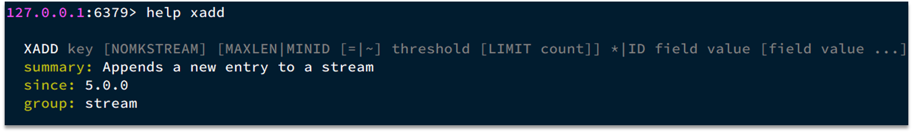
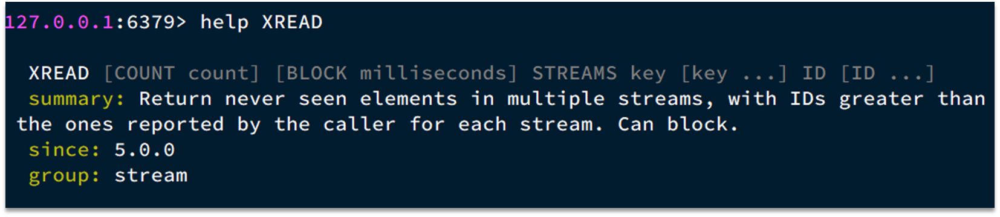

# Stream类型
Stream 是 Redis 5.0 引入的一种新数据类型，可以实现一个功能非常完善的消息队列。

+ 可持久化的，可以保证数据不丢失。
+ 支持消息的多播、分组消费。 
+ 支持消息的有序性。

> [https://juejin.cn/post/7028439051308892167#heading-0](https://juejin.cn/post/7028439051308892167#heading-0)


发送消息的命令：XADD


例如：
```bash
127.0.0.1:6379> XADD users * name Jeek age 18
"1681265184716-0"
```

读取消息的方式之一：XREAD


例如，使用XREAD读取第一个消息：
```bash
127.0.0.1:6379> XREAD COUNT 1 STREAMS users 0
1) 1) "users"
   2) 1) 1) "1681265184716-0"
         2) 1) "name"
            2) "Jeek"
            3) "age"
            4) "18"
```
XREAD阻塞方式，读取最新的消息：
```bash
> XREAD COUNT 1 BLOCK 1000 STREAMS users $
(nil)
```
在业务开发中，我们可以循环的调用XREAD阻塞方式来查询最新消息，从而实现持续监听队列的效果，伪代码如下（go语言）：
```go
for {
    // 尝试读取队列中的消息，最多阻塞2s
    // XREAD COUNT 1 BLOCK 2000 STREAMS users $
    client := redis.NewStringCmd("XREAD", "COUNT", "1", "BLOCK", "1000", "STREAMS", "users", "$")
    msg, err := client.Result()
    if err != nil {
        continue 
    }
    // 处理消息
    handleMessage(msg)
}
```

查看stream命令：
```bash
127.0.0.1:6379> help @STREAM

  XACK key group ID [ID ...]
  summary: Marks a pending message as correctly processed, effectively removing it from the pending entries list of the consumer group. Return value of the command is the number of messages successfully acknowledged, that is, the IDs we were actually able to resolve in t
he PEL.
  since: 5.0.0

  XADD key ID field string [field string ...]
  summary: Appends a new entry to a stream
  since: 5.0.0

  XCLAIM key group consumer min-idle-time ID [ID ...] [IDLE ms] [TIME ms-unix-time] [RETRYCOUNT count] [force] [justid]
  summary: Changes (or acquires) ownership of a message in a consumer group, as if the message was delivered to the specified consumer.
  since: 5.0.0

  XDEL key ID [ID ...]
  summary: Removes the specified entries from the stream. Returns the number of items actually deleted, that may be different from the number of IDs passed in case certain IDs do not exist.
  since: 5.0.0

  XGROUP [CREATE key groupname id-or-$] [SETID key id-or-$] [DESTROY key groupname] [DELCONSUMER key groupname consumername]
  summary: Create, destroy, and manage consumer groups.
  since: 5.0.0

  XINFO [CONSUMERS key groupname] [GROUPS key] [STREAM key] [HELP]
  summary: Get information on streams and consumer groups
  since: 5.0.0

  XLEN key
  summary: Return the number of entires in a stream
  since: 5.0.0

  XPENDING key group [start end count] [consumer]
  summary: Return information and entries from a stream consumer group pending entries list, that are messages fetched but never acknowledged.
  since: 5.0.0

  XRANGE key start end [COUNT count]
  summary: Return a range of elements in a stream, with IDs matching the specified IDs interval
  since: 5.0.0

  XREAD [COUNT count] [BLOCK milliseconds] STREAMS key [key ...] ID [ID ...]
  summary: Return never seen elements in multiple streams, with IDs greater than the ones reported by the caller for each stream. Can block.
  since: 5.0.0

  XREADGROUP GROUP group consumer [COUNT count] [BLOCK milliseconds] STREAMS key [key ...] ID [ID ...]
  summary: Return new entries from a stream using a consumer group, or access the history of the pending entries for a given consumer. Can block.
  since: 5.0.0

  XREVRANGE key end start [COUNT count]
  summary: Return a range of elements in a stream, with IDs matching the specified IDs interval, in reverse order (from greater to smaller IDs) compared to XRANGE
  since: 5.0.0

  XTRIM key MAXLEN [~] count
  summary: Trims the stream to (approximately if '~' is passed) a certain size
  since: 5.0.0

```
