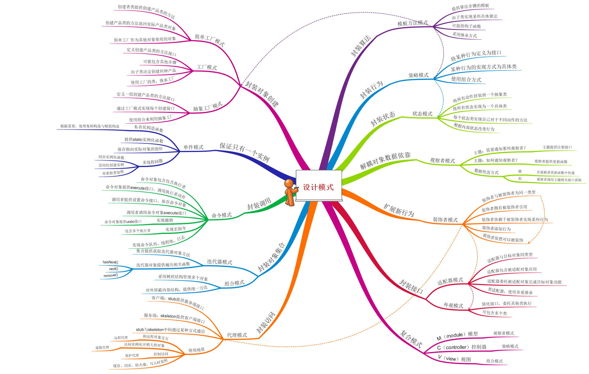

# JS设计模式学习笔记

> 本文绝大多数概念是基于ES5之前的，本人认为这些都是学习或者掌握ES6必须要理解的，因为ES6其实就是对ES5之前的方法的包装，理解透彻ES5之前的概念，那么学ES6就极其简单。



## 1. 基础

### 1.1 灵活的JS

JS极其灵活，对于同样一段业务代码，有的可以写的很复杂，有的却可以写的很简单。

例如：启动和停止一个动画

面向过程方式：

```js
// 开始
function startAnimation() {
	console.log("start...")
}
// 结束
function stopAnimation(){
	console.log("stop...")
}
// 调用
startAnimation();
stopAnimation()
```

面向对象方式一：

```js
// 创建一个对象
var Animation = function(){}
Animation.prototype.start = function(){
	console.log("start...")
}

Animation.prototype.stop = function(){
	console.log("stop...")
}

// 使用
var test = new Animation();
test.start();
test.stop();
```

面向对象方式二：

```js
var Animation = function(){}
Animation.prototype = {
	start: function(){
		console.log("start...")
	},
	stop: function(){
		console.log("stop...")
	}
}
```

更进一步：

```js
// 在Function上增加方法
Function.prototype.method = function(name, fn){
	this.prototype[name] = fn;
    return this; // 为了可以链式调用
}
var Animation = function(){};
Animation.method('start', function(){
	console.log("start...");
    return this;// 为了可以链式调用
})
Animation.method('stop',function(){
	console.log('stop...');
})

// 使用
var test = new Animation();
// 链式调用
test.start().stop();
new Animation().start().stop(); 
```

这里加了返回值`return this`,是便于链式调用，`stop()`中没有加，是为了考虑逻辑，即new Animation().stop().start(); `是错误的。

对于在原型`prototype`上增加的方法，如`Function.prototype.method`等，必须使用`new`关键字，才能调用。后续会讲解。

### 1.2  JS是弱类型语言

在js中定义变量，不像java，是不需要声明其类型。但是，这并不意味着js中没有类型，其实，js中变量在一初始化的时候就决定了变量的类型，再给变量赋予不同的类型时，变量对应的类型就随之改变。

也就是说，**js中的变量会根据所赋予的值而改变类型**。

| 类型                                                         | 分类                               | 内存位置               | typeof 输出      |
| ------------------------------------------------------------ | ---------------------------------- | ---------------------- | ---------------- |
| boolean布尔                                                  | 基本数据类型(又称原始数据类型)     | 栈                     | boolean          |
| number数字                                                   | 基本数据类型（NAN也属于number）    | 栈                     | number           |
| string字符串                                                 | 基本数据类型                       | 栈                     | string           |
| null空                                                       | 基本数据类型                       | 栈                     | **object**       |
| undefined未定义                                              | 基本数据类型                       | 栈                     | undefined        |
| [symbol](http://es6.ruanyifeng.com/#docs/symbol)独一无二的值 | 基本数据类型                       | 栈                     | symbol           |
| Object对象                                                   | 引用数据类型（function，array...） | 堆，栈中保存引用的地址 | function、object |

一般，可以使用`typeof`来判断数据类型，但是并不准确。为了精确判断，建议使用这个方法：`Object.prototype.toString.call(要判断的变量)`，它返回如：`"[object Function]"`

### 1.3 [函数是一等公民](https://developer.mozilla.org/en-US/docs/Glossary/First-class_Function)

在JS中，函数是一等公民(First-class Function)。它可以存储在变量中，可以作为参数传给其他函数，可以作为返回值从其他函数传出，还可以运行时进行构造。

+ 匿名函数自执行（[IIFE](https://developer.mozilla.org/zh-CN/docs/Glossary/立即执行函数表达式)），又称立即调用函数表达式。

  ```js
  // 无参
  (function(){
  	var x = 3;
  	var y = 7;
  	console.log(x*y)
  })()
  // 有参
  (function(x，y){
  	console.log(x*y)
  })(3,7)
  ```

  除了使用`()`包裹的方式，其实还有`~function(){...}()`或`!function(){...}()`等方式，都可以实现自执行。一般建议使用括号的方式，安全易读。

### 1.4 对象的易变性

JS虽然不像java是强制面向对象编程语言，但是在JS中一切都是对象（基本数据类型，也可以包装成对象），而且所有的对象都是异变的。例如，给函数添加属性：

```js
function test(){
	test.num++;
	console.log(test.num)
}
test.num = 10;
test(); // 输出 11
```

这意味着，我们可以对先前定义的类和实例化的对象进行修改，例如：

```js
function Person(name, age) {
	this.name = name;
	this.age = age;
}

Person.prototype = {
	getName: function(){
		return this.name
	},
	getAge: function(){
		return this.age
	}
}
// 实例化对象
var tom = new Person('Tom',12);
var jerry = new Person('jerry',12);
// 给对象新增方法
Person.prototype.sayHi = function() {
	return 'Hi, ' + this.getName() + '!';
}

jerry.sayHello = function(){
    return 'Hello, ' + this.getName() + '!';
}

tom.sayHi(); // Hi, Tom！
jerry.sayHi(); // Hi, Jerry!
jerry.sayHello(); // Hello, Jerry!
tom.sayHello(); // Cannot set property 'sayHello' of undefined
```

这里，我们在实例化`Person`对象之后新增了`sayHi`方法，并且成功调用，即我们可以扩展实例化之后的对象。通过`prototype`我们给所有的实例都新增了`sayHi`的方法。这里需要理解**[继承与原型链](https://developer.mozilla.org/zh-CN/docs/Web/JavaScript/Inheritance_and_the_prototype_chain)**,后面会讲。

每个实例对象（ object ）都有一个私有属性（称之为 __proto__ ）指向它的构造函数的原型对象（**prototype** ）。该原型对象也有一个自己的原型对象( __proto__ ) ，层层向上直到一个对象的原型对象为 `null`。根据定义，`null` 没有原型，并作为这个**原型链**中的最后一个环节。

几乎所有 JavaScript 中的对象都是位于原型链顶端的 [`Object`](https://developer.mozilla.org/zh-CN/docs/Web/JavaScript/Reference/Global_Objects/Object) 的实例。

### 1.5 继承

JS中使用的是基于对象的继承，即原型式（prototype）继承。比如，`Function B`继承`Function A`：

- 类型被定义在 `.prototype` 中
- 用 `Object.create()` 来继承

```js
function A(){};
A.prototype = {
    varA: "AAA",
    doSomething: function(){
        console.log("AAA...")
    }
}

function B(){};
B.prototype = Object.create(A.prototype, {
    varB: {
        value: "BBB", 
    	enumerable: true, 
    	configurable: true, 
    	writable: true 
    },
    doSomething : { 
    value: function(){ // override覆写
     // A.prototype.doSomething.apply(this, arguments); 
     console.log("BBB...")
    },
    enumerable: true,
    configurable: true, 
    writable: true
  }
})

B.prototype.constructor = B;


var b = new B();
b.doSomething(); // BBB...
console.log(b.varA); // AAA
console.log(b.varB); // BBB
```

还可以模仿基于类（class）的继承：ECMAScript6 引入了一套新的关键字用来实现 [class](https://developer.mozilla.org/zh-CN/docs/Web/JavaScript/Reference/Classes)，但JavaScript 仍然基于原型,这里只不过相当于语法糖，背后的实现还是原型式继承。这些新的关键字包括 [`class`](https://developer.mozilla.org/zh-CN/docs/Web/JavaScript/Reference/Statements/class), [`constructor`](https://developer.mozilla.org/zh-CN/docs/Web/JavaScript/Reference/Classes/constructor)，[`static`](https://developer.mozilla.org/zh-CN/docs/Web/JavaScript/Reference/Classes/static)，[`extends`](https://developer.mozilla.org/zh-CN/docs/Web/JavaScript/Reference/Classes/extends) 和 [`super`](https://developer.mozilla.org/zh-CN/docs/Web/JavaScript/Reference/Operators/super)。

```js
"use strict";

class Person {
    constructor(name, age) {
        this.name = name;
        this.age = age;
    }
}

class Student extends Person{
    // 构造方法
    constructor(name,age,score){
        // super可以认为指代父类
        super(name,age)
        // 扩展
        this.score = score
    }
    get getScore() {
        return this.score;
    }
    set setScore(score) {
        this.score = score
    }
}
```

这里只是简单的了解了一下JS中的继承，后面会深入研究。

### 1.6 JS中的设计模式

JS是如此的灵活，有如此的简单与复杂，为了更加方便维护代码，写出可重用的代码，还是得使用设计模式。

+ 可维护性，设计模式有利于降低模块间的耦合，便于开发和维护。

+ 易于表达，使用不同的设计模式，可以清晰的表达不同业务逻辑的实现意图。

+ 提升性能，使用设计模式，在某些程度上可以减少代码量。

  

## 2. 接口 

<a name="interface"></a>

**“函数要面向接口，而不是实现”**    —— GoF《设计模式》

> [设计模式Java版](https://gof.quanke.name/基础知识.html)
>
> [**Design-Pattern**](https://github.com/AlfredTheBest/Design-Pattern)

### 2.1 接口的概念

接口可以规定一个对象中应该具有哪些属性和方法，但不用具体实现这些方法，实现了这些接口的对象，必须实现这项属性或方法。也就是说接口的出现给对象增加了标准。

### 2.2 接口的优缺点

优点：

+ 增加类的重用性。比如A和B均实现了接口C，若我会使用A类，那么B类也很容易就会使用了；或者我熟悉C接口，不管谁实现了这个接口，我就能很容易去使用它。
+ 增加代码的可读性。比如我事先吧接口文档写好，然后实现了一些程序，当其他程序员来接手时，只需要看接口文档，就能很容易知道我的程序中类的特性，从而更容易更改程序以及实现自己的业务逻辑。
+ 增加代码的可维护性，接口可以降低对象间的耦合度。利用接口，各个组件之间只暴露少许接口共其他组件调用，如果修改了某个组件，并不会影响其他组件。
+ 测试和调试更方便。如果一些类都实现了某个接口，但是却没能完全继承接口中定义的标准，程序很容易就被发现；如果业务扩展，接口需要新增一个方法，那么实现了这些接口的类，如果忘了添加这个方法，也会报错。

缺点：

+ JS是弱类型语言，接口的使用原则会强化类型的作用，降低JS语言的灵活性。
+ 接口一旦被定义，如果再次改动，需要把所有实现了该接口的类改动，比如，某些类不需要这个方法，就会增加额外的开销。
+ JS没有提供对接口的内置支持，就算某些类实现了这个接口，如果不遵循接口的标准，并且不加严格的限制与检查，是无法保证接口的实现的。

### 2.3 用注释描述接口

用注释描述接口是最简单也是效果最差的方法。即使用interface 和 implements关键字表示接口，但是将他们写在注视中，因为JS并不认识，避免与法错误。

通俗地讲，注释中告知，该类需现了这些接口，需要定义这些方法：

```js
/* 定义接口
接口一
interface Composite{
	function add(child);
	function remove(child);
	function getChild(index);
}
接口二
interface FormItem{
	function save();
}
*/

var CompositeForm = function(id, method, action){// implements Composite,FormItem
};
// 实现接口Composite
CompositeForm.prototype.add = function(child){console.log("add...")}
CompositeForm.prototype.remove = function(child){console.log("remove...")}  
CompositeForm.prototype.getChild = function(index){console.log("getChild...")}   
// 实现接口FormItem
CompositeForm.prototype.save = function(){console.log("save...")}        
```

呵，有点东施效颦的味道。这个方式不能保证完全实现了接口，就算不按照接口来，也不会报错，对测试和调试也无帮助。但是胜在简单，也确是实现了接口的意图。

### 2.4  用属性检查模仿接口

其实，这种方式就是在上面的方式基础上，增加了属性判断，判断类中实现了那些接口，稍微严谨一些。接口仍然写在注释中。

```js
var CompositeForm = function(id,method,action){
    // 显示地申明，本类实现了如下接口
    this.implementsInterfaces = ['Composite', 'FormItem'];
}

// 定义一个添加实例的方法，并检测实例是否实现了接口
function addForm(formInstance) {
    // 判断实例是否实现了接口，否则抛出错误
    if(!implements(formInstance, 'Composite','FormItem')){
        throw new Error('Object does not implements a required interface!');
    }
}
// 定义判断是否实现接口的方法
function implements(object) {
    for (var i = 1; i < arguments.length; i++) {
        var interfaceName = arguments[i];
        var interfaceFound = false;
        // 遍历implementsInterfaces，看是否实现了对应的接口
        for (var j = 0; j < object.implementsInstances.length; j ++) {
            if (object.implementsInterfaces[j] == interfaceName) {
                interfaceFound = true; 
                break;
            }
        }
        if(!interfaceFound){
            return false; // 没有实现接口
        }
    }
    return true; // 实现了接口
}
```

这里`CompositeForm`说他实现了某某接口，那就判断一下，发现确实实现了，OK，否则就会跑出错误。但是这个简陋的判断并没有保证，完全实现接口中定义的方法，所以还是会埋下隐患。

### 2.5 用鸭式辩型模仿接口

**“像鸭子一样走路并且嘎嘎叫的就是鸭子”** —— James Whitcomb Riley鸭子类型

基于这种思想：类是否申明自己支持哪些接口并不重要，只要它具有这些接口中的方法就行。即如果对象具有与接口定义的方法同名的所有方法，那么就可以认为它实现了这个接口。

```js
var Interface = function(name, methods) {
	// 保证传入方法名和方法集合，两个参数
	if (arguments.length !== 2) {
		throw new Error(
			"Interface constructor called with " + arguments.length + "arguments, but expected exactly 2."
		);
	}

	this.name = name;
	this.methods = [];
	for (var i = 0, len = methods.length; i < len; i++) {
		// 方法名类型string
		if (typeof methods[i] !== "string") {
			throw new Error(
				"Interface constructor expects method names to be passed in as a string."
			);
		}
		this.methods.push(methods[i]);
	}
};
// 定义static方法，可以直接通过类名调用而不用实例化
Interface.ensureImplements = function(object) {
	if (arguments.length < 2) {
		throw new Error(
			"Function Interface.ensureImplements called with " + arguments.length + " arguments, but expected at least 2."
		);
	}

	for (var i = 1, len = arguments.length; i < len; i++) {
		var interface = arguments[i];
		if (interface.constructor !== Interface) {
			throw new Error(
				"Function Interface.ensureImplements expects arguments two and above to be instance of Interface."
			);
		}
		for (var j = 0, methodsLen = interface.methods.length; j < methodsLen; j++) {
			var method = interface.methods[j];
			if (!object[method] || typeof object[method] !== "function") {
				// 抛出错误：没有实现接口以及方法没有找到
				throw new Error(
					"Function interface.ensureImplements：object does not implements the " +
						interface.name + "interface. Method " + method + " was not found"
				);
			}
		}
	}
};
```

上面的类定义了接口以及接口的检测，可以作为工具类使用。

```js

// 使用：
// 定义接口，以及接口中的方法
var Composite = new Interface("Composite", ["add", "remove", "getChild"]);
var FormItem = new Interface("FormItem", ["save"]);

var CompositeForm = function(id, method, action) {
	// implements Composite,FormItem
};

var myForm = new CompositeForm();
// 实现接口
myForm.prototype.add = function(){}
myForm.prototype.remove = function(){}

// 检测实例是否完全实现了接口
function addForm(formInstance) {
	Interface.ensureImplements(formInstance, Composite, FormItem);
    // 其他操作
}
addForm(myForm);
```

`Interface.ensureImplements`方法会对实例严格检测，如果实例中没有完全实现对应的接口就会抛出错误。这样，我们就实现了接口的概念。

### 2.6 依赖于接口的设计模式

+ 工厂模式
+ 组合模式
+ 装饰者模式
+ 命令模式

## 3.  封装

封装（encapsulation）就是将不必要暴露的方法或属性隐藏起来，不让外部方法访问，以防止篡改或滥用，降低代码间的耦合度，提升安全性。

JS中没有像Java中的关键字private，实现封装的方法——闭包（closure）。

### 3.1 类中属性的私有化

在类中，一般使用下划线开头来定义私有属性，这是总所周知的命名规范，它表明一个属性（或方法）仅提供在对象内部使用。

注意，这种方式只是一种约定，并不能强制性决定外部不能访问。

```js
// 定义一个三角形类，构造方法
var Triangle = function(x,y,z){
    this.setX(x);
    this.setY(y);
    this.setZ(z);
}

// 判断能否构成三角形，静态方法，通过类名调用，不用new实例化
Triangle.isTriangle = function(x,y,z){
    return x+y>z && x+z>y && y+z>x;
}
// 实例方法，必须new之后才能调用
Triangle.prototype = {
    setX: function(x){
        this._x = x;
    },
     setY: function(y){
        this._y = y;
    },
     setZ: function(z){
        this._z = z;
    },
    
    getX: function(){
        if(!Triangle.isTriangle(this._x,this._y,this._z)){
            throw new Error('不能构成三角形!')
        }
        return this._x;
    },
    getY: function(){
          if(!Triangle.isTriangle(this._x,this._y,this._z)){
            throw new Error('不能构成三角形!')
        }
        return this._y;
    },
    getZ: function(){
          if(!Triangle.isTriangle(this._x,this._y,this._z)){
            throw new Error('不能构成三角形!')
        }
        return this._z;
    } 
}
```

这样一来，虽然我们传进去的参数是x,y,z，我们是直接获取不到的，可以通过get方法获取。

```js
var san = new Triangle(3,4,5);
san.x; // undefined;
san.getX(); // 3
san._x; // 3
```

但是，我们其实是可以通过`_x`获取的。加上下划线只是表明这些属性是私有的，最好不要直接访问。

### 3.2 作用域、嵌套函数和闭包

在JS中，只有函数具有作用域。即，在一个函数内部声明的变量在函数外部通常是无法访问的。

```js
function outer(){
    var a=10;
    
    function inner(){
        a *= 2;
    }
    inner();
    return a;
}

outer(); // 20
outer(); // 20
a; // undefined
```

这里，在函数内部定义函数，内部函数访问了外部函数定义的变量a，函数外面是访问不到变量a的。即，函数内部有局部作用域。那么，如果想访问变量a呢?

```js
function outer(){
    var a=10;
    // 将内部函数返回
    return function(){
        a *= 2;
        return a;
    };
}

var test = outer();
test(); // 20
test(); // 40
test(); // 60

var demo = outer();
demo(); // 20
```

这样就形成了闭包。闭包是函数和声明该函数的词法环境的组合。

闭包，即通过函数内部定义函数，在函数外面通过访问这个**内部函数**（可以访问外部函数的定义的变量）从而实现了操作函数内的局部变量的现象。

**闭包就是将函数内部和函数外部连接起来的一座桥梁。**通过闭包，可以访问函数内的局部变量。

```js
var Triangle = (function(){
	// private static attributes 私有静态属性
	var id = 0;
	// private static method 私有静态方法
	function yy(){
		console.log('I am the best tiangle!')
	}
	yy();
	
	// return constructor 返回构造方法
	return function(x,y,z){
		// private attributes 私有属性
		var _x,_y,_z;
		console.log(this);
		// privileged methods 特权方法
		this.getX = function(){
			return _x;
		}
		this.setX = function(x){
			_x = x;
		}
		this.getY = function(){
			return _y;
		}
		this.setY = function(y){
			_y = y;
		}
		this.getZ = function(){
			return _z;
		}
		this.setZ = function(z){
			_z = z;
		}
		this.getId = function(){
			return id;
		}
		// Constructor code 构造区代码
		id++; // 统计Triangle实例化对象个数
		this.setX(x);
		this.setX(y);
		this.setX(z);
	}
})()

// public static method 公有静态方法
Triangle.isTriangle = function(x,y,z){
	 return x+y>z && x+z>y && y+z>x; 
}

// public no-privileged methods 公有非特权方法
Triangle.prototype = {
	
}

// 判断能不能构成三角形
if(Triangle.isTriangle(3,4,5)){
   var t1 = new Triangle(3,4,5) 
   t1.getId(); // 1
    t1.getX(); // 3
    
    var t2 = new Triangle(3,4,5);
    t1.getId(); // 2
}
```

下面，我们来理解一下这些“新概念”：

```js
var A = (function(){
    // 这里定义私有属性和方法
    var haha = "我没有鄙视你!反正你也看不到！";
    function hehe(){
        console.log(haha);
    }
    hehe();
    
    // 返回构造方法
    return function(x){
        // 定义私有属性
        var _x;
        // 定义特权方法，外部通过特权方法访问和操作内部私有属性
        this.getX = function(){
            return _x;
        }
        this.setX = function(x){
            _x = x;
        }
        // 通过特权方法，不仅可以访问内部函数的局部变量，还可以访问外部函数的局部变量
         this.getHaha = function(){
            console.log("自己暴露了自己！！！(⊙o⊙)…完蛋，被发现了！");
            return haha;
        }
        
       // 构造区代码块,只要实例化就会被调用
        this.setX(x);
        console.log("我被实例化了");
    }
})()

// 普通公有方法（实例属性），不能访问内部变量
A.prototype = {
    say: function(){
        console.log("我是公有方法，你需要new之后才能调用");
    },
    sayHi: function(){
        console.log("Hello world!");
    },
    hehe: "heheheheh"
};

A.staticMethod = function(){
    console.log("我是静态方法，你不要new，就可以通过类名调用");
}
```

这样，我们就实现了对类的私有属性以及方法的封装。需要理解的概念有**闭包**，**静态方法**，**原型链**，**new关键字**，**作用域**，**构造方法**。


## 4. 继承

<a name="extend"></a>

### 4.1 类式继承

```js
// 定义一个Person类
function Person(name) {
    this.name = name;
}

Person.prototype.getName = function(){
    return this.name;
}
Person.prototype = {
    className: "Person",
    getName: function(){
        return this.name
    },
}
    
// 使用new关键字实例化类
var p = new Person('Tom');
p.getName();
```

下面，通过原型链来实现继承：

```js
// 定义一个Author类,继承Person
function Author(name, books) {
    // 1.调用父类构造方法
    Person.call(this, name);
    this.books = books;
}
// 2.将子类的原型指向父类
Author.prototype = new Person();
// 3.更新子类的构造方法
Author.prototype.constructor = Author;
// 多态，子类实现自己的属性
Author.prototype = {
    className: "Author",
    getBooks: function(){
        return this.books;
    }
}

// 使用new关键字实例化类
var a = new Author('Jerry', 'Tom and Jerry!');
a.getName(); // Jerry
```

这样就实现了Author类继承Person类的操作。三步走：

+ 1.子类创造构造函数，并在构造函数中调用父类的构造函数，将参数传给父类。`Person.call(this,name)`

+ 2.设置子类的原型链（prototype,要么指向另一个对象，要么指向null），使他指向父类对象。`Author.prototype=new Author()`

+ 3.将子类的构造方法更新为子类对象。`Author.prototype.construtor=Author`

  **原型链查找**：在访问对象的某个属性时（如name属性），首先在该类的实例属性上（`Author.name`）查找，没找到，就会在该类的原型上查找（`Author.__proto__`),即prototype所指向的对象；如果还没找到，继续向上查找（`Author.__proto__.__proto__`）,直到直到找到这个属性或者查到原型链最顶端（`Object.prototype`最终指向null）。

### 4.2  封装继承的方法

为了简化类的声明，ES6中实现了**extends**关键字，如果我们自己实现一个extend函数呢？

```js
/*extend function*/
function extend(subClass, superClass){
    // 空函数F，避免创建超类的实例
    var F = function(){};
    F.prototype = superClass.prototype;
    subClass.prototype = new F();
   
    subClass.prototype.constructor = subClass;
}

// 实现继承
function Author(name,books){
    // 更改父类的this指向，相当于ES6继承中的super
    Person.call(this,name);
    this.books=books;
}
// 继承
extend(Author,Person);

// 必须继承之后再新增方法
Author.prototype.getBooks = function(){
    return this.books;
}

```

上面可以实现继承，子类中需要直接调用父类的构造方法`Person.call(this,name)`，来更新this指向，否则子类获取不到this对象。下面对这一部分进行改善：

```js
/*extend function*/
function extend(subClass, superClass){
    // 空函数F，避免创建超类的实例
    var F = function(){};
    F.prototype = superClass.prototype;
    subClass.prototype = new F();
    subClass.prototype.constructor = subClass;
    
    // superclass属性弱化子类和超类之间的耦合
    // 将父类保存起来
    subClass.superclass = superClass.prototype;
    if(superClass.prototype.constructor==Object.prototype.constructor){
        subClass.prototype.constructor = superClass;
    }
}

// 实现继承
function Author(name,books){
    // 改善
    Author.superclass.constructor.call(this,name);
    this.books=books;
}
extend(Author,Person);

Author.prototype.getBooks = function(){
    return this.books;
}

```

### 4.3 原型式继承

原型式继承和类式继承截然不同。原型式继承，要从**对象**的角度考虑。下面我们用对象的方式重新实现上面的Person、Author类的继承：

+ 1.用一个类声明定义对象的结构

  ```JS
  /* Person Prototype Object*/
  var Person = {
      name: 'person',
      getName: function(){
          return this.name;
      }
  }
  ```

+ 2.实例化该类创建一个新对象

  ```js
  var Author = clone(Person);
  Author.name = 'author'
  Author.books = [];
  Author.getBooks = function(){
      return this.books;
  }
  
  // 每次实例化都要使用clone方法
  var author = clone(Author);
  author.name = 'zkk'
  author.books = ['JavaScript设计模式', '深入浅出ES6'];
  author.getName();
  author.getBooks();
  ```

+ 3.编写`clone`方法，实现继承

  ```js
  // 创建一个以superClass为原型的空对象
  function clone(superClass) {
      function F(){};
      F.prototype = object;
      return new F;
  }
  ```

  

### 4.4  类式继承与原型式继承

类式继承的用法更广泛，一般封装的库，都是用这种方式。

原型式继承一般用得比较少，但是最好还是要理解这种方式。

原型式继承更能节省内存空间，并且更简洁。但类式继承因为是模仿传统语言的继承方式，更容易被理解，所以被广泛应用。

鉴于此，一般建议还是使用类式继承，但不要忘记还有原型式继承。

### 4.5 部分继承——掺元类（Mixin Class）

掺元类（或混合类 mixin class）: 即通过扩充（augmentation）的方式拥有某些类中的方法而不用继承这些类,那么提供这些方法的类（被共享方法的类）就是掺元类。

1. 定义mixin class提供方法：

   ```js
    // 定义一个Mixin class 
   var Mixin = function(){};
   Mixin.prototype = {
       serialize: function(){
           var output = [];
           for(key in this){
               output.push(key + ': ' + this[key]);
           }
           return output.join(', ');
       },
       other: function(){};
   }
   ```

2. 将mixin class中提供的函数扩充到其他类中：

   ```js
   // 利用augemnt将Mixin中的serialize方法扩充到Author类中
   augment(Author, Mixin, 'serialize')
   var author = new Author('Joe', ['HTML','CSS']);
   var str = author.serialize();
   ```

3. 实现扩充方法augment：

   ```js
   // 参数：接受的类，提供的类，方法1，方法2，。。。（方法名为可选参数）
   function augment(receive, giveClass){
       if(arguments[2]){ // 明确要扩充的方法，那么只提供这些方法
           for(var i=2,len=arguments.length;i<len;i++){
               receiveClass.prototype[arguments[i]] = giveClass.prototype[arguments[i]];
           }
       } else { // 没有传入要扩充的方法，默认全部提供
           for(methodName in giveClass.prototype){
               if(!receiveClass.prototype[methodName]){
                   receiveClass.prototype[methodName] = giveClass.prototype[methodName];
               }
           }
       }
   }
   ```

   JS中一个对象只能有一个原型对象，所以不允许子类继承多个父类，但是可以通过掺元类的方式实现扩充多个类中的不同方法。

## 5. 链式调用

### 5.1 什么是链式调用？

例如，在Jquery项目中,有：

```js
$("#id").addClass('active').siblings().removeClass('active');
```

这就是 **链式调用**，即利用`.`操作符，在目标对象上连续调用函数的方式。这种方式，可以减少代码量，但是会覆盖上一次函数的返回值。

### 5.2 链式调用原理

链式调用的核心技术就是在每个方法后面返回当前对象，即`return this`，比如：一个人，吃完饭，工作，然后睡觉，实现如下：

```js
function Person(){};
Person.prototype = {
    eat: function(){
        console.log("eat...");
    },
    work: function(){
        console.log("work...")
    },
    sleep: function(){
        console.log("sleep...")
    }
}
// 调用
var p = new Person();
p.eat();
p.work();
p.sleep();
```

这是最基本的实现方式，如果用链式调用呢？

```js
function Person(){};
Person.prototype = {
    eat: function(){
        console.log("eat...");
        return this;
    },
    work: function(){
        console.log("work...");
        return this;
    },
    sleep: function(){
        console.log("sleep...");
        return this;
    }
}
// 调用
var p = new Person();
p.eat().work().sleep();

// 或者
new Person().eat().work().sleep();
```

通过改造，在每个方法中都返回了当前对象，即`return this`，这样每次函数的返回值都是当前对象实例，就可以继续调用它的方法了。

### 5.3 使回调函数从链式调用中获取数据

发现一个问题，就是如果我想要方法返回数据，而不是this对象，那么怎么实现呢？

链式调用适合于赋值器方法，但对于取值器方法（返回特定数据）并不友好，但我们可以使**回调**函数获取所要的数据。或者在特定的get方法后面直接返回数据而不是当前对象。

```js
function Person(name){
    var _name = name;
    // 特权方法
    this.setName = function(name){
        _name = name;
        return this;
    };
    this.getName = function(){
        // 这里没有返回this
        return _name;
    }
}

// 这里只能先调用setName,在链式调用get
new Person('zkk').setName('ZKKK').getName();
new Person('zkk').getName();
// 而不能先get在set
new Person('zkk').getName().steName();
```

```js
var myname;
function getMyName(name){
    myname = name;
}

// 改造上面的getName
this.getName = function(callback){
    // 通过回调函数获取name
    callback.call(this, _name)
    return this;
};

// 这时，我就可以随意获取或者修改name了
new Person('zkk').getName(getMyName).setName('zkkk').getName(getMyName)...
```

### 5.4 设计自己的JS库——支持链式调用

```js
// 定义自己的库
(function(window){
    // 给Function添加新的方法，使每个函数实例都能使用
Function.prototype.method = function(name, fn){
    this.prototype[name] = fn;
    return this;
}	
    
    function _zkk(name, age){
        this.name = name;
        this.age = age;
    };
    
    _zkk.method('getName', function(){
        return this.name;
    });
    _zkk.method('setName', function(name){
        this.name = name;
        return this;
    });
    
    // 挂载到window上
    window.zkk = function(name,age) {
        return new _zkk(name,age);
    }
})(window)	
```


## 6. 单例模式（Singleton）

### 6.1 基本概念

单体类，只有一个实例对象，即只会被实例化一次，所有的属性共享相同的资源。

通过**对象字面量**创建一个最简单的Singleton:

因为JS中普通的对象是不能通过new关键字来实例化的，所以它只有一个实例对象就是它本身。

```js
/*Basic Singleton*/
var Singleton = {
    key1: "value1",
    key2: "value2",
    
    func1: function(){},
    func2: function(){}
}
```

### 6.2 基本用途

利用单例模式划分**命名空间**：

比如：`A.js` 和`B.js`中都有一个方法`sayHi()`

```js
// A.js
function sayHi(){console.log('Hi! AAA')}
// B.js
function sayHi(){console.log('Hi! BBB')}
```

当两者都被引入同一个文件时，后引入的会覆盖县引入的，这是通过命名空间就可以解决这个问题。

```js
/* use namespace*/
var A = {
    sayHi:function(){
        console.log('Hi! AAA')
    }
};

var B = {
    sayHi:function(){
        console.log('Hi! BBB')
    }
};
// 通过命名空间调用，不会产生覆盖的问题很容易区分
A.sayHi(); 
B.sayHi();
```

### 6.3 私有属性的单例——闭包

```js
// 创建拥有私有变量的单例---闭包
var ss  = (function() {
    // private attribute
    var name = "我是private属性"
    // public attribute
	return {
		key1: "我是lublic属性;
        ",
		key2: "value2",
        
        // public访问私有属性
		func1: function() {
            console.log(name);
        },
		func2: function() {}
	};
})();

// 测试
var a = ss;
var b = ss;
a.key1; // 我是lublic属性;
b.key1; // 我是lublic属性;

a.key1 = "aaa";
b.key1; // aaa;

a===b; // true
```

单例类一旦被实例化之后，所有的实例（其实就只有一个实例化对象）都共享相同的资源，改变其中一个，另一个也会鞥这改变。利用这个特性我们可以使多个对象共相同的全局资源。

### 6.4惰性实例化

单体对象都是在被一加载时实例化的，能不能在我需要的时候再实例化呢？这样可以节省资源，这就是惰性实例化，即懒加载技术（lazy loading）。懒加载单体的关键是借助一个**静态方法**（static method），调用`Singleton.getInstance().methodName()`来实现。`getInstance`方法会检测单体是否已经被实例化，如果还没有就创建并返回实例。

+ 1.把单体的所有代码移到private方法`constructor`中
+ 2.通过public方法`getInstance`调用private方法`constructor`来控制实例的创建
+ 3.通过private属性`uniqueInstance`来检测单例是否已经实例化

```js
var Singleton = (function() {
    // 保存单体实例化对象
	var uniqueInstance;
    // 将所有的单体内容包裹在这个私有方法里面
	function constructor() {
		// private attribute
		var name = "我是private属性";
		// public attribute
		return {
			key1: "我是lublic属性",
			key2: "value2",

			// public访问私有属性
			func1: function() {
				console.log(name);
			},
			func2: function() {}
		};
	}
	
	return {
        // 通过这个public方法暴露出去
		getInstance: function(){
			if(!uniqueInstance){ // 检测是否已经实例化
				uniqueInstance = constructor();
			}
			return uniqueInstance;
		}
	}
})();

// 测试
Singleton.getInstance().func1();
```

简单梳理一下，结构如下：

```js
var singleton = (function(){
    // 保存单体类对象
    var uniqueInstance;
    function constructor(){
        // 单体类主体
        return {}
    }
    return {
        getInstance: function(){
            // 控制单体类实例化
            if(!uniqueInstance){
                uniqueInstance = constructor();
            }
            return uniqueInstance;
        }
    }
})();
```


### 6.5 分支技术

**分支**（branching）是一种用来把浏览器间的差异封装到在运行期间进行设置的动态方法中的技术。比如创建XHR对象，大多数浏览器使用`new XMLHttpRequest()`创建，低版本IE确是用` new ActiveXObject("Microsoft.XMLHTTP")`来创建，如果不使用分支技术，每次调用的时候，浏览器都要检测一次。可以利用分支技术，在初始化的时候加载特定的代码，再次调用的时候就不要再次检测了。

大概逻辑如下：

```js
var s = 'A';
var Singleton = (function(str){
    var A = {
        func1: function(){}
    };
    var B = {
        func1: function(){}
    };
    
    return str === 'A'? A: B;
})(s)
```

封装好的创建XHR对象的函数：

```js
function createXMLHttpRequest() {
    try {
        // 主流浏览器
        return new XMLHttpRequest();
    } catch (e) {
        try {
            // IE6
            return new ActiveXObject("Msxml2.XMLHTTP");
        } catch(e) {
            try {
                // IE5.5及以下
                return new ActiveXObject("Microsoft.XMLHTTP");
            } catch (e) {
                // 未知
                throw e;
            }
        }
    }
}
```

下面使用分支技术创建XHR对象：

```js
var XHRFactory = (function() {
	var standard = {
		createXMLHttpRequest: function() {
			return new XMLHttpRequest();
		}
	};
	var activeXNew = {
		createXMLHttpRequest: function() {
			return new ActiveXObject("Msxml2.XMLHTTP");
		}
	};
	var activeXOld = {
		createXMLHttpRequest: function() {
			return new ActiveXObject("Microsoft.XMLHTTP");
		}
	};

	try {
		standard.createXMLHttpRequest();
		return standard;
	} catch (e) {
		try {
			activeXNew.createXMLHttpRequest();
			return activeXNew;
		} catch (e) {
			try {
				activeXOld.createXMLHttpRequest();
				return activeXOld;
			} catch (e) {
				throw e;
			}
		}
	}
})();
```

这样只需调用`XHRFactory.createXMLHttpRequest()`就可以获取特定浏览器环境的XML对象。这里并不是说用分支创建的XHR方式更好，而是强调怎么使用分支技术来实现按需加载。

## 7. 工厂模式（Factory）

如果一个类中有成员属性是另一个类的实例，常规操作是用**new关键字**和**类构造方法**创建实例，这样一来，就会导致两个类产生**依赖性**，即**耦合度**，为了**降低耦合度**，可以考虑使用**工厂模式**。

### 7.1 初探工厂模式

比如超市提供各色商品，顾客去超市买食物：

```js
var Market = function() {};
Market.prototype = {
	getFood: function(name) {
		var food;
		switch (name) {
			case 'milk':
                // 超市自己制造的食品
				food = new Milk();
				break;
			case 'bread':
				food = new Bread();
				break;
			default:
				food = null;
		}
        // food通过检查了吗？
		return food;
	},
};

function Milk(){};
function Bread(){};

new Market().getFood('milk');
```

很显然，超市不应该可以制造食物，而是提供食物，食物应该交由食品加工厂制造，而且还要确保制造的食物是健康的、可食用的，即校验合格的。

下面，将食品加工交给食品加工厂，并且要校验合格：

```js
// 食物标准：健康、绿色、可食用
var Food = new Interface('Food', ['isHealth', 'isGreen', 'isEdible']);

// 食物加工厂
var FoodFactory = {
	createFood: function(name) {
		var food;
		switch (name) {
			case "milk":
				food = new Milk();
				break;
			case "bread":
				food = new Bread();
				break;
			default:
				food = null;
		}
		// 食物检测
		Interface.ensureImplements(food,Food);
		return food;
	}
};


function Milk(){};
// 实现标准
Milk.prototype = {
    isHealth: function(){},
    isGreen: function(){},
    isEdiable: function(){}
}

var Market = function() {};
Market.prototype = {
	getFood: function(name) {
		var food = FoodFactory.createFood(name);
		food.isHealth();
		food.isGreen();
		food.isEdible();
		// 现在可以放心出售了
		return food;
	}
};
```

这里使用**接口**定义了食物标准，并且在工厂类中检测是否实现了这些标准。**Interface**类的具体实现请看[第2章-接口2.2.3](#interface)。

这样，我们把食物制造工作从超市移交给食品加工厂了，完成了解耦操作。这是只是最简单的工厂模式，真正的工厂模式比这更复杂。

### 7.2 深入工厂模式

工厂是一个将其**成员对象的实例化**通过子类来实现。

继续用超市的例子来理解，现在超市盈利了，开办了自己的食品超市A专门自产自销食品，食品加工不再借由外面的加工厂了，而是自己的食品超市自己加工（自产自销）。

```js
var Market = function(){};
Market.prototype = {
    getFood: function(name)
        // 这里将成员对象实例化交给抽象类
        return this.createFood(name);
    },
    // 这是一个抽象类，需要子类来实现它
    createFood: function(name){
        throw new Error('Unsupported operation on an abstract class.');
    }
}
```

上面 定义抽象类来实现成员实例化方法，但是抽象类是不能直接调用的，它需要通过子类继承才能被实例化。

```js
var FoodMarketA = function() {};
// 实现继承
extend(FoodMarketA, Market);
// 实现抽象类方法
FoodMarketA.prototype.createFood = function(name) {
	var food;
	switch (name) {
		case "milk":
			food = new Milk();
			break;
		case "bread":
			food = new Bread();
			break;
		default:
			food = null;
	}
	// 食物检测
	Interface.ensureImplements(food, Food);
	return food;
};

// 这样顾客就可以到专门的食品超市购买食物
var foodMarketA = new FoodMarketA();
var milk = foodMarketA.getFood('milk');
```

`FoodMarketA`继承了`Market`，并且实现了抽象方法，`Market`就相当于一个的连锁超市总部，可以在全开连锁店，不仅可以有`FoodMarketA`，还可以扩张`FoodMarketB`等，只需要实现继承就可以了。

这里的继承`extend`方法具体实现请参考[第4节-继承4.2](#extend)。

### 7.3 工厂模式利弊

+ 利：弱化对象间的耦合，防止代码的重复。通过工厂模式，可以先创建一个抽象的父类，然后子类实现继承实现具体的方法，从而把成员对象的创建交由专门的类去创建。关键技术：**接口**和**继承**，即制定标准和实现标准。
+ 弊：逻辑复杂，有可能使问题复杂化，代码不够清晰，阅读代码需要查接口以及继承关系。

## 8. 桥接模式（Bridge）

### 8.1 桥接模式概述

“将抽象与其实现隔离开来，以便二者独立变化。” —— GOF

在实现API的时候，桥接模式非常有用。再设计一个Javascript API的时候，可以与整个模式来弱化它与所有使用它的类和对象之间的**耦合**。

在一个类中，你可能定义有许多获取方法（getter）、设置方法（setter）以及其他方法，无论是用来创建Web服务API还是普通的**取值器**（accessor）方法还是**赋值器**（mutator）方法，都借助桥接模式可以简洁代码。

### 8.2 用桥接模式联结多个类

在现实中通过媒介可以把多个不同的事物联结起来，例如：人用电脑打字，简单实现 如下：

```js
var People = function(name,age){
    this.name = name;
    this.age = age;
};
People.prototype = {
    type: function(){
        console.log('type...');
    }
};

var Computer = function(brand) {
    this.brand = brand;
};

var Word = function(text){
    this.text = text;
};

var Print = function(name,age,brand,text){
    this.people = new People(name,age);
    this.computer = new Computer(brand);
    this.word = new Word(text);
    
    this.print = function(){
        console.log('一个名叫' + this.people.name + this.people.age + '岁的人，用' + this.computer.brand + '电脑，打印出了一段话：' + this.word.text);
    } 
}

// 
var p = new Print('zkk', 24, 'Apple', 'Hello World!');
p.print();
```

这里定义了三个类：`People`、`Computer`、`Word`，通过桥接类`Print`将它们联系在一起。`Print`不用关注具体的人、电脑、词语是怎么产生的，只需调用即可。

### 8.3 接模式应用

比如手动实现一个最简单的**forEach**遍历数组：

```js
Array.prototype.myForEach = function(fn) {
    for(var i=0,len=this.length;i<len;i++){
        fn.call(this, this[i], i, this);
    }
}
```

这里`forEach`不用关注回调函数`fn`的具体实现，这里只是调用一下。回调函数`fn`想怎么实现就怎么实现，是压根不影响`forEach`函数的。

还有比如，事件监听回调、借助特权函数访问私有数据的手段，等等都有用到桥接模式。

记住，桥接模式的核心在于**将抽象与具体实现分离**，完成解耦操作。

### 8.4 桥接模式利弊

+ 利：将抽象与实现分离，独立管理各个部分的逻辑，降低耦合，有利于代码的维护。
+ 弊：提高了系统的复杂度。

## 9. 组合模式（composite）

### 9.1 理解组合模式

组合模式又称部分-整体模式，将对象组合成树形结构以表示“部分-整体”的层次结构，组合模式使得用户对单个对象和组合对象的使用具有一致性。掌握组合模式的重点是要理解清楚 “部分/整体” 还有 ”单个对象“ 与 "组合对象" 的含义。

组合模式主要有三个角色：

+ 抽象组件（Component）：抽象类，主要定义了参与组合的对象的公共接口
+ 子对象（Leaf）：组成组合对象的最基本对象
+ 组合对象（Composite）：由子对象组合起来的复杂对象


### 9.2 组合模式应用

比如DOM操作中最常用的就是给一个元素添加或删除一个样式：

```js
var div = document.getElementById('div');
div.classList.add('red');
div.classList.remove('green');
// 再来一个
var p = document.getElementById('p');
p.classList.add('red')
p.classList.remove('green');
```

每次操作都要调用各种方法，很是繁琐，我想要一次操作大量的节点，就很是费力了。

```js
var OperateClass = function(){
    this.domList = [];
};
OperateClass.prototype = {
    addDom: function(classNameOrId) {
        var dom = document.querySelector(classNameOrId);
        this.domList.push(dom);
    },
    removeClass: function(className) {
        for(var i=0,len=this.domList.length;i<len;i++){
            if(this.domList[i] && this.domList[i].classList.contains(className)){
                this.domList[i].classList.remove(className);
            }
        }
    },
    addClass:function(className) {
        for(var i=0,len=this.domList.length;i<len;i++){
            if(this.domList[i] && !this.domList[i].classList.contains(className)){
                this.domList[i].classList.add(className);
            }
        }
		}
}

var oc = new OperateClass();
oc.addDom('.item-1');
oc.addDom('.item-2');
oc.addDom('.item-3');

oc.addClass('red');
oc.addClass('bg-green');
```

通过定义一个组合对象，把每个Dom操作都统一起来，可以实现一次性对大量Dom进行添加或者删除`className`的操作。

总结一下，完整的模式如下：

```js
// 1.抽象组件（Component）定义公共接口
var Component = new Interface('Component', ['func1', 'func2']);

// 2.组合对象（Composite）
var Composite = function(){
    this.leafList = [];
};
// 3.实现继承，并实现方法
extend(Composite, Component);
Composite.prototype = {
    add: function(leaf){
        this.leafList.push(leaf);
    },
    func1: function(){
        for(var i=0,len=this.leafList.length;i<len;i++){
            if(this.leafList[i] instanceof Component){
                this.leafList[i].func1();
            }
        }
    },
    func2:function(){
                for(var i=0,len=this.leafList.length;i<len;i++){
            if(this.leafList[i] instanceof Component){
                this.leafList[i].func2();
            }
        }
    }    
};
// 4.叶子对象（Leaf）
var Leaf1 = function(){};
extend(Leaf1, Component);

Leaf1.prototype = {
    func1: function(){
        console.log('func1...');
    },
    func2:function(){
        console.log('func2...');
    }
};
var Leaf2 = function(){};
Leaf2.prototype = {
    func1: function(){
        console.log('func1...');
    },
    func2:function(){
        console.log('func2...');
    }
}; 

// 操作所有叶子节点
var composite = new Composite();
composite.add(new Leaf1());
composite.add(new Leaf2());

composite.func1();
composite.func2();
```

这里定义了一个公共接口`Component`，所有的组件（`Composite` 和`Leaf`）都继承了这个接口，然后把`Leaf`组件打包给`Composite` ，由`Composite`一次性完成对`Leaf`所有的操作。

上面代码中使用了两个函数[interface](#interface)和[extend](#extend)，具体实现请看第2节和第4节。

### 9.3 组合模式利弊

+ 利：在组合模式中，各个对象之间的耦合很松散，只要实现了相同的接口，相同的操作就可以很方便实现。组合模式是一种非常管用的模式，他把一批子对象组织为树形结构，只要一条命令就可以操作树中的所有对象，而不用每次都要手动去遍历所有子对象。

+ 弊：所谓“牵一发而动全身”，用于组合模式再适合不过了，这样一来，一次某个执行操作就会影响所有的节点，这是及其不好的。比如，做了一次删除操作，所有的节点可能都要被影响。

  

## 10. 门面模式（facade）

### 10.1 门面模式概述

门面模式有两个作用：

- 简化类的接口
- 消除类与调用它的类之间的耦合

早期的浏览器差异比较大，比如针对事件监听的封装：

```js
function addEvent(el, type, fn) {
    if(window.addEventListener){
        el.addEventListener(type, fn, false);
    } else if(window.attachEvent) {
        el.attachEvent('on' + type, fn);
    } else {
        el['on' + type] = fn;
    }
}
```

其实这里就用到了**门面模式**。`addEvent`函数就是一个**门面**，通过这个门面`addEvent`，不用再考虑各个浏览器之间的差异。

### 10.2 门面模式应用

最初，我开始写函数的时候，往往把一大堆逻辑代码写在一个函数里面，根本不知道要多设计一个函数。

```js
function a(x) {
    // do something 
}

function b(y) {
    // do something 
}

function ab(x,y) {
    a(x);
    b(y);
}
```

比如上面的函数，最初我肯定是把a,b函数代码块直接写在函数a和b里面的，为什么现在要分开？分别使用a,b,ab 这几个函数可以获得**更多粒度控制**和**灵活性**，这也有利于代码的阅读。

这也是门面模式的一种思维，像这种函数ab，我们称他为**便利函数（convenience function）**。比如DOM事件中的两个事件方法：

```js
event.stopPropagation(); // 阻止事件冒泡
evnt.preventDefault(); // 阻止事件默认行为
```

现在我想有一个方法既可以阻止事件冒泡，又可以阻止事件默认行为：

```js
var DED = window.DED || {};
DED.util = {
    stopPropagation: function(e) {
        if(e.stopPropagation){
            e.stopPropagation()
        } else {
           e.cancelBubble(); // IE
        }
    }，
    preventDefault: function(){
        if(e.preventDefault){
            e.preventDefault(); 
        } else {
            e.returnValue = false; // IE
        }
    }，
    
    // 便利函数
    stopEvent: function() {
        DED.util.stopPropagation();
        DED.util.preventDefault;
    }
}
```

针对这样一段代码：

```js
var el = document.getEementById('foo');
el.style.color = 'red';
el.styley.background = 'green';
```

现在我不想写大量的`document.getEementById`以及`el.style.xx`的代码了，come on！ 设计一个函数:

```js
function setStyle(elements, prop, val){
    for(var i=0,len=elements.length;i<len;i++){
        document.getElementById(elements[i]).style[prop] = val;
    }
}

// 使用
setStyle(['foo', 'bar'], 'color', 'red');
setStyle(['foo', 'bar'], 'postion', 'absolute');
```

现在简化了很多，但还是不够，我希望不要写大量的`setStyle`函数：

```js

function setCSS(elements,styles){
    for(var prop in styles) {
        if(!styles.hasOwnProperty(prop)) continue;
        // 调用上面的函数，而不是把上面的函数代码搬过来
        setStyle(elements, prop, styles[prop]);
    }
}

// 使用
setCSS(['foo','bar'], {
    color:'red',
    background: 'green',
    fontSize: '16px'
})
```

看见了吧，使用了对象字面量的名/值的形式，是不是看起来更像写CSS啦！

### 10.3 门面模式利弊

+ 利：门面模式可用来创建便利函数，便利函数为执行各种复杂操作提高了一个简单的接口，时代码更容易维护和理解。

+ 弊： 门面模式很容易被滥用而造成系统复杂度高。

## 11. 适配器模式（adapter）

### 11.1 适配器模式初探

比如有这样一段代码：

```js
var zkk = {
    name: 'zkk',
    age: 18,
    gender: 'male'
}

function addUser(name,age,gender){
    this.name = name;
    this.age = age;
    this.gender = gender;
}
// 调用
addUser(zkk.name, zkk.age, zkk.gender);
// 我想这样使用
myAddUserUser(user);
```

那么，可以这样改进：

```js
function myAddUser(user) {
    addUser(user.name,user.age,user.gender);
}
```

对的，这就是**适配器模式**，即**把一个不好的接口转为另一个更人性化的接口**。

适配器模式和门面模式很像，都要对其他对象就行包装并改变其呈现的接口。但两者改变接口的方式不同，门面模式通过简化接口来实现，**适配器模式是对原有接口的一次封装操作，提供一个新的接口覆盖原有接口，并不会简化原有的代码**

### 11.2 适配器模式应用

适配器模式最大的特点就是在不修改原有对象的API情况下，实现更加便利的新的API。

比如Jquery中对数组的遍历操作：

```js
$.each([1,2,3], function(index, value) {
    console.log(value)
})
```

发现回调函数参数第一个是`index`第二个才是`value`,有时候我并不想使用`index`,但是也得传入两个参数才能使用`value`，这时我们可以包装一下：

```js
function myEach(arr, fn) {
  return $.each(arr, function(index, value) {
    fn(value, index);
  });
}

myEach([1,2,3], function(value) {
    console.log(value);
})
```


### 11.3 适配器模式利弊

+ 利：适配器模式利用一个新的接口对现有类的接口进行包装，这样可以避免因修改原有代码的接口而造成客户代码的大量修改。
+ 弊：适配器模式在某一方面来说是一种不必要的开销，完全可以通过重构代码修改API来避免。

## 12 装饰者模式（deractor）

### 12.1 装饰者模式概述

装饰者模式（deractor pattern）可以用来动态的给对象增加功能而不改变原对象。

比如：煎饼果子（JB代替），刚出炉的啥也不放(￥6)，可以再加生菜（lettuce ￥+1），还可以加鸡蛋（egg ￥+1）、火腿(ham ￥+2)、培根(bacon ￥+3)。。。话说，好饿呀！^-^

```js
var JB = function(){};
JB.prototype.add = function(){
    console.log('刚出炉的，啥也没放！')
}
JB.prototype.getPrice = function(){
    return 6;
}

var JBwithLettuce = function(){};
JB.prototype.add = function(){
    console.log('加生菜！')
}
JB.prototype.getPrice = function(){
    return 7;
}

...

```

这样一来，我们就要新建好多类，如果在组合（加生菜和鸡蛋、加生菜和火腿。。。），呜呼哀哉，崩溃啦！

装饰者可用于为对象增加工鞥，可以用来替代大量的子类。那么怎么实现呢？请看下一节，嘻嘻！

### 12.2 类的装饰者模式

随着人们的口欲提高，刚出炉的煎饼果子已经满足不了啦，但是又不能把刚出炉的煎饼果子回炉重铸，那就装饰一波吧！大概逻辑如下：

```js
// 啥也不加的煎饼果子
var jb = new JB();
jb.getPrice(); // 6

// 在原有基础上，加生菜
var jbWithLettuce = new LettuceDecorator(jb);
jbWithLettuce.getPrice();  // 7

// 在原有基础上，加火腿
var jbWithHam = new HamDecorator(jb);
jbWithHam.getPrice();  // 8

// 在原有基础上，加生菜，加火腿
var jbWithLettuceHam = new LettuceHamDecorator(jb);
jbWithLettuceHam.getPrice();  // 9
```

很显然，装饰者的类继承了原有类的实现标准，扩展了功能，并且装饰者构造函数需要传入原有类的实例对象。这样我们需要制定一份标准，并且要保证装饰者类来实现它。

也就是说，我们需要两到工序，其一是制造出原汁原味的JB，其二是根据客户口味增加副品。

```js
// 制定接口标准，所有的类以及派生类都要继承
var JB = new Interface('JB', ['add', 'getPrice']);

// JB制造者，实现接口标准，怎么保证实现了标准？
var JBWithNo = function(){}; // 遵循标准
JBWithNo.prototype = {
    add: function(){
        console.log('我是原汁原味的！');
    },
    getPrice: function(){
        return 6;
    }
};

// JB装饰者，装饰器类需要继承
var JBDecorator = function(jb){ // 传入原生类实例对象
    // 这里保证实现标准
    Interface.ensureImplements(jb,JB);
    this.jb = jb;
}
LettuceDecorator.prototype = {
    add: function(){
        console.log('加什么');
    },
    getPrice: function(){
        return this.jb.getPrice(); // 6
    }
};

// 加生菜
var LettuceDecorator = function(jb){
    // 调用父类构造函数
    LettuceDecorator.superclass.constructor.call(this,jb);
}
// 继承装饰者
extend(LettuceDecorator, JBDecorator);
// 扩展功能
LettuceDecorator.prototype = {
    add: function(){
        console.log('加生菜');
    },
    getPrice: function(){
        return this.jb.getPrice() + 1;
    }
};

// 加生菜和火腿
var LettuceHamDecorator = function(jb){
    // 调用父类构造函数
    LettuceDecorator.superclass.constructor.call(this,jb);
}
// 继承装饰者
extend(LettuceHamDecorator, JBDecorator);
// 扩展功能
LettuceHamDecorator.prototype = {
    add: function(){
        console.log('加生菜和火腿');
    },
    getPrice: function(){
        return this.jb.getPrice() + 1 + 2;
    }
};

// 加火腿
var HamDecorator = function(){}
...
```

这样一来，我们实现了上面的逻辑。一切扩展，都是在原生类的基础上进行：

```js
// 原汁原味JB
var jb = new JBWithNo();
jb.getPrice(); // 6
// 加生菜
jb = new LettuceDecorator(jb);
jb.getPrice(); // 7
// 再加火腿
jb = new HamDecorator(jb);
jb.getPrice(); // 9
```

装饰者模式受益于对接口的使用，接口在这个模式中制定了标准，规定装饰者必须实现的方法，派生类通过继承来实现，有关[接口](#interface)和[继承](#extend)的具体实现，请看前面的章节。

### 12.3 方法的装饰者模式

装饰者还可以对方法进行修改，可以在原方法之前执行操作，也可以在原方法之后执行操作，还可以添加新方法。

AOP(面向切面编程)装饰函数：

```js
// 在函数调用之前执行beforeFn
Function.prototype.before = function(beforefn) {
  var self = this; // 保存原函数的引用
  return function() {
    // 返回包含了原函数和新函数的"代理"函数
    beforefn.apply(this, arguments); // 执行新函数，修正this
    return self.apply(this, arguments); // 执行原函数
  };
};
// 在函数调用之后执行afterFn
Function.prototype.after = function(afterfn) {
  var self = this;
  return function() {
    var res = self.apply(this, arguments);
    afterfn.apply(this, arguments);
    return res;
  };
};

// 使用
var func = function() {
  console.log(2);
};
// 添加新功能，覆盖原函数
func = func
  .before(function() {
    console.log(1);
  })
  .after(function() {
    console.log(3);
  });
func();

```

这种使用AOP 的方式来给函数添加功能，就是装饰者模式实现。

使用上面的方法，实现一个性能分析器，主要功能就是打印方法执行的开始时间、结束时间以及消耗时间：

```js
var logTime = function(){
    // 需要被检测的函数（注意：不能测试异步的操作，只能测试同步代码）
    setTimeout((function(){
        console.log('测试一下！')
    })(), 20000)
    
    var a=0;
    for(var i=1; i< 50000;i++){
        a=a*i;
    }
};

logTime.prototype.startTime = 0;
logTime.prototype.endTime = 0;

logTime = logTime.before(function(){
    this.startTime = new Date().getTime();
    console.log('开始时间：' + this.startTime);
}).after(function(){
    this.endTime = new Date().getTime();
    console.log('结束时间：' + this.endTime);
    console.log('消耗时间：' + (this.endTime - this.startTime))
});

// 测试
logTime();
```

### 12.4 装饰者模式利弊

+ 利：通过装饰者，可以在不修改原有对象的基础上为对象动态添加特性或修改方法，而不用创建新的对象来实现这些扩展的功能。这些方法是透明的，还可以被重用到其他对象中。
+ 弊：会增加架构的复杂度，可能不容易被理解。

## 13 享元模式（flyweight）

### 13.1 享元模式概述

享元模式，是一种性能优化的模式，最适合解决因创建大量类似对象而累积性能的问题。通过把大量独立对象转化为少量共享对象，可以降低运行程序所需的资源数量。

享元模式，通过将对象的内部状态划分为内在数据（instrinsic data，类的内部方法所需要的信息）和外在数据（extrinsic data，可以从类上剥离并存储到外部的信息）两类来实现的。然后将**内在状态相同**的所有对象替换为一个**共享对象**，通过工厂来创建这个共享对象。

区分内在数据和外在数据：

+ 内部数据储存于对象内部
+ 内部数据可以被一些对象共享
+ 内部数据独立于具体的场景，通常不会改变
+ 外部数据取决于具体的场景，并根据场景而变化，外部状态不能被共享。

### 13.2 享元模式的实现

- 1.将所有的外在数据从目标类剥离
- 2.创建一个用来控制该类的实例化的工厂
- 3.创建一个用来保存外在数据的管理器

比如，有一个用户管理系统，有一个User类来创建用户的信息，包括用户类型（type）、用户名（name）以及密码（pwd），每次又新增用户的时候都要使用这个类来创建：

```js
var User = function(type, id, name, pwd){
    this.type = type;
    this.name = name;
    this.pwd = pwd;
    this.id = id;
    this.time = new Date();
};
User.prototype = {
    getName: function() {
    return this.name;
  },
  setName: function(name) {
    this.name = name;
    return this;
  },
  // 其他setter/getter略
 // 其他方法
    getTime: function(){
        return this.time;
    },
}

var a = new User('normal', 'Tom', '123');
var b = new User('vip', 'Jerry', '123456');
```

+ 1.将所有的外在数据从目标类剥离

其实，用户类型（type）只用两种（normal和vip），而用户名和密码每个用户都不一样。运用享元模式的思维，用户类型（type）就是内在状态，可以剥离出去，创建一个共享对象：

```js
/*User类，共享对象*/
var User = function(type){
    this.type = type;
}
User.prototype = {
    getType: function(){
        return this.type;
    },
    setType: function(type){
        this.type = type;
    },
}
```

现在用户只分为普通用户和VIP用户，不管你叫张三、李四还是王五，都归为这两类。

+ 2.创建一个用来控制该类的实例化的工厂：

下面我们使用工厂类来实现User创建，如果某一类User已经创建就返回，否则就创建新的User，确保了对应于每个唯一的内在状态，只会创建一个实例：

```js
/* UserFactory 工厂类-单例*/
var UserFactory = (function(){
    var userList = {};
    return {
        create: function(type){
            if(userList[type]){
                return userList[type];
            }
            return userList[type] = new User(type);
        }
    }
})()
```

+ 3.创建一个用来保存外在数据的管理器

最后一步，我们需要用差异性信息标识在每个用户上面，否则所有的用户都一样啦，

```js
/*UserManager类 管理数据-单例*/
var UserManager = (function(){
    var userDataset = {};
    
    return {
        add: function(type, id, name, pwd){
            var user = UserFactory.create(type);
            // 保存外在数据
            userDataset[id] = {
                id: id,
                name: name,
                pwd: pwd,
                time: new Date(),
            };
            return user;
        },
        // 管理外在数据
        set: function(id, user){
            var userData = userDataset[id];
            for(var i in userData){
                user[i] = userData[i]
            }
            return user;
        },
        getName: function(id){
            return userDataset[id].name
        },
        setName: function(id, name){
            userDataset[id].name = name;
            return userDataset[id];
        },
    }
})()
```

享元模式的优化方式复杂度为代价的，原先只有一个类，现在有一个类加两个单体对象。把一个对象的数据保存在两个不同的地方确实不好理解，但是如果解决了性能问题何乐而不为。

外在状态的管理，本例中采用了最简单的方式——管理器对象。还有一种方式是采用组合模式，利用对象自身的层次结构来保存信息，而不需要另外使用一个集中管理的数据对象，组合对象的叶节点全部都可以是享元对象。

### 13.3 享元模式利弊

+ 利：通过把大量独立对象转化为少量共享对象，可以降低运行程序所需的资源数量。
+ 弊：增加逻辑复杂度，使代码难以维护。

## 14 代理模式（proxy）

### 14.1 代理模式概述

代理模式(Proxy)就是为一个对象创建一个替身，用来控制对当前对象的访问。目的就是为了在不直接操作对象的前提下对对象进行访问。

 根据代理类和被代理类的关系来区分的话，可以分为静态代理和动态代理。

+ 静态代理：在运行之前，就确定好代理类、被代理类之间的关系。

+ 动态代理：在运行时动态的创建一个代理类，实现一个或多个接口，将方法的调用转发到指定的类。

​    根据不同的功用性，可以分为远程代理、虚拟代理、保护代理、缓存代理、写入代理等。

+ 远程代理：可以用来访问远程资源的代理；
+ 虚拟代理：为创建开销大的对象提供代理，当对象在创建前和创建中时，由虚拟代理来作为对象的替身，对象创建后，代理就会将请求直接转给对象
+ 保护代理： 主要用于当对象应该有不同的访问权限的时。

代理模式和装饰者模式很像，但是装饰者会对被包装对象的功能进行修改或扩展，而代理仅仅是控制对它的访问。

### 14.2 代理模式示例

用虚拟代理实现图片懒加载：

```js
var Img = (function() {
  var img = document.createElement("img");
  document.body.appendChild(img);

  return {
    setSrc: function(src) {
      img.src = src;
    }
  };
})();

// 图片代理
var imgProxy = (function() {
  // 获取Image对象
  var img = new Image();
  // 加载图片
  img.onload = function() {
    Img.setSrc(this.src);
  };
  return {
    setSrc: function(src) {
      // 添加预览图片
      Img.setSrc("https://docs.zkkysqs.top/images/avatar.png");
      img.src = src;
    }
  };
})();

imgProxy.setSrc("https://p5.ssl.qhimgs1.com/bdr/326__/t01628ceb95c99f589f.jpg");
```

最初直接加载图片可能会显示一段时间的空白，在使用代理之后我们可以在真正图片加载好之前先加载一张本地的图片，可以避免空白。

**缓存代理**可以为一些开销大的运算结果提供暂时的存储，在下次运算时，如果传递进来的参数跟之前一致，则可以直接返回前面存储的运算结果。

```js
// 计算累乘
var mult = function() {
  console.log("开始计算乘积");
  var a = 1;
  for (var i = 0, l = arguments.length; i < l; i++) {
    a = a * arguments[i];
  }
  return a;
};
mult(2, 3); // 6
mult(2, 3, 4); // 24

// 使用缓存代理
var proxyMult = (function() {
  var cache = {};
  return function() {
    var args = Array.prototype.join.call(arguments, ",");
    if (args in cache) {
      return cache[args];
    }
    return (cache[args] = mult.apply(this, arguments));
  };
})();
proxyMult(1, 2, 3, 4); // 24
proxyMult(1, 2, 3, 4); // 24
```

### 14.3 代理模式利弊

+ 利：不同类型的代理有着不同的好处。借助远程代理可以访问远程资源当做本地资源。虚拟代理可以替代本体，减少实例化开销。合理运用不同的代理，会大大优化性能。
+ 弊：代理任何时候都可以代替本体，如使用不当会增加项目复杂度，代码难以维护。

## 15 观察者模式（observer）

### 15.1 观察者模式概述

观察者模式，即发布—订阅模式，是一种管理对象及其行为和状态之间的关系的方法。可以用来定义对象间的一种**一对多**的依赖关系，当一个对象的状态发生改变时，所有依赖于它的对象都将得到通知。存在两个角色，观察者和被观察者，或者发布者和订阅者。

DOM事件监听就是最简单的观察者模式：

```js
document.body.addEventListener('click', function(){
    console.log('click! 111');
}, false);

document.body.addEventListener('click', function(){
    console.log('click! 222');
}, false);
```

我们还可以随意增加或者删除订阅者，增加任何订阅者都不会影响发布者代码的编写。

### 15.1  观察者API的实现

+ 1.构建发布者构造函数

```js
function Publisher(){
    // 保存观察者
    this.subscribers = [];
}
```

+ 2.实现推送方法

```js
Publisher.prototype.deliver = function(data){
    this.subscribers.forEach(function(fn){
        fn(data);
    });
    return this; // 可以链式操作
}
```

+ 3.实现订阅方法

```js
Function.prototype.subscribe = function(publisher){
    var self = this;
    // 判断是否已经存在这个订阅者
    var alreadyExists = publisher.subscribers.some(function(el) {
        return el === self;
    });
    // 不存在，就添加订阅者
    if(!alreadyExists){ 
        publisher.subscribers.push(this);
    }
    return this; // 支持链式调用
}
```

+ 4.实现退订方法

```js
Function.prototype.unsubscribe = function(publisher) {
    var self = this;
    // 将Function从数组中过滤掉
    publisher.subscribers = publisher.subscribers.filter(function(el){
        return el !== self;
    });
    return this;
}
```

下面，测试一下：

```js
var p1 = new Publisher();
var p2 = new Publisher();
var ob1 = function(data){
    console.log('ob1');
    console.log(data);
};
var ob2 = function(data){
    console.log('ob2');
    console.log(data);
};

// 订阅publisher
ob1.subscribe(p1);
ob1.subscribe(p2);
ob2.subscribe(p1);
// publisher推送消息
p1.deliver('p1多谢你的订阅！').deliver('p1第一次发布消息！');
p2.deliver('p2多谢你的订阅！').deliver('p2第一次发布消息！');
// observer退订
ob1.unsubscribe(p1);
```

当然，发布者对象可以有多个订阅者，订阅者对象也可以订阅多个发布者；不同的订阅者和不同的发布者之间是不会相互影响的。

上述的发布—订阅模式，都是订阅者必须先订阅一个消息，随后才能接收到发布者发布的消息。如果把顺序反过来，发布者先发布一条消息，而在此之前并没有对象来订阅它，这条消息无疑将消失在宇宙中。

### 15.3 观察者模式利弊

+ 利：观察者模式通过**推送**和**订阅**的方式，将自身数据状态的改变自动推送给订阅者，订阅者就会自动触发相关事件，而不用自己再去监听观察者的数据状态，从而降低内存消耗，并提高交互效率。
+ 弊：创建多个可观察对象会增加加载时间的开销。但是可以通过惰性加载技术化解。

## 16 命令模式 （command）

### 16.1 命令模式概述

命名模式是一种封装方法调用的方式，可以用来对方法调用进行参数化处理和传递，经过这样处理的方法调用可以随时执行，可以用来消除调用操作的对象和实现操作的对象之间的耦合。

1、发起者：发出调用命令即可，具体如何执行，谁执行并不需要清楚。

2、接受者：有对应的接口处理不同的命令，至于命令是什么，谁发出的，不用关心

3、命令对象：链接发起者和接受者的桥梁就是命令对象。命令对象接受发送者的调用，然后调用接受者的相应接口。


### 16.2 命令模式示例

有个按钮button，点击之后，调用menu对象的refresh方法，输出‘refresh’的内容:　　　　

```js
// 发送者
var setCommand = function(button, fn){
    button.onclick = function(){
        fn();
    }
};
// 接受者
var MenuBtn = {
    refresh: function(){
        console.log('刷新菜单页面')
    }
};
// 命令对象
var Command = function(receiver){
    return function(){
        receiver.refresh();
    }
}

var c = Command(MenuBar);
setCommand(btn, c);
```

 1、发送者(setCommond)：不关心给哪个button，以及绑定什么事件，只要通过参数传入就好。

 2、命令对象(Command):只需要接收到接受者的参数，当发送者发出命令时，执行就好。

 3、接受者(MenuBtn):不用关心在哪里被调用被谁调用，只需要按需执行就好了。

### 16.3 命令模式利弊

+ 利：提高程序的模块化和灵活性；实现取消和动态回复等复杂的用用特性非常容易。
+ 弊：增加逻辑复杂度、调试困难。

## 17 职责链模式 （chain of responsibility）

### 17.1 职责链模式概述

**职责链模式**：使多个对象都有机会处理请求，从而避免请求的发送者和接收者之间的耦合关系，将这些对象连成一条链，并沿着这条链传递该请求，直到有一个对象处理它为止。DOM中的**事件冒泡**就是典型的职责链模式现象。

### 17.2 职责链模式示例

场景：某电商针对已付过定金的用户有优惠政策，在正式购买后，已经支付过 500 元定金的用户会收到 100 元的优惠券，200 元定金的用户可以收到 50 元优惠券，没有支付过定金的用户只能正常购买。

普通实现如下：

```js
/**
 * @param type: 表示订单类型，1：500 元定金用户；2：200 元定金用户；3：普通购买用户
 * @param isPay: 表示用户是否已经支付定金，true: 已支付；false：未支付
 * @param stock: 表示当前用于普通购买的手机库存数量，已支付过定金的用户不受此限制
 */
function order(type, isPay, stock) {
    switch (type) {
        case 1:
            if (isPay) {
                console.log('500 元定金预购，得到 100 元优惠券');
            } else {
                if (stock > 0) {
                    console.log('普通购买，无优惠劵');
                } else {
                    console.log('库存不足，无法购买');
                }
            }
            break;
        case 2:
            if (isPay) {
                console.log('300 元定金预购，得到 50 元优惠券');
            } else {
                if (stock > 0) {
                    console.log('普通购买，无优惠劵');
                } else {
                    console.log('库存不足，无法购买');
                }
            }
            break;
        default:
            if (stock > 0) {
                console.log('普通购买，无优惠券')
            } else {
                console.log('库存不够，无法购买')
            }
             break;
    }
}

order(1, true, 200); // 500 元定金预购，得到 100 元优惠券
```

使用职责链模式改进：

```js
var order500 = function(type, isPay, stock) {
  if ( type === 1 && isPay) {
    console.log('500 元定金预购，得到 100 元优惠券')
  } else {
    order200(type, isPay, stock)
  }
};

var order200 = function(type, isPay, stock) {
  if ( type === 2 && isPay) {
    console.log('200 元定金预购，得到 50 元优惠券')
  } else {
    orderCommon(type, isPay, stock)
  }
};

var orderCommon = function(type, isPay, stock) {
  if (type === 3 && stock > 0) {
    console.log('普通购买，无优惠券')
  } else {
    console.log('库存不够，无法购买')
  }
};

order500( 3, true, 500 ) // 普通购买，无优惠券
```

链路代码和业务代码依然耦合在一起，进一步优化：

```js
// 业务代码
var order500 = function(type, isPay, stock) {
  if ( type === 1 && isPay) {
    console.log('500 元定金预购，得到 100 元优惠券')
  } else {
    return 'next'
  }
};

var order200 = function(type, isPay, stock) {
  if ( type === 2 && isPay) {
    console.log('200 元定金预购，得到 50 元优惠券')
  } else {
     return 'next'
  }
};

var orderCommon = function(type, isPay, stock) {
  if (type === 3 && stock > 0) {
    console.log('普通购买，无优惠券')
  } else {
    console.log('库存不够，无法购买')
  }
};

// 链路代码
var Chain = function(fn) {
  this.fn = fn
  this.successor = null
};
Chain.prototype.setNext = function(successor) {
  this.successor = successor
};
Chain.prototype.init = function() {
  var result = this.fn.apply(this, arguments)
  if (result === 'next') {
    this.successor.init.apply(this.successor, arguments)
  }
};

var order500New = new Chain(order500);
var order200New = new Chain(order200);
var orderCommonNew = new Chain(orderCommon);
// 铁索连横
order500New.setNext(order200New);
order200New.setNext(orderCommonNew);

order500New.init( 3, true, 500 ) // 普通购买，无优惠券
```

另外还可以使用AOP简化一下链路代码：

```js
// 链路代码
Function.prototype.after = function(fn) {
  var self = this;
  return function() {
    var result = self.apply(self, arguments);
    if (result === 'next') {
      return fn.apply(self, arguments)
    }
  }
};
// 铁索连横
var order = order500.after(order200).after(orderCommon);

order( 3, true, 500 ) // 普通购买，无优惠券
```

### 17.3 职责链模式利弊

+ 利：

  1、降低耦合度。它将请求的发送者和接收者解耦。

  2、简化了对象。使得对象不需要知道链的结构。 

  3、增强给对象指派职责的灵活性。通过改变链内的成员或者调动它们的次序，允许动态地新增或者删除责任。 

  4、增加新的请求处理类很方便。

+ 弊： 

  1、不能保证请求一定被接收。 

  2、系统性能将受到一定影响，而且在进行代码调试时不太方便，可能会造成循环调用。 

  3、可能不容易观察运行时的特征，有碍于除错。
