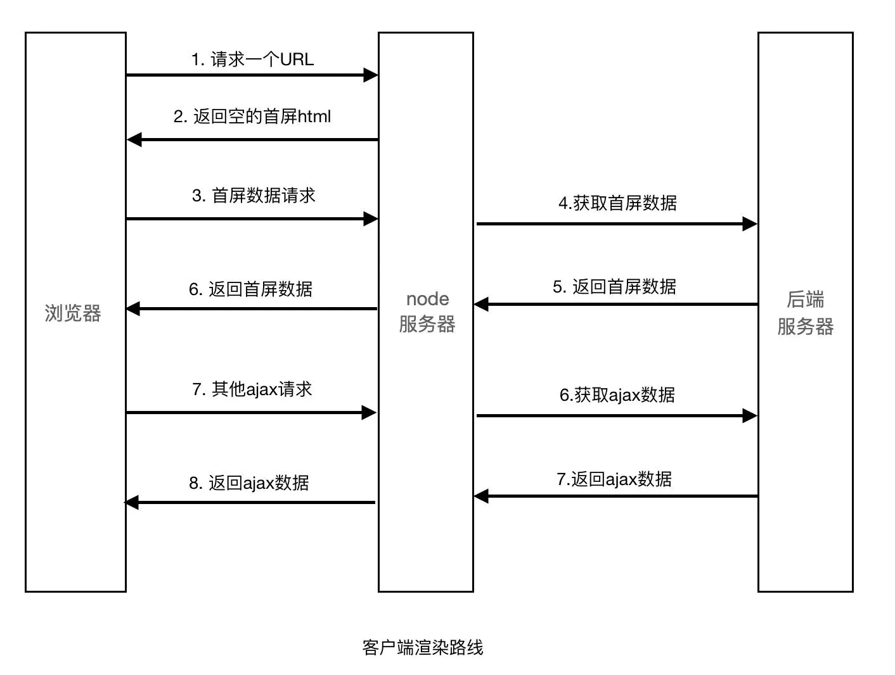
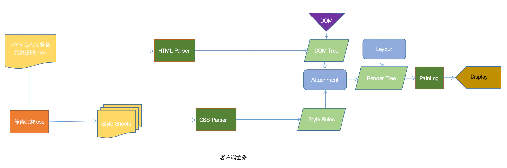
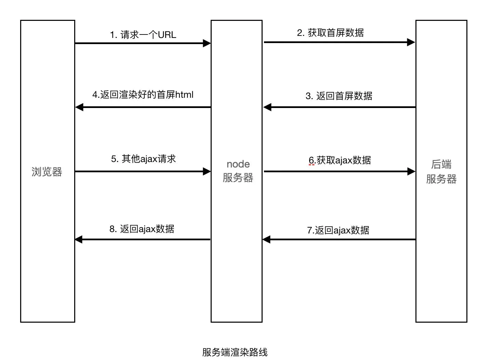
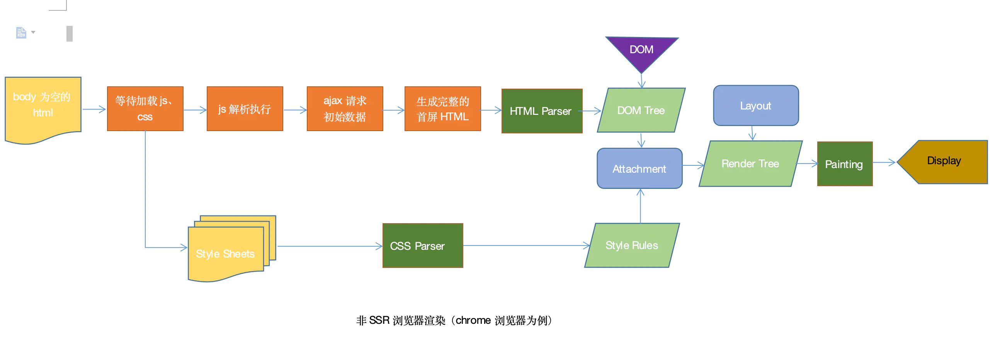
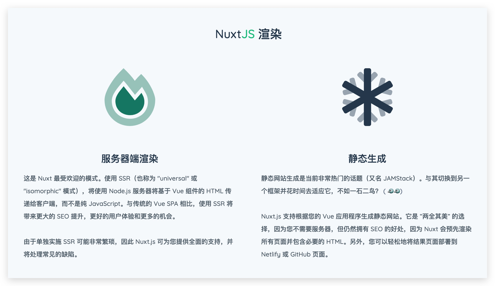
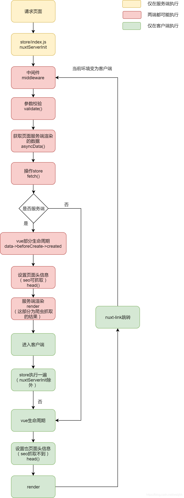
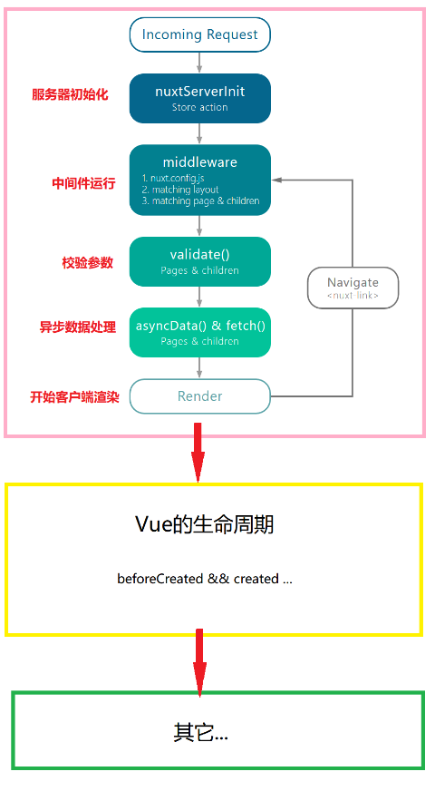
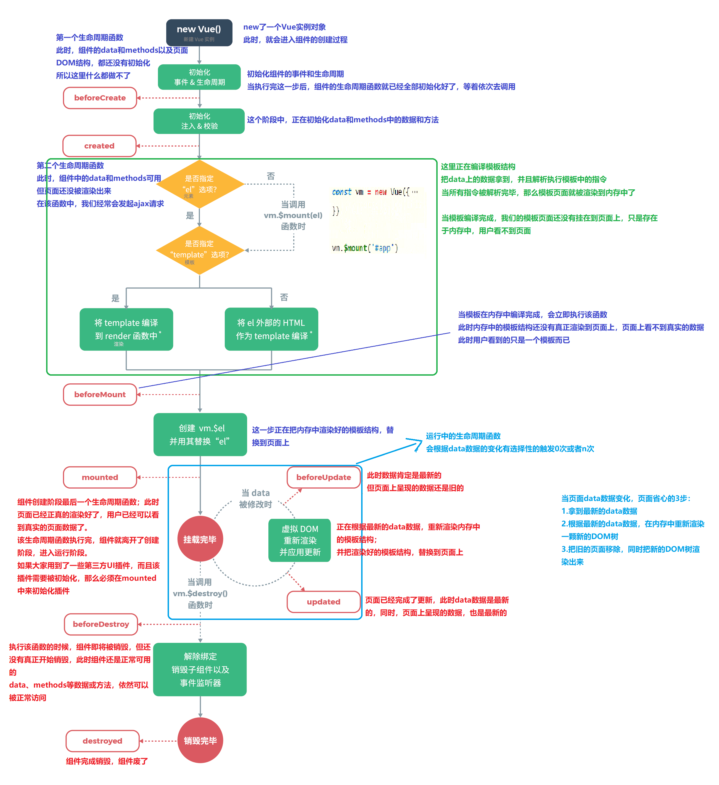

# Nuxt SSR 服务端渲染学习

为了提升spa的首屏性能和seo优化

## 一、服务端渲染 SSR 简介

### 1.1 什么是浏览器端渲染 CSR

 浏览器端渲染 CSR 是 Client Side Render 的简称，页面上的内容是我们加载的 js 文件渲染出来的，js 文件运行在浏览器上面，服务端只返回一个html模板。简单的理解就是，服务器端不负责解析页面的文档结构，服务器端把 js 、css、images 等静态资源一股脑给客户端，客户端通过 js 生产虚拟 DOM 结构树，再通过 axios 请求需要的数据渲染到页面中展示内容。

 咱们平常使用 vue 构建的 SPA 应用都是浏览器端渲染，Vue 应用原始的 HTML 页面 body 标签中只有一个 id 为 app 的节点， DOM 结构是通过 MVVM 模型中 VM 构建虚拟 DOM ，构建完成后再 mouted 到咱们的页面上。随后，根据业务需求发出 axios 请求，再根据 Diff 算法对新的数据，按需渲染更新页面。





### 1.2 什么是服务端渲染 SSR

 服务端渲染 SSR 是 Server Side Render 的简称，页面上的内容是通过服务端渲染生成的，浏览器直接显示服务端返回的html就可以了。简单的理解就是，将组件或页面通过服务器生成html字符串，再发送到浏览器客户端直接展示内容。

 咱们经常提到的前后端混合开发模型 MVC 模型，比如：PHP 的 ThinkPHP 框架、java 的 Spring MVC 框架，这些框架都会直接对应一个解析引擎（我们也经常称作为：模板引擎），比如：PHP Smarty、java JSP 。这些解析引擎的解决思路也很相似，都是在传统的网页 HTML（标准通用标记语言的子集）文件 ( .htm, .html ) 中插入PHP 或者 java 程序段，从而形成 View 视图文件，这些程序片段会被 服务端 解析后形成完整的 html 文件，再发布到客户端进行显示。

 PS：MVC 模式是开发者经典模式，其中 M 是指业务模型，V 是指用户界面，C 则是控制器，使用 MVC 的目的是将 M 和 V 的实现代码分离，从而使同一个程序可以使用不同的表现形式。其中，View 的定义比较清晰，就是用户界面，咱们前端工程师的工作核心也就是在此。





### 1.3 使用SSR的利弊

  PS：追根溯源，早期咱们 Web 开发程序员是没有前后端明确概念这么一说的，那个时候也是 jQuery 的时代，那是一个美丽的时代，在那个时代里我们直接畅快地操作 DOM，一直到2015年左右的时候咱们国内才有了前端开发的大爆发发展，2015年前，前端开发都是 SSR 的，服务端通过 assign、show 等方式将数据注入到模板中，再解析成目标 html 后进行发布。俗话说，天下大势，分久必合，合久必分啊，到了现在，SSR 的需求却又日趋明显了。毕竟，技术永远都是一个 “折中的解决方案”罢了，所以，点亮我们的技能点永远都是需要的，尤其是咱们很多同学希望进阶 “全栈开发工程师”，去掌握这些就更加需要了。

 ##### SSR的优势

 1. 更利于SEO。

 不同爬虫工作原理类似，只会爬取源码，不会执行网站的任何脚本（Google除外，据说Googlebot可以运行javaScript）。使用了Vue、React或者其它MVVM框架之后，页面大多数DOM元素都是在客户端根据 js 动态生成，可供爬虫抓取分析的内容大大减少(如图一)。另外，浏览器爬虫不会等待我们的数据完成之后再去抓取我们的页面数据。服务端渲染返回给客户端的是已经获取了异步数据并执行 JavaScript 脚本的最终HTML，网络爬虫就可以抓取到完整页面的信息。

 2. 更利于首屏渲染

 首屏的渲染是 node 发送过来的 html 字符串，并不依赖于 js 文件了，这就会使用户更快的看到页面的内容。尤其是针对大型单页应用，打包后文件体积比较大，普通客户端渲染加载所有所需文件时间较长，首页就会有一个很长的白屏等待时间。

 ##### SSR的局限

 1. 服务端压力较大

 本来是通过客户端完成渲染，现在统一到服务端 node 服务去做。尤其是高并发访问的情况，会大量占用服务端CPU 资源；

 2. 开发条件受限

 在服务端渲染中，只会执行到 componentDidMount 之前的生命周期钩子，因此项目引用的第三方的库也不可用其它生命周期钩子，这对引用库的选择产生了很大的限制；

 3. 学习成本相对较高

 除了对 pngack、Vue、React 这些客户端的逻辑要熟悉，还需要掌握 node、Koa2 等相关服务端技术，前后端的技术界限被模糊化，相对于客户端渲染，项目构建、部署过程更加复杂。


## 二、SSR 基础体验

### 2.1 构建基础的 SSR 渲染案例

 接下来我们使用node简单的写个服务端渲染的例子。首先创建一个项目文件夹：

 1. 初始化项目：yarn init -y 
 2. 下载对应的依赖包：yarn add -D koa koa-router koa-ejs
 3. 在项目文件夹中创建 app.js 和一个 template 文件夹

```js
// app.js
const Koa = require('koa');
const Router = require('koa-router');
const path = require('path');
const ejs = require('koa-ejs');

const app = new Koa()
const router = new Router()

ejs(app, {
    root: path.join(__dirname, 'template'),
    layout: false,
    viewExt: 'ejs',
    cache: false,
    debug: false
});

router.get('/', async ctx => {
    await ctx.render('index', {
        title: 'test',
        arr: [
            {name: '小红', age: 12},
            {name: '小明', age: 23}
        ]
    })
})

app.use(router.routes())
app.listen(3000)
```

 4. 然后在 template 中创建 index.ejs

```html
<!DOCTYPE html>
<html lang="en">
	<head>
		<meta charset="utf-8">
		<title><%= title %></title>
	</head>
	<body>
        <div>
            <%= title %>
        </div>
        <ul>
            <% arr.forEach(item = { %>
                <li>
                    <span<%= item.name %</span>
                    <span<%= item.age %</span>
                </li>
            <%}) %>
        </ul>
        
	</body>
</html>
```

 5. 最后我们使用 node app.js 运行项目，在本地浏览器访问：http://localhost:3000/，就会看到我们通过服务器渲染的页面


### 2.2 使用 nunjucks  构建 SSR  体验

 1. 引入 *nunjucks* 模板解析引擎

```js
// 构建 nunjucks 模板解析引擎
const nunjucks = require("nunjucks");
function createEnv(path, opts) {
  var autoescape = opts.autoescape === undefined ? true : opts.autoescape,
    noCache = opts.noCache || false,
    watch = opts.watch || false,
    throwOnUndefined = opts.throwOnUndefined || false,
    env = new nunjucks.Environment(
      new nunjucks.FileSystemLoader("views", {
        noCache: noCache,
        watch: watch,
      }),
      {
        autoescape: autoescape,
        throwOnUndefined: throwOnUndefined,
      }
    );
  if (opts.filters) {
    for (var f in opts.filters) {
      env.addFilter(f, opts.filters[f]);
    }
  }
  return env;
}
// 配置 nunjucks views 解析文件所在位置
var env = createEnv("views", {
  watch: true,
  filters: {
    hex: function (n) {
      return "0x" + n.toString(16);
    },
  },
});
```

 2. 在 views/index.html 页面中解析服务端渲染的数据内容

````html
<!DOCTYPE html>
<html lang="en">
<head
    <meta charset="UTF-8">
    <meta name="viewport" content="width=device-width, initial-scale=1.0">
    <title>SSR 学习体验</title>
</head>
<body>
    <h1这是一个 SSR 学习体验的 Demo</h1>
    <h2{{title}}</h2>
    
    <p名字：{{ name }}</p>
    
</body>
</html>
````

### 2.3 使用 nunjucks + vue 构建 SSR + CSR 体验

 使用 Vue + Axios 异步请求数据并渲染到页面中去

`````html
<div id="app">
        <h1>Vue使用，客户端渲染实现</h1>
        <h2>Vue渲染数据</h2>
        <!-- 要注意哦，这里使用 胡子语法 我们发现什么都渲染不出来，是什么原因 -->
        <p v-text="msg"</p>
        <p v-for="user in userList"
            名字：<span v-text="user.name"</span
        </p>
</div>

<script src="https://cdn.jsdelivr.net/npm/vue"</script>
<script src="https://cdn.bootcdn.net/ajax/libs/axios/0.21.0/axios.js"</script>
<script>
    const app = new Vue({
        el: "#app",
        data: {
            msg: "这是一个寂寞的天",
            userList:[]
        },
        created(){
            console.log('vue created ！')
            axios.get('/get').then( res => {
                console.log(res.data)
                this.userList = res.data
            })
        }
    })

</script>
`````


 课程分享：

 我们经常听人讲：程序员是一个吃青春饭的职业，最多干到35岁，如果30岁当不了管理就很难有前途！

 其实，我想告诉大家的是：程序员职业是一个新兴职业，随着时代的发展，国内程序员的土壤已经不再贫瘠，虽然在初期阶段我们大多数程序员确实拼的是「体力」。但是，真正决定程序员职业高度的，主要是以下 3 个方面：

 1. 计算机领域的学科素养
 2. 精益求精的专研精神
 3. 保持旺盛的精力和体力


## 三、Nuxt.js 简介与环境搭建

### 3.1 Nuxt 简介

 Nuxt.js 是一个基于 Vue.js 的通用应用框架，通过对客户端/服务端基础架构的抽象组织，Nuxt.js 主要关注的是应用的 UI渲染。

 Nuxt.js 简单的说就是 Vue.js 的通用框架，最常用的就是用来作 SSR（服务器端渲染）。再直白点说，就是 Vue.js 原来是开发 SPA（单页应用）的，但是随着技术的普及，很多人想用 Vue 开发多页应用，并在服务端完成渲染。这时候就出现了 Nuxt.js 这个框架，她简化了 SSR 的开发难度。还可以直接用命令把我们制作的 vue 项目生成为静态 html（我们也称这个技术解决方案为 SSG）。



 1. Nuxt.js 框架是如何运作的？

 Nuxt.js 集成了以下组件/框架，用于开发完整而强大的 Web 应用：

 - [Vue 2](https://github.com/vuejs/vue)
 - [Vue-Router](https://github.com/vuejs/vue-router)
 - [Vuex](https://github.com/vuejs/vuex) (当配置了 [Vuex 状态树配置项](https://www.nuxtjs.cn/guide/vuex-store) 时才会引入)
 - [Vue 服务器端渲染](https://ssr.vuejs.org/en/) (排除使用 [mode: 'spa'](https://www.nuxtjs.cn/api/configuration-mode))
 - [Vue-Meta](https://github.com/nuxt/vue-meta)

 压缩并 gzip 后，总代码大小为：57kb （如果使用了 Vuex 特性的话为 60kb）。另外，Nuxt.js 使用 [pngack](https://github.com/pngack/pngack) 和 [vue-loader](https://github.com/vuejs/vue-loader) 、 [babel-loader](https://github.com/babel/babel-loader) 来处理代码的自动化构建工作（如打包、代码分层、压缩等等）。

 2. Nuxt.js 框架都有哪些特性？

 - 基于 Vue.js
 - 自动代码分层
 - 服务端渲染
 - 强大的路由功能，支持异步数据
 - 静态文件服务
 - ES2015+ 语法支持
 - 打包和压缩 JS 和 CSS
 - HTML 头部标签管理
 - 本地开发支持热加载
 - 集成 ESLint
 - 支持各种样式预处理器： SASS、LESS、 Stylus 等等
 - 支持 HTTP/2 推送


### 3.2 Nuxt 环境搭建 HelloWord

 Nuxt.js 团队创建了脚手架工具 [create-nuxt-app](https://github.com/nuxt/create-nuxt-app)，确保安装了npx（npx在NPM版本5.2.0默认安装了）

 ```bash
    npx create-nuxt-app 项目名
 ```

 或者用yarn ，（推荐使用 yarn 作为脚手架安装工具）

 ```bash
  yarn create nuxt-app 项目名
 ```

 它会让你进行一些选择:

 1. 在集成的服务器端框架之间进行选择: None (Nuxt默认服器)

    [Express](https://github.com/expressjs/express)、[Koa](https://github.com/koajs/koa)、[Hapi](https://github.com/hapijs/hapi)、[Feathers](https://github.com/feathersjs/feathers)、[Micro](https://github.com/zeit/micro)、[Fastify](https://github.com/fastify/fastify)、[Adonis](https://github.com/adonisjs/adonis-framework)

 2. 选择您喜欢的UI框架:None (无)

    [Bootstrap](https://github.com/bootstrap-vue/bootstrap-vue)、[Vuetify](https://github.com/vuetifyjs/vuetify)、[Bulma](https://github.com/jgthms/bulma)[Tailwind](https://github.com/tailwindcss/tailwindcss)、[Element UI](https://github.com/ElemeFE/element)、[Ant Design Vue](https://github.com/vueComponent/ant-design-vue)、[Buefy](https://github.com/buefy/buefy)、[iView](https://github.com/iview/iview)[Tachyons](https://github.com/tachyons-css/tachyons)

 3. 选择您喜欢的测试框架:None (随意添加一个)[Jest](https://github.com/facebook/jest)、[AVA](https://github.com/avajs/ava)

 4. 选择你想要的Nuxt模式 (Universal or SPA)

 5. 添加 [axios module](https://github.com/nuxt-community/axios-module) 以轻松地将HTTP请求发送到您的应用程序中

 6. 添加 [EsLint](https://eslint.org/) 以在保存时代码规范和错误检查您的代码

 7. 添加 [Prettier](https://prettier.io/) 以在保存时格式化/美化您的代码

 当运行完时，它将安装所有依赖项，因此下一步是启动项目:

 `````bash
     cd project-name
     npm run dev
 `````

 应用现在运行在 http://localhost:3000 上运行，注意：Nuxt.js 会监听 pages 目录中的文件更改，因此在添加新页面时无需重新启动应用程序。


### 3.3 Nuxt 目录结构介绍

 ```
 |-- .nuxt                            // Nuxt自动生成，临时的用于编辑的文件，build
 |-- assets                           // 用于组织未编译的静态资源入LESS、SASS 或 JavaScript
 |-- components                       // 用于自己编写的Vue组件，比如滚动组件，日历组件，分页组件
 |-- layouts                          // 布局目录，用于组织应用的布局组件，不可更改。
 |-- middleware                       // 用于存放中间件
 |-- pages                            // 用于存放写的页面，我们主要的工作区域
 |-- plugins                          // 用于存放JavaScript插件的地方
 |-- static                           // 用于存放静态资源文件，比如图片
 |-- store                            // 用于组织应用的Vuex 状态管理。
 |-- .editorconfig                    // 开发工具格式配置
 |-- .eslintrc.js                     // ESLint的配置文件，用于检查代码格式
 |-- .gitignore                       // 配置git不上传的文件
 |-- nuxt.config.json                 // 用于组织Nuxt.js应用的个性化配置，已覆盖默认配置
 |-- package-lock.json                // npm自动生成，用于帮助package的统一性设置的，yarn也有相同的操作
 |-- package-lock.json                // npm自动生成，用于帮助package的统一性设置的，yarn也有相同的操作
 |-- package.json                     // npm包管理配置文件
 ```

| 别名         | 目录                                                       |
| ------------ | ---------------------------------------------------------- |
| `~` 或 `@`   | [srcDir](https://www.nuxtjs.cn/api/configuration-srcdir)   |
| `~~` 或 `@@` | [rootDir](https://www.nuxtjs.cn/api/configuration-rootdir) |


### 3.4 Nuxt 常用配置项

**1. 配置IP和端口：**

 开发中经常会遇到端口被占用或者指定 IP 的情况。我们需要在根目录下的 package.json 里对 config 项进行配置。比如现在我们想把 IP 配置成 127.0.0.1，端口设置 1818

 ```json
 "config":{
     "nuxt":{
       "host":"127.0.0.1",
       "port":"1818"
     }
   },
 ```

 配置好后，我们在终端中输入npm run dev，然后你会看到服务地址改为了127.0.0.1:1818.

**2. 配置全局CSS**

 在开发多页项目时，都会定义一个全局的 CSS 来初始化我们的页面渲染，比如把 padding 和 margin 设置成 0，网上也有非常出名的开源 css 文件 [normailze.css](https://necolas.github.io/normalize.css/8.0.1/normalize.css)，要定义这些配置，需要在nuxt.config.js里进行操作。

 比如现在我们要把页面字体设置为红色，就可以在 assets/css/normailze.css 文件，然后把字体设置为红色。

 PS：如果使用 scss 需要安装依赖 `npm install --save-dev node-sass sass-loader`

 ```css
 /* goImg/css/normailze.css */
 html{
     color:red;
 }
 ```

 ```js
 // nuxt.config.js
 css:['~goImg/css/normailze.css']
 ```

**3. 配置 pngack 的 loader **

 在 nuxt.config.js 里是可以对 pngack 的基本配置进行覆盖的，比如现在我们要配置一个 url-loader 来进行小图片的64位打包。就可以在 nuxt.config.js 的 build 选项里进行配置。

 ```js
 // 自定义 pngack 配置
 build: {
     transpile: [/^element-ui/],
     extend (config, { isDev, isClient }) {
       // 音频文件 file-loader 处理，使用 <audio :src="require('@/goImg/water.mp3')" controls</audio 快速调用
       config.module.rules.push({
         test: /\.(ogg|mp3|wav|mpe?g)$/i,
         loader: 'file-loader',
         options: {
           name: '[path][name].[ext]'
         }
       })
       // 配置 eslint 检查
       if (isDev && isClient) {
         config.module.rules.push({
           enforce: 'pre',
           test: /\.(js|vue)$/,
           loader: 'eslint-loader',
           exclude: /(node_modules)/
         })
       }
     }
 }
 ```


## 四、Nuxt 基础使用

### 4.1 Nuxt 路由配置和参数传递

 学习前端框架都要学习路由机制，因为路由可以体现我们的业务逻辑，把模块串联起来，让程序焕发光彩。那简单的说路由就是我们的跳转机制，也可以简单理解成链接跳转。Nuxt.js 的路由并不复杂，它给我们进行了封装，让我们节省了很多配置环节。

 **1. 简单路由Demo** 

 我们现在根目录的pages文件下新建两个文件夹，about 和 news，在 about 文件夹下新建 index.vue 文件

 ```vue
 <template>
   <div>
       <h2>About Index page</h2>
       <ul>
         <li><a href="/">Home</a></li>
       </ul>
   </div>
 </template>
 ```

 在 news 文件夹下新建 index.vue 文件

 ```vue
 <template>
   <div>
       <h2>News Index page</h2>
        <ul>
         <li><a href="/">Home</a></li>
       </ul>
   </div>
 </template>
 ```

 修改原来的 pages 文件夹下的 index.vue

 ```vue
 <template>
   <div>
     <ul>
       <li><a href="/">HOME</a></li>
       <li><a href="/about">ABOUT</a></li>
       <li><a href="/news">NEWS</a></li>
     </ul>
   </div>
 </template>
 ```

 **`<nuxt-link>`标签**

 虽然上面的例子跳转已经成功，但是 Nuxt.js 并不推荐这种`<a`标签的作法，它为我们准备了`<nuxt-link`标签（vue中叫组件），我们先把首页的`<a`标签替换成`<nuxt-link`。

 ```vue
 <template>
   <div>
     <ul>
       <li><nuxt-link :to="{name:'index'}">HOME</nuxt-link></li>
       <li><nuxt-link :to="{name:'about'}">ABOUT</nuxt-link></li>
       <li><nuxt-link :to="{name:'news'}">NEWS</nuxt-link></li>
     </ul>
   </div>
 </template>
 ```

 我们再次预览页面，也是可以进行正常跳转的，在实际开发中尽量使用标签的方法跳转路由。

 **2. params传递参数**

 路由经常需要传递参数，我们可以简单的使用 params 来进行传递参数，我们现在向新闻页面（news）传递个参数，然后在新闻页面进行简单的接收。

 我们先修改 pages下的 Index.vue文件，给新闻的跳转加上 params 参数，传递 3306 ID。注意：一般情况下我们不推荐这种传递参数方法，因为我们一刷新，参数立马就丢失了！

 ```vue
 <template>
   <div>
     <ul>
       <li><nuxt-link :to="{name:'index'}">HOME</nuxt-link></li>
       <li><nuxt-link :to="{name:'about'}">ABOUT</nuxt-link></li>
       <li><nuxt-link :to="{name:'news',params:{newsId:3306}}">NEWS</nuxt-link></li>
     </ul>
   </div>
 </template>
 ```

 在 news 文件夹下的 index.vue 里用 $route.params.newsId 进行接收

 ```vue
 <template>
   <div>
       <h2>News Index page</h2>
       <p>NewsID:{{$route.params.newsId}}</p>
        <ul>
         <li><a href="/"Home></a></li>
       </ul>
   </div>
 </template>
 ```


### 4.2 Nuxt 动态路由和参数校验

 简单的路由已经弄清楚了，这节看一下动态路由，其实动态路由就是带参数的路由。比如我们现在新闻模块下面有很多新闻详细页，这时候就需要动态路由的帮助了。

 **1. 新闻详细页面传递参数**

  在 news 文件夹下面新建了 _id.vue 的文件，以下画线为前缀的 Vue 文件就是动态路由，然后在文件里边有 $route.params.id 来接收参数。

 ```vue
 <template>
   <div>
       <h2>News-Content [{{$route.params.id}}]</h2>
       <ul>
         <li><a href="/"Home></a></li>
       </ul>
   </div>
 </template>
 ```

 修改新闻首页路由，我们在 `/pages/news/index.vue` 进行修改，增加两个详细页的路由

 ```vue
 <template>
   <div>
       <h2>News Index page</h2>
       <p>NewsID:{{$route.params.newsId}}</p>
        <ul>
         <li><a href="/">Home</a></li>
         <li><a href="/news/123">News-1</a></li>
         <li><a href="/news/456">News-2</a></li>
       </ul>
   </div>
 </template>
 ```

 **2. 路由动态参数校验**

 进入一个页面，对参数传递的正确性校验是必须的，Nuxt.js 也贴心的为我们准备了校验方法 validate( )

 ```js
 export default {
   validate ({ params }) {
     // Must be a number
     return /^\d+$/.test(params.id)
   }
 }
 ```

 我们使用了validate方法，并把params传递进去，然后用正则进行了校验，如果正则返回了true正常进入页面，如果返回false进入404页面。


### 4.3 Nuxt 路由动画效果

 路由的动画效果，也叫作页面的更换效果。Nuxt.js提供两种方法为路由提供动画效果，一种是全局的，一种是针对单独页面制作。

 **1. 全局路由动画设置**

 全局动画默认使用 page 来进行设置，例如现在我们为每个页面都设置一个进入和退出时的渐隐渐现的效果。我们可以先在根目录的 assets/css 下建立一个 main.css 文件

 ```css
 .page-enter-active, .page-leave-active {
     transition: opacity 1s;
 }
 .page-enter, .page-leave-active {
     opacity: 0;
 }
 ```

 然后在 nuxt.config.js 里加入一个全局的 css 文件就可以了

 ```js
 css:['goImg/css/main.css']
 ```

 这时候在页面切换的时候就会有2秒钟的动画切换效果了，但是你会发现一些页面是没有效果的，这是因为你没有是`<nuxt-link`组件来制作跳转链接，注意使用 a 标签跳转是没有动画的，这个是为什么呢？

 比如我们上节课作的动态路由新闻页，你就需要改成下面的链接，改过之后你就会看到动画效果了

 ```vue
 <li><nuxt-link :to="{name:'news-id',params:{id:123}}">News-1</nuxt-link></li>
 ```

 **2. 单独设置页面动效**

 想给一个页面单独设置特殊的效果时，我们只要在 css 里改变默认的 page，然后在页面组件的配置中加入transition 字段即可。例如，我们想给about页面加入一个字体放大然后缩小的效果，其他页面没有这个效果。

 在全局样式 assets/main.css 中添加以下内容。

 ```css
 .test-enter-active, .test-leave-active {
     transition: all 2s;
     font-size:12px;
 
 }
 .test-enter, .test-leave-active {
     opacity: 0;
     font-size:40px;
 }
 ```

 然后在 about/index.vue 组件中设置，这时候就有了页面的切换独特动效了。

 ```js
 export default {
   transition:'test'
 }
 ```


### 4.4 Nuxt 默认模板和布局

 在开发应用时，经常会用到一些公用的元素，比如网页的标题是一样的，每个页面都是一模一样的标题。这时候我们有两种方法，第一种方法是作一个公用的组件出来，第二种方法是修改默认模版。这两种方法各有利弊，比如公用组件更加灵活，但是每次都需要自己手动引入；模版比较方便，但是只能每个页面都引入。这节课我们就学习一下如何使用 Nuxt 的默认模版和默认布局功能。

 **1. 默认模板**

 Nuxt 为我们提供了超简单的默认模版订制方法，只要在根目录下创建一个 app.html 就可以实现了。现在我们希望每个页面的最上边都加入 「学而时习之，不亦说乎」这几个字，我们就可以使用默认模版来完成。

 ```html
 <!DOCTYPE html>
 <html lang="en">
 <head>
    {{ HEAD }}
 </head>
 <body>
     <p学而时习之，不亦说乎</p>
     {{ APP }}
 </body>
 </html>
 ```

 这里的 {{ HEAD }} 读取的是 nuxt.config.js 里的信息，{{ APP }} 就是我们写的 pages文件夹下的主体页面了。需要注意的是 HEAD 和 APP 都需要大写，如果小写会报错的。这里还有一个小坑需要大家注意，就是如果你建立了默认模板后，记得要重启服务器，否则你的显示不会成功；但是默认布局是不用重启服务器的。

 **2. 默认布局**

 和默认模板类似的功能还有默认布局，但是从名字上你就可以看出来，默认布局主要针对于页面的统一布局使用。它在位置根目录下的 layouts/default.vue。需要注意的是在默认布局里不要加入头部信息，只是关于`<template`标签下的内容统一订制。

 还是上边的需求，我们在每个页面的最顶部放入「有朋自远方来，不亦说乎」这几个字，看一下在默认布局里的实现。

 ```vue
 <template>
   <div>
     <p>有朋自远方来，不亦说乎</p>
     <nuxt/>
   </div>
 </template>
 ```

 这里的`<nuxt/`就相当于我们每个页面的内容，你也可以把一些通用样式放入这个默认布局里，但是个人不建议这样写，会增加页面的复杂程度。


### 4.5 Nuxt 错误页面及个性 meta 设置

 当用户输入路由错误的时候，我们需要给他一个明确的指引，所以说在应用程序开发中 404 页面是必不可少的。Nuxt.js 支持直接在默认布局文件夹里建立错误页面。

 **1. 建立错误页面**

 在根目录下的 layouts 文件夹下建立一个 error.vue 文件，它相当于一个显示应用错误的组件。

 ```vue
 <template>
   <div>
       <h2 v-if="error.statusCode==404">404页面不存在</h2>
       <h2 v-else>500服务器错误</h2>
       <ul>
           <li><nuxt-link to="/">HOME</nuxt-link></li>
       </ul>
   </div>
 </template>
 
 <script>
 export default {
   props:['error'],
 }
 </script>
 ```

 代码用 v-if 进行判断错误类型，需要注意的是这个错误是你需要在`<script`里 props 进行声明的，如果不声明程序是找不到 error.statusCode 的。

 **2. 个性 meta 设置**

 页面的 Meta 对于 SEO 的设置非常重要，比如你现在要作个新闻页面，那为了搜索引擎对新闻的收录，需要每个页面对新闻都有不同的 title 和 meta 设置。直接使用 head 方法来设置当前页面的头部信息就可以了。我们现在要把 New-1 这个页面设置成个性的 meta 和 title 。

 1. 我们先把`pages/news/index.vue`页面的链接进行修改一下，传入一个 title，目的是为了在新闻具体页面进行接收 title，形成文章的标题。

 ```vue
 <li><nuxt-link :to=" {name:'news-id',params:{id:123,title:'坚持学习'}} ">News-1</nuxt-link></li>
 ```

 2. 第一步完成后，我们修改 /pages/news/_id.vue，让它根据传递值变成独特的 meta 和 title 标签。

 ```vue
 <template>
   <div>
       <h2>News-Content [{{$route.params.id}}]</h2>
       <ul>
         <li><a href="/">Home</a></li>
       </ul>
   </div>
 </template>
 <script>
 export default {
   validate ({ params }) {
     return /^\d+$/.test(params.id)
   },
   data(){
     return{
       title: this.$route.params.title,
     }
   },
 	//独立设置head信息
   head(){
       return{
         title:this.title,
         meta:[
           {hid:'description',name:'news',content:'This is news page'}
         ]
       }
     }
 }
 </script>
 ```

 注意：为了避免子组件中的 meta 标签不能正确覆盖父组件中相同的标签而产生重复的现象，建议利用 hid 键为meta标签配一个唯一的标识编号。


### 4.6 Nuxt asyncData 方法获取数据

 在项目中需要在初始化页面前先得到数据，也就是我们常说的异步请求数据。Nuxt.js 贴心的为我们扩展了 Vue.js 的方法，增加了 anyncData，从名字上就很好理解，这是一个异步方法。

 **1. 创建远程数据**

 使用 MockJS + express 构建一个简单的数据模拟请求服务输出对应的数据结构

 ```js
 // 使用 Mock 构建本地服务器输出数据结果
 const Mock = require("mockjs");
 const express = require("express");
 const app = express();
 
 //允许跨域请求返回数据
 app.all("*", function(req, res, next) {
   res.header("Access-Control-Allow-Origin", "*");
   res.header("Access-Control-Allow-Methods", "PUT, GET, POST, DELETE, OPTIONS");
   res.header("Access-Control-Allow-Headers", "X-Requested-With");
   res.header("Access-Control-Allow-Headers", "Content-Type");
   next();
 });
 
 //根据传入的参数 num，生成 num 条模拟的数据列表
 function generatorList(num, lang) {
   if (lang === "cn") {
     return Mock.mock({
       [`list|${num}`]: [
         {
           // 文章 ID
           "id|+1": 1,
           // 作者
           author: "@cname",
           // 模拟标题，中文字符串长度为 20 位到 30 位
           title: "@ctitle(10,20)",
           // 发布时间
           date: "@date('yyyy-MM-dd')"
         }
       ]
     });
   } else {
     return Mock.mock({
       [`list|${num}`]: [
         {
           // 文章 ID
           "id|+1": 1,
           // 作者
           author: "@name",
           // 模拟标题，中文字符串长度为 20 位到 30 位
           title: "@title(10,20)",
           // 发布时间
           date: "@date('yyyy-MM-dd')"
         }
       ]
     });
   }
 }
 //截取路由并反馈数据
 app.get("/news-list", function(req, res) {
   // 获取 get 请求数据条数参数 num
   const { num, lang } = req.query;
   return res.send(generatorList(num, lang));
 });
 app.get("/new-info", function(req, res) {
   // 获取 get 请求数据条数参数 num
   const { id, lang } = req.query;
   let mock = Mock.mock({
     // 文章 ID
     id,
     // 作者
     author: "@cname",
     // 模拟标题，中文字符串长度为 20 位到 30 位
     title: "@ctitle(10,20)",
     // 内容段落
     content: "@cparagraph(5, 20)",
     // 发布时间
     date: "@date('yyyy-MM-dd')"
   });
   if (lang === "en") {
     mock = Mock.mock({
       // 文章 ID
       id,
       // 作者
       author: "@name",
       // 模拟标题，中文字符串长度为 20 位到 30 位
       title: "@title(10,20)",
       // 内容段落
       content: "@paragraph(5, 20)",
       // 发布时间
       date: "@date('yyyy-MM-dd')"
     });
   }
   return res.send(mock)
 });
 
 //设置端口并打印对应调用结果
 app.listen(4000, function() {
   console.log(
     "本地mock服务启动，接口地址为：http://localhost:4000/data?num=请求列表数量"
   );
 });
 ```

 **2. 安装 Axios**

 Vue.js官方推荐使用的远程数据获取方式就Axios，所以我们安装官方推荐，来使用Axios。这里我们使用npm 来安装 axios。 直接在终端中输入下面的命令：

 ```bash
 npm install axios --save
 ```

 **ansycData的promise方法**

 我们在pages下面新建一个文件，叫做 ansyData.vue。注意：我们需要在 asyncData 中引入 context 上下文参数代替 this，因为 asyncData 方法是在组件初始化时调用，所以没法通过 this 来引用组件实例对象

 ```vue
 <template>
   <div class="news">
     <h2>新闻列表页面</h2>
     <nuxt-link v-for="(item, index) in newsList" :key="index" :to=" '/news/' + item.id ">{{item.title}}</nuxt-link>
   </div>
 </template>
 
 <script>
 import axios from 'axios'
 export default {
   name:'news',
   // 请求数据，该方法会运行在服务器端
   async asyncData(){
     let res = await axios.get("http://localhost:4000/news-list?num=10&lang=cn")
     console.log(res.data.list)
     return {
       newsList: res.data.list
     }
   },
   // 使用 context 获取上下文信息
   async asyncData(context){
     console.log(context.route.params.id)
     let res = await axios.get("http://localhost:4000/new-info?id="+ context.route.params.id +"&lang=cn")
     console.log(res.data)
     return {
       newInfo: res.data
     }
   }
 }
 </script>
 
 <style lang="scss" scoped>
 .news{
   h2{
     margin: 20px 0;
   }
   a{
     padding: 10px 0;
     text-decoration: none;
     display: block;
   }
 }
 </style>
 
 ```


### 4.7 Nuxt 静态资源和打包

 **1. 直接引入图片**

 我们在网上任意下载一个图片，放到项目中的 static 文件夹下面，然后可以使用下面的引入方法进行引用。

 ```vue
 <div></div>
 ```

 这种引用方法是不用估计相对路径的，“~” 就相当于定位到了项目跟目录，这时候你的图片路径就不会出现错误，就算打包也是正常的。

 **2. CSS引入图片**

 如果在CSS中引入图片，方法和 html 中直接引入是一样的，也是用“~”符号引入。

 ```css
    .diss {
         width: 300px;
         height: 100px;
         background-image: url('~static/logo.png')
    }
 ```

 **3. 打包静态HTML并运行**

 用Nuxt.js制作完成后，你可以打包成静态文件并放在服务器上，进行运行。

 ```bash
 npm run generate
 ```

 然后在 dist 文件夹下输入 live-server 就可以了


## 五、Nuxt 进阶使用

### 5.1 Nuxt 生命周期

 1. Nuxt 业务响应执行生命周期逻辑



 2. Nuxt 生命周期钩子函数



 3. Nuxt 客户端生命周期钩子函数（即 Vue 生命周期钩子函数）




### 5.2 Nuxt Vuex 状态树

 对于每个大项目来说，使用状态树 (store) 管理状态 (state) 十分有必要，所以  Nuxt.js 内核实现了 Vuex。

 Nuxt.js 会尝试找到应用根目录下的 store 目录，如果该目录存在，它将做以下的事情：

 1. 引用 vuex 模块
 2. 将 vuex 模块 加到 vendors 构建配置中去
 3. 设置 Vue 根实例的 store 配置项

 **一、创建 Vuex 状态树**

 1. 首先，创建 Vuex  store  index.js + user.js  文件：

 ```js
 import Vue from 'vue';
 import Vuex from 'vuex';
 import user from './user';
 Vue.use(Vuex);
 const store = () => new Vuex.Store({
   state: {
   },
   mutations: {
   },
   modules: {
     user
   }
 });
 export default store
 ```

 ```js
 const state = () => ({
   username: "未登录用户",
   girls: ["小红", "小花"]
 })
 const getters = {
   gilsNum: state => {
     return state.girls.length;
   },
 }
 const mutations = {
   M_LOGIN(state, username) {
     state.username = username;
   },
   M_LOGOUT(state) {
     state.username = "未登录用户";
   },
   M_ADDGIRL(state, girl) {
     state.girls.push(girl);
   }
 };
 const actions = {
   login({ state, commit }, name) {
     commit("M_LOGIN", name);
   },
   logout({ state, commit }) {
     commit("M_LOGOUT");
   },
   addGirl({ state, commit }, girl) {
     commit("M_ADDGIRL", girl);
   }
 };
 export default {
   namespaced: true,
   state,
   getters,
   mutations,
   actions
 };
 ```

 2. 接着，在 pages/about.vue 中使用 user 模块

 ```vue
 <template>
   <div class="about">
     <p>用户名是：{{username}} {{gilsNum}}</p>
   </div>
 </template>
 
 <script>
 import { mapState, mapMutations, mapActions, mapGetters } from 'vuex'
 export default {
   name:'about',
   computed: {
     ...mapState('user',[
       'username', 'girls'
     ]),
     ...mapGetters('user', [
       'gilsNum'
     ]),
   },
   methods: {
     ...mapActions('user', [                                             
       "login", "logout", "addGirl"
     ])
   }
 }
 </script>
 
 ```

 3. 我们也可以将模块文件分解为单独的文件：state.js、actions.js、mutations.js 、 getters.js

 **二、使用 nuxtServerInit 方法调用 Vuex**

 如果在状态树中指定了 nuxtServerInit 方法，Nuxt.js 调用它的时候会将页面的上下文对象作为参数传给它，当我们想将服务端的一些数据传到客户端时，这个方法是非常好用的。

 举个例子，假设我们服务端的会话状态树里可以通过 req.session.user 来访问当前登录的用户。将该登录用户信息传给客户端的状态树，我们只需更新 store/index.js 如下：

 PS：关于 context 上下文对象，[官方文档](https://www.nuxtjs.cn/api/context)，非常重要要仔细理解和学习，这玩意是连接服务端和客户端的关键桥梁

 ```js
 const store = () => new Vuex.Store({
   state: {
   },
   mutations: {
   },
   modules: {
     user
   },
   actions:{
     nuxtServerInit ({ commit }) {
       console.log("nuxtServerInit is runing 哈哈哈哈")
       // 服务端这里首次被调用
       commit('user/M_LOGIN', '01-犬夜叉')
     }
   }
 })
 ```

 **三、使用 middleware 构建中间件服务**

 ````js
 // 在 middleware 文件夹中创建一个 auth.js 文件
 export default function ({ store, route }){
   console.log("中间件被执行了")
   console.log(route)
   store.commit("user/M_LOGIN", '02-黑猫警长')
 }
 // 在 nuxt.config.js 文件中路由拦截全局使用
 router: {
    middleware: 'auth'
 }
 ````

 ````vue
 // 在 page 页面中设置使用
 <template>
   <h1>Secret page</h1>
 </template>
 
 <script>
 export default {
   middleware: 'auth'
 }
 </script>
 ````

 **四、在 asyncData 中调用 vuex **

 asyncData 方法一般用来进行服务端数据初始化操作，同时也可以根据上下文去设置 store 信息

 ```js
 export default {   
   asyncData({ store }){
     console.log("asyncData is runing")
     // store.commit("user/M_LOGIN", '蜡笔小新')
     store.dispatch("user/login", '03-樱桃小丸子')
   },
 }
 ```

 **五、使用 fetch 方法调用 Vuex**

 fetch 方法会在渲染页面前被调用，作用是填充状态树 store 数据，与 asyncData 方法类似，不同的是它不会设置组件的数据，也就是说单纯的在服务端进行数据初始化操作。

 如果页面组件设置了fetch方法，它会在组件每次加载前被调用（在服务端或切换至目标路由之前），此方法需要跟服务端的人员配合

 ```js
 export default {   
   fetch({ store }){
     console.log("fetch is runing")
     // store.commit("user/M_LOGIN", '蜡笔小新')
     store.dispatch("user/login", '04-樱桃小丸子')
   },
 }
 ```


### 5.3 Nuxt axios 跨域与拓展配置

 [Nuxt](https://www.nuxtjs.cn/) 是 Vue 项目服务器端渲染（SSR)解决方案。而在使用时，就会遇到前后端分离情况下的域名或端口不一致导致的跨域问题。本文将介绍如何通过设置代理解决 Nuxt 与 [axios](https://github.com/axios/axios) 集成的跨域问题。

 1. **解决跨域**

 Nuxt 使用 axios 为避免出现前端页面跨域问题，需要安装 @nuxtjs/axios 和 @nuxtjs/proxy 两个模块。**注意：**不需要手动注册 @nuxtjs/proxy 模块，但是必须要确保它在依赖项中

 用 yarn 安装：

 ```bash
 yarn add axios @nuxtjs/axios @nuxtjs/proxy
 ```

 使用 npm 安装：

 ```bash
 npm install axios @nuxtjs/axios @nuxtjs/proxy
 ```

 安装完成后在 nuxt.config.js 文件里面添加以下配置：

 ```js
 module.exports = {
   // 配置相关依赖模块
   modules: [
     '@nuxtjs/axios',
     '@nuxtjs/proxy'
   ],
   axios: {
     // 是否开启代理
     proxy: true,
     // 尝试请求次数
     retry: { retries: 3 },
     //开发模式下开启debug
     debug: process.env._ENV == "production" ? false : true,
     // headers 设置
     headers: { 'Content-Type': 'application/json', 'crossDomain': true },
     timeout: 5000,
     // 设置一个请求 baseUrl 这个要与 proxy 中保持一致
     prefix: "/api"
   },
   proxy: {
     '/api': {
       target: 'http://ts.lagou.uieee.com/api/v2', // 目标接口域名
       changeOrigin: true, // 表示是否跨域
       pathRewrite: {
         '^/api': '/', // 把 /api 替换成 /
       }
     }
   },
   build: {
     // 防止多次打包
     vendor: ["axios"]
   }
 }
 ```

 2. **扩展 axios**

 创建 nuxt 插件，更改全局配置全局配置自定义 axios，在 plugins/ 目录下新建 axios.js 文件：

 ```js
 // plugins/axios.js
 export default function({ $axios, redirect }) {
   console.log('axios 请求插件被调用了！')
   $axios.onResponse(res => {
     return res.data
   })
   $axios.onError(error => {
     const code = parseInt(error.response && error.response.status)
     if (code === 404) {
       redirect("/")
     }
   });
 }
 
 ```

 在 nuxt.config.js 中配置 axios.js 插件：

 ```js
 module.exports = {
   plugins: ["@/plugins/axios"],
 }
 ```

 3. **使用 axios 插件**

 通过上面的设置后，使用 axios 插件需要注意的是在 asyncData 内和在 asyncData 外的使用是所不同的。

 在 asyncData 里使用，服务端请求数据

 ```js
 // 请求数据，该方法会运行在服务器端
 async asyncData( context ){
     let res = await context.$axios.get("/feeds")
     return {
       newsList: res.feeds
     }
 }
 ```

 在 asyncData 外使用，客户端请求数据

 ```js
 async mounted(){
     let res = await this.$axios.get("/feeds")
     console.log(res.feeds )
 }
 ```

### 5.4 Nuxt ElementUI 按需引用配置

 Nuxt 使用 create-nuxt-app 创建项目时，选择使用 Element-UI 为默认组件库，发现 Nuxt 没有开启 Element-UI 的按需引入配置，需要自行配置。

 1. **安装依赖**

 在 create-nuxt-app 中没有选择 Element-UI 的先安装。

 ```bash
 npm install element-ui --save
 ```

 或者

 ```bash
 yarn add element-ui
 ```

 Element-UI 开启按需引入，必须安装 babel-plugin-component 插件。

 ```bash
 npm install babel-plugin-component --save-dev
 ```

 或者

 ```bash
 yarn add babel-plugin-component
 ```

 2. 安装完成依赖后，在 plugins 目录下创建相应的插件文件 element-ui.js

 ```js
 // element-ui.js
 import Vue from 'vue'
 import {
   Container,
   Header,
   Aside,
   Main,
   Menu,
   MenuItem,
   Button,
   Form,
   FormItem,
   Input
 } from 'element-ui'
 const components = [
   Container,
   Header,
   Aside,
   Main,
   Menu,
   MenuItem,
   Button,
   Form,
   FormItem,
   Input
 ];
 const Element = {
   install (Vue) {
     components.forEach(component = {
       Vue.component(component.name, component)
     })
   }
 }
 // 全局引入
 // import Element from 'element-ui'
 
 import locale from 'element-ui/lib/locale/lang/en'
 Vue.use(Element, { locale })
 ```

 3. 在 nuxt.config.js 中配置 plugins 选项，通过配置导入插件

 ```js
 module.exports = {
   plugins: ["@/plugins/element-ui"],
 }
 ```

 ​	PS：Nuxt 默认为开启 SSR，采用服务端渲染，也可以手动配置关闭 SSR，配置为：	

 ```js
 module.exports = {
   plugins: [
     {
       src: "@/plugins/element-ui",
       ssr: false  // 关闭ssr
     }
   ],
 }
 ```

 4. 如果在 create-nuxt-app 中默认选了 Element-UI 的，还需要在 nuxt.config.js 中，将 Element-UI 的全局样式去掉，即：

 ```js
 module.exports = {
   css: ['element-ui/lib/theme-chalk/index.css'],
 }
 ```

 5. 在 nuxt.config.js 文件中 build 选项中配置 babel 选项

 ```js
 module.exports = {
   build: {
     // 按需引入 element 的样式 pngack 配置
     babel: {
       "plugins": [
         [
           "component",
           {
             "libraryName": "element-ui",
             "styleLibraryName": "theme-chalk"
           }
         ]
       ]
     }
   }
 }
 ```

 到此，Element-UI 按需引入配置完成。


### 5.5 Nuxt 多语言 i18n 站点配置

 在 Nuxt 中配置多语言站点逻辑相当复杂，要非常清晰理解到「服务端/客户端」之间的每个关键环节，还要理解多语言模式下的 ElementUI 插件的同步关系等。

 1. 安装nuxt-i18n

 ```css
 npm install nuxt-i18n -S
 yarn add nuxt-i18n
 ```

 2. 新建 lang 文件夹，放置语言包，输出语言包配置信息

 lang/zh.js  配置中文站点下的语言包信息

 ```js
 const zh = {
   home:'首页',
   news:'新闻中心',
   aboutus: '关于我们',
   musicPlayer:'音乐播放器'
 }
 export default zh
 ```

 lang/en.js 配置英文站点下的语言包信息

 ```js
 const en = {
   home:'Home',
   news:'NewsList',
   aboutus: 'AboutUs',
   musicPlayer:'MusicPlayer'
 }
 export default en
 ```

 lang/Index.js 组合 element-ui 语言包信息及默认语言包配置信息

 ```js
 import zh from "./zh.js";
 import en from "./en.js";
 // 加载element-ui语言包
 import enLocale from "element-ui/lib/locale/lang/en";
 import zhLocale from "element-ui/lib/locale/lang/zh-CN";
 // const mergeZH = Object.assign(zhLocale, zh);
 // const mergeEN = Object.assign(enLocale, en);
 const mergeZH = { ...zhLocale, ...zh };
 const mergeEN = { ...enLocale, ...en };
 const langSet = {
   fallbackLocale: "zh",
   messages: {
     en: mergeEN,
     zh: mergeZH
   }
 };
 export default langSet;
 ```

 3. 在 Plugins  中新建 i18n.js 插件

 ```js
 import Vue from 'vue'
 import VueI18n from 'vue-i18n'
 // 引入语言包配置的相关信息
 import langSet from '../lang/index'
 // 引入 element 配置的语言包信息
 import elementLocale from 'element-ui/lib/locale'
 
 Vue.use(VueI18n)
 
 export default ({ app, store }) = {
   app.i18n = new VueI18n({
     // 要在 store 中配置相应的语言状态，这个状态会在中间件 middleware 中调用（实现客户端、服务端信息共用）
     locale: store.state.user.lang,
     ...langSet
   })
   // 按需加载配置element
   elementLocale.i18n((key, value) = app.i18n.t(key, value))
 }
 ```

 4. 在 nuxt.config.js 中引入配置好的插件文件，这个时候代表 i18n 作为插件引入到咱们系统中

 ```js
 plugins: [
   "@/plugins/axios.js",
   "@/plugins/element-ui.js",
   "@/plugins/i18n.js"
 ]
 ```

 5. 在 store user model 中配置相应的语言状态信息

 ```js
 const state = () =bash ({
   lang: 'zh',
   langs: ['zh', 'en'],
 })
 const mutations = {
   M_SET_LANG(state, lang){
     state.lang = lang
   }
 }
 const actions = {
   setLang({ commit }, lang) {
     commit("M_SET_LANG", lang);
   },
 }
 export default {
   namespaced: true,
   state,
   getters,
   mutations,
   actions
 }
 ```

 6. 设置路由中间件：i18n.js，切换语言时，更改路由，同时更新 store 中语言类型

 ```js
 export default function ({ isHMR, app, store, route, params, redirect }) {
   // 如果从热模块替换调用中间件，则忽略它
   if (isHMR) {
     return
   }
   // 获取语言包中设置的默认语言
   const defaultLang = app.i18n.fallbackLocale
   // 获取 state 中保存当前语言状态
   const lang = store.state.user.lang || defaultLang
   // 获取 state 中保存的允许语言种类数组
   const langs = store.state.user.langs
   // 获取 url 路径中配置的语言状态 
   const urlLang = params.lang
 
   // 如果路由没有传递 lang 参数，或者传递的参数不在 langs 数组中
   if (!urlLang || !langs.includes(urlLang)) {
     // 如果语言状态设置异常，则追加语言路由地址
     return redirect('/' + lang + route.fullPath)
   } else if(urlLang !== lang){
     // 在 store 中设置新的语言
     store.commit('user/M_SET_LANG', urlLang)
     // 设置语言为新的语言体系
     app.i18n.locale = urlLang
   }
 }
 ```

 7. 在 nuxt.config.js 配置路由中间件，同步设置 build 防止多次打包；到此为止，i18n 多语言配置完成，但是调用还有对应的逻辑需要判断

 ```js
 router: {
     middleware: ["auth", "i18n"]
 },
 // 自定义 pngack 配置
 build: {
     // 防止多次打包
     vendor: ["axios", "vue-i18n"],
     transpile: [/^element-ui/]
 }
 ```

 8. 在 pages 文件下将凡是需要多语言配置的页面都移动进 _lang 文件夹内， 也就是说我们以 语言 作为动态路由

 ```
 页组件
 |-- layouts                          // 布局目录，用于组织应用的布局组件，不可更改。
 |-- middleware                       // 用于存放中间件
 |-- pages                            // 用于存放写的页面，我们主要的工作区域
 |-- |-- _lang
 |-- |-- |-- index.vue
 |-- |-- |-- about
 |-- |-- |-- |-- index.vue
 ```

 9. 在 layouts / default.vue 默认布局文件或者 pages 页面中使用配置的语言

 ```vue
 <template>
   <div>
     <header>
       <nuxt-link> to="/"{{ $t("home") }}</nuxt-link>
       <nuxt-link> to="/news"{{ $t("news") }}</nuxt-link>
       <nuxt-link> to="/about"{{ $t("aboutus") }}</nuxt-link>
     </header>
     <Nuxt />
   </div>
 </template>
 ```

 10. 对需要根据语言异步 axios 请求数据的地方，我们根据上下文中 vuex state 中的语言状态来获取

 ```vue
 <template>
   <div class="news">
     <nuxt-link v-for="(item, index) in newsList" :key="index" :to=" '/news/' + item.id ">
       <el-button type="success">{{item.title}}</el-button>
     </nuxt-link>
   </div>
 </template>
 
 <script>
 export default {
   // 请求数据，该方法会运行在服务器端
   async asyncData( context ){
     let res = await context.$axios.get("http://localhost:4000/news-list?num=10&lang="+context.store.state.user.lang)
     return {
       newsList: res.list
     }
   }
 }
 </script>
 ```

 

 11. 如何在语言包中没有设置语言状态，前端（客户端）可以根据 vuex state 语言逻辑切换显示内容

 ```vue
 <template>
   <div class="about">
     <h2> {{title}} </h2>
   </div>
 </template>
 
 <script>
 import {
     mapState
 } from 'vuex'
 export default {
   computed: {
     ...mapState('user',[
       'lang'
     ]),
     title(){
       if(this.lang === 'zh'){
         return '关于我们'
       }else{
         return 'About us'
       }
 
     }
   }
 }
 </script>
 ```

 12. 设置i18n locale ，同时结合 vuex state 来实现语言状态设置和切换

 ```vue
 <template>
   <div>
     <header>
       <nuxt-link to="/">{{ $t("home") }}</nuxt-link>
       <nuxt-link to="/news">{{ $t("news") }}</nuxt-link>
       <nuxt-link to="/about">{{ $t("aboutus") }}</nuxt-link>
     </header>
     <Nuxt />
     <footer>
       <el-button v-for="(item, index) in langs"
       :key="index"
       :disabled="item === lang? true : false"
       :type=" item === lang ? 'success':'primary' "
       @click="changeLang(item)">{{item}}</el-button>
     </footer>
   </div>
 </template>
 
 <script>
 import {
     mapState,
     mapActions
 } from 'vuex'
 export default {
   data() {
     return {};
   },
   computed: {
     ...mapState('user',[
       'lang','langs'
     ])
   },
   methods:{
     ...mapActions('user', [
       "setLang"
     ]),
     changeLang(lang){
       // vuex 修改语言状态
       this.setLang(lang)
       // 通知 i18n 修改语言状态（仅仅为前端语言状态的改变）
       this.$i18n.locale = lang
       // 一旦监听到语言发生改变，则回到系统首页
       this.$router.push("/")
     }
   }
 };
 </script>
 ```

 到此为止，我们终于完成了所有的逻辑配置，这个时候我们 ElementUI 中的语言状态也会同步发生更新


### 5.6 Nuxt generate 静态化输出多语言 CMS 站点

 Generate 静态化打包的目的是为了能够生产出对应的静态文件，这里我们现在需要实现的目的是：

 1. 根据语言包配置，输出对应语言下的独立站点
 2. 根据新闻列表，输出对应语言下的新闻文件

 `````js
 // 指定渲染输出的语言类目下的文件体系
 generate: {
  		// nuxt generate 生成的目录名称 
     dir: 'jxnuxt',
    // Nuxt.js 在生成静态文件时使用 html-minifier 对 html 文件进行压缩，配置压缩的行为
     minify: {
       collapseBooleanAttributes: true,
       collapseWhitespace: false,
       decodeEntities: true,
       minifyCSS: true,
       minifyJS: true,
       processConditionalComments: true,
       removeAttributeQuotes: false,
       removeComments: false,
       removeEmptyAttributes: true,
       removeOptionalTags: true,
       removeRedundantAttributes: true,
       removeScriptTypeAttributes: false,
       removeStyleLinkTypeAttributes: false,
       removeTagWhitespace: false,
       sortAttributes: true,
       sortClassName: false,
       trimCustomFragments: true,
       useShortDoctype: true
     }，
     // 直接配置的路由在 Nuxt.js 执行 generate 命令时，动态路由 会被忽略
     // routes: ['/cn', '/en', '/cn/news', '/en/news']
     // 动态参数返回 Promise 对象类型，函数回调是 callback(err, params)
     async routes(callback) {
       const langs = ["/en", "/zh"];
       const urls = ["/", "/news", "/about"];
       const routes = [];
       langs.map(lang => {
         urls.map(url => {
           routes.push(lang + url);
         });
       });
 
       let res = await axios.get(
         "http://localhost:4000/news-list?num=10&lang=en"
       );
       res.data.list.map(item => {
         routes.push("/en/news/" + item.id);
       });
 
       let resq = await axios.get(
         "http://localhost:4000/news-list?num=10&lang=zh"
       );
       resq.data.list.map(item => {
         routes.push("/zh/news/" + item.id);
       });
 
       callback(null, routes);
     }
   }
 }
 `````
