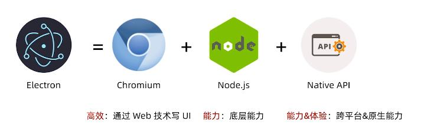

# 1.Electron简介

+ Electron是由github开发，现在由openJS基金会维护的一个开源框架
  
+ 使用web技术(HTML、CSS、JS)构建**跨平台****桌面应用**

Electron的核心组成是其中Chromium、NodeJS、以及内置的Native API，其中Chromium为Electron提供强大的UI能力，可以在考虑兼容性的情况下，利用强大的web生态来开发界面；NodeJS让Electron有了底层的操作能力，比如图像读写、文件操作等，并集成C++等，还可以使用大量的NPM包。

内置的Native API解决了跨平台的问题，它提供了统一的原生界面，比如窗口、托盘，其次是系统能力，比如Notification。还有应用的基础能力，比如软件更新、崩溃监控等。

Electron正是基于这么多的特性，使得它开发桌面端效率很高。

# 2.Electron历史

Electron历史要从浏览器讲起：

+ 1989年，万维网诞生：英国科学家伯纳斯·李（Berners-Lee）发明了万维网
  
+ 1990年，第一个浏览器Nexus诞生：伯纳斯·李创造了世界上第一个浏览器Nexus，Nexus有一个很大的缺陷：不能显示图片
  
+ 1993年，Mosaic(马赛克)诞生：NSCA（美国国家超级电脑应用中心）研发了第一款能够看到图片的浏览器——Mosaic(马赛克)

+ 1994年，Netscape(Mozilla)诞生：Mosaic核心成员**Marc Andreessen**与辞职的硅谷制图（Silicon Graphics）创始人**吉姆·克拉克**一起创建了Netscape即网景公司（愿景：打破Mosaic的垄断）——Mozilla(WHY: 1.Mosaic Killa 2.Godzilla eat the Mosaic ---> Mosaic + Godzilla + Killa = Mozilla)。后来由于市场原因还是使用了Netscape。虽然Mozilla更名为Netscape，但是User Agent还是Mozilla。

由于Netscape快速发展并奠定浏览器霸主地位，各个服务端都会去判断Mozilla，渐渐的所有的浏览器的UA都带上了Mozilla

+ 1995年，IE诞生：微软发现浏览器的巨大市场之后推出了IE1(同年，网景公司招来了天才程序员**布兰登·艾奇**)

+ 1995年，JavasCript诞生：网景公司高层在发布网景2.0的10天之前加了一个交互需求，为了赶需求**布兰登·艾奇**用了10天时间创造了JavasCript。

+ 1998年，Mozilla开源：网景公司被微软打败，受Linux开源影响，网景公司决定开放源码回击IE

+ 2002年，FireFox诞生：网景公司在网景源码基础上派生了FireFox（火狐浏览器），它在安全、插件扩展、开发调试工具都有这巨大的贡献。

+ 2008年，Chrome诞生：Chrome基于FireFox开发，极致简洁、多进程、V8引擎 —— 开源项目Chromium

+ 2009年，NodeJS诞生：Ryan Dahl基于V8将非阻塞IO和JS整合，让JS衍生到了服务端领域——NodeJS

+ 2011年，NW诞生：Intel工程师王文睿写了第一版Node-webkit(NW)，这是JS在桌面端的初次尝试.

+ 2012年，Intel工程师王文睿招了一个实习生，几乎重写了NW，将NW做到了GitHub C++前五，这个实习生就是Electron的作者**赵成**。

+ 2013年，Atom-shell诞生：赵成在2012年底加入了GitHub Atom项目组，在尝试使用NW开发时，发现问题太多且响应太慢。在2013年的时候决定开发Atom-shell

+ 2015年，Electron诞生：Atom-shell在2015年正式更名为Electron

总结：网景公司在浏览器大战后被IE击败后，开放源码成立了Mozilla,派生了FireFox。Chrome基于FireFox开发并产生了V8引擎。NodeJS基于V8引擎实现了非阻塞IO。NW基于NodeJS和Chromium开发了桌面端。Atom在尝试NW失败后，开始了Atom-shell的开发，最后更名为Electron。

# Electron适用场景

+ 快速试错

+ 特定领域：开发工具、效率应用

+ 同时开发桌面端和WEB端

案例：Atom、VS Code、slack、Whatsapp、WordPress等

> [CN:Electron 文档](https://www.electronjs.org/docs)
>
> [EN:Electron 文档](https://www.electronjs.org/docs)
>
> [Electron github](https://github.com/electron)