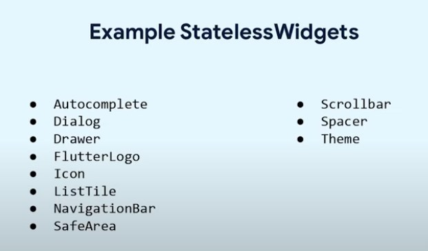
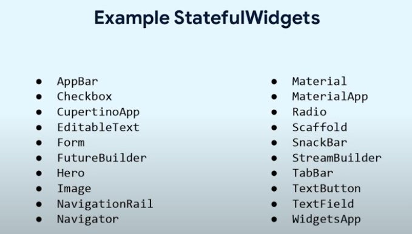
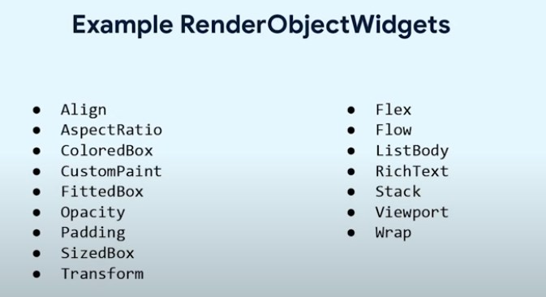
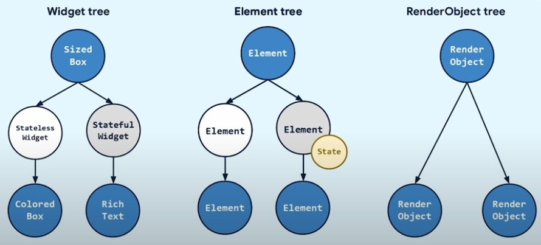
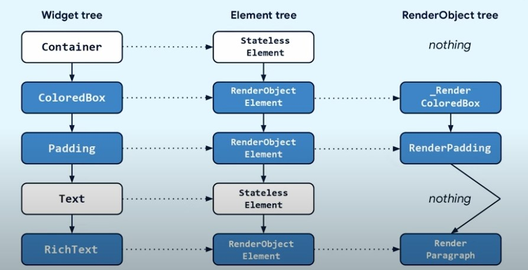

## widget的实现

flutter 中的 内置的 widget 都继承自 `statelessWidget` 和 `statefulWidget`以及 `renderObjectWidget` 三个类。





## flutter 三棵树

flutter 框架中的三棵树，分别是 `Widget tree`、`Element tree`和`RenderObject tree`。


比如下面这个简单的 widget:

```dart
Container(
  color: Colors.blue,
  padding: EdgeInsets.all(10),
  child: Text('hello world'),
)
```

构建的三棵树如下图所示：




<iframe width="100%" src="https://www.youtube.com/embed/_gIbneld-bw" title="Lifecycle of a Widget | FlutterVikings 2022" frameborder="0" allow="accelerometer; autoplay; clipboard-write; encrypted-media; gyroscope; picture-in-picture; web-share" referrerpolicy="strict-origin-when-cross-origin" allowfullscreen></iframe>
