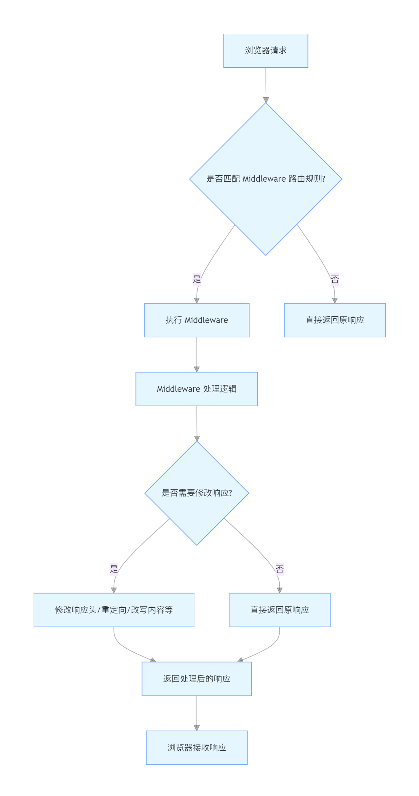

本文将详细解析 Next.js 中间件（Middleware）。它是 Next.js 框架中一个极其强大且灵活的功能，理解它对于构建复杂的、高性能的现代 Web 应用至关重要。

## 什么是 Next.js 中间件？

简单来说，Next.js 中间件是一个在**请求到达服务器、但尚未完成处理（例如尚未进行页面渲染或 API 路由执行）之前**运行的函数。

你可以把它想象成一个站应用入口处的“**智能交通警察**”或“**门卫**”。它能够检查每一个传入的请求，并根据你定义的规则，在请求继续前进之前对其进行处理、重写、重定向或者直接拦截。



### 核心特性

1.  **运行在 Edge (边缘计算)**: 这是中间件最显著的特点。当部署在 Vercel 等支持 Edge Functions 的平台上时，中间件代码会在离用户最近的服务器上执行，而不是在单一的源服务器上。这使得响应速度极快，延迟极低。
2.  **在缓存之前执行**: 中间件在 Next.js 的缓存层之前运行。这意味着你可以动态修改即将从缓存中提供的响应，例如根据用户地理位置提供不同内容。
3.  **轻量级运行时**: 它使用 Vercel Edge Runtime，这是一个精简的、基于 Web API（如 `fetch`, `Request`, `Response`）的环境，不支持完整的 Node.js API。这确保了它的快速启动和执行。
4.  **代码集中管理**: 你只需要在项目的根目录（或 `src/` 下）创建一个 `middleware.ts` 文件，所有的中间件逻辑都写在这里。

---

## 如何创建和配置中间件？

1.  **创建文件**: 在你的项目根目录（与 `pages` 或 `app` 目录同级）下创建 `middleware.ts` 文件。
2.  **编写函数**: 在该文件中，导出一个名为 `middleware` 的函数。
3.  **配置 `matcher`**: 导出一个 `config` 对象，其中的 `matcher` 属性告诉 Next.js 这个中间件应该在哪些路径上运行。**这是至关重要的性能优化点**，可以避免中间件在不必要的路径（如 `/_next/static`, `/_next/image`, `favicon.ico`）上运行。

### `middleware.ts` 的基本结构

```typescript
import { NextResponse } from 'next/server';
import type { NextRequest } from 'next/server';

// 这是中间件的核心函数
export function middleware(request: NextRequest) {
  // 在这里编写你的逻辑
  console.log('中间件被触发了:', request.nextUrl.pathname);

  // 默认行为：让请求继续
  return NextResponse.next();
}

// 这是 matcher 配置，用于过滤中间件要应用的路径
export const config = {
  /*
   * 匹配除了以下开头的路径之外的所有请求路径：
   * - api (API routes)
   * - _next/static (static files)
   * - _next/image (image optimization files)
   * - favicon.ico (favicon file)
   */
  matcher: '/((?!api|_next/static|_next/image|favicon.ico).*)',
};
```

### `NextResponse` 的核心 API

*   `NextResponse.next()`: 继续请求处理链。如果需要修改请求头或响应头，可以在 `next()` 的基础上进行。
*   `NextResponse.redirect(url)`: 将用户重定向到另一个 URL。浏览器地址栏会改变。
*   `NextResponse.rewrite(url)`: “在后台”重写 URL，将用户导航到另一个页面或路由，但浏览器地址栏**保持不变**。这是 A/B 测试和路由代理的利器。
*   `NextResponse.json(data)`: 直接返回一个 JSON 响应，常用于在中间件层面拦截 API 请求。

---

## 常用的实用案例

下面是一些最常见且强大的中间件应用场景。

### 案例 1: 认证与受保护的路由 (Authentication)

这是最经典的应用。如果用户未登录，则将他们从受保护的页面（如 `/dashboard`）重定向到登录页 (`/login`)。

```typescript
// middleware.ts
import { NextResponse } from 'next/server';
import type { NextRequest } from 'next/server';

export function middleware(request: NextRequest) {
  // 1. 从 cookie 中获取认证 token
  const authToken = request.cookies.get('auth-token')?.value;

  // 2. 如果 token 不存在，并且用户正试图访问受保护的页面
  if (!authToken && request.nextUrl.pathname.startsWith('/dashboard')) {
    // 3. 将用户重定向到登录页
    const loginUrl = new URL('/login', request.url);
    // 可选：将用户原本想访问的页面作为查询参数，以便登录后跳回
    loginUrl.searchParams.set('from', request.nextUrl.pathname);
    return NextResponse.redirect(loginUrl);
  }

  // 如果用户已登录但尝试访问登录页，可以把他重定向到 dashboard
  if (authToken && request.nextUrl.pathname === '/login') {
    return NextResponse.redirect(new URL('/dashboard', request.url));
  }

  return NextResponse.next();
}

export const config = {
  // 只在 dashboard 相关的页面和登录页上运行此中间件
  matcher: ['/dashboard/:path*', '/login'],
};
```

### 案例 2: A/B 测试 (A/B Testing)

根据用户的 cookie 或其他标识，将一部分流量无缝地导向页面的新版本，而用户不会察觉 URL 的变化。

```typescript
// middleware.ts
import { NextResponse } from 'next/server';
import type { NextRequest } from 'next/server';

export function middleware(request: NextRequest) {
  // 1. 决定用户属于哪个分组（A 或 B）。可以通过 cookie 或随机分配。
  let bucket = request.cookies.get('bucket')?.value;
  if (!bucket) {
    bucket = Math.random() < 0.5 ? 'a' : 'b'; // 50/50 分流
  }

  // 2. 如果用户在 B 组，则将他们对主页的请求重写到新版主页
  if (request.nextUrl.pathname === '/' && bucket === 'b') {
    const url = request.nextUrl.clone();
    url.pathname = '/new-homepage'; // 假设 /new-homepage 是新版页面
    console.log('Rewriting to /new-homepage for bucket B');
    return NextResponse.rewrite(url);
  }

  // 3. 创建响应，以便将分组信息存入 cookie，确保用户后续访问时分组不变
  const response = NextResponse.next();
  if (!request.cookies.has('bucket')) {
    response.cookies.set('bucket', bucket, { maxAge: 60 * 60 * 24 * 7 }); // 7天
  }
  return response;
}

export const config = {
  matcher: '/', // 只对主页进行 A/B 测试
};
```

### 案例 3: 国际化 (i18n) 路由

根据浏览器 `Accept-Language` 头自动检测用户偏好语言，并将其重定向到相应的语言路径（如 `/en` 或 `/zh`）。

```typescript
// middleware.ts
import { NextResponse } from 'next/server';
import type { NextRequest } from 'next/server';

const locales = ['en', 'zh', 'ja'];
const defaultLocale = 'en';

function getLocale(request: NextRequest): string {
  // 从 Accept-Language header 中解析最佳匹配的语言
  // 注意：真实场景下这里需要一个更健壮的库，如 `accept-language-parser`
  const languages = request.headers.get('accept-language')?.split(',')?.[0] || defaultLocale;
  const preferredLocale = languages.split('-')[0];

  if (locales.includes(preferredLocale)) {
    return preferredLocale;
  }
  return defaultLocale;
}

export function middleware(request: NextRequest) {
  const { pathname } = request.nextUrl;

  // 检查 URL 是否已经包含了语言前缀
  const pathnameHasLocale = locales.some(
    (locale) => pathname.startsWith(`/${locale}/`) || pathname === `/${locale}`
  );

  if (pathnameHasLocale) {
    return NextResponse.next();
  }

  // 如果没有，则根据浏览器偏好进行重定向
  const locale = getLocale(request);
  request.nextUrl.pathname = `/${locale}${pathname}`;

  return NextResponse.redirect(request.nextUrl);
}

export const config = {
  matcher: [
    // 跳过所有内部路径 (_next) 和静态资源
    '/((?!api|_next/static|_next/image|assets|favicon.ico).*)',
  ],
};
```

### 案例 4: 地理位置定位 (Geolocation)

根据用户的地理位置（由 Vercel 平台提供）提供定制内容或重定向。

```typescript
// middleware.ts
import { NextResponse } from 'next/server';
import type { NextRequest } from 'next/server';

export function middleware(request: NextRequest) {
  // 从请求中获取地理位置信息（仅在 Vercel 全球的 Edge Network 环境下可用）
  const { geo } = request;

  // 如果用户来自加拿大，将他们重定向到加拿大专区
  if (geo?.country === 'CA') {
    const url = request.nextUrl.clone();
    url.pathname = '/ca';
    return NextResponse.rewrite(url);
  }

  return NextResponse.next();
}

export const config = {
  matcher: '/', // 仅在访问主页时进行地理位置判断
};
```


### 案例 5: CORS 处理
#### 为什么使用中间件处理 CORS？

1.  **集中管理 (Centralization)**: 所有 API 路由的 CORS 策略都定义在 `middleware.ts` 这一个文件中。修改、添加或删除允许的源，只需改动一处。
2.  **边缘执行 (Edge Execution)**: 中间件在 Edge 环境运行。对于 CORS 的 `OPTIONS` 预检（pre-flight）请求，可以在离用户最近的服务器上就快速响应，无需将请求传递到后端的源服务器，从而降低延迟。
3.  **代码即配置 (Code as Configuration)**: 你可以使用编程逻辑来动态确定 CORS 策略，例如根据不同的 API 路径（`/api/v1/*` vs `/api/v2/*`）应用不同的规则，或者从数据库/环境变量中读取白名单，这比静态配置要灵活得多。
4.  **全覆盖 (Coverage)**: 确保你不会忘记在某个新的 API 路由上设置 CORS 头，避免了人为疏忽。

---

#### 创建并编写 `middleware.ts`
```typescript
// middleware.ts

import { NextResponse } from 'next/server';
import type { NextRequest } from 'next/server';

// .env
// ALLOWED_ORIGINS=http://localhost:3000,https://my-awesome-site.com,https://staging.my-awesome-site.com

// 1. 从环境变量中获取白名单，并解析成数组
const allowedOrigins = process.env.ALLOWED_ORIGINS?.split(',') || [];

// 2. 一个辅助函数，用于设置 CORS 响应头
function applyCorsHeaders(response: NextResponse, origin: string) {
  response.headers.set('Access-Control-Allow-Origin', origin);
  response.headers.set('Access-Control-Allow-Methods', 'GET, POST, PUT, DELETE, OPTIONS');
  response.headers.set('Access-Control-Allow-Headers', 'Content-Type, Authorization');
  response.headers.set('Access-Control-Allow-Credentials', 'true');
  return response;
}

export function middleware(request: NextRequest) {
  // 3. 从请求头中获取 Origin
  const origin = request.headers.get('origin');

  // 4. 如果 Origin 在白名单中
  if (origin && allowedOrigins.includes(origin)) {
    // 4.1. 处理预检请求 (Pre-flight OPTIONS request)
    // 浏览器在发送实际请求（如POST）前，会先发送一个OPTIONS请求来询问服务器是否允许跨域。
    if (request.method === 'OPTIONS') {
      const response = new NextResponse(null, { status: 204 }); // 204 No Content
      return applyCorsHeaders(response, origin);
    }

    // 4.2. 处理实际请求 (Actual request)
    // 让请求继续流向 API 路由，但在响应上附加 CORS 头。
    const response = NextResponse.next();
    return applyCorsHeaders(response, origin);
  }

  // 5. 如果 Origin 不在白名单中，或者请求没有 Origin 头 (例如服务器间调用或直接在浏览器打开URL)
  // 我们不添加任何 CORS 头。浏览器将默认执行同源策略，并阻止跨域请求。
  // 注意：对于预检请求，如果走到这里，浏览器会因为缺少CORS头而拒绝后续的实际请求。
  if (request.method === 'OPTIONS') {
    return new NextResponse(null, { 
      status: 204,
      statusText: "No Content", // 明确告知浏览器
      headers: {
        'Access-Control-Allow-Origin': '', // 可以设置为空或一个不允许的源
        'Access-Control-Allow-Methods': 'GET, POST, PUT, DELETE, OPTIONS',
        'Access-Control-Allow-Headers': 'Content-Type, Authorization'
      }
    });

  }
  return NextResponse.next();
}

// 6. 配置 matcher，让中间件只在 API 路径上运行
// 这是关键的性能优化，避免在普通页面、静态资源上执行此逻辑。
export const config = {
  matcher: '/api/:path*',
};
```

## 总结与最佳实践

*   **精简 `matcher`**: 永远通过 `matcher` 将中间件的执行范围限制在绝对必要的路径上，这是最重要的性能优化手段。
*   **保持轻量**: 中间件会给每个匹配的请求增加一点延迟。逻辑应尽可能快地执行完毕。避免在中间件中进行复杂的、耗时的计算或 API 调用。
*   **理解 `rewrite` 与 `redirect` 的区别**:
    *   `redirect`: **307 临时重定向**。URL 变了，常用于认证和强制跳转。
    *   `rewrite`: **服务器内部重写**。URL 不变，对用户透明，常用于 A/B 测试、代理、个性化内容。
*   **Edge Runtime 限制**: 牢记你不能使用 Node.js 的原生模块（如 `fs`, `path`），只能使用 Web标准 API。

Next.js 中间件是一个强大的工具，它赋予了你在请求生命周期的早期阶段控制流量和响应的能力，为实现高级功能提供了优雅的解决方案。


> [Next.js Middleware for Beginners: How to Implement and Use It Effectively](https://devot.team/blog/nextjs-middleware)
> 
> [All you need to know about Middleware in Nextjs](https://abeer.hashnode.dev/all-you-need-to-know-about-middleware-in-nextjs)
