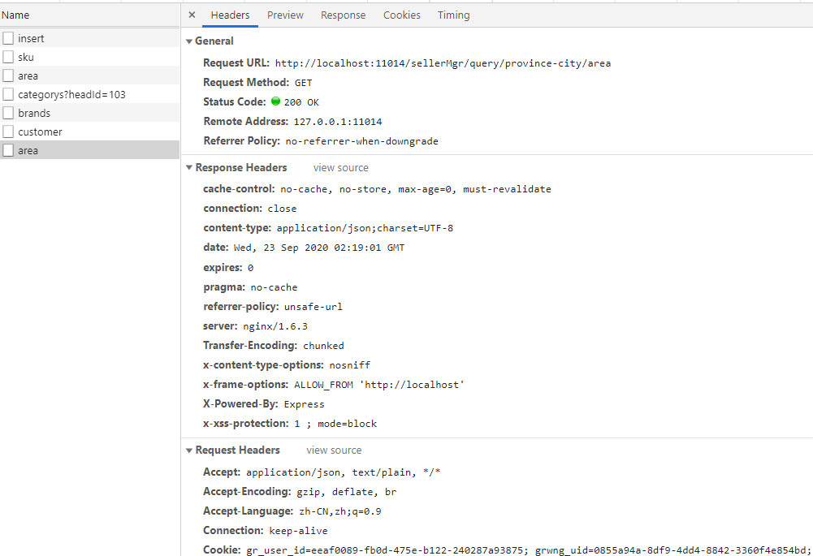

# HTTP缓存策略

> 前期学习了一下缓存相关的知识，看了一下项目的接口发现Header里面设置的全是不允许缓存，巩固一下HTTP缓存



`area`接口返回的是地理区域信息(省、市、区)，一般这个数据是几乎不会改动的，但是从上图的`Response Header`中可以看出，是一刻都不让缓存啊（小朋友，你是不是有很多的问号:zap:），下面我挑出了上图中与缓存相关的几个Header信息：

+ **cache-control**: `no-cache, no-store, max-age=0, must-revalidate` 
+ **connection**: `close`
+ **expires**: `0`
+ **pragma**: `no-cache`

+ **Connection**: `keep-alive` （ HTTP 长连接或持久连接）在 HTTP/1.1 协议中，默认开启 keep-alive 。[【HTTP keep-alive 二三事】](https://lotabout.me/2019/Things-about-keepalive/)

除了这些，还有诸如： `Etag`、`Last-modified`、`If-Modified-Since`是不是一脸懵逼（同道中人），没关系，下面我们一个一个来学习。

## 1.缓存策略

HTTP缓存分为强缓存和协商缓存。

### 1. 强缓存

即在第一次访问服务器取到数据之后，在过期时间之内不会重复请求数据，那么怎么知道过期时间呢？

+ HTTP1.0：通过`expires`响应头来实现，表示资源过期时间（一个GMT时间格式个字符串）

  ```markdown
  Response Headers
  	connection: keep-alive
  	Date: Fri, 08 Dec 2019 10:18:50 GMT
  	Expires: Sun, 08 Dec 2019 10:18:50 GMT
  	X-Powered-By: Express
  ```

  

+ HTTP1.1：通过 `Cache-Control` 响应头来实现。`Cache-Control`属性值：

  - `max-age`：过期时长s

  - `private`： 这种情况就是只有浏览器能缓存了，中间的代理服务器不能缓存。

  - `no-cache`: 跳过当前的**强缓存**，发送HTTP请求，即直接进入`协商缓存阶段`。

  - `no-store`：非常粗暴，不进行任何形式的缓存。

  - `s-maxage`：这和`max-age`长得比较像，但是区别在于s-maxage是针对代理服务器的缓存时间。

  - `must-revalidate`: 是缓存就会有过期的时候，加上这个字段一旦缓存过期，就必须回到源服务器验证。

    

  值得注意的是，当**Expires**和**Cache-Control**同时存在的时候，**Cache-Control**会优先考虑。

### 2.协商缓存

协商缓存每次读取数据时都需要跟服务器通信，并且会增加缓存标识。

在第一次请求服务器时，服务器会返回资源，并且返回一个资源的**缓存标识**，一起存到浏览器的缓存数据库。

当第二次请求资源时，浏览器会首先将**缓存标识**发送给服务器，服务器拿到标识后判断标识是否匹配，如果不匹配，表示资源有更新，服务器会将新数据和新的缓存标识一起返回到浏览器；**如果缓存标识匹配，表示资源没有更新，并且返回 `304` 状态码**，浏览器就读取本地缓存服务器中的数据。

+ HTTP1.0：`Last-Modified` 和 `If-Modified-Since`

  + 第一次请求资源时服务器通过 `Last-Modified` 来设置响应头的缓存标识，并且把资源最后修改的时间作为值填入，然后将资源返回给浏览器。
  + 在第二次请求时，浏览器会首先带上 `If-Modified-Since` 请求头去访问服务器，服务器会将 `If-Modified-Since` 中携带的时间与资源修改的时间匹配，如果时间不一致，服务器会返回新的资源，并且将 `Last-Modified` 值更新，作为响应头返回给浏览器。如果时间一致，表示资源没有更新，服务器返回 304 状态码，浏览器拿到响应状态码后从本地缓存数据库中读取缓存资源。

  这种方式有一个弊端，就是当服务器中的资源增加了一个字符，后来又把这个字符删掉，本身资源文件并没有发生变化，但修改时间发生了变化。当下次请求过来时，服务器也会把这个本来没有变化的资源重新返回给浏览器。

+ HTTP1.1：`Etag`(设置响应头缓存标识)和`If-None-Match`(保存`Etag`信息)

  + 在第一次请求时，服务器会将资源和 `Etag` 一并返回给浏览器，浏览器将两者缓存到本地缓存数据库

  + 在第二次请求时，浏览器会将 `Etag` 信息放到 `If-None-Match` 请求头去访问服务器，服务器收到请求后，会将服务器中的文件标识与浏览器发来的标识进行对比，如果不相同，服务器返回更新的资源和新的 `Etag` ，如果相同，服务器返回 `304` 状态码，浏览器读取缓存。

    

  同样的，一般来讲为了兼容，两个版本的协商缓存都会被实现，`http 1.1` 版本的实现优先级会高于 `http 1.0` 版本的实现。

  

+ `Etag`主要解决了`Last-Modified`一些无法解决的问题

  1. 一些文件也许会周期性的更改，但是他的内容并不改变(仅仅改变的修改时间)，这个时候我们并不希望客户端认为这个文件被修改了，而重新get；

  2. 某些文件修改非常频繁，比如在秒以下的时间内进行修改，(比方说1s内修改了N次)，`If-modified-since`能检查到的粒度是秒级的，这种修改无法判断(或者说UNIX记录MTIME只能精确到秒)；

  3. 某些服务器不能精确的得到文件的最后修改时间。

     

## 2.设置强缓存与协商缓存

`了解了强缓存和协商缓存，会发现无论单独使用哪一种都无法满足我们的需要，建议：`

`1.HTML采用协商缓存，用户每次请求index.html不拿浏览器缓存，直接请求服务器，这样就保证资源更新了，用户能马上访问到新资源，如果服务端返回304，这时候再拿浏览器的缓存的index.html。`

`2.JS/CSS/IMG采用强缓存，打包的时候给文件名加上hash值`，见[【webpack学习系列笔记-文件指纹策略】](https://docs.zkkysqs.top/other/webpack/Webpack%E5%AD%A6%E4%B9%A0%E7%AC%94%E8%AE%B0%E4%B9%8B%E5%9F%BA%E7%A1%80%E5%BA%94%E7%94%A8.html#_6-文件指纹策略-chunkhash、contenthash和hash)

### 2.1 nodejs服务器设置缓存:

```js
res.setHeader('max-age': '3600 public')
res.setHeader(etag: '5c20abbd-e2e8')
res.setHeader('last-modified': Mon, 24 Sep 2020 09:49:49 GMT)
```

### 2.2 nginx配置禁用强缓存

> [nginx设置资源缓存实战](https://juejin.im/post/6844903981181829134)

```nginx
server {
  listen       8080;
  server_name  localhost;
  location / {
     root  /Volumes/myFile/nginx_root;   
     index  index.html index.htm;
     add_header Cache-Control no-cache;
     # 为 public可以被任何对象缓存，private只能针对个人用户，而不能被代理服务器缓存
     add_header Cache-Control private;
  }
}
```

### 2.3 Tomcat 设置缓存图片、JS、CSS 等

> [Tomcat 设置缓存图片、JS、CSS 等](http://read.pudn.com/downloads416/ebook/1767859/Tomcat%20%E8%AE%BE%E7%BD%AE%E7%BC%93%E5%AD%98%E5%9B%BE%E7%89%87JS%E5%92%8CCSS%E7%AD%89.pdf)
>
> [闲谈 Tomcat 性能优化，通过 ExpiresFilter 设置浏览器缓存](https://zhangzw.com/posts/20190926.html)

```java
HttpServletResponse resp = (HttpServletResponse)response;
resp.setHeader("Cache-Control", (new StringBuilder("max-age=")).append(exp).toString());
resp.setDateHeader("Expires", System.currentTimeMillis() + exp.longValue() * 1000L);
```

至此，我们对HTTP缓存有了新的认识，那么我们总结一下

## 3.小结

+ HTTP缓存分为强缓存（生效的话，不用请求数据）和协商缓存（需要请求数据，可以用缓存数据返回：304 Not Modified）。
+ 强缓存-HTTP1.0（expires）;HTTP1.1（cache-control）。
+ 协商缓存-HTTP1.0（`Last-Modified` 和 `If-Modified-Since`）;HTTP1.1(`Etag`(设置响应头缓存标识)和`If-None-Match`(保存`Etag`信息))。
+ 为了兼容,一般HTTP1.0和HTTP1.1两种缓存策略都会加上，其中HTTP1.1优先级更高。


>  [彻底弄懂HTTP缓存机制及原理](https://www.cnblogs.com/chenqf/p/6386163.html)
>
>  [【webpack学习系列笔记-文件指纹策略】](https://docs.zkkysqs.top/other/webpack/Webpack%E5%AD%A6%E4%B9%A0%E7%AC%94%E8%AE%B0%E4%B9%8B%E5%9F%BA%E7%A1%80%E5%BA%94%E7%94%A8.html#_6-文件指纹策略-chunkhash、contenthash和hash)
>
>  [【HTTP 304状态码的详细讲解】](https://blog.csdn.net/huwei2003/article/details/70139062?utm_medium=distribute.pc_relevant.none-task-blog-title-1&spm=1001.2101.3001.4242)
>
>  **推荐**：[【缓存（一）——缓存总览：从性能优化的角度看缓存】](https://github.com/amandakelake/blog/issues/43)
>
>  [【利用nginx设置浏览器协商缓存】](https://blog.csdn.net/weixin_30443895/article/details/96133353?utm_medium=distribute.pc_relevant.none-task-blog-BlogCommendFromMachineLearnPai2-6.channel_param&depth_1-utm_source=distribute.pc_relevant.none-task-blog-BlogCommendFromMachineLearnPai2-6.channel_param)
>
>  [详解HTTP的缓存机制与原理](https://www.jianshu.com/p/f080181021cb)
>
>  [【复习：TCP 三次握手、四次挥手】](https://lotabout.me/2019/TCP-connection-establish-and-termination/)

