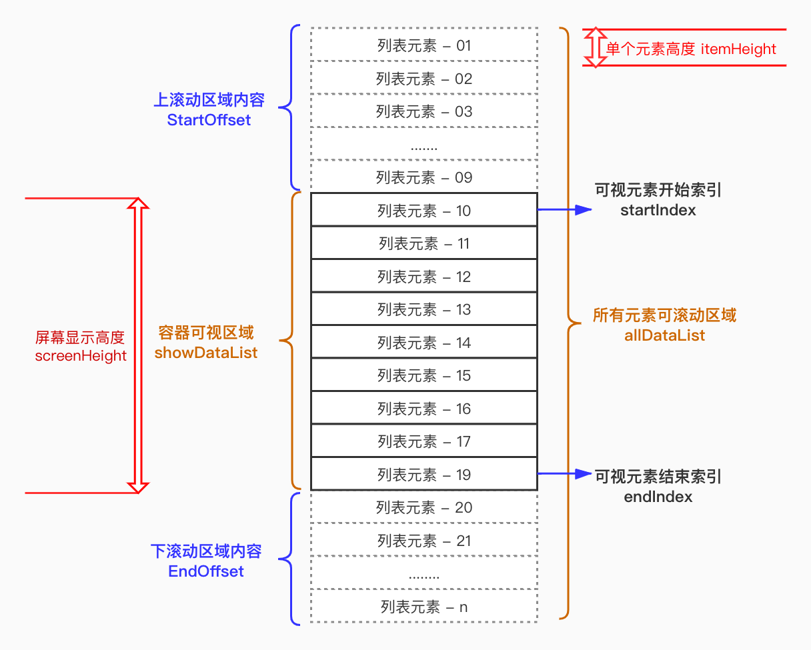
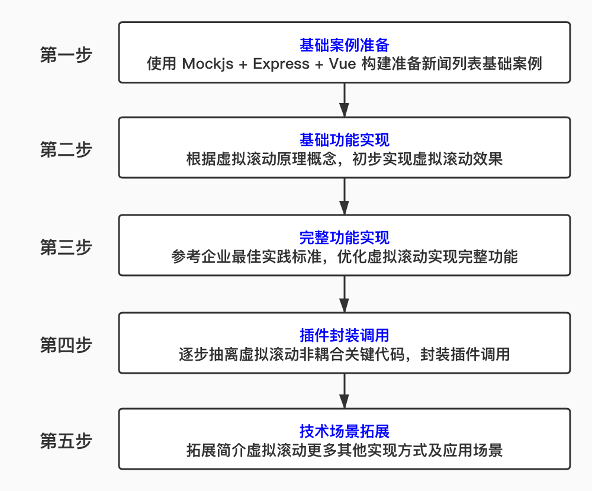
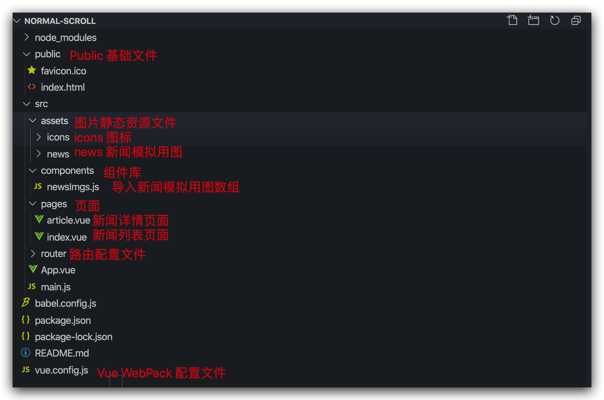

# Vue长列表虚拟滚动插件封装

## 虚拟滚动概述


**场景引入**

>  **思考：**
>
>  ​			老板让我开发一个 类似 新浪新闻  移动端 H5 Web页面，需要怎样设计，才能符合**「 企业实践标准 」**？

根据用户行为，滑动下拉置底，使用 Axios ，按需请求分页数据，追加显示页面。


> **思考：**
>
> ​			如果，我们不断下拉访问，页面中有大量的新闻列表的时候，用户会不会有不好的体验？

> **案例：**
>
> ​			使用 Vue 构建一个页面，直接将 10000 条新闻类列表数据显示到页面上，体验效果
>
> ​         *PS：通过 Chrome 浏览器性能分析工具  **Performance**，监测分析页面前端性能数据*
>
> ​					FPS，每秒帧数，图表上的红色块表示长时间帧，很可能会出现卡顿；
>
> ​					CPU，CPU消耗占用，实体图越多消耗越高
>
> ​					NET，网络请求效率
>
>    ​			通过 CHrome 浏览器内存分析工具 Memory，监测分析内存消耗情况

一个长列表 Web 页面，如果需要展示成千上万条数据，那么页面中就会有数万甚至数十万的HTML节点，会巨大的消耗浏览器性能，进而给用户造成非常不友好的体验。

1. 页面等待时间极长，用户体验差；
2. CPU 计算能力不够，滑动会卡顿；
3. GPU 渲染能力不够，页面会跳屏；
4. RAM 内存容量不够，浏览器崩溃。


> **思考：**
>
> ​			前端如何优化这种 「 长列表 」显示场景，才能符合**「 企业最佳实践标准 」**？

1. 不把长列表数据一次性全部直接显示在页面上；
2. 截取长列表一部分数据用来填充屏幕容器区域；
3. 长列表数据不可视部分使用使用空白占位填充；
4. 监听滚动事件根据滚动位置动态改变可视列表；
5. 监听滚动事件根据滚动位置动态改变空白填充。

  我们也把上面的优化行为简称为 **「 虚拟滚动 」**

> **案例：**
>
> ​			同样使用 Vue 构建一个页面，使用虚拟滚动显示 10000 条数据，监听分析前端性能数据
>
> ​	      *PS：通过 Chrome 浏览器元素查阅工具 **Elements**，查看空白填充区域动态变化效果*


**概念介绍**

虚拟滚动，就是根据 **「 容器可视区域 」**的 **「 列表容积数量 」**，监听用户滑动或者滚动事件，动态截取 **「 长列表数据 」** 中的**「 部分数据 」**渲染到页面上，动态使用空白占位填充容器 **「上下滚动区域内容 」** ，模拟实现 **「 原生滚动效果 」**。




**课程安排**




##  基础案例准备


### 使用 Express + Mockjs 模拟新闻类列表API接口

[Express 官方文档快速入门](https://www.expressjs.com.cn/starter/hello-world.html)

[Mockjs 官方文档快速入门](http://mockjs.com/)

```js
// 使用 Mock 构建本地服务器输出数据结果
const Mock = require('mockjs');
const express = require('express');
const app = express();
//根据传入的参数 num，生成 num 条模拟的数据列表
function generatorList(num) {
  return Mock.mock({
    [`list|${num}`]: [{
      // 模拟 ID，自增方式追加
      'id|+1': 1,
      // 模拟标题，中文字符串长度为 20 位到 30 位
      title: "@ctitle(15,25)",
      // 模拟图片索引，自然数从 0 到 15
      image: "@natural(0,15)",
      // 模拟访问人数，自然数从 0 到 99999
      reads: "@natural(0,99999)",
      // 模拟新闻来源，中文字符串长度为 3 到 10 位
      from: "@ctitle(3,7)",
      // 模拟发布时间，时间格式
      date:"@date('yyyy-MM-dd')"
    }]
  });
}
//允许跨域请求返回数据
app.all('*', function (req, res, next) {
  res.header("Access-Control-Allow-Origin", "*");
  res.header('Access-Control-Allow-Methods', 'PUT, GET, POST, DELETE, OPTIONS');
  res.header("Access-Control-Allow-Headers", "X-Requested-With");
  res.header('Access-Control-Allow-Headers', 'Content-Type');
  next();
});
//截取路由并反馈数据
app.get("/data", function (req, res) {
  // 获取 get 请求数据条数参数 num
  const { num } = req.query;
  return res.send(generatorList(num));
})
//设置端口并打印对应调用结果
const server = app.listen(4000, function () {
  console.log("本地mock服务启动，接口地址为：http://localhost:4000/data?num=请求列表数量");
})
```


### 基于 Vue-Cli  脚手架准备基础案例



> PS：企业级应用开发，在 Vue WebPack 中灵活配置，可以让我们的项目更加灵活可靠


## 基础功能实现


### 使用 Axios 引入模拟数据

```js
//引入axios，并加到原型链中
import axios from "axios";
Vue.prototype.$axios = axios;

export default {
  data() {
    return {
      // 数据请求状态判断
      isRequestStatus: true,
      // 提示显示信息
      msg: "小二正在努力，请耐心等待...",
    };
  },
  created() {
    // 分批发送请求时，先请求一部分数据保证数据显示
    this.getAllListData(100);
    if (!!request && request.length > 0) {
      this.allDataList = [...request];
      this.isRequestStatus = false;
    }
  },
  methods: {
    // 发送请求获取新的请求模拟数据，这个是跨域请求的网络mock数据
    getAllListData(num) {
      this.isRequestStatus = true;
      this.msg = "小二正在努力，请耐心等待...";
      this.$axios
        .get("http://localhost:4000/data?num=" + num)
        .then(res => {
          this.isRequestStatus = false;
          this.allListData = res.data.list;
        })
        .catch(() => {
          this.msg = "亲，网络请求出错啦！赶快检查吧...";
        });
    }
  }
};
```


### 计算滚动容器最大列表容积

根据滚动容器 DOM 元素高度 `this.$refs.scrollContainer.innerHeight` 和单条数据的固定高度  `oneHeight` ，计算当前滚动容器最大列表容积数量  `containSize` 。

> **注意：**
>
> ​			当屏幕 `Resize` 改变窗口，或者 `orientationchange` 手机横竖屏切换时，滚动容器最大容积数需要动态计算

```vue
// 给滚动容器加一个 ref 属性，用来获取当前滚动容器的 DOM 节点
<div class="scroll-container" ref="scrollContainer" />
// 首先在data中声明两个属性
data() {
  return {
    // 列表单条条数据 CSS 高度，这个数值需要固定，根据 CSS 值手动填写，如此才能准确的计算容积
    oneHeight: 100,
    // 当前页面可以容纳的列表最大数量
    containSize: 0
  }
}
mounted() {
	// 根据显示区域高度，计算可以容纳最大列表数量
 	this.myresize();
	window.onresize = this.myresize;
 	window.orientationchange = this.myresize;
},
methods: {
  // 监听窗口变化动态计算容器最大容积数
  myresize: () => {
    console.log(this.$refs.scrollContainer.offsetHeight);
    // 容积数量可能只截取了单条数据的一部分，所以要进位加一
    this.containSize = 
      Math.ceil(this.$refs.scrollContainer.offsetHeight / this.oneHeight) + 1;
  }
}
``````

> **思考：**
>
> ​			现在我将 `className` 为 `scroll-container `或者` news-box` 的高度 100% 设置取消会是什么结果？为什么会这样？
>
> 1. 当前 ref 节点 DOM 元素 `scrollContainer `的高度竟然成了 84，这是什么原因呢？
> 2. 原来，这个时候异步请求的新闻列表数据填充虽然改变了 DOM 结构，但是 DOM 计算是异步的，所以导致了这个时候计算的容器高度，仅仅是底部 msg 信息提示 DOM 节点的高度，如何解决？
> 3. 使用` this.nextTick()` 解决数据变化后 DOM 更新后的节点信息获取，我们发现变成了 10000 ，这是因为填充了100条高度为100的列表数据导致。

> **注意：**
>
> ​			我们在学习虚拟滚动前，务必要非常清醒的去理解，盒元素高度继承的原理，以及子元素高度溢出滚动的原理。如果滚动容器 CSS 高度使用百分比限制的话，要注意其父元素的高度需要指定，父元素的父元素一样需要指定高度，依次类推，只有这样，才会有当前滚动容器内部的滚动效果。


### 监听滚动事件动态截取数据

监听用户滚动、滑动事件，根据滚动位置，动态计算当前可视区域起始数据的索引位置 `startIndex`，再根据  `containSize`，计算结束数据的索引位置 `endIndex`，最后根据`startIndex`与 `endIndex`截取长列表所有数据 `allDataList` 中需显示的数据列表 `showDataList`。

```vue
// 给滚动容器添加滚动事件 @scroll="handleScroll"
// 使用passive修饰符，确保默认滚动行为有效
<div class="scroll-container" ref="scrollContainer" @scroll.passive="handleScroll" />
// 显示容器最大容积截取的数组数据
<div v-for="(item, index) in showDataList" :key="index" />
 
data() {
  return {
    // 可视元素开始索引
    startIndex:0
	}
}
computed: {
    // 根据 starIndex 和屏幕容积 containSize 计算 endIndex
    endIndex() {
      let endIndex = this.startIndex + this.containSize;
      // 判断截取到最后元素是否存在，如果不存在则只取最后一位
      if (!this.allDataList[endIndex]) {
        endIndex = this.allDataList.length - 1;
      }
      return endIndex;
    },
    // 根据容器最大容积数，截取显示，实际需要渲染列表，这里也通过计算属性动态依赖计算
    showDataList() {
      // 根据 starIndex 和 endIndex，截取 allDataList 对应需要显示部分 showDataList
      return this.allDataList.slice(this.startIndex, this.endIndex);
    }
},
methods: {
  // 监听容器滚动事件
  handleScroll() {
    this.startIndex = ~~(
       this.$refs.scrollContainer.scrollTop / this.oneHeight
    );
  }
}
// 给容器添加 Y 轴可滚动 CSS 属性
.scroll-container {
   overflow-y: auto;
}
``````

> **注意：**
>
> 1. 务必给 scroll-container 添加   overflow-y: auto; 的 CSS 属性，Vue 才能监听滚动触发事件；
> 2. 使用 Computed 计算属性，可以依赖性的计算创建对应属性；
> 3. 数组操作 splice 会改变原始数组，slice 不会改变原始数组


### 使用计算属性动态设置上下空白占位

> **思考：**
>
> ​			我们设置了根据容器滚动位移动态截取 `ShowDataList ` 数据，现在我们滚动一下发现滚动 2 条列表数据后，就无法滚动了，这个原因是什么呢？
>
> ​			在容器滚动过程中，因为动态移除、添加数据节点丢失，进而强制清除了顶部列表元素 DOM 节点，导致滚动条定位向上移位一个列表元素高度，进而出现了死循环

根据 `startIndex` 和 `endIndex` 的位置，使用计算属性，动态的计算并设置，上下空白填充的高度样式 `blankFillStyle`，使用 padding 或者 margin 进行空白占位都是可以的

```vue
<!-- 添加上下空白占位 -->
<div :style="blankFillStyle">
	<!-- 循环遍历元素 -->
</div>

computed: {
	// blankFillStyle 依赖 计算上下空白占位高度样式
	blankFillStyle() {
		return {
			paddingTop: this.startIndex * 100 + "px",
			paddingBottom: (this.allDataList.length - this.endIndex) * 100 + "px"
		};
	}
}
``````

> **注意：**
>
> 1. 填充样式必须以盒子包裹的方式包裹所有节点；
> 2. 使用计算属性来自动依赖输出  `blankFillStyle` 对象;
> 3. 在Vue中可以使用对象直接操作 Style 样式，但是要注意「 驼峰式 」的命名规则。

> **思考：**
>
> ​			如果填充样式，使用上下分散占位方式，没有包裹内部列表节点会出现什么现象？为什么？需要怎样处理呢？
>
> ​				`@mousewheel.passive="handleScroll" `
>
> ​				`@touchmove.passive="handleScroll"`


## 完整功能实现


### 下拉置底自动请求加载数据

```vue

async created() {
    // 分批发送请求时，先请求一部分数据保证数据显示
    let request = await this.getAllListData(100);
    if (!!request && request.length > 0) {
      this.allDataList = [...request];
      this.isRequestStatus = false;
    }
  },
  methods: {
    // 发送请求获取新的请求模拟数据，这个是跨域请求的网络mock数据
    getAllListData(num) {
      this.isRequestStatus = true;
      this.msg = "小二正在努力，请耐心等待...";
      return this.$axios
        .get("http://localhost:4000/data?num=" + num)
        .then(res => {
          this.isRequestStatus = false;
          return res.data.list;
        })
        .catch(() => {
          this.msg = "亲，网络请求出错啦！赶快检查吧...";
          return false;
        });
    },
    // 监听容器滚动事件
    handleScroll() {
      // 获取当前容器在scoll事件中距离顶部的位移 scrollTop 计算可视元素开始索引
      let CurrentStartIndex = ~~(
        this.$refs.scrollContainer.scrollTop / this.oneHeight
   	  );
      // 如果当前可视元素开始索引和记录的 startIndex 开始索引发生变化，才需要更改 showDataList
      if (CurrentStartIndex === this.startIndex) return;
      // 当前可视元素索引发生变化后，更新记录的 startIndex 值
      this.startIndex = CurrentStartIndex;
      // PS：因为计算属性依赖关系，startIndex 发生变化，endIndex 会自动触发计算属性的操作
      // 同理，根据计算属性依赖关系，showDataList 也会自动触发返回新的值
      
      // 如果下拉到了底部，并且上一次请求已经完成，则触发新的数据更新
      // 使用 this.loadingTag 状态进行节流，防止非必要触发
      if ( this.containSize + currentIndex > this.listData.length - 1  
           && !this.loadingTag ) {
           // 请求新的20条新闻数据，如果没有请求到数据则直接return
           let newListData = await this.getAllListData(20);
           if (!!newListData && newListData.length === 0) return;
           // 使用拓展运算符将请求的最新数据写进所有数据的列表
           this.listData = [...this.listData, ...newListData];
      }
    },
  }
```


### 滚动事件节流定时器优化

> **思考：**
>
> ​			监听滚动事件触发对应函数方法的频率是极高的，该如何做好页面节流优化呢？

```vue
// 在data中声明一个属性scrollState用来记录滚动状态
// 监听滚动（滑动）事件，
handelScroll() {
     // 只有scrollState值为true的时候才会具体执行 
     if (this.scrollState) {
       this.scrollState = false;
       this.setDataStartIndex();
       var mytimer = setTimeout(() => {
         this.scrollState = true;
         window.clearTimeout(mytimer);
       },60);
     }
},

async setDataStartIndex() {
  		// 获取当前容器在scoll事件中距离顶部的位移 scrollTop 计算可视元素开始索引
      let CurrentStartIndex = ~~(
        this.$refs.scrollContainer.scrollTop / this.oneHeight
   	  );
      // 如果当前可视元素开始索引和记录的 startIndex 开始索引发生变化，才需要更改 showDataList
      if (CurrentStartIndex === this.startIndex) return;
      // 当前可视元素索引发生变化后，更新记录的 startIndex 值
      this.startIndex = CurrentStartIndex;
      // PS：因为计算属性依赖关系，startIndex 发生变化，endIndex 会自动触发计算属性的操作
      // 同理，根据计算属性依赖关系，showDataList 也会自动触发返回新的值
      
      // 如果下拉到了底部，并且上一次请求已经完成，则触发新的数据更新
      // 使用 this.loadingTag 状态进行节流，防止非必要触发
      if ( this.containSize + currentIndex > this.listData.length - 1  
           && !this.loadingTag ) {
           // 请求新的20条新闻数据，如果没有请求到数据则直接return
           let newListData = await this.getAllListData(20);
           if (!!newListData && newListData.length === 0) return;
           // 使用拓展运算符将请求的最新数据写进所有数据的列表
           this.listData = [...this.listData, ...newListData];
      }
}
```


### 滚动事件节流请求动画帧优化

[requestAnimationFrame 介绍](https://developer.mozilla.org/zh-CN/docs/Web/API/Window/requestAnimationFrame)


```js
//兼容低版本浏览器
let requestAnimationFrame =
  window.requestAnimationFrame ||
  window.mozRequestAnimationFrame ||
  window.webkitRequestAnimationFrame ||
  window.msRequestAnimationFrame;
//浏览器防抖优化：根据浏览器FPS采用递归方法，队列调用requestAnimationFrame方法实现优化
let fps = 30;
let interval = 1000 / fps;
let then = Date.now();
requestAnimationFrame(() => {
  let now = Date.now();
  let delta = now - then;
  then = now;
  this.setDataStartIndex();
  if (delta >= interval) {
    requestAnimationFrame(arguments.callee);
  }
});
```


### 设置上下滚动缓冲消除快速滚动白屏

```vue
computed: {
// 用来保存实际要渲染到页面的数据
showListData() {
  // 设置起始、结尾位置索引
	let startIndex = 0;
  let endIndex = 0;
    // 如果当前滚动的位置还没有完成一屏，则从第1条开始，截取到当前索引位置+屏幕容积+向下缓冲屏幕容积
    if (this.currentIndex <= this.containSize) {
      startIndex = 0;
    } else {
      startIndex = this.currentIndex - this.containSize;
    }
    endIndex = this.currentIndex + this.containSize * 2;
    // 判断截取到最后元素是否存在，如果不存在则只取最后一位
    if (!this.listData[endIndex]) {
      endIndex = this.listData.length - 1;
    }
    return this.listData.slice(startIndex, endIndex);
  },
  // 用来动态的计算上下空白padding的占位样式
  wrapperStyle() {
    let paddingTop = "0px";
    let paddingBottom = "0px";
    // 判断当前滚动位置
    if (this.currentIndex > this.containSize) {
      // 当当前滚动位置大于屏幕容积后才填充空白
      paddingTop =
        (this.currentIndex - this.containSize) * this.oneHeight + "px";
    }
    let endIndex = this.currentIndex + this.containSize * 2;
    // 判断截取到最后元素是否存在，只有最后一个元素存在则填充下空白
    if (!!this.listData[endIndex]) {
      paddingBottom =
        (this.listData.length - endIndex) * this.oneHeight + "px";
    }
    return {
      paddingTop,
      paddingBottom
    };
  }
}
```


### 路由切换定位列表滚动位置

> **思考：**
>
> ​			当我们滚动了一段列表后，点击一条新闻查看新闻详情，然后再返回列表页面，发现列表回到顶部了，这个体验很不好，该如何解决？

``````js
// 在 app.vue 文件的路由出口添加 keepAlive 
<keep-alive>
 <router-view />
</keep-alive>	
``````

```vue
// 在 index.vue 文件中记录相关信息
data(){
  return {
    // 在data中声明一个属性，用来保存路由切换后的偏移定位
    scrollTop: 0  
  }
},
methods:{
  async setDataStartIndex() {
      // 根据滚动事件，获取当前容器在scoll事件中距离顶部的位移
    	this.scrollTop = this.$refs.scrollContainer.scrollTop;
  		// 根据 scrollTop 计算可视元素开始索引
      let CurrentStartIndex = ~~( this.scrollTop / this.oneHeight );
    	...
  }
},
activated() {
	//在keep-alive路由模式下，切换路由时确保能够返回用户之前所在位置
	this.$nextTick(() => {
		this.$refs.scrollContainer.scrollTop = this.scrollTop;
	});
},
```


## 插件封装调用


### 剥离代码构建插件文件并直接调用

1. 在 src 文件夹下，创建 plugins 文件夹，用来保存我们的自定义插件，并创建插件 VirtualScroll.vue 文件

``````vue
<template>
  <div class="scroll-container" ref="scrollContainer" @scroll.passive="handleScroll">
      <!-- 滚动容器内部数据 -->
   </div>
</template>
<script>
export default {
   // 对应实现虚拟滚动的脚本文件
};
</script>

<style lang="scss" scoped>
  .scroll-container {
  	/* 对应实现虚拟滚动的 css 文件*/
  }
</style>
``````

2. 新建 index.js 文件输出插件

``````vue
import VirtualScroll from './VirtualScroll.vue';
const plugin = {
    install(Vue) {
        Vue.component("VirtualScroll", VirtualScroll);
    }
}
export default plugin;
``````

3. 在 main.js 文件中，给 Vue 添加全局插件属性

``````js
//引入定制化虚拟滚动插件并注册到Vue全局实例上，这里需要注意先后顺序，我们的定制化插件中会用到iView中的组件
import VirtualScroll from "./plugins";
Vue.use(VirtualScroll);
``````

4. 在 index.vue 文件中调用插件

``````vue
<template>
  <div class="news-box">
    <virtual-scroll />
  </div>
</template>
``````


### 调用插件并传递 Props 参数


调用插件的时候，需要抽离关键定制化的参数信息，向子组件进行通信使用

``````vue
<template>
  <div class="news-box">
    <virtual-scroll 
      :msg ="msg"
      :oneHeight ="oneHeight"
      :requestUrl ="requestUrl"
      :oneRequestDataLength ="oneRequestDataLength"
    />
  </div>
</template>

<script>
export default {
  data() {
    return {
      // 请求数据提示信息
      msg: "小二正在努力，请耐心等待...",
      // 记录单条数据的高度
      oneHeight: 100,
      // 数据请求的 Url
      requestUrl: "http://localhost:4000/data?num=",
      // 单次请求数据的条数
      oneRequestDataLength: 20,
    };
  },
};
</script>
``````

在组件中使用 props 接收父组件传递过来的参数

``````vue
props: {
    // 请求数据提示信息
    msg: {
      default: () => "小二正在努力，请耐心等待...",
      type: String,
    },
    // 记录单条数据的高度
    oneHeight: {
      default: () => 100,
      type: Number,
    },
    // 数据请求的 Url
    requestUrl: {
      default: () => "http://localhost:4000/data?num=",
      type: String,
    },
    // 单次请求数据的条数
    oneRequestDataLength: {
      default: () => 20,
      type: Number,
    },
}
``````

修改关键传递过来的参数信息

``````js
let newList = async () => await this.getNewsList(this.oneRequestDataLength);
// 使用父组件传递过来的请求地址 requestUrl 来替代写死的地址
return this.$axios.get(this.requestUrl + num)
// 追加请求新的数据
let newList = async () => await this.getNewsList(this.oneRequestDataLength);
``````


### 使用作用域插槽传递单条元素结构


将 VirtualScroll.vue 组件内部的单条元素的 html 结构、css 样式、data 数据，使用作用域插槽传递出去

``````html
<div v-for="(item, index) in showDataList" :key="index">
	<slot :thisItem="item"></slot>
</div>
``````

在 index.vue 接收子组件中传递过来的单条元素内容，结构、数据、样式

``````vue
<virtual-scroll v-slot:default="oneItem">
    <router-link class="one-new" to="/article">
    <!-- 新闻左侧标题、评论、来源部分 -->
    <div class="new-left">
        <h3>{{ oneItem.thisItem.title }}</h3>
        <div>
        <p>
            
            <span>{{ oneItem.thisItem.reads }}</span>
            <span>{{ oneItem.thisItem.from }}</span>
        </p>
        <h4>{{ oneItem.thisItem.date }}</h4>
        </div>
    </div>
    <!-- 新闻右侧图片部分 -->
    <div class="new-right">
        
    </div>
    </router-link>
</virtual-scroll>

<style lang="scss" scoped>
.news-box {
  width: 100%;
  max-width: 800px;
  height: 100%;
  .one-new {
    text-decoration: none;
    display: block;
    display: flex;
    flex-direction: row;
    flex-wrap: nowrap;
    justify-content: space-between;
    border-bottom: 1px solid #ddd;
    padding: 14px 10px 5px;
    .new-left {
      height: 80px;
      position: relative;
      h3 {
        padding: 0;
        margin: 0;
        font-size: 16px;
        text-align: justify;
        color: #555;
      }
      div {
        position: absolute;
        width: 100%;
        bottom: 10px;
        display: flex;
        flex-direction: row;
        flex-wrap: nowrap;
        justify-content: space-between;
        align-items: center;
        p {
          display: flex;
          flex-direction: row;
          flex-wrap: nowrap;
          justify-content: space-between;
          align-items: center;
          img {
            height: 16px;
          }
          span {
            font-size: 12px;
            color: #555;
            margin-left: 3px;
            margin-right: 3px;
          }
        }
        h4 {
          font-size: 12px;
          color: #888;
        }
      }
    }
    .new-right {
      margin-left: 10px;
      img {
        height: 68px;
      }
    }
  }
}
</style>
``````


## 技术场景拓展简介

1. 使用上下空白占位的方式实现虚拟滚动
2. 横屏滑动实现虚拟滚动
3. 浮动模型实现虚拟滚动
4. 微信小程序长列表虚拟滚动实现

[小程序长列表组件 - RecycleView](https://developers.weixin.qq.com/miniprogram/dev/extended/component-plus/recycle-view.html)

