# 数据结构和算法

**掌握数据结构和算法，不管对于阅读框架源码，还是理解其背后的设计思想，都是非常有用的。**


## 一、数据结构和算法

从广义上讲，**数据结构**就是指一组**数据的存储结构**。**算法**就是**操作数据**的一组方法。

从狭义上讲，是指某些著名的数据结构和算法，比如队列、栈、堆、二分查找、动态规划等。

数据结构是为算法服务的，算法要作用在特定的数据结构之上。

## 二、时间空间复杂度

> 复杂度分析是整个算法学习的精髓，只要掌握了它，数据结构和算法的内容基本上就掌握了一半。

### 1. 时间复杂度——大O表示法


> [图：从经典算法题看时间复杂度](https://zhuanlan.zhihu.com/p/73731500)
>
> [如何理解算法时间复杂度的表示法，例如 O(n²)、O(n)、O(1)、O(nlogn) 等？](https://www.zhihu.com/question/21387264)

算法的**时间复杂度**（Time complexity）是一个**函数**，用于定性描述算法的运行时间。一般我们我们评估一个算法都是直接评估它的**最坏的复杂度**。

```js
function sumN(n) {
    let sum = 0;
    let i=1;
    for(;i<=n;i++) {
        sum += i;
    }
    return sum;
}
```

假设每行代码执行的时间都一样为K，那么总时间：T(n) = (2 + n + n)*K = f(n) * K，即所有代码的执行时间 T(n) 与每行代码的执行次数n成正比。我们可以把这个规律总结成一个公式：

```
T(n) = O(f(n))

T(n) - 代码执行的时间
n - 数据规模的大小
f(n) - 每行代码执行的次数总和
O - 表示代码的执行时间 T(n) 与 f(n) 表达式成正比
```

### 2.时间复杂度分析

+ 只关注循环执行次数最多的一段代码
+ 加法法则：总复杂度等于量级最大的那段代码的复杂度
+ 乘法法则：嵌套代码的复杂度等于嵌套内外代码复杂度的乘积

  大 O 这种复杂度表示方法只是表示一种变化趋势。我们通常会忽略掉公式中的常量、低阶、系数，只需要记录一个**最大阶的量级**就可以了。所以，我们在分析一个算法、一段代码的时间复杂度的时候，也只关注循环执行次数最多的那一段代码就可以了。这段核心代码执行次数的 n 的量级，就是整段要分析代码的时间复杂度。

即时间复杂度分析只需要关注复杂度量级最高的那部分即可。

### 3. 常见时间复杂度

> [维基百科：时间复杂度](https://zh.wikipedia.org/wiki/%E6%97%B6%E9%97%B4%E5%A4%8D%E6%9D%82%E5%BA%A6)

| 度量级     | 大 *O* 表示                                          |
| ---------- | ---------------------------------------------------- |
| 常量阶     | )         |
| 对数阶     | )   |
| 线性阶     | )         |
| 线性对数阶 | ) |
| 平方阶     | )   |
| 立方阶     | )   |
| 指数阶     | )   |
| 阶乘阶     | )       |

一般情况下，只要算法中不存在循环语句、递归语句，即使有成千上万行的代码，其时间复杂度也是Ο(1)。

在对数阶时间复杂度的表示方法里，我们忽略对数的“底”，统一表示为 O(logn)

### 4.空间复杂度分析

时间复杂度的全称是渐进时间复杂度，表示算法的执行时间与数据规模之间的增长关系。

类比一下，空间复杂度全称就是渐进空间复杂度（asymptotic space complexity），表示算法的存储空间与数据规模之间的增长关系。

常见的空间复杂度就是 O(1)、O(n)、O(n )，像 O(logn)、O(nlogn) 这样的对数阶复杂度平时都用不到。而且，空间复杂度分析比时间复杂度分析要简单很多。

### 5.最好、最坏、平均、均摊时间复杂度

分析下面函数的时间复杂度：

```js
function find(arr, x) {
    let i=0;
    let index = -1;
    let len = arr.length;
    for(;i<len;i++) {
        if(arr[i]===x) {
            index = i;
        }
    }
    return pos;
}
```

这段代码要实现的功能是，在一个无序的数组（array）中，查找变量x 出现的位置。如果没有找到，就返回 -1。这段代码的复杂度是 O(n)，其中，n 代表数组的长度。

我们在数组中查找一个数据，并不需要每次都把整个数组都遍历一遍，因为有可能中途找到就可以提前结束循环了。但是，这段代码写得不够高效。我们可以这样优化一下这段查找代码:

```js {8}
function find(arr, x) {
    let i=0;
    let index = -1;
    let len = arr.length;
    for(;i<len;i++) {
        if(arr[i]===x) {
            index = i;
            break;
        }
    }
    return pos;
}
```

因为，要查找的变量 x 可能出现在数组的任意位置。如果数组中第一个元素正好是要查找的变量 x，那就不需要继续遍历剩下的 n-1 个数据了，那时间复杂度就是 O(1)。但如果数组中不存在变量 x，那我们就需要把整个数组都遍历一遍，时间复杂度就成了 O(n)。所以，不同的情况下，这段代码的时间复杂度是不一样的。

+ **最好情况时间复杂度**（best case time complexity）：在最理想的情况下，执行这段代码的时间复杂度

+ **最坏情况时间复杂度**（worst case time complexity）：在最糟糕的情况下，执行这段代码的时间复杂度

+ **平均情况时间复杂度**（average case time complexity）：加权平均时间复杂度或者期望时间复杂度（与概率相关）

+ **均摊时间复杂度**（amortized time complexity）：均摊时间复杂度就是一种特殊的平均时间复杂度

## 三、[数组Array](https://leetcode-cn.com/tag/array/)

> 数组访问速度快

数组（Array）是一种线性表数据结构。它用一组连续的内存空间，来存储一组具有相同类型的数据。它具有连续的内存空间，可以进行“**随机访问**”。但有利就有弊，比如要想在数组中删除、插入一个数据，为了保证连续性，就需要做大量的数据搬移工作。

**线性表**（Linear List）。顾名思义，线性表就是数据排成像一条线一样的结构。每个线性表上的数据最多只有前和后两个方向。其实除了数组，链表、队列、栈等也是线性表结构。

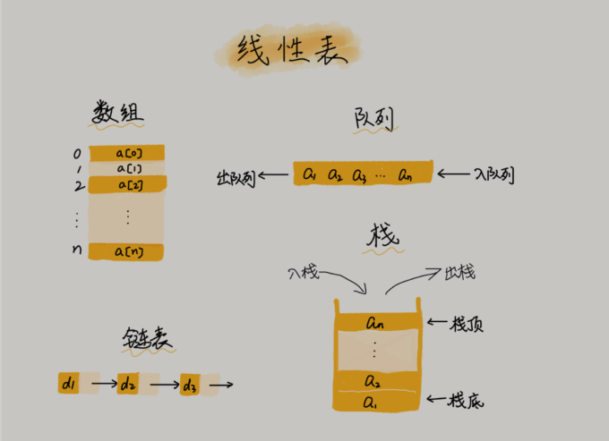

**非线性表**，比如二叉树、堆、图等。之所以叫非线性，是因为，在非线性表中，数据之间并不是简单的前后关系。

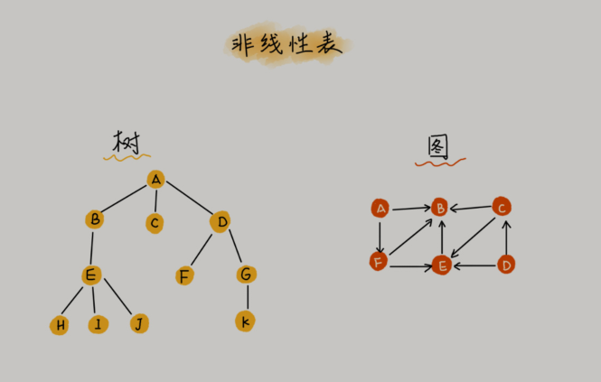

一般认为：“链表适合插入、删除，时间复杂度 O(1)；数组适合查找，查找时间复杂度为O(1)”。

这种表述是不准确的，数组是适合查找操作，但是查找的时间复杂度并不为O(1)。即便是排好序的数组，你用二分查找，时间复杂度也是 O(logn)。所以，正确的表述应该是，数组支持随机访问，根据下标随机访问的时间复杂度为 O(1)。

## 四、[链表LinkedList](https://leetcode-cn.com/tag/linked-list/)

> 插入和删除速度快

数组需要一块连续的内存空间来存储，对内存的要求比较高。

链表恰恰相反，它并不需要一块连续的内存空间，它通过“指针”将一组零散的内存块串联起来使用。

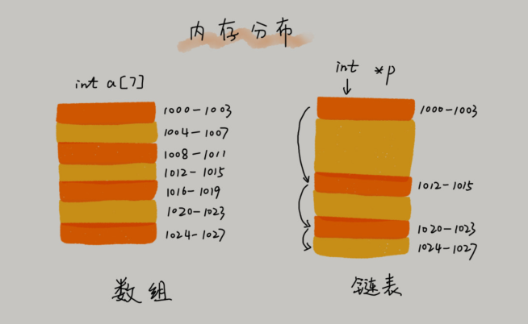


链表通过指针将一组零散的内存块串联在一起。其中，我们把内存块称为链表的“结点”。为了将所有的结点串起来，每个链表的结点除了存储数据之外，还需要记录链上的下一个结点的地址。如图所示，我们把这个记录下个结点地址的指针叫作**后继指针next**。

习惯性地把第一个结点叫作**头结点**，把最后一个结点叫作**尾结点**。其中，**头结点用来记录链表的基地址**。有了它，我们就可以遍历得到整条链表。而尾结点特殊的地方是：指针不是指向下一个结点，而是指向一个空地址 NULL，表示这是链表上最后一个结点。

与数组一样，链表也支持数据的查找、插入和删除操作，而且很高效：

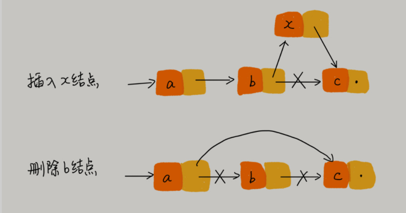

链表随机访问的性能没有数组好，需要 O(n) 的时间复杂度。因为链表中的数据并非连续存储的，所以无法像数组那样，根据首地址和下标，通过寻址公式就能直接计算出对应的内存地址，而是需要根据指针一个结点一个结点地依次遍历，直到找到相应的结点。

最常见的链表结构，它们分别是：单链表、双向链表和循环链表。

### 1.单链表

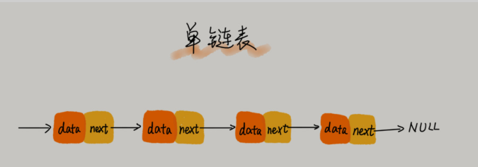

### 2.循环链表

循环链表是一种特殊的单链表。实际上，循环链表也很简单。它跟单链表唯一的区别就在尾结点。

我们知道，单链表的尾结点指针指向空地址，表示这就是最后的结点了。而循环链表的尾结点指针是指向链表的头结点。从循环链表图中，你应该可以看出来，它像一个环一样首尾相连，所以叫作“循环”链表。

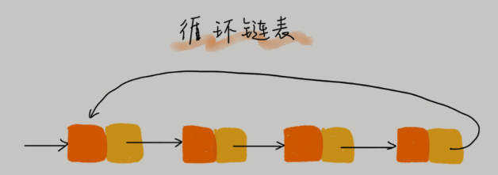

和单链表相比，循环链表的优点是从链尾到链头比较方便。当要处理的数据具有环型结构特点时，就特别适合采用循环链表。比如著名的[约瑟夫问题](https://www.nowcoder.com/questionTerminal/41c399fdb6004b31a6cbb047c641ed8a)。尽管用单链表也可以实现，但是用循环链表实现的话，代码就会简洁很多。

### 3.双向链表

单向链表只有一个方向，结点只有一个后继指针 next 指向后面的结点。而双向链表，顾名思义，它支持两个方向，每个结点不止有一个后继指针 next 指向后面的结点，还有一个前驱指针 prev 指向前面的结点。

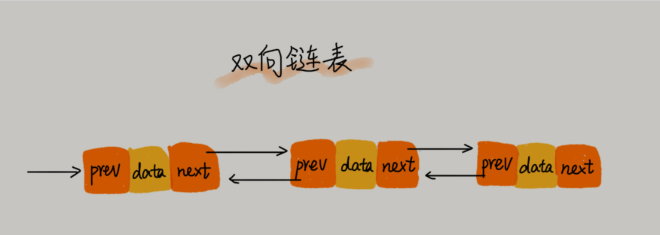

从图中可以看出，双向链表需要额外的两个空间来存储**后继结点**和**前驱结点**的地址。所以，如果存储同样多的数据，双向链表要比单链表占用更多的内存空间。虽然两个指针比较浪费存储空间，但可以支持双向遍历，这样也带来了双向链表操作的灵活性。

从结构上来看，双向链表可以支持 O(1) 时间复杂度的情况下找到前驱结点，正是这样的特点，也使双向链表在某些情况下的插入、删除等操作都要比单链表简单、高效。

### 4.双向循环链表

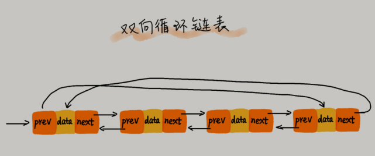

### 5.数组VS链表

| 时间复杂度 | 数组 | 链表 |
| ---------- | ---- | ---- |
| 插入删除   | O(n) | O(1) |
| 随机访问   | O(1) | O(n) |

### 6.JS实现链表

#### 6.1 单链表

单链表中的节点应该具有两个属性：val 和 next。val 是当前节点的值，next 是指向下一个节点的指针/引用。如果要使用双向链表，则还需要一个属性 prev 以指示链表中的上一个节点。

```js
// 定义节点类
class Node {
    constructor(val) {
        this.val = val;
        this.next = null;
    }
}
// 定义链表类
class LinkedList {
    constructor(){
        this.head = null;
        this.length = 0;
    }
    append(val) {}
    insert(position,val) {}
    indexOf(val){}
    removeAt(position){}
    isEmpty(){}
    size(){}
    toString(){}
    getHead(){}
    getTail(){}
}
```


需要实现的方法：

+ [x] `append(element)` ：向列表尾部添加一个新的项。
+ [x] insert(position, val) ：向列表的特定位置插入一个新的项。
+ [x] `remove(val)` ：从列表中移除一项。
+ [x] `indexOf(val)` ：返回元素在列表中的索引。如果列表中没有该元素则返回 -1 。
+ [x] `removeAt(position)` ：从列表的特定位置（从0开始，0表示第一个元素）移除一项。
+ [x] `isEmpty()` ：如果链表中不包含任何元素，返回 true ，如果链表长度大于0则返回 false 。
+ [x] `size()` ：返回链表包含的元素个数。与数组的 length 属性类似。
+ [x] `toString()` ：由于列表项使用了 Node 类，就需要重写继承自JavaScript对象默认的toString 方法，让其只输出元素的值。
+ [x] `getHead()` ：获取head
+ [ ] `getTail()`：获取tail

```js
// 定义节点类
class Node {
    constructor(val) {
        this.val = val;
        this.next = null;
    }
}
// 定义链表类
class LinkedList {
    constructor(){
        this.head = null;
        this.tail = null;
        this.length = 0;
    }
    
    // 向链表尾部追加元素
    append(val) {
        let node = new Node(val);
        let current = null;
        this.tail = node;
        if(this.head === null) {
            // 链表中第一个节点
            this.head = node;
        } else {
            current = this.head;
            // 循环列表，直到找到最后一项
            while(current.next) {
                current = current.next;
            }
            //找到最后一项，将其next赋为node，建立链接
            current.next = node;
        }
        return ++this.length;
    }
    // 从链表中移除第几个元素
    removeAt(position) {
        // 检查越界值
        if(position > -1 && position < this.length) {
            let current = this.head;
            let previous = null;
            // 移除第一项
            if(position === 0) {
                this.head = current.next;
                if (this.length === 1) {
                    this.tail = null;
                }
            } else {
                // 从head顺延找到目标
                while(position--) {
                   previous = current;
                   current = current.next;
                }
                // 将previous与current的下一项链接起来：跳过current，从而移除它
                previous.next = current.next
            }
            // 更新size
            this.length--;
            return current.val;
        } else {
            return null;
        }
    }
    // 向列表的任意位置插入一个新的项
    insert(position, val) {
        // 检查越界值
        if(position >= 0 && position <= this.length) {
            let node = new Node(val);
            let current = this.head;
            let previous = null;
            
            // 在第一个位置添加
            if(position === 0) {
                if (!this.head) { //新增的
                    this.head = node;
                    this.tail = node;
                } else {
                    node.next = current;
                	this.head = node;
                }
            } else if (position === length) {
                current = this.tail;
                current.next = node;
                this.tail = node;
            }else {
                // 在其他位置添加
                while(--position) {
                    previous = current;
                    current = current.next;
                }
                
                node.next = current;
                previous.next = node;
            }
            this.length++;
            return true;
        } else {
           // 更新size
            return false;
        }
    }
    // toString 方法会把 LinkedList 对象转换成一个字符串
    toString() {
        let current = this.head;
        let str = current ? current.val : '';
        while(current && current.next) {
            current = current.next;
            str += '->' + current.val;
        }
        return str;
    }
    
    // indexOf 方法接收一个元素的值，如果在列表中找到它，就返回元素的位置，否则返回 -1 
    indexOf(val) {
        let current = this.head;
        let index = 0;
        while(current) {
            if(val === current.val) {
                return index;
            }
            current = current.next;
            index++;
        }
        return -1;
    }
    // remove删除一个指定的元素值
    remove(val) {
        let index = this.indexOf(val);
        return this.removeAt(index);
    }
    
    // isEmpty判空
    isEmpty() {
        return this.length === 0;
    }
    // size返回长度
    size() {
        return this.length;
    }
    // getHead获取head
    getHead(){
        return this.head;
    }
    
    // getHead获取tail
    getTail(){
        return this.tail;
    }
}
```

测试一波：

```js
let lk = new LinkedList();
lk.append(1); // 1
lk.append(2); // 2
lk.insert(0,0); // true
lk.toString(); // '0->1->2'
lk.getHead(); // Node {val: 0, next: Node}
lk.getTail(); // Node {val: 2, next: Node}
lk.size(); // 3
lk.isEmpty(); // false

lk.indexOf(0); // 0
lk.indexOf(4); // -1

lk.remove(0);
lk.toString(); // '1->2'

```

#### 6.2 双向链表

双向链表和普通链表的区别在于，在链表中，一个节点只有链向下一个节点的链接，而在双向链表中，链接是双向的：一个链向下一个元素，另一个链向前一个元素。

```js
// 定义节点类
class Node {
    constructor(val) {
        this.val = val;
        this.next = null;
        // 增加prev
        this.prev = null;
    }
}
// 定义链表类
class DoubleLinkedList {
    constructor(){
        this.head = null;
        // 增加tail
        this.tail = null;
        this.length = 0;
    }
    
    // 向链表尾部追加元素
    append(val) {
        let node = new Node(val);
        let current = null;
         // 新增
        this.tail = node;
        if(this.head === null) {
            // 链表中第一个节点
            this.head = node;
        } else {
            //找到最后一项，将其next赋为node，建立链接
            current = this.tail;
            current.next = node;
            node.prev = current;
        }
        return ++this.length;
    }
    // 从链表中移除第几个元素
    removeAt(position) {
        // 检查越界值
        if(position > -1 && position < this.length) {
            let current = this.head;
            let previous = null;
            // 移除第一项
            if(position === 0) {
                this.head = current.next;
                //如果只有一项，更新tail //新增的
                if(this.length===1) {
                    this.tail = null;
                } else {
                    this.head.prev = null;
                }
                //最后一项 //新增的
            } else if(position === this.length -1) {
                current = this.tail;
                this.tail = current.prev;
                this.tail.next = null;
            } else {
                // 从head顺延找到目标
                while(--position) {
                   previous = current;
                   current = current.next;
                }
                // 将previous与current的下一项链接起来：跳过current，从而移除它
                previous.next = current.next;
                current.next.prev = previous; //新增的
            }
            // 更新size
            this.length--;
            return current.val;
        } else {
            return null;
        }
    }
    // 向列表的任意位置插入一个新的项
    insert(position, val) {
        // 检查越界值
        if(position > -1 && position <= this.length) {
            let node = new Node(val);
            let current = this.head;
            let previous = null;
            
            // 在第一个位置添加
            if(position === 0) {
            	if (!this.head){ //新增的
				  this.head = node;
				  this.tail = node;
                } else {
                    node.next = current;
                    current.prev = node;//新增的
                	this.head = node;
                }
                
            } else if (position === length) {
                current = this.tail;
                current.next = node;
                node.prev = current;
                this.tail = node;
            } else {
                // 在其他位置添加
                while(position--) {
                    previous = current;
                    current = current.next;
                }
                
                node.next = current;
                previous.next = node;
                // 新增的
                current.prev = node;
                node.prev = previous;
            }
            this.length++;
            return true;
        } else {
           // 更新size
            return false;
        }
    }
    // toString 方法会把 LinkedList 对象转换成一个字符串
    toString() {
        let current = this.head; // 有可能为null
        let str = current ? current.val : '';
        while(current && current.next) {
            current = current.next;
            str += '->' + current.val;
        }
        return str;
    }
    
    // indexOf 方法接收一个元素的值，如果在列表中找到它，就返回元素的位置，否则返回 -1 
    indexOf(val) {
        let current = this.head;
        let index = 0;
        while(current) {
            if(val === current.val) {
                return index;
            }
            current = current.next;
            index++;
        }
        return -1;
    }
    // remove删除一个指定的元素值
    remove(val) {
        let index = this.indexOf(val);
        return this.removeAt(index);
    }
    
    // isEmpty判空
    isEmpty() {
        return this.length === 0;
    }
    // size返回长度
    size() {
        return this.length;
    }
    // getHead获取head
    getHead(){
        return this.head;
    }
    // getTail获取tail
    getTail(){
        return this.tail;
    }
}
```

## 五、[栈Stack](https://leetcode-cn.com/tag/stack/)

### 1.栈的引出：如何实现浏览器的前进和后退功能？

浏览器的前进、后退功能，我想你肯定很熟悉吧？

假设你是 Chrome 浏览器的开发工程师，你会如何实现这个功能呢？

—— 使用栈来实现：

我们使用两个栈，X 和 Y，我们把首次浏览的页面依次压入栈 X，当点击后退按钮时，再依
次从栈 X 中出栈，并将出栈的数据依次放入栈 Y。当我们点击前进按钮时，我们依次从栈Y 中取出数据，放入栈 X 中。当栈 X 中没有数据时，那就说明没有页面可以继续后退浏览了。当栈 Y 中没有数据，那就说明没有页面可以点击前进按钮浏览了。

### 2.如何理解“栈”？

一般会把队列和栈放一起比较，前者先进先出（FIFO），后者先进后出（LIFO）。


从栈的操作特性上来看，栈是一种“操作受限”的线性表，只允许在一端插入和删除数据。我们可以使用数组或链表替代栈，但是两者暴露了太多接口，意味着更灵活，有时候更灵活反而导致容易出错，不可控。存在即合理，栈自然有它的用武之地。

当某个数据集合只涉及在一端插入和删除数据，并且满足后进先出、先进后出的特性，我们就应该首选“栈”这种数据结构。

### 3.JS实现栈

```js
class Stack {
    constructor() {
        this.length = 0;
        this.data = [];
    }
    
    // 入栈
    push(val){
        this.data.push(val);
        this.length++;
        return val;
    }
    
    // 出栈
    pop() {
        if(this.length > 0) {
          this.length--;
          return this.data.pop();
        }
    }
    // 判空
    isEmpty() {
        return this.length === 0;
    }
    // 获取长度
    size() {
        return this.length;
    }
    
    // 获取栈顶元素
    top() {
        return this.data[this.length - 1]
    }
    
    // 获取栈底元素
    bottom(){
        return this.data[0];
    }
}
```

### 4.用栈实现队列

```js {14-28}
class QueenByStack {
    constructor() {
        // 入队列-栈
        this.stack1 = new Stack();
        // 出队列栈
        this.stack2 = new Stack();
    }
    
     // 入队列
    enqueue(value) {
       this.stack1.push(value);
        return value;
    }
    
    // 出队列
    dequeue() {
      	// 将stack1的数据放入stack2(从而完成将stack1队首和队尾调换位置)
        while(!this.stack1.isEmpty()){
            this.stack2.push(this.stack1.pop())
        }
        // 此时stack2的队尾就是最先进入队列的元素,出栈即出队列
        const top = this.stack2.pop();
        // 再将剩余的数据还原
        while(!this.stack2.isEmpty()) {
            this.stack1.push(this.stack2.pop())
        }
        
        return top;
    }
    // 获取队列头部
    getHead() {
        return this.stack1.bottom();
    }
    // 获取队列尾部
    getTail() {
        return this.stack1.top();
    }
    // 判空
    isEmpty() {
        return this.stack1.isEmpty();
    }
    // 获取长度
    size() {
        return this.stack1.size();
    }
}
```


## 六、[队列Queue](https://leetcode-cn.com/leetbook/read/queue-stack/ktrmr/)

### 1.如何理解“队列”？

队列这个概念非常好理解。你可以把它想象成排队买票，先来的先买，后来的人只能站末尾，不允许插队。先进者先出，这就是典型的“队列”。先进先出（FIFO）


我们知道，栈只支持两个基本操作：入栈 push()和出栈 pop()。

队列跟栈一样，也是一种操作受限的线性表数据结构。最基本的操作也是两个：入队 enqueue()，放一个数据到队列尾部；出队 dequeue()，从队列头部取一个元素。

> 秘诀：“吃多了拉就是队列，吃多了吐就是栈”

### 2.JS实现简单队列

跟栈一样，队列可以用数组来实现，也可以用链表来实现。用数组实现的栈叫作顺序栈，用链表实现的栈叫作链式栈。同样，用数组实现的队列叫作顺序队列，用链表实现的队列叫作链式队列。

#### 2.1 顺序队列

使用数组来实现队列：

```js
class Queue {
    constructor() {
        this.data = [];
    }
    
    // 入队列
    enqueue(value) {
       this.data.push(value);
        return true;
    }
    
    // 出队列
    dequeue() {
        if(this.data.length > 0) {
            this.data.shift();
        	return true;  
        }
		return false
    }
    // 获取队列头部
    getHead() {
        return this.data[0];
    }
    // 获取队列尾部
    getTail() {
        return this.data[this.data.length - 1];
    }
    // 判空
    isEmpty() {
        return this.data.length === 0;
    }
    // 获取长度
    size() {
        return this.data.length
    }
}
```

#### 2.2 链式队列

使用链表来实现队列：

```js
class Queue {
    constructor() {
        this.data = new LinkedList();
    }
    
    // 入队列
    enqueue(value) {
       this.data.append(value);
       return true;
    }
    // 出队列
    dequeue() {
        if(this.data.size() > 0) {
            this.data.removeAt(0);
        	return true;  
        }
		return false
    }
    // 获取队列头部
    getHead() {
        return this.data.getHead();
    }
    // 获取队列尾部
    getTail() {
        return this.data.getTail();
    }
    // 判空
    isEmpty() {
        return this.data.isEmpty();
    }
    // 获取长度
    size() {
        return this.data.size();
    }
    
    toString() {
        return this.data.toString();
    }
}
```


### 3.[JS实现循环队列](https://leetcode-cn.com/problems/design-circular-queue/solution/shu-zu-shi-xian-de-xun-huan-dui-lie-by-liweiwei141/)

> [队列&双端队列&循环队列&双端循环队列](https://www.cnblogs.com/ggnbnb/p/12435479.html)

循环队列是一种线性数据结构，其操作表现基于 FIFO（先进先出）原则并且队尾被连接在队首之后以形成一个循环。它也被称为“环形缓冲器”。

循环队列的一个好处是我们可以利用这个队列之前用过的空间。在一个普通队列里，一旦一个队列满了，我们就不能插入下一个元素，即使在队列前面仍有空间。但是使用循环队列，我们能使用这些空间去存储新的值。

+ [x] `CircularQueue(k)`: 构造器，设置队列长度为 k 。
+ [x] `getHead`: 从队首获取元素。如果队列为空，返回 -1 。
+ [x] `getTail`: 获取队尾元素。如果队列为空，返回 -1 。
+ [x] `enqueue(value)`: 向循环队列插入一个元素。如果成功插入则返回真。
+ [x] `dequeue()`: 从循环队列中删除一个元素。如果成功删除则返回真。
+ [x] `isEmpty()`: 检查循环队列是否为空。
+ [x] `isFull`(): 检查循环队列是否已满。

```js
class CircularQueue {
    constructor(k) {
        this.size = k;
        this.data = Array(k);
        // 头部指针(从-1开始是为了减少一个数组空间的浪费)
        this.head = -1;
        // 尾部指针
        this.tail = -1;
    }
    getHead() {
        if(this.isEmpty()) {
            return -1;
        }
        
        return this.data[this.head];  
    }
    
    getTail() {
        if(this.isEmpty()) {
            return -1;
        }
        
        return this.data[this.tail];  
    }
    
    // 入队列时，更新tail
    enqueue(value) {
        if(this.isFull()) {
            return false;
        }
        
        // 只有在队列当为空时，更新head
        if(this.isEmpty()) {
            this.head = 0;
        }
        
        this.tail = (this.tail + 1) % this.size;
        this.data[this.tail] = value;
        
        return true;
    }
    
    // 出队列时，更新head
    dequeue() {
        if(this.isEmpty()) {
            return false;
        }
        
        // 出队列时，当首尾相遇时，表示队列为空了，还原head和tail
        if(this.head === this.tail) {
            this.head = -1;
            this.tail = -1;
            return true;
        }
        
        this.head = (this.head + 1) % this.size;
        
        return true;
    }
    
    isEmpty() {
        // 头部指针指向-1，此时队列为空
        return this.head === -1;
    }
    
    isFull() {
        // 尾部指针下一位为头部指针，表示对列满了
        return ((this.tail + 1) % this.size) === this.head;
    }
    
}
```

测试一波：

```js
let circularQueue = new CircularQueue(3); // 设置长度为 3
circularQueue.enqueue(1);  // 返回 true
circularQueue.enqueue(2);  // 返回 true
circularQueue.enqueue(3);  // 返回 true
circularQueue.enqueue(4);  // 返回 false，队列已满
circularQueue.getTail();  // 返回 3
circularQueue.isFull();  // 返回 true
circularQueue.dequeue();  // 返回 true
circularQueue.enqueue(4);  // 返回 true
circularQueue.getTail();  // 返回 4
```


### 4.用队列实现栈

```js
class StackByQueue {
    constructor() {
        // 这里是顺序队列（数组实现）
        this.queue = new Queue();
    }
    
    // 入栈
    push(val){
        this.queue.enqueue(val);
        return val;
    }
    
    // 出栈
    pop() {
       if(!this.queue.isEmpty()) {
           let ret = [];
           // 获取栈顶元素(队尾元素)
           const top = this.top();
           while(this.size() > 1) {
               // 除了队尾，其他出队列
               ret.push(this.queue.dequeue());
           }
           this.queue = ret;
           return top;
       }
    }
    
    // 判空
    isEmpty() {
        return this.queue.isEmpty();
    }
    // 获取长度
    size() {
        return this.queue.size();
    }
    
    // 获取栈顶元素
    top() {
        return this.queue.getTail();
    }
    
    // 获取栈底元素
    bottom(){
        return this.queue.getHead();
    }
    
}
```

## 七、[树Tree](https://leetcode-cn.com/tag/tree/)

数组、栈、队列、链表都是线性表结构，树是一种非线性结构。

树是一种抽象数据类型（ADT）或是实现这种抽象数据类型的数据结构，用来模拟具有树状结构性质的数据集合。它是由 n(n>0)n(n>0) 个有限节点组成一个具有层次关系的集合。

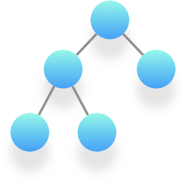

把它叫做「树」是因为它看起来像一棵倒挂的树，也就是说它是根朝上，而叶朝下的。

它具有以下的特点：

+ 每一个非根节点有且只有一个父节点；
+ 每个节点都只有有限个子节点或无子节点；
+ 没有父节点的节点称为根节点；
+ 没有子节点的叫做叶子节点；
+ 除了根节点外，每个子节点可以分为多个不相交的子树；
+ 树里面没有环路。(有环的话，就是图了)

**节点名称**：

+ **父节点**：A是B的父节点
+ **子节点**：B是A的子节点
+ **兄弟节点**：B、C、D 这三个节点的父节点是同一个节点，他们是兄弟节点
+ **叶子节点**：没有子节点的节点叫作叶子节点或者叶节点，比如图中的 G、H、I、J、K、L 都是叶子节点。

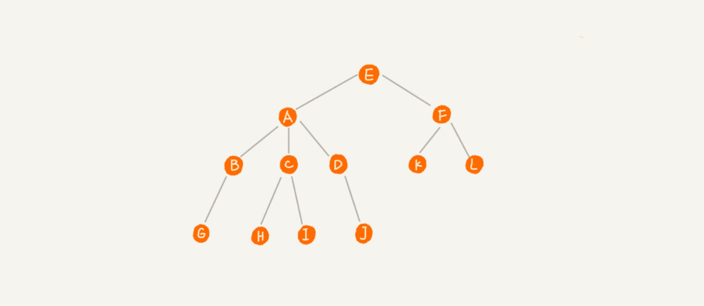

**三个概念**：

+ 节点的**高度（height）**：节点到叶子节点的最长路径（从0开始）
+ 节点的**深度（depth）**：根节点到该节点的路径长度（从0开始）
+ 节点的**层级（level）**：节点的深度 + 1（从1开始）
+ 树的高度：即根节点的高度

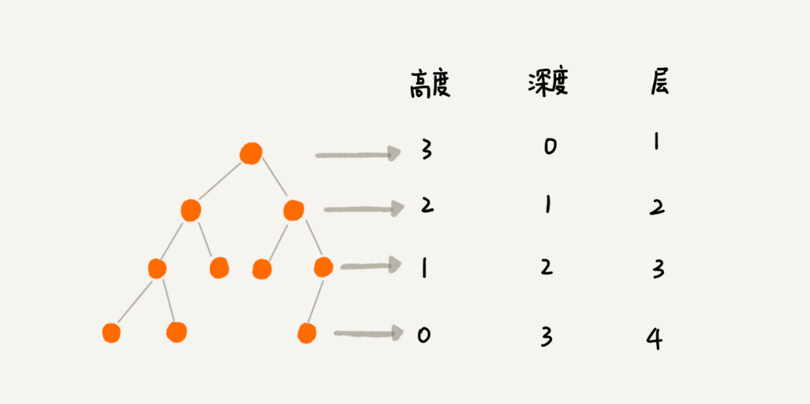

### 1.二叉树

二叉树，顾名思义，每个节点最多有两个“叉”，也就是两个子节点，分别是左子节点和右子节点。

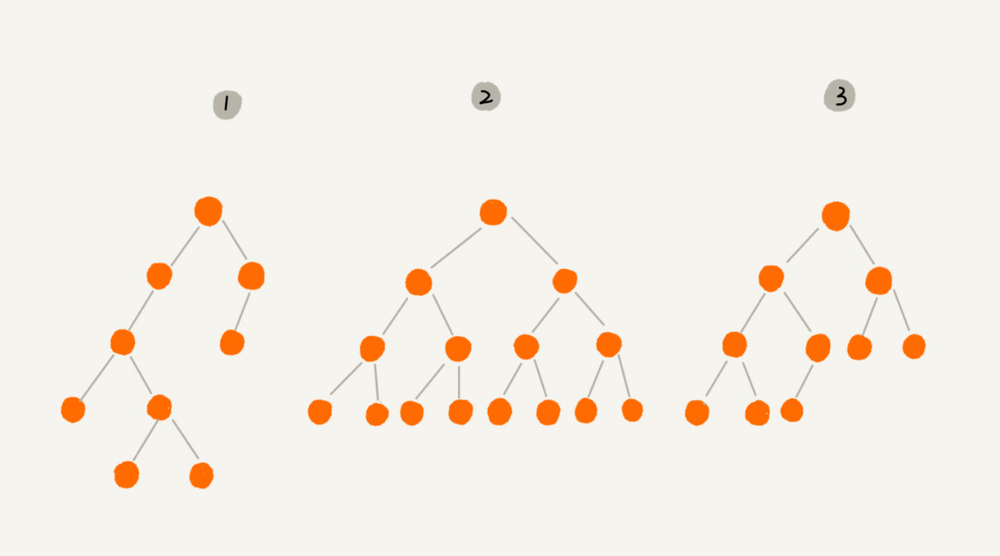

**满二叉树**：叶子节点全都在最底层，除了叶子节点之外，每个节点都有左右两个子节点，这种二叉树就叫作满二叉树。（如：编号2）

**完全二叉树**：叶子节点都在最底下两层，最后一层的叶子节点都**靠左排列**，并且除了最后一层，其他层的节点个数都要达到最大，这种二叉树叫作完全二叉树。（如编号3）

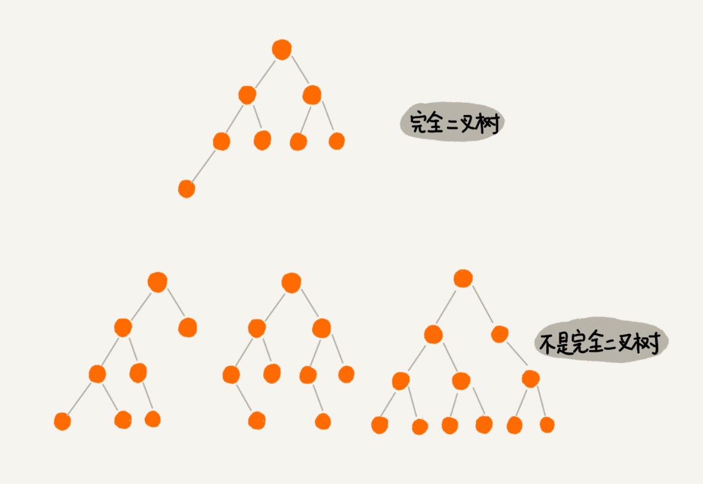


### 2. 二叉树的存储

**如何表示（或者存储）一棵二叉树？**

想要存储一棵二叉树，我们有两种方法，一种是基于指针或者引用的二叉**链式存储法**，一种
是基于数组的**顺序存储法**。

+ **链式存储法**：每个节点有三个字段，其中一个存储数据，另外两个是指向左右子节点的指针。

  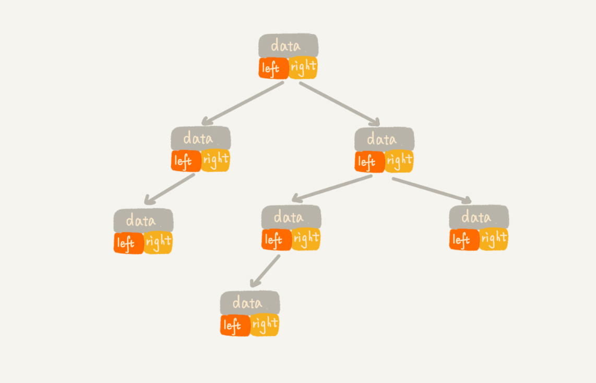

+ **顺序存储法**：把根节点存储在下标 i = 1 的位置，那左子节点存储在下标 2 * i = 2 的位置，右子节点存储在 2 * i + 1 = 3 的位置。以此类推，B 节点的左子节点存储在 2 * i = 2 * 2 = 4 的位置，右子节点存储在 2 * i + 1 = 2 * 2 + 1 = 5 的位置。

  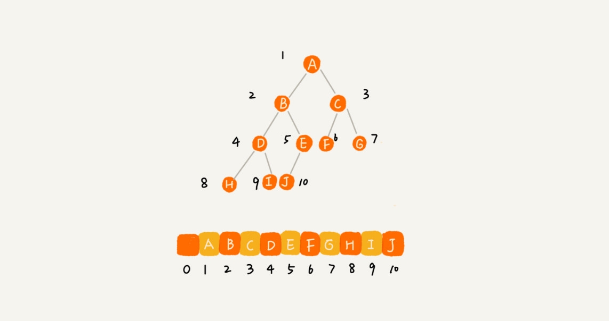

不过，我刚刚举的例子是一棵完全二叉树，所以仅仅“浪费”了一个下标为 0 的存储位置。如果是非完全二叉树，其实会浪费比较多的数组存储空间。你可以看我举的下面这个例子。

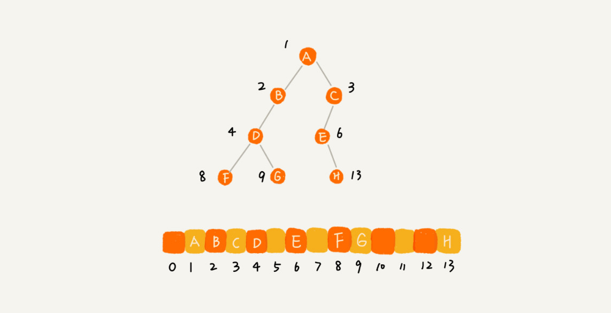


[数组实现二叉树](https://www.hello-algo.com/chapter_tree/array_representation_of_tree/)：
```ts
/* 数组表示下的二叉树类 */
class ArrayBinaryTree {
    #tree: (number | null)[];

    /* 构造方法 */
    constructor(arr: (number | null)[]) {
        this.#tree = arr;
    }

    /* 列表容量 */
    size(): number {
        return this.#tree.length;
    }

    /* 获取索引为 i 节点的值 */
    val(i: number): number | null {
        // 若索引越界，则返回 null ，代表空位
        if (i < 0 || i >= this.size()) return null;
        return this.#tree[i];
    }

    /* 获取索引为 i 节点的左子节点的索引 */
    left(i: number): number {
        return 2 * i + 1;
    }

    /* 获取索引为 i 节点的右子节点的索引 */
    right(i: number): number {
        return 2 * i + 2;
    }

    /* 获取索引为 i 节点的父节点的索引 */
    parent(i: number): number {
        return Math.floor((i - 1) / 2); // 向下整除
    }

    /* 层序遍历 */
    levelOrder(): number[] {
        let res = [];
        // 直接遍历数组
        for (let i = 0; i < this.size(); i++) {
            if (this.val(i) !== null) res.push(this.val(i));
        }
        return res;
    }

    /* 深度优先遍历 */
    #dfs(i: number, order: Order, res: (number | null)[]): void {
        // 若为空位，则返回
        if (this.val(i) === null) return;
        // 前序遍历
        if (order === 'pre') res.push(this.val(i));
        this.#dfs(this.left(i), order, res);
        // 中序遍历
        if (order === 'in') res.push(this.val(i));
        this.#dfs(this.right(i), order, res);
        // 后序遍历
        if (order === 'post') res.push(this.val(i));
    }

    /* 前序遍历 */
    preOrder(): (number | null)[] {
        const res = [];
        this.#dfs(0, 'pre', res);
        return res;
    }

    /* 中序遍历 */
    inOrder(): (number | null)[] {
        const res = [];
        this.#dfs(0, 'in', res);
        return res;
    }

    /* 后序遍历 */
    postOrder(): (number | null)[] {
        const res = [];
        this.#dfs(0, 'post', res);
        return res;
    }
}
```

### 3.二叉树的遍历O(n)

如何将所有节点都遍历打印出来呢？经典的方法有三种，**前序遍历**、**中序遍历**和**后序遍历**。其中，前、中、后序，表示的是节点与它的左右子树节点遍历打印的先后顺序。

+ **前序遍历**：根-左-右。对于树中的任意节点来说，先打印这个节点，然后再打印它的左子树，最后打印它的右子树。
+ **中序遍历**：左-右-根。对于树中的任意节点来说，先打印它的左子树，然后再打印它本身，最后打印它的右子树。
+ **后序遍历**：左-右-根。对于树中的任意节点来说，先打印它的左子树，然后再打印它的右子树，最后打印这个节点本身。


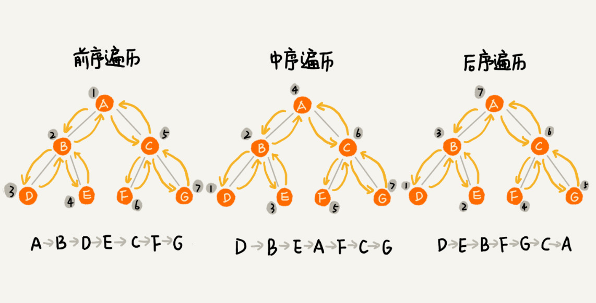

从前、中、后序遍历的顺序图中，可以看出来，每个节点最多会被访问两次，所以遍历操作的时间复杂度，跟节点的个数 n 成正比，也就是说二叉树遍历的时间复杂度是**O(n)**。

**实际上，二叉树的前、中、后序遍历就是一个递归的过程**。比如，前序遍历，其实就是先打印根节点，然后再递归地打印左子树，最后递归地打印右子树。

写递归代码的关键，就是看能不能写出**递推公式**，而写递推公式的关键就是，如果要解决问题 A，就假设子问题 B、C 已经解决，然后再来看如何利用 B、C 来解决 A。所以，我们可以把前、中、后序遍历的递推公式都写出来。

```
前序遍历的递推公式：
preOrder(r) = print r->preOrder(r->left)->preOrder(r->right)

中序遍历的递推公式：
inOrder(r) = inOrder(r->left)->print r->inOrder(r->right)

后序遍历的递推公式：
postOrder(r) = postOrder(r->left)->postOrder(r->right)->print r
```

### 4.[二叉树的前序遍历(preOrder)](https://leetcode-cn.com/leetbook/read/data-structure-binary-tree/xeywh5/)

```js
/**
 * Definition for a binary tree node.
 * function TreeNode(val, left, right) {
 *     this.val = (val===undefined ? 0 : val)
 *     this.left = (left===undefined ? null : left)
 *     this.right = (right===undefined ? null : right)
 * }
 */
/**
 * @param {TreeNode} root
 * @return {number[]}
 */
var preorderTraversal = function(root) {
    let ans = [];
    preOrder(root, ans);
    return ans;
};

var preOrder = function(root, ans) {
    if(!root) return;
    
    // 根 - 左 - 右
    ans.push(root.val);
    preOrder(root.left, ans);
    preOrder(root.right, ans);
}
```


### 5.[二叉树的中遍历(inOrder)](https://leetcode-cn.com/leetbook/read/data-structure-binary-tree/xecaj6/)

```js
/**
 * Definition for a binary tree node.
 * function TreeNode(val, left, right) {
 *     this.val = (val===undefined ? 0 : val)
 *     this.left = (left===undefined ? null : left)
 *     this.right = (right===undefined ? null : right)
 * }
 */
/**
 * @param {TreeNode} root
 * @return {number[]}
 */
var inorderTraversal = function(root) {
    let ans = [];
    inOrder(root, ans);
    return ans;
};

var inOrder = function(root, ans) {
    if(!root) return;
    
    // 左 -  根 - 右
    inOrder(root.left, ans);
    ans.push(root.val);
    inOrder(root.right, ans);
}
```


### 6.[二叉树的后序遍历(postOrder)](https://leetcode-cn.com/leetbook/read/data-structure-binary-tree/xebrb2/)

```js
/**
 * Definition for a binary tree node.
 * function TreeNode(val, left, right) {
 *     this.val = (val===undefined ? 0 : val)
 *     this.left = (left===undefined ? null : left)
 *     this.right = (right===undefined ? null : right)
 * }
 */
/**
 * @param {TreeNode} root
 * @return {number[]}
 */
var postorderTraversal = function(root) {
    let ans = [];
    postOrder(root, ans);
    return ans;
};

var postOrder = function(root, ans) {
    if(!root) return;
    
    // 左 - 右 - 根
    postOrder(root.left);
    postOrder(root.right);
    ans.push(root.val);
}
```


### 7.[二叉树的层序遍历(levelOrder)](https://leetcode-cn.com/leetbook/read/data-structure-binary-tree/xefh1i/)

除了前、中、后序遍历，还可以对二叉树进行层序遍历。层序遍历就是逐层遍历树结构。

[`广度优先搜索`](https://leetcode-cn.com/leetbook/read/queue-stack/k89rs/)是一种广泛运用在树或图这类数据结构中，遍历或搜索的算法。从一个根节点开始，首先访问节点本身。 然后遍历它的相邻节点，其次遍历它的二级邻节点、三级邻节点，以此类推。

```js
/**
 * Definition for a binary tree node.
 * function TreeNode(val) {
 *     this.val = val;
 *     this.left = this.right = null;
 * }
 */
/**
 * @param {TreeNode} root
 * @return {number[][]}
 */
var levelOrder = function(root) {
    let ans = [];
    bfs(root, ans);
    return ans;
};

var bfs = function(root, ans) {
    if(!root) return;
    let queue = [root];
    
    while(queue.length > 0) {
        // 记录当前层的数据
        let data = [];
        // 这里一定要使用固定大小size，不要使用que.size()，因为que.size是不断变化的
        let size = queue.length;
        
        for(let i=0; i < size; i++) {
            let cur = queue.shift();
            data.push(cur.val);
            
            // 左子节点入
            if(cur.left) queue.push(cur.left);
            // 右子节点入
            if(cur.right) queue.push(cur.right);
        }
        
        // 保存当前层数据
        ans.push(data);
    }
}
```

### 8.[二叉搜索树（Binary Search Tree）](https://leetcode-cn.com/tag/binary-search-tree/)

概念：**在二叉树中的任意一个节点，其左子树中的每个节点的值，都要小于这个节点的值，而右子树节点的值都大于这个节点的值** --- **中序遍历**的值是一个升序的数据序列

+ 若任意节点的左子树不空，则左子树上所有节点的值均小于它的根节点的值；
+ 若任意节点的右子树不空，则右子树上所有节点的值均大于它的根节点的值；
+ 任意节点的左、右子树也分别为二叉查找树；
+ 没有键值相等的节点。

二叉查找树相比于其他数据结构的优势在于查找、插入的时间复杂度较低。为 `O(logn)`

## 八、[堆Heap](https://www.hello-algo.com/chapter_heap/)

### 1.堆的定义
**堆** 是一种特别的二叉树，满足以下条件的二叉树，可以称之为 **堆**：
+ 完全二叉树；
+ 每一个节点的值都必须 **大于等于或者小于等于** 其孩子节点的值。

堆 具有以下的特点：
+ 可以在 `O(logN)` 的时间复杂度内向 堆 中插入元素；
+ 可以在 `O(logN)` 的时间复杂度内向 堆 中删除元素；
+ 可以在 `O(1)` 的时间复杂度内获取 堆 中的最大值或最小值。 

### 2.堆的分类
堆 有两种类型：**最大堆** 和 **最小堆**。

+ 最大堆：堆中每一个节点的值 **都大于等于** 其孩子节点的值。所以最大堆的特性是 **堆顶元素（根节点）是堆中的最大值**。

+ 最小堆：堆中每一个节点的值 **都小于等于** 其孩子节点的值。所以最小堆的特性是 **堆顶元素（根节点）是堆中的最小值**。


### 3.堆的操作

堆通常用于实现**优先队列**，大顶堆相当于元素按从大到小的顺序出队的优先队列。
```
push()  元素入堆  𝑂(log 𝑛)
pop()   堆顶元素出堆 𝑂(log 𝑛)
peek()  访问堆顶元素（对于大 / 小顶堆分别为最大 / 小值） 𝑂(1)
size()  获取堆的元素数量 𝑂(1)
isEmpty() 判断堆是否为空 𝑂(1)
```
完全二叉树非常适合用数组来表示。由于堆正是一种完全二叉树，因此我们将采用**数组来存储堆** 。

给定索引` 𝑖 `，其左子节点的索引为 `2𝑖 + 1` ，右子节点的索引为 `2𝑖 + 2` ，父节点的索引为`(𝑖 − 1)/2（向下整除）`。当索引越界时，表示空节点或节点不存在。


下面实现大顶堆：
```ts
/* 最大堆类 */
class MaxHeap {
  private maxHeap: number[];
  /* 构造方法，建立空堆或根据输入列表建堆 */
  constructor(nums?: number[]) {
    // 将列表元素原封不动添加进堆
    this.maxHeap = nums === undefined ? [] : [...nums];
    // 堆化除叶节点以外的其他所有节点
    for (let i = this.parent(this.size() - 1); i >= 0; i--) {
      this.siftDown(i);
    }
  }

  /* 获取左子节点的索引 */
  private left(i: number): number {
    return 2 * i + 1;
  }

  /* 获取右子节点的索引 */
  private right(i: number): number {
    return 2 * i + 2;
  }

  /* 获取父节点的索引 */
  private parent(i: number): number {
    return Math.floor((i - 1) / 2); // 向下整除
  }

  /* 交换元素 */
  private swap(i: number, j: number): void {
    const tmp = this.maxHeap[i];
    this.maxHeap[i] = this.maxHeap[j];
    this.maxHeap[j] = tmp;
  }

  /* 获取堆大小 */
  public size(): number {
    return this.maxHeap.length;
  }

  /* 判断堆是否为空 */
  public isEmpty(): boolean {
    return this.size() === 0;
  }

  /* 访问堆顶元素 */
  public peek(): number {
    return this.maxHeap[0];
  }

  /* 元素入堆 */
  public push(val: number): void {
    // 添加节点
    this.maxHeap.push(val);
    // 从底至顶堆化
    this.siftUp(this.size() - 1);
  }

  /* 从节点 i 开始，从底至顶堆化 */
  private siftUp(i: number): void {
    while (true) {
      // 获取节点 i 的父节点
      const p = this.parent(i);
      // 当“越过根节点”或“节点无须修复”时，结束堆化
      if (p < 0 || this.maxHeap[i] <= this.maxHeap[p]) break;
      // 交换两节点
      this.swap(i, p);
      // 循环向上堆化
      i = p;
    }
  }

  /* 元素出堆 */
  public pop(): number {
    // 判空处理
    if (this.isEmpty()) throw new RangeError('Heap is empty.');
    // 交换根节点与最右叶节点（交换首元素与尾元素）
    this.swap(0, this.size() - 1);
    // 删除节点
    const val = this.maxHeap.pop();
    // 从顶至底堆化
    this.siftDown(0);
    // 返回堆顶元素
    return val;
  }

  /* 从节点 i 开始，从顶至底堆化 */
  private siftDown(i: number): void {
    while (true) {
      // 判断节点 i, l, r 中值最大的节点，记为 ma
      const l = this.left(i),
              r = this.right(i);
      let ma = i;
      if (l < this.size() && this.maxHeap[l] > this.maxHeap[ma]) ma = l;
      if (r < this.size() && this.maxHeap[r] > this.maxHeap[ma]) ma = r;
      // 若节点 i 最大或索引 l, r 越界，则无须继续堆化，跳出
      if (ma === i) break;
      // 交换两节点
      this.swap(i, ma);
      // 循环向下堆化
      i = ma;
    }
  }

  /* 打印堆（二叉树） */
  public print(): void {
    printHeap(this.maxHeap);
  }

  /* 取出堆中元素 */
  public getMaxHeap(): number[] {
    return this.maxHeap;
  }
}

```