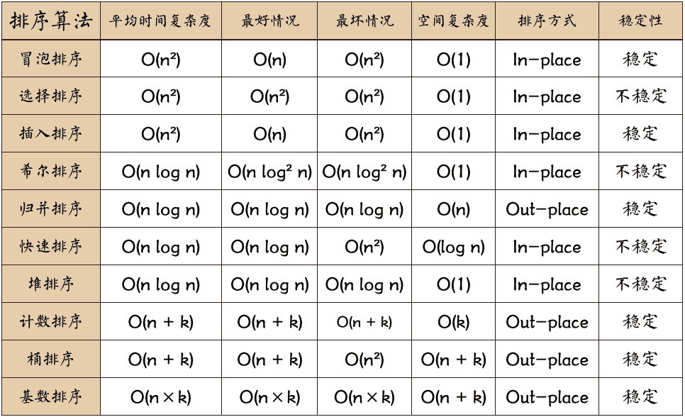

## 经典排序算法复杂度




## 冒泡排序(稳定)(n^2)

### 1.常规冒泡排序

相邻比较，两两交换
```js
function bubbleSort1(nums) {
    const n = nums.length
  // 从前往后遍历
  for (let i = 0; i < n; i++) {
    for (let j = 0; j < n - 1 - i; j++) {
      if (data[j] > data[j + 1]) {
        [data[j], data[j + 1]] = [data[j + 1], data[j]];
      }
    }
  }
  return data;
}


function bubbleSort2(nums) {
  let n = nums.length
  // 从后往前遍历
  for (let i = n - 1; i > 0; i--) {
    for (let j = 0; j < i; j++) {
      if (nums[j] > nums[j + 1]) {
        [nums[j], nums[j + 1]] = [nums[j + 1], nums[j]]
      }
    }
  }

  return nums
}
```

### 2.改进冒泡排序-标志位

```js
function bubbleSort(data) {
    if (data.length < 2) return data;
    let len = data.length;
    let flag = true;
    for (let i = 0; i < len; i++) {
        flag = true
        for (let j = 0; j < len - i - 1; j++) {
            if (data[j] > data[j + 1]) {
                [data[j], data[j + 1]] = [data[j + 1], data[j]];
                // 交换了
                flag = false;
            }
        }
        // 如果没有发生交换，则退出循环
        if (flag) break;
    }
    return data
}
```

### 2.改进冒泡排序-双向

```js
function bubbleSort(data) {
    if (data.length < 2) return data;
    let left = 0;
    let right = data.length - 1;

    while (left < right) {
        let flag = true

        for (let i = left; i < right; i++) {
            if (data[i] > data[i + 1]) {
                [data[i], data[i + 1]] = [data[i + 1], data[i]];
                flag = false
            }
        }
        // 最右边已经是最大的了
        right--;
        for (let i = right; i > left; i--) {
            if (data[i] < data[i - 1]) {
                [data[i], data[i - 1]] = [data[i - 1], data[i]];
                flag = false
            }
        }
        // 最左边已经时最小的了
        left++;

        if (flag) break;
    }
    return data;
}
```

## 选择排序(不稳定)(n^2)

+ 基础版

每轮记录最小的下标，然后交换到首位

```js
function selectionSort1(data) {
    let n = data.length
    let minIndex;
    for (let i = 0; i < n - 1; i++) {
        // 假设当前的最小数的下标为i, 记录一下
        minIndex = i;
        // 比较之后的数，找到更小的数的下表然后替换minIndex
        for (let j = i + 1; j < n; j++) {
            if (data[j] < data[minIndex]) {
                minIndex = j;
            }
        }
        // 交换位置
        [data[i], data[minIndex]] = [data[minIndex], data[i]];
    }
    return data;
}
```

为了便于后续优化的理解，使用while循环实现：

```js
function selectionSort2(nums) {
    let n = nums.length

    let left = 0
    let right = n - 1

    while (left < right) {
        let minIndex = left

        // 处理最小值
        for (let i = left; i <= right; i++) {
            if (nums[i] < nums[minIndex]) minIndex = i
        }
        if (minIndex !== left) {
            [nums[minIndex], nums[left]] = [nums[left], nums[minIndex]]
        }

        // 左向右递进
        left++
    }

    return nums
}
```

+ 优化版
  每轮记录最小数的下标和最大数的下标，然后将最小数交换到首位，最大数交换到尾部

```js
function optimizedSelectionSort1(nums) {
    let n = nums.length

    let left = 0
    let right = n - 1

    while (left < right) {
        let minIndex = left
        let maxIndex = right

        // 先处理最小值
        for (let i = left; i <= right; i++) {
            if (nums[i] < nums[minIndex]) minIndex = i
        }
        if (minIndex !== left) {
            [nums[minIndex], nums[left]] = [nums[left], nums[minIndex]]
        }

        // 再处理最大值
        for (let i = left; i <= right; i++) {
            if (nums[i] > nums[maxIndex]) maxIndex = i
        }
        if (maxIndex !== right) {
            [nums[maxIndex], nums[right]] = [nums[right], nums[maxIndex]]
        }

        // 左右向中间收敛
        left++
        right--
    }

    return nums
}
```

进一步优化，将最大最小值的判断合并为一个：

```js
function optimizedSelectionSort2(nums) {
    let n = nums.length

    let left = 0
    let right = n - 1

    while (left < right) {
        let minIndex = left
        let maxIndex = right

        for (let i = left; i <= right; i++) {
            if (nums[i] < nums[minIndex]) minIndex = i
            if (nums[i] > nums[maxIndex]) maxIndex = i
        }

        if (minIndex !== left) {
            [nums[minIndex], nums[left]] = [nums[left], nums[minIndex]]
        }

        // 如果最大的在左边，由于上一步已经把左边的交换了，所以需要修正
        if (maxIndex === left) {
            maxIndex = minIndex;
        }

        if (maxIndex !== right) {
            [nums[maxIndex], nums[right]] = [nums[right], nums[maxIndex]]
        }

        left++
        right--
    }

    return nums
}
```

## 插入排序(稳定)(n^2)

```js
function insertionSort(nums) {
    let n = nums.length

    for (let i = 1; i < n; i++) {
        for (let j = i; j > 0 && nums[j] < nums[j - 1]; j--) {
          [nums[j], nums[j - 1]] = [nums[j - 1], nums[j]]
        }
    }

    return nums
}
```

## 希尔排序(不稳定)(Nlog2N))
希尔排序，也称递减增量排序算法，是插入排序的一种更高效的改进版本。但希尔排序是非稳定排序算法。

```js
function shellSort(nums) {
  let n = nums.length
  
  // 选择 n/2作为gap
  for(let gap = n >> 1; gap > 0; gap = gap >> 1) {
    for(let i=gap; i < n; i++) {
      for(let j=i; j>gap-1 && nums[j] < nums[j-gap]; j -= gap) {
        [nums[j], nums[j-gap]] = [nums[j-gap], nums[j]]
      }
    }
  }

  return nums
}
```

使用Knuth序列：
```js
function shellSort(nums) {
  let n = nums.length

  // 计算gap
  let h = 1;
  while (h < n / 3) {
    h = h * 3 + 1;
  }
  
  for(let gap = h; gap > 0; gap = Math.floor((gap - 1) / 3)) {
    for(let i=gap; i < n; i++) {
      for(let j=i; j>gap-1 && nums[j] < nums[j-gap]; j -= gap) {
        [nums[j], nums[j-gap]] = [nums[j-gap], nums[j]]
      }
    }
  }

  return nums
}
```

## 快速排序(不稳定)(nlogn)

+ 使用额外数组
```js
function quickSort(data) {
    if (data.length < 2) return data;
    // 提出最后一个作为基准
    let pivot = data.pop();

    // 将data分为基准两侧的
    let left = [];
    let right = [];
    for (let i = 0; i < data.length; i++) {
        if (data[i] < pivot) {
            left.push(data[i]);
        } else {
            right.push(data[i])
        }
    }

    // 递归调用 [基准左侧， 基准， 基准右侧]
    return [...quickSort(left), pivot, ...quickSort(right)];
}
```

+ 使用指针
```js
function quickSort(nums) {

  // 结果：左子数组任意元素 <= 基准元素 <= 右子数组任意元素
  function _partition(_nums, left, right) {
    // 以nums[left]作为基准
    let i = left
    let j = right

    while (i < j) {
      // 从右往左找到首个小于基准的数
      while (i < j && _nums[j] >= _nums[left]) {
        j--
      }
      // 从左往右找到首个大于基准的数
      while (i < j && _nums[i] <= _nums[left]) {
        i++
      }

      // 交换这两个元素
      [_nums[i], _nums[j]] = [_nums[j], _nums[i]]
    }

    // 将基准数交换至两子数组的分界线
    [_nums[i], _nums[left]] = [_nums[left], _nums[i]]

    return i
  }

  function _sort(_nums, left, right) {
    if (left >= right) return

    const pivotIndex = _partition(_nums, left, right)
    
    _sort(_nums, left, pivotIndex - 1)
    _sort(_nums, pivotIndex + 1, right)
  }

  _sort(nums, 0, nums.length - 1)

  return nums
}

```

## 归并排序(稳定)(nlogn)

+ 直接切分数组
```js
function mergeSort(arr) {
    if (arr.length < 2) return arr;

    let mid = arr.length >> 1;
    let left = arr.slice(0, mid);
    let right = arr.slice(mid);

    return merge(mergeSort(left), mergeSort(right));

    function merge(left, right) {
        let res = [];
        let i = 0, j = 0;

        while (i < left.length && j < right.length) {
            if (left[i] <= right[j]) {
                res.push(left[i]);
                i++;
            } else {
                res.push(right[j]);
                j++;
            }
        }

        return [...res, ...left.slice(i), ...right.slice(j)]
    }
}
```

+ 指针切分数组
```js
function mergeSort(nums) {

  /*合并左子数组和右子数组*/
  // 数组1: [left, mid] 数组2: [mid+1, right]
  function _merge(_nums, left, mid, right) {
    //左子数组区间为[left, mid],右子数组区间为[mid+1, right]
    // 创建一个临时数组tmp，用于存放合并后的结果
    const tmp = new Array(right - left + 1);
    //初始化左子数组和右子数组的起始索引
    let i = left, j = mid + 1, k = 0;
    // 当左右子数组都还有元素时，进行比较并将较小的元素复制到临时数组中
    while (i <= mid && j <= right) {
      if (_nums[i] <= _nums[j]) {
        tmp[k++] = _nums[i++];
      } else {
        tmp[k++] = _nums[j++];
      }
    }
    //将左子数组和右子数组的剩余元素复制到临时数组中
    while (i <= mid) {
      tmp[k++] = _nums[i++];
    }
    while (j <= right) {
      tmp[k++] = _nums[j++];
    }
    //将临时数组tmp中的元素复制回原数组nums的对应区间
    for (k = 0; k < tmp.length; k++) {
      _nums[left + k] = tmp[k];
    }
  }

  /*归并排序*/
  // 闭区间: [left, right]
  function _mergeSort(_nums, left, right) {
    //终止条件
    if (left >= right) return;
    //当子数组长度为1时终止递归
    // 划分阶段
    // let mid = Math.floor((left + right) / 2);//计算中点
    let mid = ~~((left + right) / 2);//计算中点

    _mergeSort(_nums, left, mid);//递归左子数组
    _mergeSort(_nums, mid + 1, right);//递归右子数组
    // 合并阶段
    _merge(_nums, left, mid, right);
  }

  _mergeSort(nums, 0, nums.length - 1)
  return nums
}
```

> https://www.cnblogs.com/jztan/p/12273671.html
>
> https://www.jianshu.com/p/a28db3d3cc18

## [堆排序(不稳定)(nlogn)](https://www.hello-algo.com/chapter_sorting/heap_sort/#1171)

```ts
function heapSort(nums: number[]): number[] {
  let n = nums.length
  

  /**
   * 由于叶节点没有子节点，因此它们天然就是合法的子堆，无须堆化
   * 将除叶子节点以外的其他节点堆化 索引 >= Math.floor(n / 2) 的为叶子结点
   * 堆顶[1,2,3,4,5,6,7,8,9,10,11]堆底 
   * 索引 >= 5 的为叶子结点
   *            1
   *       2         3
   *    4    5     6   7
   *  8 9  10 11
   * 
   * */
  // 从底部节点开始至顶部节点堆化
  for(let i=Math.floor(n / 2) - 1; i>=0; i--) {
    siftDown(nums, n, i)
  }
  
  for(let i=n-1; i>=0; i--) {
    swap(nums, 0, i)
    siftDown(nums, i, 0)
  }
  
  // 交换i,j处的元素
  function swap(nums, i, j) {
    [nums[i], nums[j]] = [nums[j], nums[i]]
  }
  
  // 从顶至底堆化
  function siftDown(nums, n, i) {
    while(true) {
      let root = i // 根节点 交换之后：left <= max >= right
      let left = i * 2 + 1 // 左叶子结点
      let right = i * 2 + 2 // 右叶子节点
      
      if(left < n && nums[left] > nums[root]) {
        root = left
      }

      if(right < n && nums[right] > nums[root]) {
        root = right
      }
      
      if(root === i) break
      
      swap(nums, i, root)
      
      i = root
    }
  }
  return nums
}
```