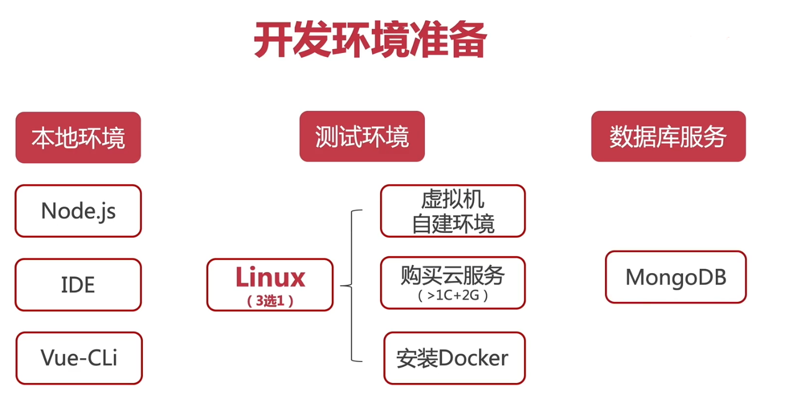

## 1.开发环境准备



## 2.本地环境

+ NodeJS + NPM / Yarn(推荐) + [NVM](https://github.com/nvm-sh/nvm)（NodeJS版本管理）

  + linux: nvm

    ```bash
    curl -o- https://raw.githubusercontent.com/nvm-sh/nvm/v0.37.1/install.sh | bash
    ```

    

  + windows: [nvm-windows](https://github.com/coreybutler/nvm-windows/releases)

    

+ IDE（webstrom、VSCODE）

+ [VUE-CLI](https://github.com/vuejs/vue-cli/tree/dev/docs)

  ```bash
  # 安装命令yarn
  yarn global add @vue/cli
  
  # 快速原型开发
  yarn global add @vue/cli-service-global
  
  # 安装命令npm
  npm install -g @vue/cli
  npm install -g @vue/cli-service-global
  ```

+ [win10 安装linux](https://docs.microsoft.com/en-us/windows/wsl/install-win10#install-windows-subsystem-for-linux)----[WSL](https://en.wikipedia.org/wiki/Windows_Subsystem_for_Linux)

  > https://peteoshea.co.uk/wsl-on-windows-10/
  >
  > 
  >
  > https://blog.jayway.com/2017/04/19/running-docker-on-bash-on-windows/

  **1.以管理员身份运行powershell ，输入下面的代码，等待提示完成后，重启系统：**

  ```shell
  Enable-WindowsOptionalFeature -Online -FeatureName Microsoft-Windows-Subsystem-Linux
  ```

  **2.在微软应用商城搜索LINUX或WSL安装。**

  
  
  > 推荐：[window10下子系统ubuntu安装Docker](https://lupengfei.blog.csdn.net/article/details/94637398?utm_medium=distribute.pc_relevant.none-task-blog-OPENSEARCH-5.not_use_machine_learn_pai&depth_1-utm_source=distribute.pc_relevant.none-task-blog-OPENSEARCH-5.not_use_machine_learn_pai)
  >
  > 
  >
  > [Win10 WSL2 安装Docker](https://www.jianshu.com/p/a20c2d58eaac)
  
```bash
# win10安装linux子系统

wsl -o -l # 查看子系统

  NAME            FRIENDLY NAME
* Ubuntu          Ubuntu
Debian          Debian GNU/Linux
kali-linux      Kali Linux Rolling
openSUSE-42     openSUSE Leap 42
SLES-12         SUSE Linux Enterprise Server v12
Ubuntu-16.04    Ubuntu 16.04 LTS
Ubuntu-18.04    Ubuntu 18.04 LTS
Ubuntu-20.04    Ubuntu 20.04 LTS


# 开始安装
wsl --install Ubuntu-20.04 
```

## 3.linux环境

+ 虚拟机自建环境（Parallels / Vmware / Hyperv）

+ 购买云服务（> 1核 + 2G）

+ [安装Docker](https://github.com/docker/docker-install)

  + 在linux中安装

    > [Ubuntu 16.04安装docker详细步骤](https://blog.csdn.net/jinking01/article/details/82490688)

  ```bash
  
  curl -fsSL https://get.docker.com -o get-docker.sh
  
  sh get-docker.sh
  ```

  + [在windows中安装](https://hub.docker.com/editions/community/docker-ce-desktop-windows/)

    > 推荐：[window10下子系统ubuntu安装Docker_码霸霸的博客-CSDN博客](https://lupengfei.blog.csdn.net/article/details/94637398?utm_medium=distribute.pc_relevant.none-task-blog-OPENSEARCH-5.not_use_machine_learn_pai&depth_1-utm_source=distribute.pc_relevant.none-task-blog-OPENSEARCH-5.not_use_machine_learn_pai)

  + [在Mac中安装](https://docs.docker.com/docker-for-mac/install/)

+ ubuntu卸载docker

  ```bash
  # 1. 删除某软件,及其安装时自动安装的所有包
  sudo apt-get autoremove docker docker-ce docker-engine  docker.io  containerd runc
  
  # 2. 删除docker其他没有没有卸载
  dpkg -l | grep docker
  # 删除无用的相关的配置文件
  dpkg -l |grep ^rc|awk '{print $2}' |sudo xargs dpkg -P 
  
  # 3.卸载没有删除的docker相关插件(结合自己电脑的实际情况)
  sudo apt-get autoremove docker-ce-*
  
  # 4.删除docker的相关配置&目录
  sudo rm -rf /etc/systemd/system/docker.service.d
  sudo rm -rf /var/lib/docker
  
  # 5.确定docker卸载完毕
  docker --version
  ```

  

+ [使用docker-compose](https://docs.docker.com/compose/)

  ```bash
  # 安装
  sudo curl -L "https://github.com/docker/compose/releases/download/1.27.4/docker-compose-$(uname -s)-$(uname -m)" -o /usr/local/bin/docker-compose
  
  # 添加执行权限
  sudo chmod +x /usr/local/bin/docker-compose
  
  # 查看版本
  docker-compose -v
  ```

  

+ 安装mongodb

  打开[docker-hub](https://hub.docker.com/),查找packge，比如[搜索mongo](https://hub.docker.com/_/mongo),可以看到对应的镜像包，（zkkysqs登录docker-hub）
  
  ```bash
  # 下载最新版本
  docker pull mongo
  
  # 下载指定版本4
docker pull mongo:4
  ```

  >  mongodb服务可视化工具[Robot 3T](https://robomongo.org/)
  
  

## 4.docker简单使用

+ 使用cn加速镜像：

在`/etc/docker/daemon.json`中新增：

```json
{
    "registery-mirrors": ["https://registery.docker-cn.com"]
}
```

保存之后重启docker服务即可.`service docker restart`重启


+ 查看已下载的镜像：

  ```bash
  docker images
  ```

+ 运行mongo镜像：

  ```bash
  # -d 后台运行	--name取个名字 -p 指定端口 10050 映射mongo对应的端口27017到10050
  docker run -d --name some-mongo -p 10050:27017 mongo:4
  ```

+ 查看运行的docker服务：

  ```bash
  docker ps
  ```

+ 端口开放访问：
  + 简单粗暴：关闭防火墙

  ```bash
  # ubuntu
  service ufw stop
  
  # centos
  service firewalld stop
  ```

  + 放行10050端口：

  ```bash
  firewall-cmd --zone-public --add-port=10050/tcp --permanent
  ```

+ 启动docker

  ```bash
  # 查看docker服务是否启动：
  systemctl status docker
  
  # 若未启动，则启动docker服务：
  sudo systemctl start docker
  
  # 经典的hello world：
  sudo docker run hello-world
  ```

  > [修复 "System has not been booted with systemd as init system "的错误。](https://www.cnblogs.com/a5idc/p/13752839.html)

  > ​	[Docker 入门指南：如何在 Ubuntu 上安装和使用 Docker](https://kalasearch.cn/community/tutorials/how-to-install-and-use-docker-on-ubuntu/)

  

## 5.ubuntu安装nginx

> [tomcat 与 nginx，apache的区别是什么？](https://www.zhihu.com/question/32212996)

+ 1、Nginx的软件包在Ubuntu默认软件仓库中可用。 安装非常简单，只需键入以下命令：

  ```bash
  # 更新
  sudo apt update
  
  # 安装nginx
  sudo apt install nginx
  ```

+ 2、安装完成后，检查Nginx版本：

  ```bash
  nginx –v
  ```

+ 3、启动nginx服务：

  ```bash 
  # 开启
  sudo service nginx start
  # 停止
  sudo service nginx stop
  # 重启
  sudo service nginx restart
  ```

+ 4、访问 localhost:80
  安装默认的目录在 `/etc/nginx`

+ 5.查看配置文件

  ```bash 
  
  sudo nginx -t
   
  # nginx: the configuration file /etc/nginx/nginx.conf syntax is ok
  # nginx: configuration file /etc/nginx/nginx.conf test is successful
  ```

  
