# 一、shell介绍

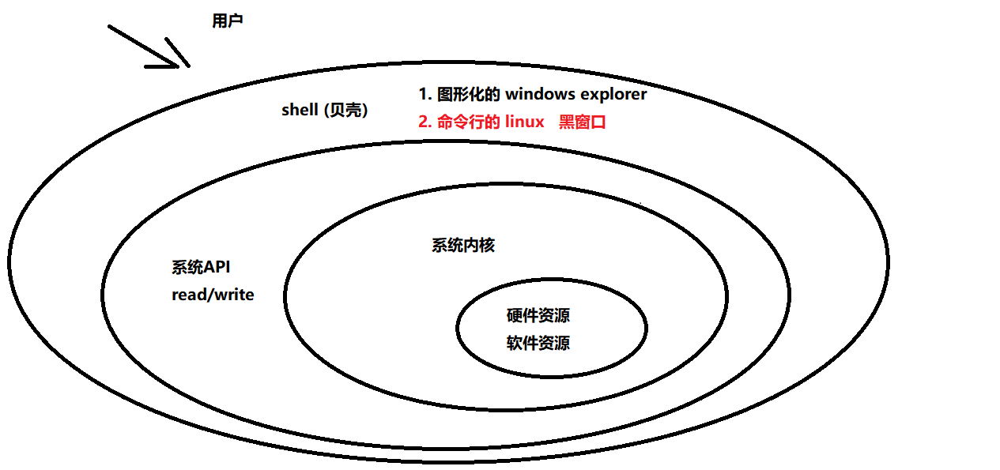

1. shell是用户与操作系统交互工具，桥梁
2. 它本身是一个应用程序，可以使用echo  $$来查看它的pid
3. shell贝壳的意思，像一个贝壳一样将操作系统包裹起来，供用户交互使用

在开发过程中，需求：统计一个日志中错误日志的条数：
1. c，python，java，开发效率很低，需要2小时
2. shell，几个命令就可以搞定了

运维上的需求，打包，编译，预处理，批量的、重复性的操作，我们可以快速的使用shell脚本进行完成。

shell是开发人员必须掌握的技能！

主流的shell工具：

1. `sh`，直接执行sh命令，可以进入到sh的shell终端，也可以与操作系统进行交互
2. `csh`
3. `bash`: 最重要的，使用两种方式查看当前用户终端的默认shell：
   1. `echo $SHELL`
   2. `vi /etc/passwd`
4. 小技巧：当我们紧急处理一个任务的时候，可以使用`ctrl+z`将当前的vi放到后台，再使用fg进行唤醒（避免反复退出vim）

5. `whoami`， 查看当前登陆用户
6.` echo $$`，可以查看当前`pid`
7. 同时编辑两个vim文件的技巧
   1. 打开`1.txt`
   2. 输入: `tabe 2.txt`
   3. 使用gt在两个文件中快速切换

# 二、内建命令-外部命令

命令：

`cd`,  ==> 内建命令（buildin）

`chmod` ==》 外部命令

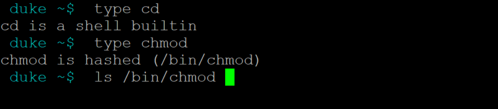

**如何判断一个命令的类型：**
1. `type` 加上命令
2. `which` 加上命令， 如果没有找到这个命令的位置，则说明他是内建命令

区别：

1. 内建命令是不需要启动子进程的，而是在当前的进程下去调用一个普通的函数，产生的效果直接作用在当前终端（cd , source, .  )， 回想一下`source ~/.bashrc`

   > 小技巧：将常用目录设置成变量，定义在.bashrc中，cd $c39，可以快速切换

2. 外部命令：bash会先fork一个子进程，内部调用exec，执行程序，执行完毕后退会到bash中

# 三、执行脚本方法
shell

shell命令：`cd 、ls`

shell脚本（shell script）：把shell命令按照一定的逻辑进行编程，完成既定步骤比较多的任务。

```sh
#!/bin/bash     #注意，这不是注释

echo "hello world"

cd ..
ls
touch c39.txt
```

1. 一个shell脚本必须指定解析器，明确下面的命令使用哪个解析器：bash, sh
2. `#!`  ==> 开头是固定的
3. shell使用#号作为注释
4. shell没有主函数，也不需要编译，它是解释性语言，而不是编译性语言（c，c++）
5. shell脚本的执行顺序就是从上到下
6. 如果一个命令在解析器之上，是不会被解析的，但是不会报错
7. 常见执行方式：
   1. `chmod +x hello.sh`  ,   使用 `./hello.sh`执行
   2. 明确指定解析器，`/bin/bash`  `hello.sh` ， 也可以，而且不需要`hello.sh`有执行权限
   3. （`cd ..;ls`），使用括号的方式，也可以启动子进程执行，而不是影响当前进程

8. 执行脚本的逻辑：
   1. bash在执行shell脚本时，启动一个子进程，进行`exec`处理，退出
   
# 四、基本语法

### 1. 变量相关：

```sh
#!/bin/bash

#定义变量不需要指定类型,int float

#定义变量时，等号两边不要有空格，否则会报错
name="Lily"

#使用$进行遍历的引用
echo $name
echo name


#如果在变量解析的时候，涉及到边界划分问题，可以使用${}方式，来进行划分
#helloa
a="hello"
aa="world"
echo $a
echo ${a}a
```

结果：
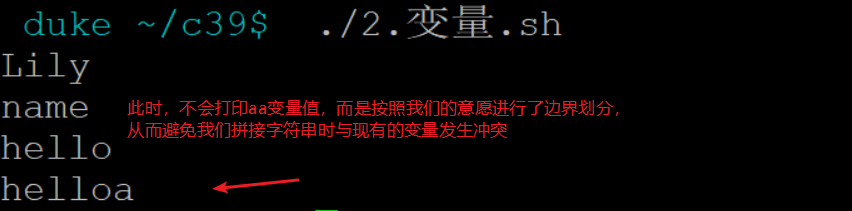

### 2.单引号-双引号-反引号

1. 单引号：所见即所得，不会解析里面的变量
2. 双引号：所见非所得，里面可以包含变量，会先解析变量，在赋值
3. 反引号：会事先对命令进行解析，得到的结构再进行赋值

案例：

```sh
#!/bin/bash

name=lily

person="$name is a good girl"
person1='$name is a good girl'

echo "person: $person , person1: $person1"

touch a.txt b.txt
v1="a.txt b.txt"

ls $v1
echo "-----------"
ls "$v1"   #<<=== 经验老道都这样写！


d0=date  
d1=`date`  #《== tab键上面的
d2=$(date)  #与``效果相同

echo "d0: $d0"
echo "d1: $d1"
echo "d2: $d2"

curPath=$(cd `dirname $0`;pwd)
#curPath=$(cd dirname $0;pwd) #此时会报错，too many arguments
echo "curPath: $curPath"

```

结果：

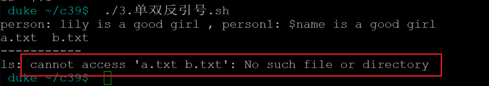

此时，程序将 "`a.txt\\ b.txt`"当成一个文件去查找了，所以报错

注意点：所有使用变量的地方，尽量使用双引号将变量包裹起来   `"$var"`， 而不用直接使用 `$var`，尤其是在`if`，`for`里面，如果变量不加双引号，会经常出bug

### 3. 变量分类

shell内变量：

1. 分为全局变量，局部变量local修饰的，不能在进程间传递

环境变量，最出名的环境变量：`PATH`

1. 加上了export之后，就会变成环境变量
2. 环境变量可以在当前进程已及子进程之间都可以使用
3. 子进程的环境变量无法传递给父进程, 只能单向传递

```sh
#!/bin/bash


export school=浙江大学

echo "address" $address  #事先在bash终端中设置了  export addrss="Beijing"
echo 111111 : $name

#全局的内变量
name=Lily
echo 222222 : $name


function testfunc()
{
    #局部内变量，只能在自己的作用域中使用
    local age=20
    echo 333333 : $age
}

testfunc

echo 444444 : age :$age , name : $name

/bin/bash 4.1.子进程.sh

```


4.1.子进程.sh:

```sh
#!/bin/bash

echo "school :" $school
echo "name :" $name

```

结果：

```sh
address 黑龙江
111111 :
222222 : Lily
333333 : 20
444444 : age : , name : Lily
school : 浙江大学
name :
```

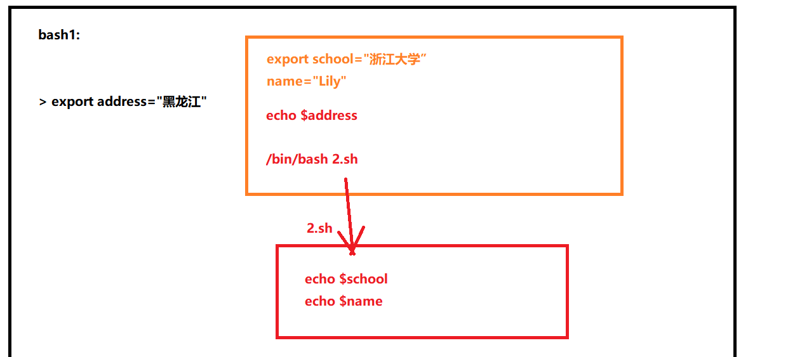

可以使用env来查看环境变量（export修饰的）

可以使用set命令来查看所有变量（包括环境变量和普通变量）

可以使用unset命令来删除变量的值（置空）

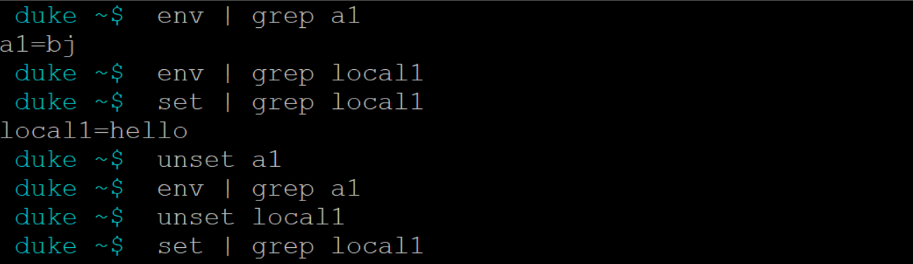

### 4.通配符

1. `\*` ==> 最常用的，代表0或多个任意字符
2. `？`==> 匹配任意1个字符
3. `[]` ==》方框中的任意数字出现1次

```sh
touch {1..9}.txt
touch {a..h}.sh
mv 1.txt 111.txt
mv c.sh cccc.sh

ls *.txt
ls ?.txt
ls [123ght].txt
```

### 5.  转义字符

1. 特殊字符变成普通字符

   `echo \\$SHELL`

2. 把普通字符变成特殊字符

   ` \r\n` ==> 换行回车

   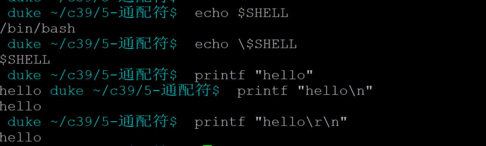

4. 一行文字过多时，可以使用\进行换行

   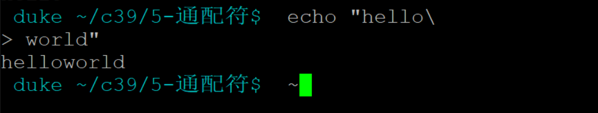


# 五、脚本语法

### 1. test

- 用于检测文件类型，数值（字符串，数字）
- `test -e file1`， 此时测试文件是否存在，使用`echo $?` 来打印执行结果，0：代表真，非0,：代表假
- 使用[ `-e file1` ] 等同于test
- 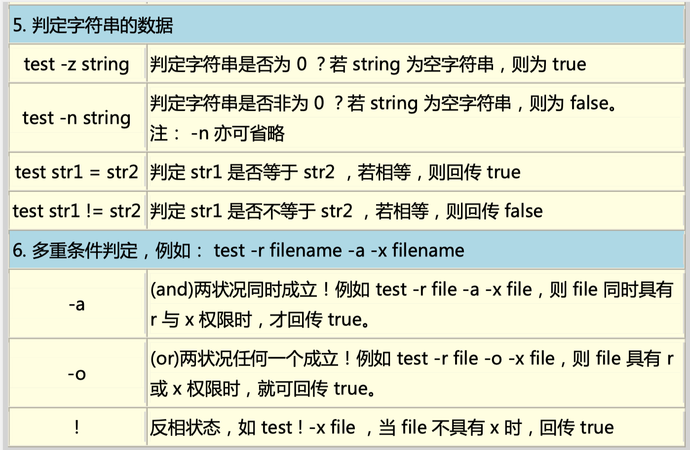

- 案例：

  ```sh
  #!/bin/bash
  
  echo "====> 1. 文件测试!"
  f1=test.sh
  
  test -e "$f1"; echo $?  #0
  test -f "$f1"; echo $? #0
  test -d "$f1"; echo $? #1
  test -d a; echo $? #0
  [ -d a ]; echo $? #0
  
  echo "====> 2. 数字测试!"
  v1=100
  v2=200
  [ $v1 -eq 100 ];echo $? #0
  #使用[ 时，一定要留出空格，否则报错
  #[$v1 -eq 100];echo $? #0
  
  [ $v1 -eq 100 ];echo $? #0
  [ $v1 -ne $v2 ];echo $? #0
  [ $v1 -gt $v2 ];echo $? #1
  [ $v1 -lt $v2 ];echo $? #0
  [ $v1 -ge $v2 ];echo $? #1
  [ $v1 -le $v2 ];echo $? #0
  
  #下面这种>写法，语法执行时没有报错，但是处理的结果是错的，需要慎重
  [ $v1 > $v2 ];echo $? #0
  
  echo "====> 3. 字符串测试!"
  name="duke !"
  [ -z "$name" ];echo $?  #1   当name为空时，返回true
  [ ! -z "$name" ];echo $?  #0
  [ -n "$name" ];echo $? #0 当name非空时，返回true
  
  name1=""
  [ -z $name1 ];echo $?
  #[ -n "$name" ];echo $?
  [ -n "$name1" ];echo $?  #该案例中，如果不加引号，判断是错误的
  
  name2="lily !"
  #在shell的条件判断中，=不是赋值，而是等同于==
  [ "$name" = "$name2" ]; echo $?  #1
  #[ "duke !" = "lily !" ]
  #[ duke ! = lily ! ] #不加的效果
  [ "$name" != "$name2" ]; echo $?  #0
  
  
  echo "===》 与或非"
  [ -f test.sh -a  -z "$name2" ] ;echo $? #1
  [ -f test.sh -o  -z "$name2" ] ;echo $? #0
  [ ! -z "$name2" ] ;echo $? #0
  ```

如果不加双引号报错如下：

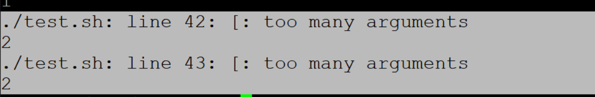


工程示意：

```sh
src  internal external test build.sh 

./build.sh debug
./build.sh release
```


### 2. if  test

1. 基本语法：

```sh
#!/bin/bash

f1="if.sh"

if [ -d "$f1" ];then
    echo "$f1 is a file"
elif [ -x "$f1" ]; then
    echo "$f1 有执行权限!"
else
    echo "$f1 is not a file"
fi


if true;then
    echo "永远为真"
else
    : #代表空操作
fi

if :;then
    echo "永远为真"
else
    : #代表空操作
fi

```

1. `if` 与`test`配合使用，后面如果`then`放在下一行，则分号可以省略
2. `if`必须使用`fi`进行结尾
3. 冒号，代表永远为真


2. 案例：让用户输入YES，NO进行分支处理

```sh
#!/bin/bash

#echo "请问最近在找工作吗?(Y|N)"
#read YES_OR_NO

#-p 是输入前的提示
read -p  "请问最近在找工作吗?(Y|N)" YES_OR_NO

if [ "$YES_OR_NO" = "Y" ];then
    echo "是的"
elif [ "$YES_OR_NO" = "N" ];then
    echo "不是"
else
    echo "请正确输入,Y|N"
fi

```

3. -a 与 &&的区别（-o和||同理）

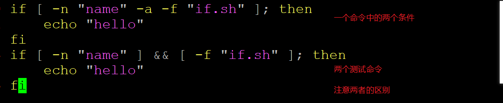


### 3. case

c语言的switch:

```sh
switch (表达式)
{
	case 值1:
		xxx
		break;
    case 值2:
		xxx
		break;
	default:
		xxxx;
}
```

shell：

```sh
case 表达式 in
    v1|v2)
        xxx
        ;;
    v3|v4)
        xxx
        ;;
    *)
        xxx
esac    
```

案例：

```sh
#!/bin/bash


read -p "灭霸同学，你集齐拯救世界的宝石没?" YES_OR_NO

case "$YES_OR_NO" in
    y|Y|yes|YES)  #表示里面的多个值都是满足当前分支条件的
        echo "是的，Mr杜!"
        ;; #v这两个分号必须存在
    n|N|no|NO)
        echo "抱歉先生!"
        ;;
    *)
        echo "输入无效!"
esac

```


### 4. for、while

```sh
#!/bin/bash

values="aaa bbb ccc ddd biu biu biu"
for i in $values
do
    echo $i
done

#for i in `ls /`
#do
#    echo $i
#done

#1 + 2+ ... + 100 = 5050
sum=0
for i in {1..100}; do
    #sum=$sum+$i  #这是错的，效果:1+2+3+4...
    #sum=$(($sum + $i)) #正确的
    #sum=$((sum + i))  #正确的
    sum=$[$sum+$i] #正确的
    sum=$[sum+i] #正确的
done

echo sum : $sum

#shell的数组
nums=(10 20 30 40)
echo ${nums[0]}
echo ${nums[1]}
echo ${nums[2]}
echo ${nums[3]}

echo "for遍历数组...."
#for i in $nums  #这种方式是错误的
for i in ${nums[*]}
do
    echo $i
done

i=10
while [ $i -gt 0 ]
do
    echo "$i"
    i=$[i-1]
done

if [ $? -eq 0];then
	echo "上一句命令执行成功"
fi


while true
do
    sleep 1
    echo "hello"
done
```

结果：

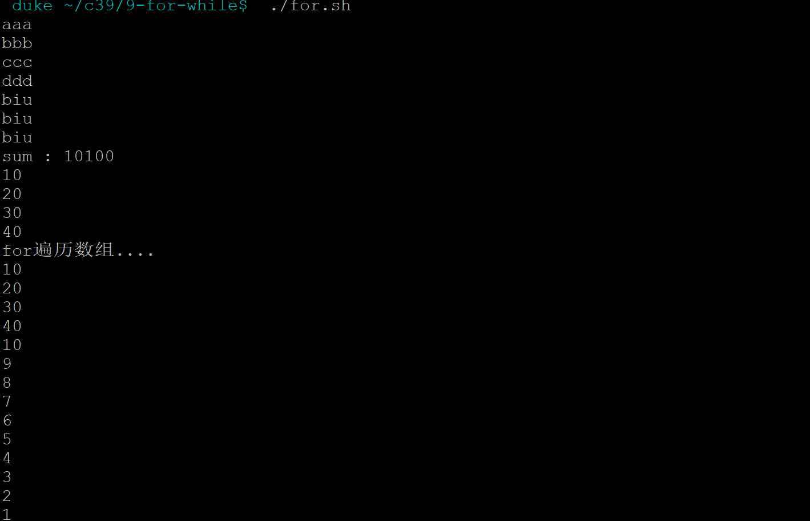

### 5. 特殊字符

>`$?` : 一个程序执行完毕的返回值，用于判断程序是否执行成功，从而控制后续逻辑
>
>`$$`: 返回当前进程的pid
>
>`$#`: 获取当前脚本传入参数的个数
>
>`$@`：获取当前脚本传入参数的具体数值 "aa"  "bb"  "cc"
>
>`$*`：与$@类似，但是=》    "aa  bb cc"
>
>`$0`：当前脚本文件的名字
>
>`$1 ~ $9`：依次存储每一个输入参数的变量值
>
>`shift`：将用户输入的参数逐个剔除，从而使得程序控制$1即可。


```sh
#!/bin/bash

echo "接收参数的数量:" $#   #argc
echo "接收参数的内容:" $@   #argv[0]之后的
echo "程序的名字:" $0 #argv[0]

echo "遍历参数如下:"

for i in $@  #$@用户输入参数的集合
do
    echo $i,  当前参数总个数为: $#
done

#这些依次保存用户输入的参数，但是最多到$9
echo $1 $2 $3 $4 $5 $6 $7 $8 $9 $10 $11

echo "使用shift命令之后....."

for i in $@
do
    echo $1, 当前参数总个数为: $#
    shift #将当前的参数最左侧的剔除掉，后一个变成了第一个
done

```


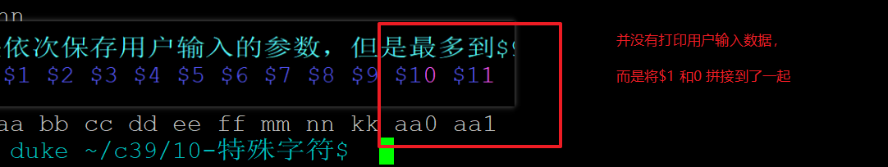


结果：

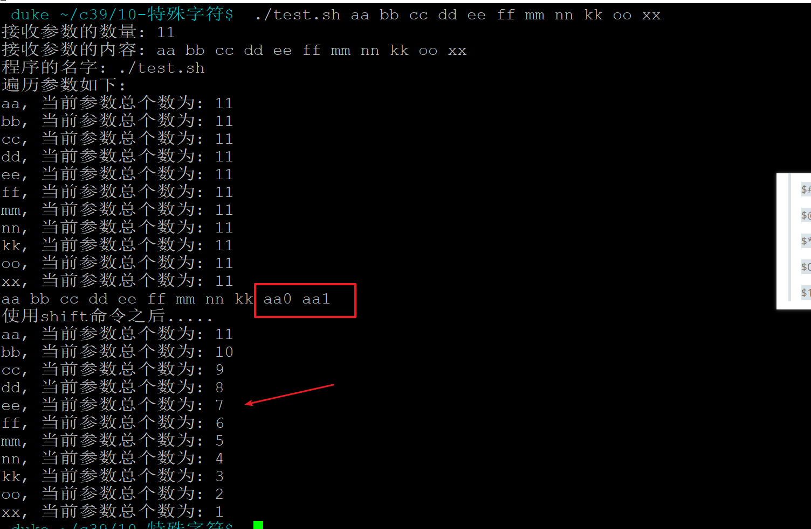
