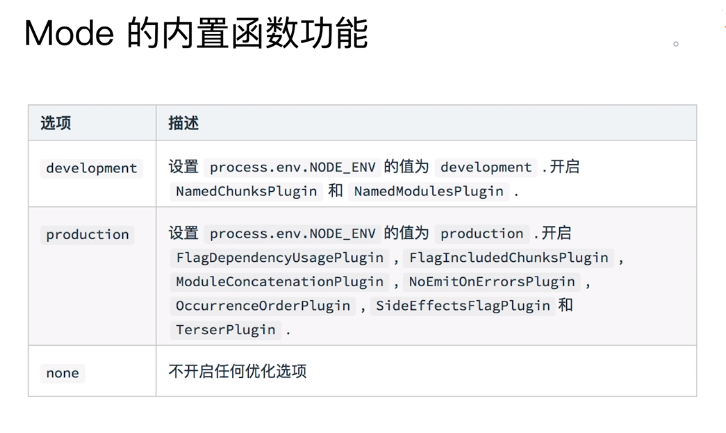

# Webpack学习笔记之核心概念

## 1.Entry

Entry用来指定webpack的打包入口。


### 1.1 entry单入口

+ 单入口： `entry`是一个字符串

  ```js
  module.exports = {
      entry: './path/to/my/entry/file.js'
  }
  ```

  

### 1.2  entry多入口

+ 多入口：`entry`是一个对象：

  ```js
  module.exports = {
      entry: {
          app: './src/app.js',
          admin: './scr/admin/app.js',
      }
  }
  ```

  

## 2. Output

output来告诉webpack如何将编译后的文件输出到磁盘

### 2.1 output单入口

```js
module.exports = {
    entry: './path/to/my/entry/file.js',
    output: {
        filename: 'bundle.js',
          path: path.join(__dirname, 'dist')
    }
}
```

### 2.1 output多入口

output并没有专门的多入口配置，它是通过**占位符**确保文件名称的唯一性来实现多入口的。

```js
module.exports = {
    entry: {
        index: './src/index.js',
        login: './src/login.js'
    },
    output: {
        filename: '[name].js', // 占位符 [name]
        path: path.join(__dirname, 'dist')
    }
}
```

## 3. Loaders

webpack开箱即用只支持JS和JSON两种文件类型，通过Loaders区支持其他文件类型并且把它们转化为有效的模块，并且乐意添加到依赖图中。

Loaders本身是一个函数，接受源文件作为参数，返回转换后的结果。


### 3.1  Loaders的用法

通过rules中的`test`指定正则匹配规则（匹配文件名），`use`指定对应的loader来解析：

```js
const path = require('path');

module.exports = {
    output: {
        filename: 'bundle.js'
    },
    module: {
        rules: [
            {test:/\.txt/, use: 'raw-loader'}
        ]
    }
}
```


## 4.Plugins

plugins即插件，用于bundle文件的优化，资源管理和环境变量的注入，它作用于整个构建过程。


### 4.1 Plugins的用法

将plugin放在`plugins`数组中：

```js
const path = require('path');

module.exports = {
    output: {
        filename: 'bundle.js'
    },
    plugins: [
        new HtmlWebpackPlugin({template: './src/index.html'})
    ]
}
```

## 5. Mode

mode用来指定当前的构建环境：`production`、`development`或`none`。

设置mode可以使用webpack内置的函数，默认值为`production`(生产环境)。



## 6.Resolve
