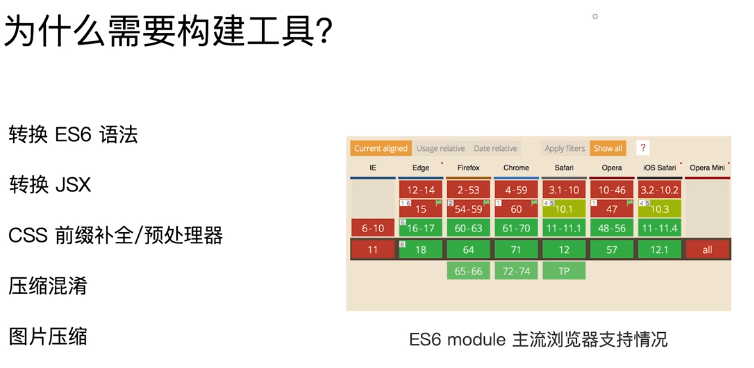
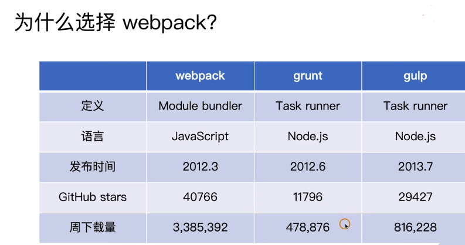

# Webpack学习笔记之概述

## webpack能做的事儿：提升打包速度、体积优化

+ 多页面打包、SSR、PWA、Prerender等多种构建场景
+ 多实例构建、并行压缩、公共资源分包、tree shaking、动态Polyfill等构件策略

## 为什么需要构建工具

## 为什么选择webpack

+ 社区生态丰富
+ 配置灵活和插件化扩展
+ 官方更新迭代速度快

## 为什么要深入掌握webpack？

**1.与应用场景和开发方式息息相关**：web前端从PC到移动设备，需要同时兼顾PC和H5页面以及各种分辨率的网页开发，就需要针对不同的场景做不同的打包。

+ PC端中后台页面——支持单页应用打包构件

+ H5页面性能和可访问性有极高的要求——支持服务端渲染和PWA离线缓存

**2.NodeJS包管理**：NodeJS的快速发展，自2009年到现在10年的时间，社区活跃，已经有了80多万的第三方组件，每天还在快速增长。但是npm的组件在浏览端并不能直接引入，这时需要借助webpack等构建工具来快速复用各种优秀成熟的组件从而加速web开发。

**3.编译三大框架VAR**：当前前端社区流行的三大框架VAR（Vue、Angular、React），一些语法比如JSX和Vue指令在浏览器无法直接转换，需要通过构建工具编译之后才能执行。

**4.理解跨端应用打包**：webpack是前段构件领域里最耀眼的一颗星，无论前端哪个领域都会涉及到webpack知识。熟悉webpack原理和知识，能够让我们拓宽前端技术栈，在发现页面打包的速度和资源体积的问题时，能够知道如何排查问题和优化，同时熟悉webpack原理，有助于对其他跨端应用的开发（比如: 小程序、Weex、React Native、Electron等）打包时能快速上手。

## webpack特点

+ 一切皆模块：css、js、html甚至图片、字体等都是一个个模块
+ 配置异常灵活
+ 具备强大的插件化扩展能力
+ 概念：`entry`、`output`、`mode`、`loaders`和plugins`、热更新、`code spliting`、`tree shaking`等
