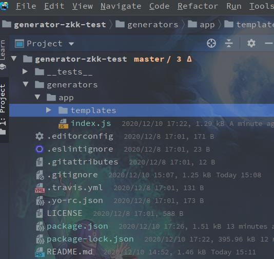
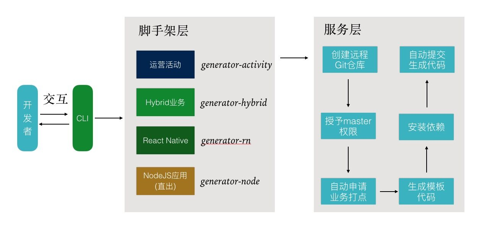
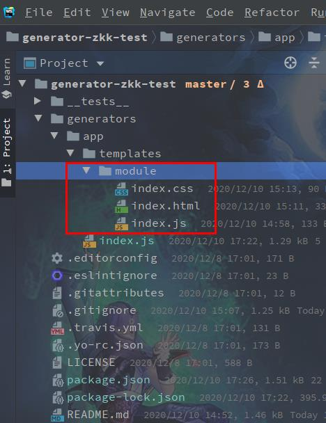
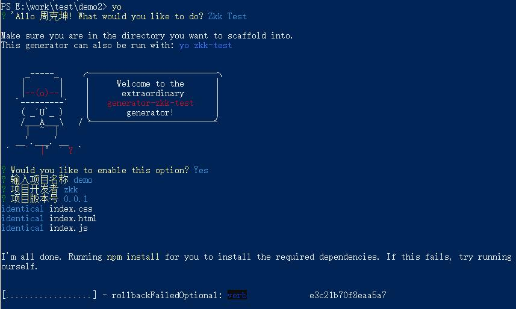

:::tip
Yeoman是一个脚手架，可以快速生成一个项目的骨架。官网上有很多大家<a href="http://yeoman.io/generators/" rel="nofollow noreferrer" target="_blank">已经写好的脚手架</a>我们可以通过yeoman来定制自己的脚手架
:::

# 使用yeoman搭建自己的CLI

## 一、准备工作

+ 1.node
确保安装了node
```bash
node -v
```

+ 2.安装yeoman工具
```bash
npm i -g yo

npm i -g generator-generator

# 验证安装成功
yo --version
```

+ 3.注册npm账号

+ [npmjs](https://www.npmjs.com/package/generator-zkk-test)

## 二、创建CLI基础框架
### 1.基础目录
使用[generator-generator](https://github.com/yeoman/generator-generator)来生成自己的CLI目录：

```bash
yo gengrator
```



### 2.编辑`index.js`

**yeoman创建项目阶段：**

+ `initializing`: 初始化一些状态之类的，通常是和用户输入的 `options` 或者 `arguments` 打交道
+ `prompting`: 和用户交互的时候（命令行问答之类的）调用
+ `configuring`: 保存配置文件（如 `.babelrc` 等）
+ `writing`: 生成模板文件
+ `install`: 安装依赖
+ `end`: 结束部分，初始代码自动提交

我们只需要继承Yeoman的Generator类做模板定制化，基于Yeoman的脚手架设计思路应该如下图所示：


在上述生成的目录中，`generators/app/index.js`是我们CLI的入口，通过修改，可以定制化我们的CLI：

```js
const Generator = require('yeoman-generator');

module.exports = class extends Generator {
    // 初始化阶段
    initializing () { /* code */ }
    // 接收用户输入阶段
    prompting () { /* code */ }
    // 保存配置信息和文件
    configuring () { /* code */ }
    // 执行自定义函数阶段
    default () { /* code */ }
    // 生成项目目录阶段
    writing () { /* code */ }
    // 统一处理冲突，如要生成的文件已经存在是否覆盖等处理
    conflicts () { /* code */ }
    // 安装依赖阶段
    install () { /* code */ }
    // 结束阶段
    end () { /* code */ }
}
```

### 3.创建模板文件
上述生成的目录，`generators/app/template`即为我们的模板所在目录，我们可以把创建好的模板拷贝进来：


## 四、本地测试
### 1.连接项目
+ 在项目下执行：
```bash
npm link
```

### 2.验证
```bash
# 执行yo
yo
# 选择Zkk Test

# 或者直接执行
# yo zkk-test
```


## 五、发布
+ ### 1.登陆npm
```bash
npm login
```

+ ### 2.发布
```bash
npm publish
```
在`generator-name`项目于根目录下执行`npm public`发布到npm上
注意：每次进行修改后上传都需要在`package.json上`修改版本
一般来说，版本分成三部门：`a.b.c`

+ `a`：表示大版本号，一般是项目较大改动的时候修改，a为0的时候，表示项目处于开发阶段。
+ `b`：表示功能更新，或者项目模块改动的时候增加。
+ `c`：表示小改动，如修bug。

+ ### 3.验证
```bash
# 查看版本
npm info generator-zkk-test

# 安装
npm i -g generator-zkk-test

# 使用自己CLI的
yo zkk-test
```

## 六.示例项目
+ [使用lerna构建react自定义组件项目](https://gitee.com/keekuun/generator-lerna-project)

+ [react业务组件，基于ts，提升开发效率](https://gitee.com/keekuun/react-components)

> 本文只是入门的操作，更多请访问[Yeoman官网](https://yeoman.io/)
