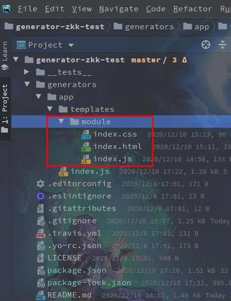
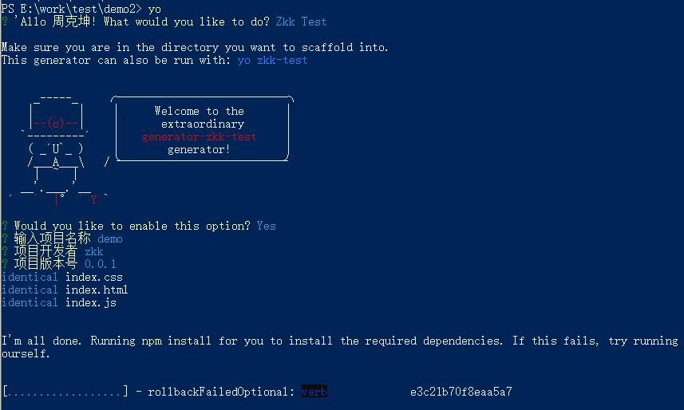

:::tip
使用yeoman定制化自己的CLI
:::

# 使用yeoman搭建自己的CLI

## 一、准备工作

+ 1.node
确保安装了node
```bash
node -v
```

+ 2.安装yeoman工具
```bash
npm i -g yo

npm i -g generator-generator

# 验证安装成功
yo --version
```

+ 3.注册npm账号

+ [npmjs](https://www.npmjs.com/package/generator-zkk-test)

## 二、创建CLI基础框架
### 1.基础目录
使用[generator-generator](https://github.com/yeoman/generator-generator)来生成自己的CLI目录：

```bash
yo gengrator
```


### 2.编辑`index.js`
在上述生成的目录中，`generators/app/index.js`是我们CLI的入口，通过修改，可以定制化我们的`console`输出信息：

```js
"use strict";
const Generator = require("yeoman-generator");
const chalk = require("chalk");
const yosay = require("yosay");

module.exports = class extends Generator {
  prompting() {
    // Have Yeoman greet the user.
    this.log(
      yosay(
        `Welcome to the extraordinary ${chalk.red(
          "generator-zkk-test"
        )} generator!`
      )
    );

    // 定制console选项
    const prompts = [
      {
        type: "confirm",
        name: "someAnswer",
        message: "Would you like to enable this option?",
        default: true
      },
      {
        type: "input",
        name: "projectName",
        message: "输入项目名称",
        default: this.appname
      },
      {
        type: "input",
        name: "projectAuthor",
        message: "项目开发者",
        store: true,
        default: ""
      },
      {
        type: "input",
        name: "projectVersion",
        message: "项目版本号",
        default: "0.0.1"
      }
    ];

    return this.prompt(prompts).then(props => {
      // To access props later use this.props.someAnswer;
      this.props = props;
    });
  }

  writing() {
    // 从模板生成项目文件，默认为template目录template/module
    this.fs.copy(this.templatePath("module"), this.destinationPath(""));
  }

  install() {
    // 不使用bower,使用npm安装依赖
    this.installDependencies({ bower: false });
  }
};

```
### 3.创建模板文件
上述生成的目录，`generators/app/template`即为我们的模板所在目录，我们可以把创建好的模板拷贝进来：


## 四、本地测试
### 1.连接项目
+ 在项目下执行：
```bash
npm link
```

### 2.验证
```bash
# 执行yo
yo
# 选择Zkk Test

# 或者直接执行
# yo zkk-test
```


## 五、发布
+ ### 1.登陆npm
```bash
npm login
```

+ ### 2.发布
```bash
npm publish
```
在`generator-name`项目于根目录下执行`npm public`发布到npm上
注意：每次进行修改后上传都需要在`package.json上`修改版本
一般来说，版本分成三部门：`a.b.c`

+ `a`：表示大版本号，一般是项目较大改动的时候修改，a为0的时候，表示项目处于开发阶段。
+ `b`：表示功能更新，或者项目模块改动的时候增加。
+ `c`：表示小改动，如修bug。

+ ### 3.验证
```bash
# 查看版本
npm info generator-zkk-test

# 安装
npm i -g generator-zkk-test

# 使用自己CLI的
yo zkk-test
```

> 本文只是入门的操作，更多请访问[Yeoman官网](https://yeoman.io/)
