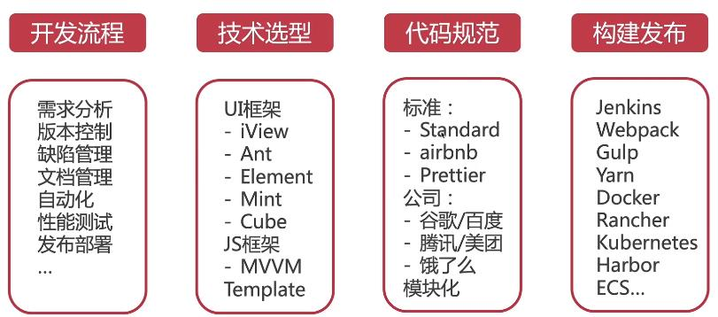
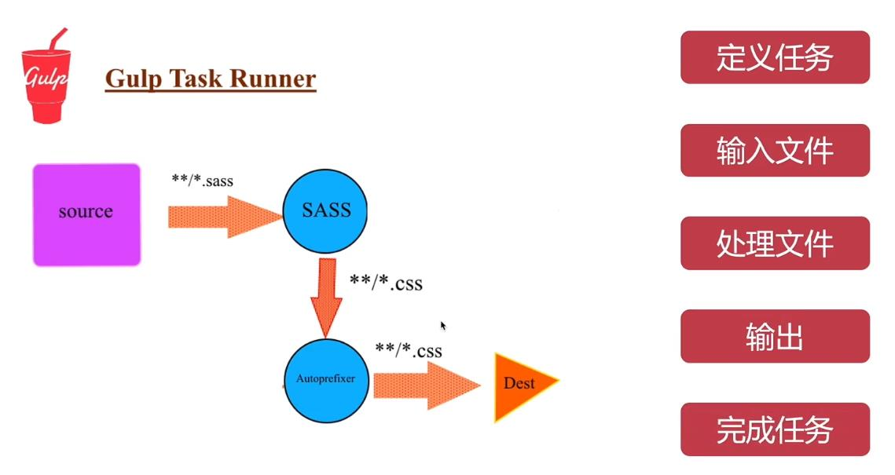

# 前端工程化

## 1.什么是前端工程化？

前端工程化实质将前端开发的流程**规范化**、**标准化**，包括**开发流程**、**技术选型**、**代码规范**、**构建发布**等，用于提升前端工程的开发效率和代码质量。



## 2.为什么要做前端工程化？

+ 复杂度高：前端项目的多功能、多页面、多状态、多系统

+ 规模大： 团队开发，多人协作，代码质量管理

+ 要求高：页面性能化（CDN/异步加载/请求合并），CSS兼容性、单页面应用、服务端渲染。。。

## 3.怎么实现前端工程化？

+ 从业务着手：
简单的单页面应用，使用gulp打包 + 同步工具实现开发全流程

+ 从复杂度考虑：
jenkins、git/gitlab、webpack、React/Vue/Angular

+ 从已知向未知扩展：
不同的技术有不同的适应点，选择合适的才是最好的

## 4.推荐

+ 组件化/脚手架/工程CLI工具

+ Git Flow

+ webpack

+ Jenkins + Docker

## 5.使用webpack打包

## 6.使用gulp打包

+ [gulp中文官网](https://www.gulpjs.com.cn/)
+ [gulp英文官网](https://gulpjs.com/)



### 使用Browsersync热刷新

---省时的浏览器同步测试工具： **Browsersync可以同时在PC、平板、手机等设备下进行调试**

+ [Browsersync中文官网](http://browsersync.cn/)
+ [Browsersync英文官网](https://browsersync.io/)


>  [Browsersync + Grunt.js结合使用](http://browsersync.cn/docs/gulp/)

## 7.使用Yeoman编写CLI

> [Yeoman官网](https://yeoman.io/)
>
> [generator-generator](https://github.com/yeoman/generator-generator)

+ 安装

  ```bash
  npm install -g yo
  ```

  