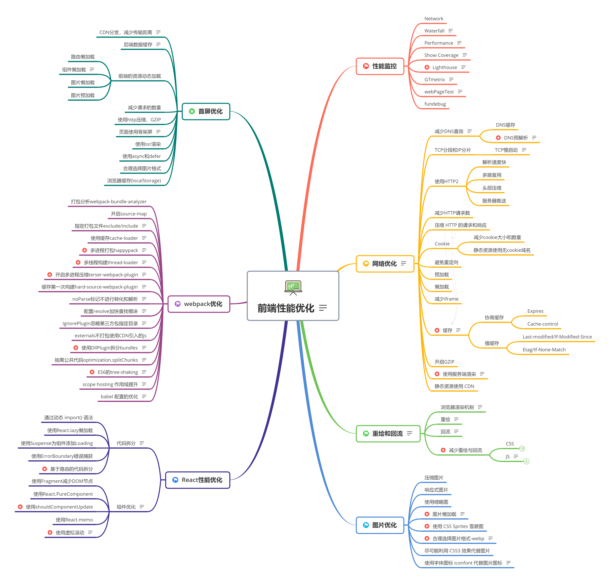
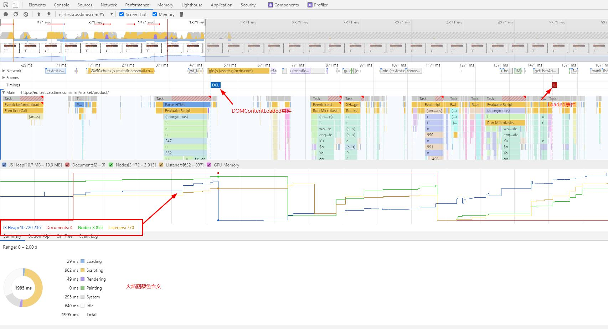
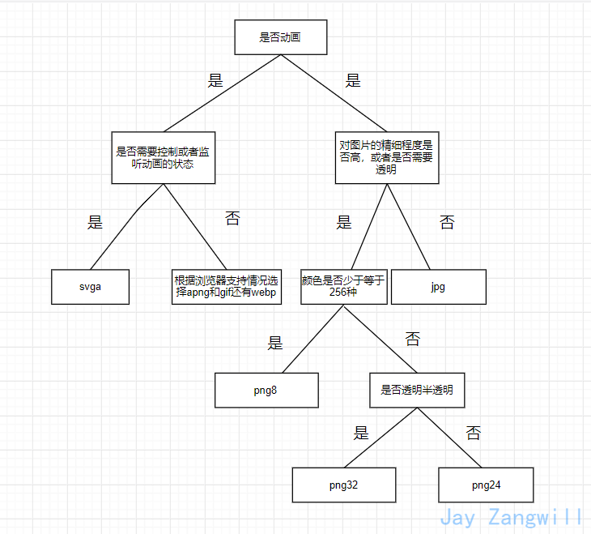

# 前端性能优化


## 1.浏览器

### 1.1[如何使用performance工具查看程序性能](https://developers.google.cn/web/tools/chrome-devtools/evaluate-performance/timeline-tool)
 
 + **FP**： First Paint
 + FCP： First Contentful Paint
 + **FMP**： First Meaningful Paint
 + **TTI**： Time To Interactive

 > [First Contentful Paint (FCP) and First Meaningful Paint (FMP) Explained](https://www.acmethemes.com/blog/first-contentful-paint-and-first-meaningful-paint/#)

 火焰图表线条含义：
 + <span style="color: blue">蓝线</span>：代表DOMContentLoaded事件。 
 + <span style="color: green">绿线</span>：表示第一次绘制的时间。 
 + <span style="color: red">红线</span>：代表load事件。

彩色条含义：
<ul>
  <li>HTML文件是 <strong><span style="color:hsl(214, 67%, 66%)">blue (蓝色)</span></strong> 的。</li>
  <li>JS是 <strong><span style="color:hsl(43, 83%, 64%)">yellow (黄色)</span></strong> 的。</li>
  <li>CSS表是 <strong><span style="color:hsl(256, 67%, 70%)">purple (紫色)</span></strong> 的。</li>
  <li>媒体文件是 <strong><span style="color:hsl(109, 33%, 55%)">green (绿色)</span></strong> 的。</li>
  <li><p>其他是 <strong><span style="color:hsl(0, 0%, 70%)">grey (灰色)</span></strong> 的。</p><p><br></p></li>
</ul>

### 1.2使用Show Coverage查看代码覆盖率
chrome浏览器，调试console界面，`ctrl+shift+p`,输入`show Courage`

使用**异步加载**优化, 如：
```js
function handleClick(){
    const dom = document.createElement('div');
    dom.innerHTML = 'Hello Webpack';
    document.body.appendChild(dom);
}

export default handleClick;
```

```js
document.addEventListener('click', ()=>{
    import('./handle').then(({ default:click })=>{
        click();
    })
})
```

> 推荐： [【webpack】快速笔记18 -- 擅用show Coverage以及 preloading与prefetching](https://blog.csdn.net/Umbrella_Um/article/details/100179524)

### 1.3 使用lighthouse查看页面整体性能
> [Lighthouse的使用与Google的移动端最佳实践](https://zhuanlan.zhihu.com/p/33752746)
>
>[How to measure speed?](https://web.dev/how-to-measure-speed/)

> 工具：
>   +  [Google’s PageSpeed Insights](https://developers.google.com/speed/pagespeed/insights/)
>
>   + [GTmetrix](https://gtmetrix.com/)
>

### 1.4 [减少浏览器的重绘和回流](http://www.stubbornella.org/content/2009/03/27/reflows-repaints-css-performance-making-your-javascript-slow/)


**重绘**

由于节点的几何属性发生改变或者由于样式发生改变而不会影响布局的，称为重绘，例如outline, visibility, color、background-color等，重绘的代价是高昂的，因为浏览器必须验证DOM树上其他节点元素的可见性。

**回流**

回流必定会发生重绘，重绘不一定会引发回流。
回流是布局或者几何属性需要改变就称为回流。回流是影响浏览器性能的关键因素，因为其变化涉及到部分页面（或是整个页面）的布局更新。一个元素的回流可能会导致了其所有子元素以及DOM中紧随其后的节点、祖先节点元素的随后的回流。

**哪些会导致回流？**

    + 添加或删除可见的DOM元素
    + 元素的位置发生变化
    + 元素的尺寸发生变化（包括外边距、内边框、边框大小、高度和宽度等）
    + 内容发生变化，比如文本变化或图片被另一个不同尺寸的图片所替代。
    + 页面一开始渲染的时候（这肯定避免不了）
    + 浏览器的窗口尺寸变化（因为回流是根据视口的大小来计算元素的位置和大小的）

注意：**回流一定会触发重绘，而重绘不一定会回流**

**怎么减少回流？**

**针对CSS**：

    - 使用transform代替top
    
    - 使用 visibility 替换 display: none
    
      为前者只会引起重绘，后者会引发回流（改变了布局)
    
    - 避免使用table布局
    
      可能很小的一个小改动会造成整个 table 的重新布局
    
    - 尽可能在DOM树的最末端改变class
    
      回流是不可避免的，但可以减少其影响。尽可能在DOM树的最末端改变class，可以限制了回流的范围，使其影响尽可能少的节点
    
    - 避免设置多层内联样式
    
      CSS 选择符从右往左匹配查找，避免节点层级过多
    
    - 将动画效果应用到position属性为absolute或fixed的元素上
    
      避免影响其他元素的布局，这样只是一个重绘，而不是回流，同时，控制动画速度可以选择 requestAnimationFrame，详见探讨 requestAnimationFrame。
    
    - 避免使用CSS表达式，可能会引发回流
    
    - 将频繁重绘或者回流的节点设置为图层
    
      图层能够阻止该节点的渲染行为影响别的节点，例如will-change、video、iframe等标签，浏览器会自动将该节点变为图层。
    
    - CSS3 硬件加速（GPU加速）
    
      使用css3硬件加速，可以让transform、opacity、filters这些动画不会引起回流重绘 。但是对于动画的其它属性，比如background-color这些，还是会引起回流重绘的，不过它还是可以提升这些动画的性能。
    
      - transform、opacity、filters、will-changeition-absolute 或 position-fixed 来实现此目的。

**针对JS**

    - 避免频繁操作样式，最好一次性重写style属性，或者将样式列表定义为class并一次性更改class属性。
    - 避免频繁操作DOM，创建一个documentFragment，在它上面应用所有DOM操作，最后再把它添加到文档中。
    - 避免频繁读取会引发回流/重绘的属性，如果确实需要多次使用，就用一个变量缓存起来。
    - 对具有复杂动画的元素使用绝对定位，使它脱离文档流，否则会引起父元素及后续元素频繁回流。
    
    - 使用cssText一次性改变样式
    
    - 修改class类名来操作样式
    
    - 批量修改DOM先让DOM脱离文档流
    
      1.使元素脱离文档流
      2.对其进行多次修改
      3.将元素带回到文档中。

  **有三种方式可以让DOM脱离文档流**：

    1.隐藏元素，应用修改，重新显示
    
    2.使用文档片段(document fragment)在当前DOM之外构建一个子树，再把它拷贝回文档。
    
    3.将原始元素拷贝到一个脱离文档的节点中，修改节点后，再替换原始的元素。

> [介绍下重绘和回流（Repaint & Reflow），以及如何进行优化 ](https://github.com/Advanced-Frontend/Daily-Interview-Question/issues/24)

## 2 网络优化


[从输入url到页面渲染](https://github.com/webVueBlog/interview-answe/issues/27)的时间怎么变短？

### 2.1 DNS查询：
- 浏览器缓存
- 本机缓存
- hosts文件
- 路由器缓存
- ISP DNS缓存
- DNS递归查询（可能存在负载均衡导致每次IP不一样）

### 2.2 DNS预解析

浏览器会在加载网页时对网页中的域名进行解析缓存，这样在你单击当前网页中的连接时就无需进行 DNS 的解析，减少用户等待时间，提高用户体验。

```html
<!--<meta>信息告诉浏览器，当前页面要做DNS预解析;content="off"禁用-->
<meta http-equiv="x-dns-prefetch-control" content="on" />
<!--使用<link>标签来强制对DNS预解析-->
<link rel="dns-prsfetch" href="//g.alicdn.com"></link>
```

> [DNS预解析dns-prefetch是什么及怎么使用](https://blog.csdn.net/qq_35432904/article/details/83988726?utm_medium=distribute.pc_relevant_t0.none-task-blog-BlogCommendFromBaidu-1.not_use_machine_learn_pai&depth_1-utm_source=distribute.pc_relevant_t0.none-task-blog-BlogCommendFromBaidu-1.not_use_machine_learn_pai)
>
>[Web 性能优化：prefetch, prerender](https://harttle.land/2015/10/06/html-cache.html)

### 2.3 TCP分段和IP分片

TCP报文段如果很长的话，会在发送时发生分段，在接受时进行重组，同样IP数据包在长度超过一定值时也会发生分片，在接收端再将分片重组。

> [TCP/IP详解--TCP的分段和IP的分片](https://www.cnblogs.com/zhangkele/p/9899278.html)

### 2.4 [TCP慢启动](https://zhuanlan.zhihu.com/p/139378305)
根据网络情况逐步增加每次发送的数据量，让网络包的大小逐渐匹配网速，从而防止网络的拥塞现象。

> [TCP的智慧—慢启动，拥塞避免，快速重传和快速恢复](https://www.bookstack.cn/read/tcp-udp-ip/24.md)

### 2.5 减少HTTP请求
一个完整的 HTTP 请求需要经历 DNS 查找，TCP 握手，浏览器发出 HTTP 请求，服务器接收请求，服务器处理请求并发回响应，浏览器接收响应等过程。

### 2.6 使用 HTTP2
解析速度快、多路复用（多个请求可以共用一个 TCP 连接）、头部压缩、服务器推送

### 2.7 [压缩 HTTP 的请求和响应](http://nodejs.cn/api/zlib/compressing_http_requests_and_responses.html)

### 2.8 使用服务端渲染（ssr）：
+ [react框架next](../../frontEnd/VAR/React学习笔记/React进阶之-Next.md)
+ [vue框架nuxt](../../frontEnd/VAR/Vue学习笔记/Vue-SSR%20Nuxt.md)

### 2.9 静态资源使用 CDN(内容分发网络)

在多个位置部署服务器，让用户离服务器更近，从而缩短请求时间。


> 基于TCP之上的协议，如HTTP，传输过程要在加上其头部信息并且还需要解析之后TCP才能识别，这部分信息也会影响网络传输速度。如果只是单纯的发送一些数据，可以不走HTTP，可以直接基于TCP之上定制自己的client和server，以减少包的大小，从而达到加快传输的目的。

**问题再现：**
+ [Chrome架构：仅仅打开了1个页面，为什么有4个进程？](https://os.51cto.com/art/202006/618050.htm#topx)
+ [Chrome原理和HTTP协议](https://juejin.cn/post/6902556452721229837#heading-0)

## 3 图片优化

### 3.1 使用字体图标 iconfont 代替图片图标

字体图标就是将图标制作成一个字体，使用时就跟字体一样，可以设置属性，例如 font-size、color 等等，非常方便。并且字体图标是矢量图，不会失真。还有一个优点是生成的文件特别小。

还可以使用 fontmin-webpack 插件对字体文件进行压缩 

>[fontmin-webpack](https://github.com/patrickhulce/fontmin-webpack)
>
>[Iconfont-阿里巴巴矢量图标库](https://www.iconfont.cn/)

### 3.2 图片懒加载：

在页面中，先不给图片设置路径，只有当图片出现在浏览器的可视区域时，才去加载真正的图片，这就是图片懒加载。

首先可以将图片这样设置，在页面不可见时图片不会加载：
```html

```
等页面可见时，使用 JS 加载图片：
```js
<script>
const img = document.querySelector('img') 
img.src = img.dataset.src
</script>
```

[还可以使用HTML5中的`loading`属性，处于实验阶段](https://developer.mozilla.org/en-US/docs/Web/Performance/Lazy_loading)：

`loading`：指示浏览器应当如何加载该图像。

`loading：eager`立即加载图像，不管它是否在可视视口（visible viewport）之外（默认值）。

`loading: lazy`延迟加载图像，直到它和视口接近到一个计算得到的距离，由浏览器定义。

> [web 前端图片懒加载实现原理](https://juejin.cn/post/6844903482164510734)

### 3.3 响应式图片

浏览器能够根据屏幕大小自动加载合适的图片:

+ 通过 picture 实现:
```html
<picture>
	<source srcset="banner_w1000.jpg" media="(min-width: 801px)">
	<source srcset="banner_w800.jpg" media="(max-width: 800px)">
	
</picture>
```
+ 通过 @media 实现:
```css
@media (min-width: 769px) {
	.bg {
		background-image: url(bg1080.jpg);
	}
}
@media (max-width: 768px) {
	.bg {
		background-image: url(bg768.jpg);
	}
}

```

### 3.4 使用缩略图

例如，你有一个 1920 * 1080 大小的图片，用缩略图的方式展示给用户，并且当用户鼠标悬停在上面时才展示全图。如果用户从未真正将鼠标悬停在缩略图上，则浪费了下载图片的时间。

所以，我们可以用两张图片来实行优化。

一开始，只加载缩略图，当用户悬停在图片上时，才加载大图。

还有一种办法，即对大图进行延迟加载，在所有元素都加载完成后手动更改大图的 src 进行下载。

### 3.5 合理选择图片格式



+ 下一代图片格式 AVIF（AV1 Image File Format）已经来了，此格式比 JPEG 小 50% 左右、比 WebP 小 20% 左右，相关性能跑分见此，目前 Chrome 85、Firefox 77 已支持；

> [前端该如何选择图片的格式](https://jayzangwill.github.io/blog/2020/04/07/img-knowledge/)
>
> [每个前端工程师都应该了解的图片知识](https://mp.weixin.qq.com/s/j6V5CLeHJzU5WxysmnQUqg)
>
> [WebP 相对于 PNG、JPG 有什么优势？](https://www.zhihu.com/question/27201061)

### 3.6 压缩图片

压缩方法有两种，一是通过 webpack 插件 image-webpack-loader，二是通过在线网站进行压缩。
使用插件 `image-webpack-loader` ：
```bash
npm i -D image-webpack-loader
```
webpack 配置：
```js
{
  test: /\.(png|jpe?g|gif|svg)(\?.*)?$/,
  use:[
    {
    loader: 'url-loader',
    options: {
      limit: 10000, /* 图片大小小于1000字节限制时会自动转成 base64 码引用*/
      name: utils.assetsPath('img/[name].[hash:7].[ext]')
      }
    },
    /*对图片进行压缩*/
    {
      loader: 'image-webpack-loader',
      options: {
        bypassOnDebug: true,
      }
    }
  ]
}
```

### 3.7 尽可能利用 CSS3 效果代替图片

有很多图片使用 CSS 效果（渐变、阴影等）就能画出来，这种情况选择 CSS3 效果更好。因为代码大小通常是图片大小的几分之一甚至几十分之一。但是需要考虑浏览器兼容性。

###　3.8 使用 CSS Sprites 雪碧图

webpack插件： [webpack-spritesmith](https://www.npmjs.com/package/webpack-spritesmith)

> [浅谈 CSS Sprites 雪碧图应用](https://segmentfault.com/a/1190000007686042)

### 3.9 处理加载失败的图片
+ 1.图像注明`alt`属性，将图像加载`error`的时候，新增一个错误类名，例如`.error`：
```html

```
+ 2.配合使用如下所示的CSS,并将`alt`属性显示出来：
```scss
img.error {
  display: inline-block;
  transform: scale(1);
  content: '';
  color: transparent;
    &::before {
       content: '';
       position: absolute;
       left: 0; 
       top: 0;
       width: 100%; 
       height: 100%;
       background: #f5f5f5 url('break.svg') no-repeat center / 50% 50%;
     }
    &::after {
       // 展示alt属性，标明加载失败的图像的内容
       content: attr(alt);
       position: absolute;
       left: 0; bottom: 0;
       width: 100%;
       line-height: 2;
       background-color: rgba(0,0,0,.5);
       color: white;
       font-size: 12px;
       text-align: center;
       white-space: nowrap;
       overflow: hidden;
       text-overflow: ellipsis;
     }
}
```

> [参考：图片加载失败后CSS样式处理最佳实践](https://www.zhangxinxu.com/wordpress/2020/10/css-style-image-load-fail/)

### 3.10 图片预加载
HTML5中有原生的预加载属性，名为`prefetch`和`prerender`:
```html
<!--IE11及以上，兼容性更好-->
<link rel="prefetch" href="(url)">
<!--prefetcher:浏览器会在后台（页面不可见）的位置预加载,相比prefetch，兼容性要差一些-->
<link rel="prefetcher" href="(url)">
```

或者使用JS：
```js
function preloadImg(url) {
    const img = new Image();
    img.src = url;
    if(img.complete) {
        //接下来可以使用图片了
        //do something here
    }
    else {
        img.onload = function() {
            //接下来可以使用图片了
            //do something here
        };
    }
}
```

还可以提高图片的加载
> [张鑫旭:基于用户行为的图片等资源预加载](https://www.zhangxinxu.com/wordpress/2016/06/image-preload-based-on-user-behavior/)

### 3.11 降低/提升图像加载优先级

``标签的`importance`属性可以指示下载资源时相对重要性，或者说优先级。允许的值：

+ `importance：auto`：不指定优先级。浏览器可以使用自己的算法来为图像选择优先级。

+ `importance：high`：此图像在下载时优先级较高。

+ `importance：low`：此图像在下载时优先级较低。

```html
<!-- An image the browser assigns "High" priority, but we don't actually want that. -->

```

当然不仅仅`img`可以，我们还可以给`js`加上：
```html
<!-- We want to initiate an early fetch for a resource, but also deprioritize it -->
<link rel="preload" href="/js/script.js" as="script" importance="low">
<script src="/js/app.js" defer importance="high"></script>
```

甚至,使用`fetch`API也可以加上这个属性：
```js
fetch("https://example.com/", {importance: "low"}).then(data => {
    // Do whatever you normally would with fetch data
});
```
> [Get Ready for Priority Hints](https://developers.google.com/web/updates/2019/02/priority-hints)

## 4.[React性能优化](https://juejin.cn/post/6908895801116721160)

### 4.1[代码拆分（Code Splitting）](https://react.css88.com/docs/code-splitting.html)

+ [通过动态 import() 语法](https://react.css88.com/docs/code-splitting.html#import)
+ [使用React.lazy懒加载](https://react.css88.com/docs/code-splitting.html#reactlazy)
+ [使用Suspense为组件添加Loading](https://react.css88.com/docs/code-splitting.html#suspense)
+ [使用ErrorBoundary错误捕获](https://react.css88.com/docs/code-splitting.html#%E9%94%99%E8%AF%AF%E8%BE%B9%E7%95%8C)
    
    > [React异常捕获](../../frontEnd/VAR/React学习笔记/React接入fundebug.md)
+ [基于路由的代码拆分](https://react.css88.com/docs/code-splitting.html#%E5%9F%BA%E4%BA%8E%E8%B7%AF%E7%94%B1%E7%9A%84%E4%BB%A3%E7%A0%81%E6%8B%86%E5%88%86)
    
    > [Code Splitting and React Router v4](https://serverless-stack.com/chapters/code-splitting-in-create-react-app.html)

**React Router实践：** 使用`react-loadable`、`react-router-config`

+ 配置`app.tsx`, 挂载DOM：
```typescript jsx
import { Provider } from 'mobx-react';
import React from 'react';
import ReactDOM from 'react-dom';
import { renderRoutes } from 'react-router-config';
import { HashRouter } from 'react-router-dom';
import './index.scss';

import routes from './routes';
import stores from './stores';

ReactDOM.render(
  <HashRouter>
    // 此处渲染路由
    <Provider {...stores}>{renderRoutes(routes)}</Provider>
  </HashRouter>,
  document.getElementById('root')
);

```

+ 配置`routes.ts`文件：
```typescript
import Loadable from 'react-loadable';
import Loading from '../components/Loading';
import { RouteConfig } from 'react-router-config';

const routes: RouteConfig[] = [
  {
    path: '/',
    component: Loadable({
      // 此处为页面布局
      loader: () => import('./Layout'),
      loading: Loading,
    }),
    routes: [
      {
        path: '/page-a',
        exact: true,
        component: Loadable({
          loader: () =>
            import('./pages/page-a'),
          loading: Loading,
        }),
      },
      {
        path: '/page-b',
        exact: true,
        component: Loadable({
          loader: () =>
            import('./pages/page-b'),
          loading: Loading,
        }),
      },
    ],
  },
];

export default routes;

```

+ 配置页面布局`Layout.tsx`:
```typescript jsx
import React from 'react';
import { renderRoutes, RouteConfigComponentProps } from 'react-router-config';

import TopBar from './components/topbar';
import Sidebar from './components/sidebar';
import Footer from './components/footer';

const Layout: React.FC<RouteConfigComponentProps<void>> = ({route}) => {
  return (
    <>
        <TopBar />
        <Sidebar />
        <div className="main">{route && renderRoutes(route.routes)}</div>
        <Footer />
    </>
  );
};

export default Layout;
```

### 4.2优化组件

+ [使用Fragment减少DOM节点](https://react.css88.com/docs/fragments.html#short-syntax)
+ [使用虚拟滚动](https://react.css88.com/docs/optimizing-performance.html#%E8%99%9A%E6%8B%9F%E5%8C%96%E9%95%BF%E5%88%97%E8%A1%A8)
    
    > [react-window](https://react-window.now.sh/#/examples/list/fixed-size)
+ [使用React.PureComponent](https://react.css88.com/docs/react-api.html#reactpurecomponent)
+ [使用shouldComponentUpdate](https://react.css88.com/docs/optimizing-performance.html#%E5%BA%94%E7%94%A8-shouldcomponentupdate)

    > 大多数情况下，你可以使用 React.PureComponent 而不是自己编写 shouldComponentUpdate 。但 React.PureComponent 仅会进项浅比较，因此如果 props 或者 state 可能会导致浅比较失败的情况下就不能使用 React.PureComponent 。
+ [使用React.memo](https://react.css88.com/docs/react-api.html#reactmemo)

> [掘金：React性能优化](https://juejin.cn/post/6908895801116721160)
>
> [React官方：React性能优化](https://react.css88.com/docs/optimizing-performance.html)

## 5.webpack打包优化

### 5.1打包分析webpack-bundle-analyzer
```bash
npm install webpack-bundle-analyzer -D
```

```js
//webpack.config.prod.js
const BundleAnalyzerPlugin = require('webpack-bundle-analyzer').BundleAnalyzerPlugin;
const merge = require('webpack-merge');
const baseWebpackConfig = require('./webpack.config.base');
module.exports = merge(baseWebpackConfig, {
    //....
    plugins: [
        //...
        new BundleAnalyzerPlugin(),
    ]
})
```
### 5.2 升级webpack

[一次webpack3升级为webpack4的实践](https://segmentfault.com/a/1190000022693214)

### 5.3配置source-map

当添加`source-map`后，在`dist`文件夹之后就会生成一个`.map`文件

在生产环境建议使用，cheap-module-source-map
在开发环境中建议使用，cheap-module-eval-source-map

eval：的特点：
1. 打包速度最快
2. 针对于复杂的代码eval提示出来的错误坑可能不全

```js
module.exports = {
    mode:"development",//代表的为开发环境
    devtool:"inline-source-map"//代表的是当我打包之后，在dist文件下不会生成一个.map的文件，但是会在index.js中生成一个base64的字符串
}
```

### 5.4 指定打包文件`exclude/include`

我们可以通过 exclude、include 配置来确保转译尽可能少的文件。顾名思义，exclude 指定要排除的文件，include 指定要包含的文件。
exclude 的优先级高于 include，在 include 和 exclude 中使用绝对路径数组，尽量避免 exclude，更倾向于使用 include。

```js
//webpack.config.js
const path = require('path');
module.exports = {
    //...
    module: {
        rules: [
            {
                test: /\.js[x]?$/,
                use: ['babel-loader'],
                include: [path.resolve(__dirname, 'src')]
            }
        ]
    },
}
```

### 5.5使用缓存cache-loader

在一些性能开销较大的 loader 之前添加 cache-loader，将结果缓存中磁盘中。默认保存在 node_modueles/.cache/cache-loader 目录下。
首先安装依赖：

```bash
npm install cache-loader -D
```
复制代码
cache-loader 的配置很简单，放在其他 loader 之前即可。修改Webpack 的配置如下:

```js
module.exports = {
    //...
    

    module: {
        //我的项目中,babel-loader耗时比较长，所以我给它配置了`cache-loader`
        rules: [
            {
                test: /\.jsx?$/,
                use: ['cache-loader','babel-loader']
            }
        ]
    }

}
```

如果只打算给 `babel-loader` 配置 `cache` 的话，也可以不使用 `cache-loader`，给 `babel-loader` 增加选项 `cacheDirectory`。

### 5.6多线程构建thread-loader

`thread-loader` 会将您的 loader 放置在一个 `worker` 池里面运行，以达到多线程构建。

### 5.7开启多进程压缩[`terser-webpack-plugin`](https://webpack.docschina.org/plugins/terser-webpack-plugin/)

```js
const TerserPlugin = require('terser-webpack-plugin'); 
module.exports = {
  optimization: {
    minimize: true,
    minimizer: [
      new TerserPlugin({
        parallel: true,
      }),
    ],
  },
};
Num
```

### 5.8缓存第一次构建`hard-source-webpack-plugin`

配置 `hard-source-webpack-plugin`，首次构建时间没有太大变化，但是第二次开始，构建时间大约可以节约 80%。

### 5.9noParse标记不进行转化和解析

如果一些第三方模块没有`AMD/CommonJS`规范版本，可以使用 `noParse` 来标识这个模块，这样 Webpack 会引入这些模块，但是不进行转化和解析，从而提升 Webpack 的构建性能 ，例如：jquery 、lodash。

### 5.10配置resolve加快查找模块

resolve 配置 webpack 如何寻找模块所对应的文件

### 5.11 [IgnorePlugin](https://webpack.docschina.org/plugins/ignore-plugin/)忽略第三方包指定目录

```js
//webpack.config.js
module.exports = {
  //...
  plugins: [
    //忽略 moment 下的 ./locale 目录
    new webpack.IgnorePlugin(/^\.\/locale$/, /moment$/)
  ]
}
```

### 5.12externals不打包使用CDN引入的js

### 5.13使用[DllPlugin](https://webpack.docschina.org/plugins/dll-plugin/)拆分bundles

DllPlugin 和 DLLReferencePlugin 可以实现拆分 bundles，并且可以大大提升构建速度，DllPlugin 和 DLLReferencePlugin 都是 webpack 的内置模块。

### 5.14抽离公共代码optimization.splitChunks

抽离公共代码是对于多页应用来说的，如果多个页面引入了一些公共模块，那么可以把这些公共的模块抽离出来，单独打包。公共代码只需要下载一次就缓存起来了，避免了重复下载。
抽离公共代码对于单页应用和多页应该在配置上没有什么区别，都是配置在 optimization.splitChunks 中。

### 5.15[tree-shaking](https://webpack.docschina.org/blog/2020-10-10-webpack-5-release/#nested-tree-shaking)

+ 嵌套的 tree-shaking 
+ 内部模块 tree-shaking 
+ CommonJs Tree Shaking

webpack4只支持ES6的`tree shaking`，不支持 `CommonJs` 导出和 `require()` 。

webpack 5 增加了对一些 CommonJs 构造的支持，允许消除未使用的 CommonJs 导出，并从 require() 调用中跟踪引用的导出名称。

### 5.16 scope hosting 作用域提升

变量提升，可以减少一些变量声明。在生产环境下，默认开启。

### 5.17babel 配置的优化

如果你对 babel 还不太熟悉的话，那么可以阅读这篇文章：不容错过的 Babel7 知识。
在不配置 @babel/plugin-transform-runtime 时，babel 会使用很小的辅助函数来实现类似 _createClass 等公共方法。默认情况下，它将被注入(inject)到需要它的每个文件中。但是这样的结果就是导致构建出来的JS体积变大。
我们也并不需要在每个 js 中注入辅助函数，因此我们可以使用 @babel/plugin-transform-runtime，@babel/plugin-transform-runtime 是一个可以重复使用 Babel 注入的帮助程序，以节省代码大小的插件。
因此我们可以在 .babelrc 中增加 @babel/plugin-transform-runtime 的配置。

```js
{
    "presets": [],
    "plugins": [
        [
            "@babel/plugin-transform-runtime"
        ]
    ]
}
```


## 6首屏优化

### 6.1CDN分发，减少传输距离
全称:`Content Delivery Network`或`Content Distribute Network`，即内容分发网络。

通过在网络各处放置**节点服务器**，这些节点之间会动态的互相传输内容，CDN系统能够根据网络流量和各节点的连接、负载状况以及到用户的距离和响应时间等综合信息将用户的请求重新导向离用户最近的服务节点上。

目的是就近取得所需内容，解决Internet网络拥挤的状况，提高用户访问网站的响应速度。

### 6.2后端数据缓存

数据库查询缓存是可以设置缓存的，这个对于处于高频率的请求很有用。浏览器一般不会对`content-type: application/json`的接口进行缓存，所以有时需要我们手动地为接口设置缓存。

比如一个用户的签到状态，它的缓存时间可以设置到明天之前。

### 6.3前端的资源动态加载

- 路由懒加载

[react路由懒加载和vue路由懒加载 ](https://segmentfault.com/a/1190000022265737)

- 组件懒加载

    + [通过动态 import() 语法](https://react.css88.com/docs/code-splitting.html#import)
    
    + [使用React.lazy懒加载](https://react.css88.com/docs/code-splitting.html#reactlazy)

    + 动态渲染[react-window](https://react-window.now.sh/#/examples/list/fixed-size)

- 图片懒加载

> [web 前端图片懒加载实现原理](https://juejin.cn/post/6844903482164510734)

- 图片预加载
HTML5中有原生的预加载属性，名为`prefetch`和`prerender`:
```html
<!--IE11及以上，兼容性更好-->
<link rel="prefetch" href="(url)">
<!--prefetcher:浏览器会在后台（页面不可见）的位置预加载,相比prefetch，兼容性要差一些-->
<link rel="prefetcher" href="(url)">
```

> [张鑫旭:基于用户行为的图片等资源预加载](https://www.zhangxinxu.com/wordpress/2016/06/image-preload-based-on-user-behavior/)

### 6.4减少请求的数量

### 6.5使用http压缩，GZIP
+ 验证是否开启GZIP：
```bash
 curl -H "Accept-Encoding: gzip" -I https://juejin.cn/post/6844903825585897485#heading-4
```
+ Koa服务开启GZIP
```js
const compress = require('koa-compress');
const app = module.exports = new Koa();
app.use(compress());
```

+ webpack开启GZIP：
```js
const CompressionWebpackPlugin = require('compression-webpack-plugin');
plugins.push(
    new CompressionWebpackPlugin({
        asset: '[path].gz[query]',// 目标文件名
        algorithm: 'gzip',// 使用gzip压缩
        test: new RegExp(
            '\\.(js|css)$' // 压缩 js 与 css
        ),
        threshold: 10240,// 资源文件大于10240B=10kB时会被压缩
        minRatio: 0.8 // 最小压缩比达到0.8时才会被压缩
    })
);
```

更进一步，使用更先进的压缩算法，进一步压缩——[Brotli](https://seo.g2soft.net/AMP/2019/05/22/brotli-vs-gzip.html)([Brotli兼容性差](https://caniuse.com/brotli))
> [前端性能优化之gzip ](https://segmentfault.com/a/1190000012571492)
>
>[启用 Brotli 压缩算法，对比 Gzip 压缩 CDN 流量再减少 20%](https://www.upyun.com/tech/article/257/%E5%90%AF%E7%94%A8%20Brotli%20%E5%8E%8B%E7%BC%A9%E7%AE%97%E6%B3%95%EF%BC%8C%E5%AF%B9%E6%AF%94%20Gzip%20%E5%8E%8B%E7%BC%A9%20CDN%20%E6%B5%81%E9%87%8F%E5%86%8D%E5%87%8F%E5%B0%91%2020%25.html)

### 6.6页面使用骨架屏

用css提前占好位置，当资源加载完成即可填充，减少页面的回流与重绘，同时还能给用户最直接的反馈。
[react-placeholder](https://github.com/buildo/react-placeholder)

使用css伪类：[只要css就能实现的骨架屏方案](https://segmentfault.com/a/1190000020437426)

> [CSS3- Loader & Spinners](https://codepen.io/keekuun/pen/yLOMNWz?editors=1010)

### 6.7使用ssr渲染

+ [react框架next](../../frontEnd/VAR/React学习笔记/React进阶之-Next.md)

+ [vue框架nuxt](../../frontEnd/VAR/Vue学习笔记/Vue-SSR%20Nuxt.md)

### 6.8使用async和defer

+ [defer和async的区别 ](https://segmentfault.com/q/1010000000640869)

+ [Web 性能优化：异步加载脚本](https://harttle.land/2016/05/18/async-javascript-loading.html#)

### 6.9合理选择图片格式
[AVIF has landed](https://jakearchibald.com/2020/avif-has-landed/)

```html
<picture>  
<!--If this type is supported, use this-->
  <source type="image/avif" srcset="snow.avif">  
<!--…else this-->
  
</picture>
```

### 6.10 使用HTTP缓存

[使用 HTTP 缓存：Etag, Last-Modified 与 Cache-Control](https://harttle.land/2017/04/04/using-http-cache.html#)

### 6.11 浏览器缓存(localStorage)
> [localstorage 必知必会](https://juejin.cn/post/6844903570941165582)
>
>[使用 localStorage 的最佳实践](https://juejin.cn/post/6857315310908506119#heading-4)
>
>[A Simple TODO list using HTML5 WebDatabases](https://www.html5rocks.com/en/tutorials/webdatabase/todo/)

兼容性：[支持IE8+](https://caniuse.com/?search=localstorage)


```js
// 获取指定key本地存储的值
localStorage.getItem(key)
// 将value存储到key字段
localStorage.setItem(key,value)
//删除指定key本地存储的值
localStorage.removeItem(key) 
```


cookie最大的缺陷是在每一次HTTP请求中都会携带所有符合规则的cookie数据（最大4k），这会<a rel="nofollow" href="http://yuiblog.com/blog/2007/03/01/performance-research-part-3/" target="_blank">增加请求响应时间</a>,特别是XHR请求. 

在HTML5中使用`sessionStorage`和`localStorage`(最大5M)代替cookie是更好的做法:
```js
// if localStorage is present, use that
if (('localStorage' in window) && window.localStorage !== null) {

  // easy object property API
  localStorage.wishlist = '["unicorn", "Narwhal", "deathbear"]';

} else {

  // without sessionStorage we'll have to use a far-future cookie
  // with document.cookie's awkward API
  var date = new Date();
  date.setTime(date.getTime() + (365 * 24 * 60 * 60 * 1000));
  var expires = date.toGMTString();
  var cookiestr = 'wishlist=["unicorn", "Narwhal", "deathbear"];' +
                  ' expires=' + expires + '; path=/';
  document.cookie = cookiestr;
}
```


## 小结
web性能优化是一个系统的工程，需要各方面一起配合。大概从两个方向入手：

+ 减少资源体积
    - css压缩([mini-css-extract-plugin](https://webpack.docschina.org/plugins/mini-css-extract-plugin/#minimizing-for-production))
    - js压缩（[terser-webpack-plugin](https://webpack.docschina.org/plugins/terser-webpack-plugin/)）
    - html压缩([html-loader](https://webpack.docschina.org/loaders/html-loader/#boolean))
    - http压缩（GZIP/br，header压缩-HTTP2）
    - 图片压缩（使用webpy）
    - 减少cookie体积
    
+ 控制请求数
    - DNS解析
    - 资源合并（js、css、html）
    - 图片合并（雪碧图、base64）
    - 减少接口数量
    - 并行加载（使用async/defer、ajax）
    - 合理使用缓存（http缓存、localstorage）
    - 懒加载（图片、路由、组件）和预加载
    - 静态资源CDN
    - 使用http2
    - 使用websocket

>
> [前端性能优化 24 条建议](https://juejin.cn/post/6892994632968306702)
>
> [前端性能优化](https://juejin.cn/post/6911472693405548557)
>
>>[大话WEB前端性能优化基本套路](https://blog.thankbabe.com/2017/07/05/fore-end-optimize/)
>
>[[译]让web app更快的HTML5最佳实践](https://segmentfault.com/a/1190000002884052)
>
>[带你深度解锁webpack系列(优化篇)](https://juejin.cn/post/6844904093463347208)
>
>[Webpack 5 发布 (2020-10-10)](https://webpack.docschina.org/blog/2020-10-10-webpack-5-release/)
