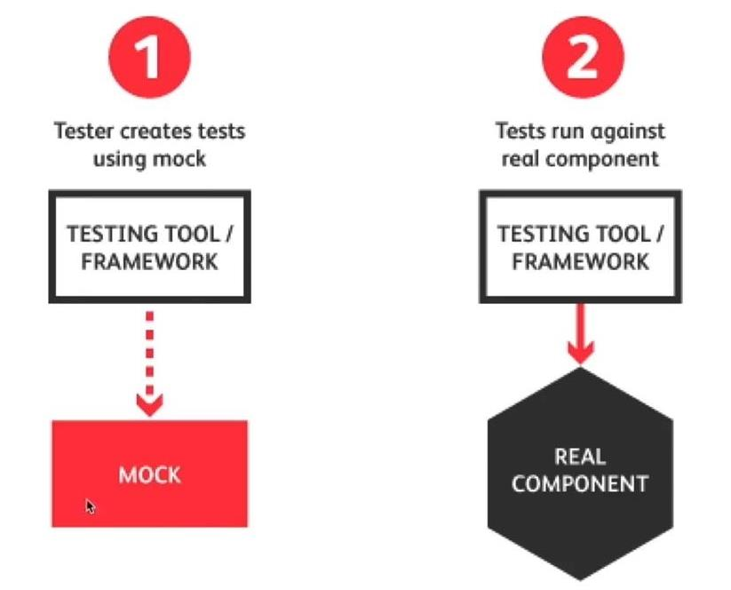
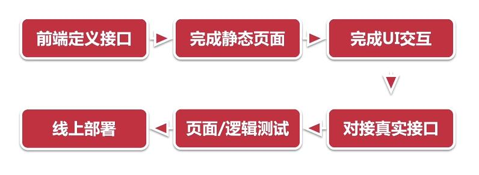

## 1. Restful API

### 1.1定义

**Restful** ：**表现层状态转移**(Representational State Transfer)

+ Resource-based：资源，即数据

+ Representational：某种表现形式，比如JSON、XML、JPG等

+ State Transfer：状态变化。通过HTTP动词实现

  

**API - 应用编程接口**（**A**pplication **P**rogramming **I**nterface）

### 1.2特点

+ 客户端 - 服务器：通过用户界面，将数据与存储分开，通过简化服务器组件来实现跨多平台的应用。
+ 无状态、可缓存：C -> S包含理解请求所需的所有信息
+ 统一接口
+ 分层系统
+ 按需代码
+ 常用接口测试工具
  + 插件类：[Postman](https://www.postman.com/), DHC，REST client
  + 平台类：[Yapi](https://yapi.baidu.com/)，[DOClever](http://doclever.cn/controller/index/index.html)，RAP2，[EasyMock](https://www.easy-mock.com/login)，[Swagger](https://swagger.io/)
  + 终端类：[Postman](https://www.postman.com/),，SoapUI，[DOClever](http://doclever.cn/controller/index/index.html)

## 2.Mock数据

### 2.1 什么是mock数据？

简单来讲就是虚拟的数据、虚假的测试数据。

+ 模拟真实接口：实现效率开发，前后台同步，特别是分布式的系统

+ 虚拟业务场景：某些开发场景非常难接触，还有一些异常逻辑、交互逻辑

  



### 2.2 作用

+ 效率开发
+ 模拟交互与全过程
+ 全量数据测试极端情况
+ 压力测试

### 2.3 常用工具

+ [DOClever](http://doclever.cn/controller/index/index.html) / Yapi / EasyMock
+ [Mockjs](https://github.com/nuysoft/Mock/wiki/Getting-Started)
+ postman

> [Docker安装：DOClever Docker 镜像](https://github.com/sx1989827/DOClever/tree/master/docker)

### 2.4 Mock数据开发流程



+ 安装

  ```bash
  npm install mockjs
  ```

+ 简单使用：

  ```js
  // 使用 Mock
  var Mock = require('mockjs')
  var data = Mock.mock({
      // 属性 list 的值是一个数组，其中含有 1 到 10 个元素
      'list|1-10': [{
          // 属性 id 是一个自增数，起始值为 1，每次增 1
          'id|+1': 1
      }]
  })
  // 输出结果
  console.log(JSON.stringify(data, null, 4))
  ```

  

  

## 3.性能测试