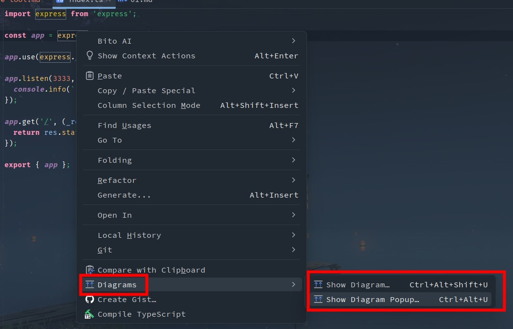
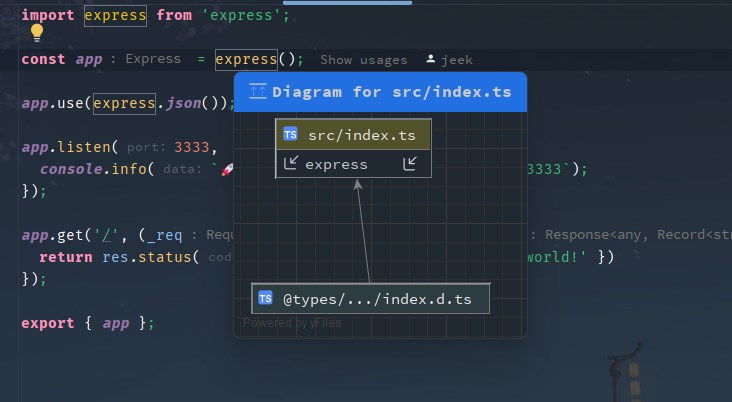

## 1.npmgraph 可视化 npm 包依赖关系

A tool for exploring npm modules and dependencies. Available online at https://npmgraph.js.org/.

## 2.dependency-cruiser 可视化代码文件依赖关系

## 3.WebStorm - Module Dependency Diagrams 可视化代码依赖关系

https://www.jetbrains.com/help/webstorm/module-dependency-diagram.html

