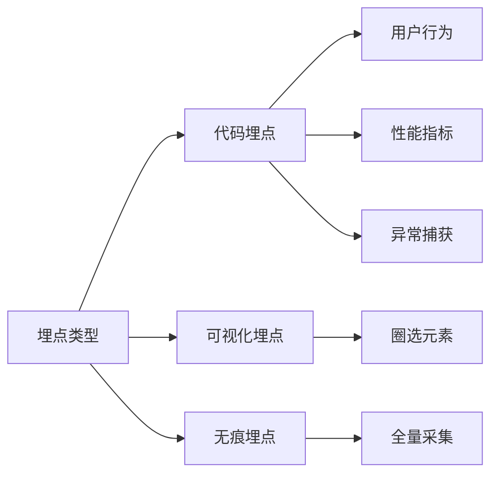

## 前端监控埋点方案

以下是前端监控埋点方案的详细介绍，包含 **技术实现**、**数据规范**、**场景策略** 和 **最佳实践** 的全方位指南，基于现代前端技术栈（TypeScript + 主流监控体系）：

---

### 一、埋点方案架构设计


---

### 二、埋点类型与实现方案

#### 1. **代码埋点（精准采集）**
```typescript
// 通用埋点函数（TypeScript 实现）
class Tracker {
  private static instance: Tracker;

  static getInstance() {
    if (!Tracker.instance) {
      Tracker.instance = new Tracker();
    }
    return Tracker.instance;
  }

  track(event: string, payload: Record<string, any>) {
    const data = {
      event,
      timestamp: Date.now(),
      sessionId: this.getSessionId(),
      ...payload,
      // 环境信息自动附加
      _metadata: {
        url: sanitizeUrl(location.href),
        userAgent: navigator.userAgent,
        screen: `${window.screen.width}x${window.screen.height}`
      }
    };

    this.send(data);
  }
  
    private getSessionId() {
        // 简单实现：使用 localStorage 存储会话 ID
        let sessionId = localStorage.getItem('session_id');
        if (!sessionId) {
            sessionId = crypto.randomUUID();
            localStorage.setItem('session_id', sessionId);
        }
        return sessionId;
    }

  private send(data: any) {
    // 优先使用 Beacon API
    if (navigator.sendBeacon) {
      const blob = new Blob([JSON.stringify(data)], { type: 'application/json' });
      navigator.sendBeacon('/api/track', blob);
    } else {
      // 降级方案
      new Image().src = `/api/track?data=${encodeURIComponent(JSON.stringify(data))}`;
    }
  }
}

// 使用示例
Tracker.getInstance().track('button_click', {
  buttonId: 'checkout-now',
  page: 'product_detail'
});
```

#### 2. **可视化埋点（无代码接入）**
```typescript
// 动态元素圈选逻辑
class VisualTracker {
  startElementPicker() {
    document.addEventListener('mouseover', this.highlightElement);
    document.addEventListener('click', this.registerElement, { once: true });
  }

  private highlightElement(e: MouseEvent) {
    const target = e.target as HTMLElement;
    target.style.outline = '2px solid #f00';
  }

  private registerElement(e: MouseEvent) {
    const target = e.target as HTMLElement;
    const xpath = getXPath(target);
    saveElementConfig({
      xpath,
      eventName: `${target.textContent}_click`,
      metadata: {
        position: getRelativePosition(target)
      }
    });
  }
}

// 获取元素的 XPath
function getXPath(element: HTMLElement): string {
    if (element.id) {
        return `//*[@id="${element.id}"]`;
    }
    if (element === document.body) {
        return '/html/body';
    }
    const index = Array.from(element.parentNode?.children || []).indexOf(element) + 1;
    return `${getXPath(element.parentNode as HTMLElement)}/${element.tagName.toLowerCase()}[${index}]`;
}

// 获取元素相对位置
function getRelativePosition(element: HTMLElement): { top: number; left: number } {
    const rect = element.getBoundingClientRect();
    return {
        top: rect.top + window.scrollY,
        left: rect.left + window.scrollX
    };
}

// 保存圈选的元素配置
function saveElementConfig(config: { xpath: string; eventName: string; metadata?: Record<string, any> }) {
    // 这里可以将配置保存到后端或本地存储
    console.log('保存元素配置:', config);
    // 例如：localStorage.setItem('visual_tracker_config', JSON.stringify(config));
    // 或者发送到后端
    fetch('/api/save-element-config', {
        method: 'POST',
        headers: { 'Content-Type': 'application/json' },
        body: JSON.stringify(config)
    });
}
```

#### 3. **无痕埋点（全量采集）**
```typescript
// 自动追踪所有点击事件
document.addEventListener('click', (e) => {
  const target = e.target as HTMLElement;
  Tracker.getInstance().track('autotrack_click', {
    xpath: getXPath(target),
    text: target.innerText?.slice(0, 30),
    className: target.className
  });
}, true); // 使用捕获阶段

// 页面停留时长统计
let pageEnterTime = Date.now();
window.addEventListener('beforeunload', () => {
  Tracker.getInstance().track('page_dwell', {
    duration: Date.now() - pageEnterTime,
    pageUrl: location.pathname
  });
});
```

---

### 三、关键埋点场景与实现

#### 1. **用户行为追踪**
| 场景              | 实现方案                                                                 |
|-------------------|--------------------------------------------------------------------------|
| 页面访问          | 监听 `history.pushState` 和 `hashchange`                                 |
| 按钮点击          | 事件委托 + 元素指纹（XPath/选择器）                                     |
| 表单提交          | 拦截 `submit` 事件 + 表单序列化                                         |
| 滚动深度          | 监听 `scroll` 事件 + 节流计算百分比                                     |
| 元素曝光          | IntersectionObserver 监听可视区域                                        |

```typescript
// 滚动深度监控示例
const scrollTracker = throttle(() => {
  const scrolled = (window.scrollY / document.body.scrollHeight) * 100;
  Tracker.getInstance().track('scroll_depth', {
    percent: Math.round(scrolled),
    page: location.pathname
  });
}, 500);
window.addEventListener('scroll', scrollTracker);
```

#### 2. **性能监控埋点**
```typescript
// 使用 PerformanceObserver 监听关键指标
const perfObserver = new PerformanceObserver((list) => {
  list.getEntries().forEach(entry => {
    if (entry.entryType === 'largest-contentful-paint') {
      Tracker.getInstance().track('lcp', {
        value: entry.startTime,
        element: entry.element?.tagName
      });
    }
  });
});
perfObserver.observe({ types: ['largest-contentful-paint'] });
```

#### 3. **异常捕获埋点**
```typescript
// 全局错误监听
window.addEventListener('error', (event) => {
  Tracker.getInstance().track('window_error', {
    message: event.message,
    stack: event.error?.stack,
    filename: event.filename,
    lineno: event.lineno
  });
});

// Promise 异常
window.addEventListener('unhandledrejection', (event) => {
  Tracker.getInstance().track('promise_error', {
    reason: event.reason?.toString()
  });
});
```

---

### 四、数据规范与字段设计

#### 1. **基础字段（必选）**
| 字段名          | 类型     | 说明                          |
|----------------|----------|-------------------------------|
| event          | string   | 事件标识（如：login_success） |
| timestamp      | number   | 精确到毫秒的事件时间戳        |
| session_id     | string   | 会话ID（通常30分钟过期）      |
| device_id      | string   | 设备指纹（通过canvas生成）    |

#### 2. **扩展字段（按需）**
```typescript
// 电商场景示例
interface EcommercePayload {
  product_id: string;
  category?: string;
  price?: number;
  currency?: 'CNY' | 'USD';
  // 购物车相关
  cart_id?: string;
  checkout_step?: number;
}
```

#### 3. **数据过滤规则**
```typescript
function sanitize(data: any) {
  // 移除敏感字段
  delete data.password;
  delete data.creditCard;

  // 脱敏处理
  if (data.email) {
    data.email = data.email.replace(/@.*/, '@***');
  }

  return data;
}
```

---

### 五、上报优化策略

#### 1. **本地缓存队列**
```typescript
class BatchedReporter {
  private queue: any[] = [];
  private readonly MAX_SIZE = 10;

  add(event: any) {
    this.queue.push(event);
    if (this.queue.length >= this.MAX_SIZE) {
      this.flush();
    }
  }

  flush() {
    if (this.queue.length === 0) return;
  
    const eventsToSend = [...this.queue];
    this.queue = [];
  
    if (navigator.onLine) {
      sendEvents(eventsToSend);
    } else {
      IndexedDB.saveOfflineEvents(eventsToSend);
    }
  }
}
```

#### 2. **请求优先级控制**
```typescript
const PRIORITY = {
  ERROR: 0,
  PURCHASE: 1,
  CLICK: 2
};

function sendWithPriority(event: any) {
  if (event.priority === PRIORITY.ERROR) {
    // 立即发送错误日志
    navigator.sendBeacon('/error', event);
  } else {
    // 普通事件加入队列
    batchedReporter.add(event);
  }
}
```

#### 3. **数据压缩（Gzip + Protobuf）**
```typescript
// 使用 protobuf.js 压缩数据
import { Root } from "protobufjs";
const proto = await Root.fromJSON(require('./track.proto.json'));
const TrackMessage = proto.lookupType("TrackEvent");

const encoded = TrackMessage.encode({
  event: 'click',
  timestamp: Date.now()
}).finish();

// 压缩后体积减少 60-70%
```

---

### 六、生产环境最佳实践

#### 1. **埋点测试方案**
```typescript
// Mock 测试模式
class MockTracker extends Tracker {
  track(event: string, payload: any) {
    console.log(`[Mock] Track: ${event}`, payload);
    return true;
  }
}

// 开发环境使用 Mock
const tracker = process.env.NODE_ENV === 'production' 
  ? Tracker.getInstance() 
  : new MockTracker();
```

#### 2. **采样率控制**
```typescript
// 根据事件重要性设置采样率
const SAMPLE_RATES = {
  ERROR: 1,      // 100% 采集
  CLICK: 0.1,    // 10% 采集
  PAGE_VIEW: 0.3 // 30% 采集
};

function shouldSample(eventType: keyof typeof SAMPLE_RATES) {
  return Math.random() < SAMPLE_RATES[eventType];
}
```

#### 3. **合规性检查**
```typescript
// GDPR 合规处理
function isTrackingAllowed() {
  return (
    localStorage.getItem('tracking_consent') === 'true' &&
    !navigator.doNotTrack
  );
}

if (isTrackingAllowed()) {
  initTracking();
}
```

---

### 七、主流方案对比

| **方案类型**   | **优点**                  | **缺点**                  | **适用场景**              |
|----------------|---------------------------|---------------------------|--------------------------|
| 代码埋点       | 精准可控，数据丰富        | 开发成本高                | 关键转化路径、核心指标   |
| 可视化埋点     | 无需发版，运营可配置      | 无法获取深层数据          | 快速验证UI改版效果       |
| 无痕埋点       | 全量数据，无遗漏          | 数据量大，噪音多          | 用户行为分析探索期       |

---

### 八、前沿发展方向

1. **AI 驱动的智能埋点**
   ```typescript
   // 自动识别高价值元素
   const aiDetector = new AIDetector();
   aiDetector.analyzeDOM().then(hotspots => {
     hotspots.forEach(spot => autoTrack(spot));
   });
   ```

2. **边缘计算预处理**
   ```javascript
   // Cloudflare Worker 处理埋点
   addEventListener('fetch', event => {
     const data = await event.request.json();
     // 实时过滤无效请求
     if (isValid(data)) {
       event.respondWith(new Response('OK'));
       sendToKafka(data);
     }
   });
   ```

3. **与 RUM(Real User Monitoring) 集成**
   ```typescript
   // 关联性能数据与业务事件
   performance.mark('checkout_start');
   // ...用户操作后
   performance.measure('checkout_duration', 'checkout_start');
   ```

---

通过这套方案，您可以实现：
- **精准业务监控**：关键转化漏斗分析
- **技术质量把控**：性能与异常实时预警
- **用户行为洞察**：热力图与路径分析
- **合规安全保障**：数据脱敏与权限控制

建议根据业务阶段选择合适方案：
- **初创期**：优先代码埋点核心事件
- **成长期**：补充可视化埋点快速迭代
- **成熟期**：建立全链路埋点+智能分析体系
