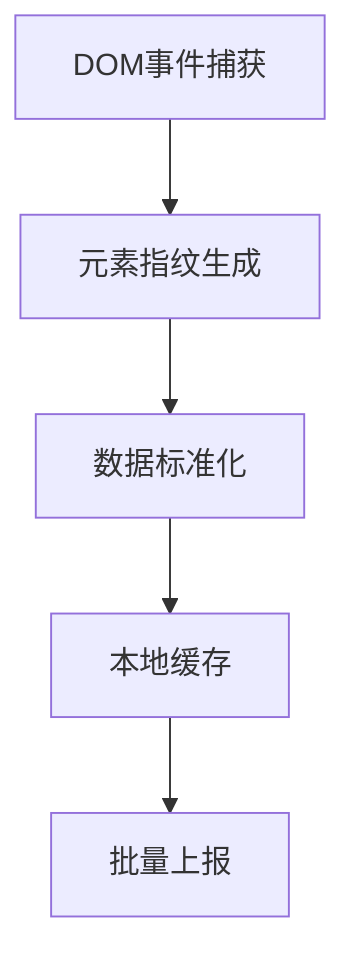

## 无痕埋点（无埋点/全量埋点）

以下是关于 **无痕埋点（无埋点/全量埋点）** 的深度解析与技术实现方案，涵盖其核心原理、技术实现、优缺点及生产环境优化策略：

---

### 一、无痕埋点核心原理


**核心思想**：通过全局监听用户行为（点击、滚动、输入等），自动采集所有交互事件，结合元素唯一标识和页面上下文信息，实现无需手动插码的全自动数据采集。

---

### 二、关键技术实现（TypeScript 版）

#### 1. **全局事件监听**
```typescript
// 监听所有交互事件
const trackEvents = ['click', 'change', 'submit', 'scroll'];
trackEvents.forEach(eventType => {
  document.addEventListener(eventType, (e) => {
    const target = e.target as HTMLElement;
    if (shouldTrack(target)) {
      sendTrackEvent({
        eventType,
        xpath: getXPath(target),
        text: extractText(target),
        timestamp: Date.now(),
        pageUrl: window.location.pathname
      });
    }
  }, true); // 使用捕获阶段确保不遗漏
});

// 判断是否需采集该元素
function shouldTrack(element: HTMLElement): boolean {
  const ignoreSelectors = ['.no-track', '[data-private]'];
  return !ignoreSelectors.some(sel => element.matches(sel));
}
```

#### 2. **元素唯一标识生成**
```typescript
// 生成元素指纹（XPath + CSS选择器双保险）
function getElementFingerprint(element: HTMLElement): string {
  return JSON.stringify({
    xpath: getXPath(element),
    cssSelector: getCssSelector(element),
    position: getRelativePosition(element),
    contentHash: hashString(element.textContent?.trim() || '')
  });
}

// 获取XPath（简化版）
function getXPath(element: HTMLElement): string {
  if (element.id) return `//*[@id="${element.id}"]`;

  const parts: string[] = [];
  let current: HTMLElement | null = element;
  while (current && current !== document.body) {
    let part = current.tagName.toLowerCase();
    if (current.className) {
      part += `[contains(@class,"${current.className.split(' ')[0]}")]`;
    }
    parts.unshift(part);
    current = current.parentElement;
  }
  return '/' + parts.join('/');
}
```

#### 3. **数据压缩与批量上报**
```typescript
// 使用 IndexedDB 缓存数据
class EventBuffer {
  private db: IDBDatabase | null = null;

  async init() {
    this.db = await openDB('event-buffer', 1, {
      upgrade(db) {
        db.createObjectStore('events', { autoIncrement: true });
      }
    });
  }

  async add(event: any) {
    await this.db?.put('events', event);
    this.checkFlush();
  }

  private async checkFlush() {
    const count = await this.db?.count('events');
    if (count && count >= 20) {
      this.flush();
    }
  }

  async flush() {
    const events = await this.db?.getAll('events');
    if (events?.length) {
      if (navigator.onLine) {
        await sendBatch(events);
        await this.db?.clear('events');
      }
    }
  }
}
```

---

### 三、生产环境优化策略

#### 1. **数据采样与过滤**
```typescript
// 动态采样率控制
function getSampleRate(eventType: string): number {
  const rates: Record<string, number> = {
    click: 0.2,      // 20%采集点击事件
    scroll: 0.1,     // 10%采集滚动
    change: 0.5      // 50%采集表单变更
  };
  return rates[eventType] || 0.1;
}

// 采样判断
function shouldSample(eventType: string): boolean {
  return Math.random() < getSampleRate(eventType);
}
```

#### 2. **敏感信息处理**
```typescript
// 自动过滤敏感字段
function sanitizeInput(target: HTMLInputElement) {
  const type = target.type.toLowerCase();
  if (type === 'password') return '[MASKED]';
  if (type === 'email') return target.value.replace(/(.{2}).+@(.+)/, '$1***@$2');
  return target.value;
}
```

#### 3. **性能优化（防抖+节流）**
```typescript
// 高频事件节流处理
const throttledTrack = throttle((eventType, target) => {
  sendTrackEvent({ eventType, element: getElementFingerprint(target) });
}, 300);

// 滚动事件防抖
window.addEventListener('scroll', debounce(() => {
  trackScrollDepth();
}, 500));
```

---

### 四、与传统埋点对比

| **维度**         | **无痕埋点**                          | **代码埋点**                      |
|------------------|---------------------------------------|-----------------------------------|
| 实施成本         | 低（一次接入）                        | 高（需每个事件手动编码）          |
| 数据完整性       | 全量数据（可能含噪音）                | 精准数据（仅目标事件）            |
| 可维护性         | 高（无需随业务变更调整）              | 低（需同步业务逻辑修改）          |
| 数据分析难度     | 高（需后期过滤清洗）                  | 低（数据结构明确）                |
| 适用阶段         | 探索期/未知行为分析                   | 成熟期/核心转化监控               |

---

### 五、典型应用场景

#### 1. **用户行为路径分析**
```typescript
// 记录页面跳转路径
let lastPage = '';
window.addEventListener('popstate', () => {
  trackNavigation(lastPage, location.pathname);
  lastPage = location.pathname;
});
```

#### 2. **热力图生成**
```typescript
// 收集点击坐标
document.addEventListener('click', (e) => {
  sendHeatmapData({
    x: e.pageX,
    y: e.pageY,
    screen: `${window.innerWidth}x${window.innerHeight}`,
    page: location.pathname
  });
});
```

#### 3. **表单流失分析**
```typescript
// 监控表单放弃行为
const form = document.querySelector('form');
let startTime = 0;

form?.addEventListener('focus', () => {
  startTime = Date.now();
}, true);

form?.addEventListener('blur', () => {
  const duration = Date.now() - startTime;
  if (duration > 5000 && !formSubmitted) {
    trackFormAbandon();
  }
}, true);
```

---

### 六、前沿技术结合

#### 1. **AI 元素重要性分析**
```typescript
// 使用机器学习模型预测高价值元素
import { predictImportantElements } from 'ai-tracker';

predictImportantElements(document.body).then(elements => {
  elements.forEach(el => el.setAttribute('data-track-priority', 'high'));
});
```

#### 2. **Web Components 支持**
```typescript
// 自定义元素特殊处理
customElements.define('my-button', class extends HTMLElement {
  connectedCallback() {
    this.addEventListener('click', () => {
      trackCustomElement(this.getAttribute('action-type'));
    });
  }
});
```

#### 3. **与 RUM 集成**
```typescript
// 关联性能指标与用户行为
performance.mark('checkout_start');
trackUserFlow('begin_checkout');
```

---

### 七、实施建议

1. **分层采集策略**
    - 基础层：无痕采集全量交互事件
    - 业务层：关键事件手动埋点补充
    - 核心层：性能/错误监控独立通道

2. **数据治理流程**
   ```mermaid
   graph LR
       A[原始日志] --> B[实时过滤]
       B --> C[离线清洗]
       C --> D[特征提取]
       D --> E[分析建模]
   ```

3. **合规性保障**
    - 数据采集前获取用户授权
    - 提供实时关闭采集的开关
    - 内置敏感字段自动脱敏规则

---

通过无痕埋点方案，企业可以快速构建用户行为大数据平台，但需注意：
- **数据爆炸问题**：需配套强大的实时计算和存储能力
- **隐私合规风险**：需与法务团队共同设计采集边界
- **信号噪音比**：需结合业务知识进行后期数据清洗

建议初期采用 **无痕埋点+核心代码埋点** 的混合模式，平衡数据全面性与分析效率。
