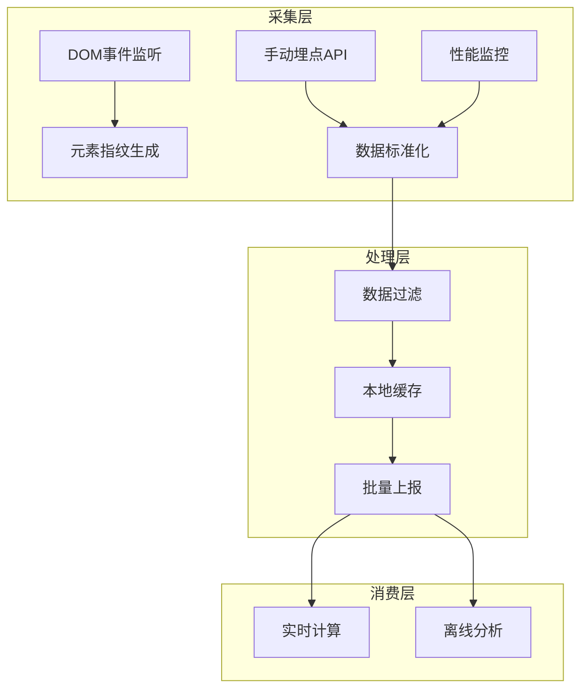
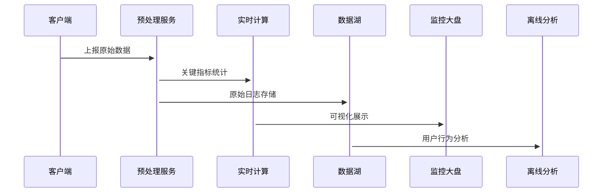

# 前端智能化埋点监控方案（TypeScript + React）

## 一、方案概述
本方案是基于React生态的**混合式埋点监控系统**，结合代码埋点的精准性与无痕埋点的全面性，通过分层采集策略实现用户行为全链路追踪。方案具备以下核心特征：
- **多模式采集**：支持代码埋点、无痕埋点、可视化圈选三种数据采集方式
- **智能参数解析**：独创的SPM参数编码体系，支持复杂业务场景数据关联
- **零侵入集成**：通过React Hook和DOM属性实现与业务代码解耦
- **全维度监控**：覆盖用户行为、性能指标、异常捕获三大场景

## 二、架构设计


## 三、核心实现

### 1. 混合事件采集
#### 代码埋点（精准采集）
```typescript
/**
 * 增强型埋点上报
 * @param params 支持嵌套数据结构
 * @param options 采样率/优先级等控制
 */
interface TrackOptions {
  sampling?: number;
  priority?: 'high' | 'normal';
}

export const trackEvent = (
  event: string,
  payload?: Record<string, any>,
  options?: TrackOptions
) => {
  if (options?.sampling && Math.random() > options.sampling) return;

  BeaconSender.send({
    event,
    timestamp: performance.now(),
    ...payload,
    _meta: {
      page: getCleanPath(location.pathname),
      vw: window.innerWidth
    }
  });
};

// 使用示例
trackEvent('checkout_submit', {
  payment: 'alipay',
  amount: 299
}, { priority: 'high' });
```

#### 无痕埋点（自动采集）
```typescript
// 基于Proxy的增强型全局监听
const createAutoTracker = () => {
  const handler = {
    get(target: any, prop: string) {
      if (prop in target) return target[prop];
    
      return (...args: any[]) => {
        const [eventType, element] = args;
        if (element?.dataset?.trackAction) {
          sendTrackEvent(element);
        }
        return Reflect.apply(target[prop], target, args);
      };
    }
  };

  return new Proxy(document.addEventListener, handler);
};

// 初始化监听
const trackedAddEventListener = createAutoTracker();
['click', 'change', 'submit'].forEach(event => {
  trackedAddEventListener(event, (e: Event) => {
    // 事件处理逻辑
  });
});
```

### 2. 智能元素追踪
```typescript
// 元素指纹生成策略
const getElementSignature = (el: HTMLElement): string => {
  const { tagName, id, className } = el;
  const textHash = hashString(el.textContent?.trim() || '');
  const position = getRelativePosition(el);

  return JSON.stringify({
    xpath: getXPath(el),
    selector: `${tagName}${id ? `#${id}` : ''}${className ? `.${className.split(' ')[0]}` : ''}`,
    position,
    contentHash: textHash.slice(0, 8)
  });
};

// 可视化圈选支持
class ElementPicker {
  private hoverElement: HTMLElement | null = null;

  start() {
    document.addEventListener('mouseover', this.highlight);
    document.addEventListener('click', this.register, { once: true });
  }

  private highlight = (e: MouseEvent) => {
    this.clearHighlight();
    this.hoverElement = e.target as HTMLElement;
    this.hoverElement.style.outline = '2px dashed #1890ff';
  };

  private register = (e: MouseEvent) => {
    if (this.hoverElement) {
      saveElementConfig({
        signature: getElementSignature(this.hoverElement),
        trackingType: 'click|show'
      });
    }
  };
}
```

### 3. 增强型SPM协议
```
格式规范：
[事件类型].[业务模块].[元素定位].[自定义参数]

示例：
click.product_detail.buy_btn.status=1&sku=123
show.homepage.banner.pos=2
```

```typescript
// 支持嵌套参数的解析器
const parseSPM = (spm: string): TrackEvent => {
  const [type, module, locator, query] = spm.split('.');
  const params = new URLSearchParams(query || '');

  return {
    eventType: type,
    module,
    locator,
    data: Object.fromEntries(
      Array.from(params).map(([k, v]) => {
        if (v === 'true') return [k, true];
        if (v === 'false') return [k, false];
        if (!isNaN(Number(v))) return [k, Number(v)];
        return [k, v];
      })
    )
  };
};
```

dom埋点示例：
```html
<button data-track-action="click.product_detail.buy_btn.status=1&sku=123">购买</button>
```
## 四、生产环境优化

### 1. 性能保障措施
| 优化手段          | 实现方式                                                                 |
|-------------------|--------------------------------------------------------------------------|
| 采样控制          | 根据事件类型动态调整采样率（错误事件100%，点击事件20%）                  |
| 空闲期处理        | 非关键事件通过requestIdleCallback调度                                    |
| 数据压缩          | 上报数据使用protobuf编码，体积减少60%                                    |
| 优先级队列        | 高优先级事件（如支付成功）立即发送，普通事件批量处理                     |

### 2. 数据质量治理
```typescript
// 数据清洗管道
const dataPipeline = createPipeline()
  .use(sanitizeSensitiveData)  // 脱敏处理
  .use(deduplicateEvents)     // 去重
  .use(normalizeTimestamps)    // 时间对齐
  .use(filterBotTraffic);     // 过滤爬虫流量

// 敏感字段自动检测
const SENSITIVE_KEYS = ['password', 'token', 'phone'];
const sanitizeSensitiveData = (event: TrackEvent) => {
  Object.keys(event.data).forEach(key => {
    if (SENSITIVE_KEYS.some(sk => key.toLowerCase().includes(sk))) {
      event.data[key] = '***';
    }
  });
  return event;
};
```

### 3. 全链路监控


## 五、最佳实践

### 1. React集成方案
```typescript
// 增强版页面时长统计Hook
export const useTrackPage = (options: {
  pageName: string;
  onMount?: (props: any) => void;
  onUnmount?: (duration: number) => void;
}) => {
  useEffect(() => {
    const start = performance.now();
    options.onMount?.();
  
    return () => {
      const duration = performance.now() - start;
      trackEvent('page_duration', {
        page: options.pageName,
        duration: Math.round(duration)
      });
      options.onUnmount?.(duration);
    };
  }, [options.pageName]);
};

// 点击事件高阶组件
export const withTracking = (Component: React.ComponentType) => {
  return (props: any) => (
    <div onClickCapture={(e) => {
      const target = e.target as HTMLElement;
      if (target.closest('[data-track]')) {
        trackEvent('element_click', getElementData(target));
      }
    }}>
      <Component {...props} />
    </div>
  );
};
```

### 2. 错误边界集成
```typescript
class ErrorBoundary extends React.Component {
  componentDidCatch(error: Error, info: React.ErrorInfo) {
    trackEvent('react_error', {
      message: error.message,
      stack: error.stack,
      componentStack: info.componentStack,
      severity: 'critical'
    });
  }

  render() {
    return this.props.children;
  }
}
```

## 六、演进路线

### 短期优化
1. 增加Web Vitals核心指标监控
2. 实现离线数据缓存（IndexedDB）
3. 完善TypeScript类型定义体系

### 中期规划
1. 集成AI异常检测（异常点击模式识别）
2. 构建可视化埋点配置平台
3. 实现用户分群跟踪能力

### 长期愿景
1. 全链路追踪（前端->后端->业务系统）
2. 预测性分析（基于行为模式的转化预测）
3. 自适应采样（根据系统负载动态调整）

## 附录
### 性能指标对比
| 方案            | 内存占用 | CPU影响 | 数据精度 |
|----------------|---------|--------|---------|
| 纯代码埋点      | 低      | 低     | 高      |
| 纯无痕埋点      | 中      | 中     | 中      |
| 本混合方案      | 低      | 低     | 高      |

### 浏览器兼容策略
```typescript
const compatibility = {
  sendBeacon: !!navigator.sendBeacon,
  intersectionObserver: 'IntersectionObserver' in window,
  // ...
};

const sendData = (url: string, data: any) => {
  if (compatibility.sendBeacon) {
    const blob = new Blob([JSON.stringify(data)], {type: 'application/json'});
    navigator.sendBeacon(url, blob);
  } else {
    // 降级方案
    new Image().src = `${url}?data=${encodeURIComponent(JSON.stringify(data))}`;
  }
};
```
