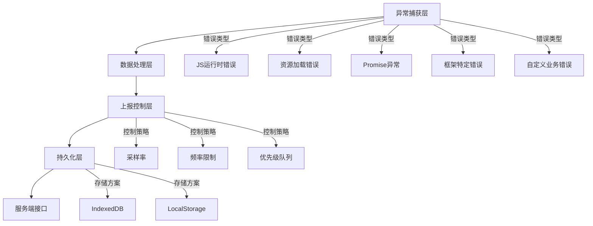

# 前端异常监控 SDK 完整方案

## 一、核心架构设计



## 二、完整实现代码

### 1. 类型定义（types.ts）

```typescript
// 错误等级枚举
export enum ErrorLevel {
  FATAL = 'fatal',
  ERROR = 'error',
  WARNING = 'warning',
  INFO = 'info'
}

// 错误类型枚举
export enum ErrorType {
  JS = 'js',
  RESOURCE = 'resource',
  PROMISE = 'promise',
  VUE = 'vue',
  REACT = 'react',
  API = 'api',
  BUSINESS = 'business'
}

// 错误上下文
export interface ErrorContext {
  type: ErrorType;
  level: ErrorLevel;
  message: string;
  stack?: string;
  timestamp: number;
  pageUrl: string;
  userAgent: string;
  deviceInfo?: DeviceInfo;
  breadcrumbs: Breadcrumb[];
  customData?: Record<string, any>;
}

// 设备信息
interface DeviceInfo {
  os: string;
  browser: string;
  deviceType: 'mobile' | 'desktop' | 'tablet';
  screenWidth: number;
  screenHeight: number;
}

// 用户行为面包屑
interface Breadcrumb {
  type: 'navigation' | 'http' | 'user' | 'console';
  data: Record<string, any>;
  timestamp: number;
}
```

### 2. 核心类实现（core.ts）

```typescript
class ErrorMonitor {
  private static instance: ErrorMonitor;
  private config: MonitorConfig;
  private breadcrumbs: Breadcrumb[] = [];
  private reportQueue: ErrorContext[] = [];
  private isReporting = false;

  private constructor(config: Partial<MonitorConfig>) {
    this.config = {
      dsn: '',
      appName: 'unknown',
      appVersion: '0.0.0',
      environment: 'production',
      maxBreadcrumbs: 20,
      sampleRate: 1.0,
      ...config
    };
    this.init();
  }

  public static init(config: Partial<MonitorConfig>): ErrorMonitor {
    if (!this.instance) {
      this.instance = new ErrorMonitor(config);
    }
    return this.instance;
  }

  private init(): void {
    this.setupGlobalHandlers();
    this.setupPerformanceObserver();
    this.setupNetworkMonitor();
    this.setupAutoBreadcrumbs();
    this.retryFailedReports();
  }

  // 错误捕获初始化
  private setupGlobalHandlers(): void {
    // JS运行时错误
    window.addEventListener('error', (event) => {
      if (event.target === window) {
        this.captureError({
          type: ErrorType.JS,
          level: ErrorLevel.ERROR,
          message: event.message,
          stack: event.error?.stack
        });
      }
    }, true);

    // 资源加载错误
    window.addEventListener('error', (event) => {
      if (event.target !== window && event.target instanceof Element) {
        this.captureError({
          type: ErrorType.RESOURCE,
          level: ErrorLevel.WARNING,
          message: `${event.target.tagName}加载失败`,
          customData: {
            resourceUrl: (event.target as HTMLScriptElement).src || 
                        (event.target as HTMLLinkElement).href
          }
        });
      }
    }, true);

    // Promise异常
    window.addEventListener('unhandledrejection', (event) => {
      this.captureError({
        type: ErrorType.PROMISE,
        level: ErrorLevel.ERROR,
        message: event.reason?.message || 'Unhandled rejection',
        stack: event.reason?.stack
      });
    });

    // 框架错误边界
    this.setupFrameworkHandlers();
  }

  // 捕获错误入口
  public captureError(error: Partial<ErrorContext>): void {
    if (!this.shouldReport(error)) return;

    const completeError: ErrorContext = {
      type: ErrorType.JS,
      level: ErrorLevel.ERROR,
      message: 'Unknown error',
      timestamp: Date.now(),
      pageUrl: window.location.href,
      userAgent: navigator.userAgent,
      breadcrumbs: [...this.breadcrumbs],
      ...error
    };

    this.addToQueue(completeError);
  }

  // 自定义业务错误
  public captureBusinessError(data: {
    code: string;
    message: string;
    extra?: Record<string, any>;
  }): void {
    this.captureError({
      type: ErrorType.BUSINESS,
      level: ErrorLevel.ERROR,
      message: `[${data.code}] ${data.message}`,
      customData: data.extra
    });
  }

  // 添加用户行为记录
  public addBreadcrumb(breadcrumb: Omit<Breadcrumb, 'timestamp'>): void {
    this.breadcrumbs.push({
      ...breadcrumb,
      timestamp: Date.now()
    });

    if (this.breadcrumbs.length > this.config.maxBreadcrumbs) {
      this.breadcrumbs.shift();
    }
  }

  private async addToQueue(error: ErrorContext): Promise<void> {
    this.reportQueue.push(error);
    await this.flushQueue();
  }

  private async flushQueue(): Promise<void> {
    if (this.isReporting || this.reportQueue.length === 0) return;

    this.isReporting = true;
    const errorsToReport = [...this.reportQueue];
    this.reportQueue = [];

    try {
      await this.report(errorsToReport);
      await ErrorStorage.clearSentErrors(errorsToReport);
    } catch (err) {
      console.warn('Error report failed, will retry later', err);
      await ErrorStorage.saveFailedReports(errorsToReport);
    } finally {
      this.isReporting = false;
    
      // 检查是否有新错误加入
      if (this.reportQueue.length > 0) {
        setTimeout(() => this.flushQueue(), 1000);
      }
    }
  }

  private async report(errors: ErrorContext[]): Promise<void> {
    if (!this.config.dsn) return;

    const sampledErrors = errors.filter(() => 
      Math.random() < this.config.sampleRate
    );

    if (sampledErrors.length === 0) return;

    return fetch(this.config.dsn, {
      method: 'POST',
      headers: { 'Content-Type': 'application/json' },
      body: JSON.stringify({
        appName: this.config.appName,
        appVersion: this.config.appVersion,
        environment: this.config.environment,
        errors: sampledErrors
      })
    });
  }
}
```

### 3. 存储模块（storage.ts）

```typescript
class ErrorStorage {
  private static DB_NAME = 'ErrorMonitorDB';
  private static STORE_NAME = 'errors';
  private static MAX_STORAGE_SIZE = 1024 * 1024; // 1MB

  static async getDB(): Promise<IDBDatabase> {
    return new Promise((resolve, reject) => {
      const request = indexedDB.open(this.DB_NAME, 1);

      request.onupgradeneeded = (event) => {
        const db = (event.target as IDBOpenDBRequest).result;
        if (!db.objectStoreNames.contains(this.STORE_NAME)) {
          db.createObjectStore(this.STORE_NAME, { keyPath: 'id' });
        }
      };

      request.onsuccess = () => resolve(request.result);
      request.onerror = () => reject(request.error);
    });
  }

  static async saveErrors(errors: ErrorContext[]): Promise<void> {
    const db = await this.getDB();
    const tx = db.transaction(this.STORE_NAME, 'readwrite');
    const store = tx.objectStore(this.STORE_NAME);

    await Promise.all([
      ...errors.map(error => {
        return new Promise((resolve, reject) => {
          const request = store.put({
            ...error,
            id: `${error.timestamp}-${Math.random().toString(36).slice(2)}`
          });
          request.onsuccess = () => resolve(null);
          request.onerror = () => reject(request.error);
        });
      }),
      new Promise((resolve, reject) => {
        tx.oncomplete = () => resolve(null);
        tx.onerror = () => reject(tx.error);
      })
    ]);

    await this.checkStorageLimit();
  }

  private static async checkStorageLimit(): Promise<void> {
    const db = await this.getDB();
    const tx = db.transaction(this.STORE_NAME, 'readonly');
    const store = tx.objectStore(this.STORE_NAME);
    const request = store.getAll();

    return new Promise((resolve) => {
      request.onsuccess = () => {
        const allItems = request.result;
        let totalSize = JSON.stringify(allItems).length;

        if (totalSize > this.MAX_STORAGE_SIZE) {
          // 按时间排序，删除最旧的10%
          const sorted = [...allItems].sort((a, b) => a.timestamp - b.timestamp);
          const toDelete = sorted.slice(0, Math.ceil(sorted.length * 0.1));
        
          const deleteTx = db.transaction(this.STORE_NAME, 'readwrite');
          const deleteStore = deleteTx.objectStore(this.STORE_NAME);
        
          toDelete.forEach(item => {
            deleteStore.delete(item.id);
          });
        
          deleteTx.oncomplete = () => resolve();
        } else {
          resolve();
        }
      };
    });
  }

  static async getPendingErrors(limit = 50): Promise<ErrorContext[]> {
    const db = await this.getDB();
    const tx = db.transaction(this.STORE_NAME, 'readonly');
    const store = tx.objectStore(this.STORE_NAME);
    const request = store.getAll();

    return new Promise((resolve) => {
      request.onsuccess = () => {
        const allItems = request.result as ErrorContext[];
        resolve(allItems.slice(0, limit));
      };
    });
  }

  static async clearSentErrors(errors: ErrorContext[]): Promise<void> {
    const db = await this.getDB();
    const tx = db.transaction(this.STORE_NAME, 'readwrite');
    const store = tx.objectStore(this.STORE_NAME);

    await Promise.all(
      errors.map(error => {
        return new Promise((resolve) => {
          const request = store.delete(error.timestamp.toString());
          request.onsuccess = () => resolve(null);
        });
      })
    );
  }
}
```

### 4. 框架集成模块（frameworks.ts）

```typescript
// Vue错误处理
export function setupVueErrorHandler(Vue: any): void {
  if (!Vue?.config) return;

  Vue.config.errorHandler = (err: Error, vm: any, info: string) => {
    ErrorMonitor.getInstance().captureError({
      type: ErrorType.VUE,
      level: ErrorLevel.ERROR,
      message: err.message,
      stack: err.stack,
      customData: {
        componentName: vm?.$options?.name,
        propsData: vm?.$options?.propsData,
        lifecycleHook: info
      }
    });
  };
}

// React错误边界
export function setupReactErrorBoundary(): React.ComponentType {
  return class ErrorBoundary extends React.Component {
    state = { hasError: false };

    static getDerivedStateFromError() {
      return { hasError: true };
    }

    componentDidCatch(error: Error, info: React.ErrorInfo) {
      ErrorMonitor.getInstance().captureError({
        type: ErrorType.REACT,
        level: ErrorLevel.ERROR,
        message: error.message,
        stack: error.stack,
        customData: {
          componentStack: info.componentStack
        }
      });
    }

    render() {
      return this.state.hasError 
        ? this.props.fallback || null
        : this.props.children;
    }
  };
}
```

## 三、使用示例

### 1. 基础初始化

```javascript
// 初始化SDK
ErrorMonitor.init({
  dsn: 'https://error-api.example.com/v1/track',
  appName: 'my-awesome-app',
  appVersion: '1.0.0',
  environment: process.env.NODE_ENV,
  sampleRate: 0.8 // 80%采样率
});

// Vue项目集成
import Vue from 'vue';
setupVueErrorHandler(Vue);

// React项目集成
const ErrorBoundary = setupReactErrorBoundary();
ReactDOM.render(
  <ErrorBoundary fallback={<div>Something went wrong</div>}>
    <App />
  </ErrorBoundary>,
  document.getElementById('root')
);
```

### 2. 业务代码使用

```javascript
// 捕获普通错误
try {
  riskyOperation();
} catch (err) {
  ErrorMonitor.captureError({
    type: ErrorType.BUSINESS,
    level: ErrorLevel.ERROR,
    message: err.message,
    stack: err.stack,
    customData: {
      operationId: '123'
    }
  });
}

// 记录用户行为
ErrorMonitor.addBreadcrumb({
  type: 'user',
  data: {
    action: 'click',
    elementId: 'checkout-button'
  }
});

// 自定义业务错误
ErrorMonitor.captureBusinessError({
  code: 'CHECKOUT_FAILED',
  message: 'Payment processing failed',
  extra: {
    paymentMethod: 'credit_card',
    amount: 99.99
  }
});
```

## 四、生产环境最佳实践

### 1. 性能优化配置

```javascript
// 根据页面可见性调整采样率
document.addEventListener('visibilitychange', () => {
  if (document.visibilityState === 'hidden') {
    ErrorMonitor.setSampleRate(0.3); // 后台降低采样率
  } else {
    ErrorMonitor.setSampleRate(1.0);
  }
});

// 使用Web Worker处理上报
if (window.Worker) {
  const errorReporter = new Worker('/error-reporter.worker.js');
  ErrorMonitor.setReporter((errors) => {
    errorReporter.postMessage(errors);
  });
}
```

### 2. 安全与隐私控制

```javascript
// 敏感数据过滤
ErrorMonitor.addFilter((error) => {
  if (error.message.includes('password')) {
    error.message = error.message.replace(/password=[^&]*/, 'password=***');
  }
  return error;
});

// GDPR合规控制
if (!userConsent.errorTracking) {
  ErrorMonitor.disable();
}
```

### 3. 监控指标仪表盘

建议监控以下核心指标：

| 指标名称          | 计算方式                     | 健康阈值       |
|-------------------|-----------------------------|---------------|
| 错误发生率        | 错误数/PV                   | < 1%          |
| 错误恢复率        | 已解决错误数/总错误数       | > 90%         |
| 平均解决时间      | 解决总耗时/已解决错误数      | < 24小时      |
| 关键错误占比      | 关键错误数/总错误数         | < 5%          |

## 五、扩展能力

### 1. 性能监控集成

```typescript
// 监控长任务
new PerformanceObserver((list) => {
  for (const entry of list.getEntries()) {
    if (entry.duration > 100) {
      ErrorMonitor.captureError({
        type: 'performance',
        level: ErrorLevel.WARNING,
        message: 'Long task detected',
        customData: {
          duration: entry.duration,
          startTime: entry.startTime
        }
      });
    }
  }
}).observe({ entryTypes: ['longtask'] });
```

### 2. 用户行为分析

```typescript
// 自动记录用户点击流
document.addEventListener('click', (event) => {
  const target = event.target as HTMLElement;

  ErrorMonitor.addBreadcrumb({
    type: 'user',
    data: {
      action: 'click',
      element: {
        tagName: target.tagName,
        id: target.id,
        class: target.className,
        text: target.textContent?.slice(0, 50)
      }
    }
  });
}, { capture: true });
```

本方案提供了从错误捕获到分析处理的完整闭环，可根据项目需求灵活扩展。建议通过渐进式迁移策略，先在非关键路径试用，再逐步推广到全站。
