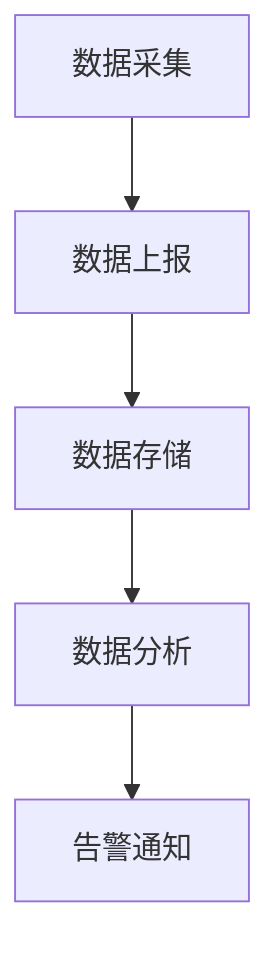

## 7. 如何做好前端监控方案
构建完善的前端监控方案需要覆盖 **性能监控**、**错误追踪**、**用户行为分析** 和 **数据可视化** 等多个维度。以下是经过大型项目验证的完整方案设计（含 TypeScript 实现示例）：

---

### 一、监控架构设计


---

### 二、核心监控模块实现

#### 1. 性能监控（Performance API）
> `Performance.timing`将被弃用，升级请参考[`Performance.timing` api 升级方案](./07-1.md)
```typescript
// 关键性能指标采集
const monitorPerformance = () => {
  const timing = performance.timing;
  const metrics = {
    DNS查询: timing.domainLookupEnd - timing.domainLookupStart,
    TCP连接: timing.connectEnd - timing.connectStart,
    白屏时间: timing.responseStart - timing.navigationStart,
    DOM解析: timing.domComplete - timing.domInteractive,
    页面完全加载: timing.loadEventEnd - timing.navigationStart,
    FP: performance.getEntriesByName('first-paint')[0]?.startTime,
    FCP: performance.getEntriesByName('first-contentful-paint')[0]?.startTime,
    LCP: performance.getEntriesByType('largest-contentful-paint')[0]?.startTime,
  };

  sendToAnalytics('performance', metrics);
};

// 使用 PerformanceObserver 监听动态指标
const perfObserver = new PerformanceObserver((list) => {
  list.getEntries().forEach(entry => {
    if (entry.entryType === 'longtask') {
      sendToAnalytics('longtask', {
        duration: entry.duration,
        startTime: entry.startTime
      });
    }
  });
});
perfObserver.observe({ entryTypes: ['longtask'] });
```

#### 2. 错误监控（同步/异步错误）
```typescript
// 全局错误捕获
window.addEventListener('error', (event) => {
  sendToAnalytics('error', {
    msg: event.message,
    file: event.filename,
    line: event.lineno,
    col: event.colno,
    stack: event.error?.stack
  });
  return true; // 阻止默认错误提示
});

// Promise 错误
window.addEventListener('unhandledrejection', (event) => {
  sendToAnalytics('promise_error', {
    reason: event.reason?.toString(),
    stack: event.reason?.stack
  });
});

// 封装 try-catch 自动上报
function withErrorTracking<T extends any[], R>(fn: (...args: T) => R) {
  return (...args: T): R => {
    try {
      return fn(...args);
    } catch (err) {
      sendToAnalytics('function_error', {
        name: fn.name,
        args: JSON.stringify(args),
        error: err?.toString(),
        stack: err?.stack
      });
      throw err;
    }
  };
}
```

#### 3. 用户行为追踪
```typescript
// PV/UV 统计
history.pushState = new Proxy(history.pushState, {
  apply: (target, thisArg, argArray) => {
    sendToAnalytics('route_change', {
      from: location.pathname,
      to: argArray[2]
    });
    return target.apply(thisArg, argArray);
  }
});

// 点击热力图
document.addEventListener('click', (e) => {
  const target = e.target as HTMLElement;
  sendToAnalytics('click_heatmap', {
    x: e.pageX,
    y: e.pageY,
    element: getXPath(target),
    text: target.innerText?.slice(0, 50)
  });
}, { capture: true });

// 自定义埋点装饰器
function track(eventName: string) {
  return (target: any, key: string, descriptor: PropertyDescriptor) => {
    const original = descriptor.value;
    descriptor.value = function(...args: any[]) {
      sendToAnalytics(eventName, { args });
      return original.apply(this, args);
    };
    return descriptor;
  };
}
```

#### 4. 资源加载监控
```typescript
new PerformanceObserver((list) => {
  list.getEntries().forEach(entry => {
    if (entry.initiatorType === 'script') {
      sendToAnalytics('resource_load', {
        name: entry.name,
        duration: entry.duration,
        size: entry.decodedBodySize
      });
    }
  });
}).observe({ type: 'resource' });
```

---

### 三、数据上报优化策略

#### 1. 节流上报 + 本地缓存
```typescript
class Reporter {
  private cache: any[] = [];
  private timer: NodeJS.Timeout | null = null;

  send(data: any) {
    this.cache.push(data);
  
    if (this.cache.length > 10) {
      this.flush(); // 达到阈值立即上报
    } else if (!this.timer) {
      this.timer = setTimeout(() => this.flush(), 5000); // 5秒延迟上报
    }
  }

  private flush() {
    if (navigator.onLine) {
      sendBeacon('/api/log', this.cache);
      this.cache = [];
    } else {
      // 离线时存入 IndexedDB
      saveToIndexedDB(this.cache);
    }
    this.timer && clearTimeout(this.timer);
    this.timer = null;
  }
}
```

#### 2. 请求优化（优先使用 Beacon API）
```typescript
function sendBeacon(url: string, data: any) {
  if (navigator.sendBeacon) {
    const blob = new Blob([JSON.stringify(data)], { type: 'application/json' });
    return navigator.sendBeacon(url, blob);
  } else {
    // 降级方案
    const img = new Image();
    img.src = `${url}?data=${encodeURIComponent(JSON.stringify(data))}`;
  }
}
```

---

### 四、监控平台关键技术选型

| 模块         | 推荐方案                                                                 |
|--------------|--------------------------------------------------------------------------|
| 前端 SDK     | Sentry / 自研 TypeScript SDK                                            |
| 实时处理     | Kafka + Flink                                                           |
| 存储分析     | Elasticsearch（日志） + InfluxDB（性能指标） + ClickHouse（用户行为）   |
| 可视化       | Grafana（指标） + Kibana（日志） + 自研数据看板                         |
| 异常告警     | 企业微信/钉钉机器人 + 邮件 + PagerDuty                                  |

---

### 五、生产环境最佳实践

#### 1. 采样率控制
```typescript
// 根据错误级别动态采样
function shouldSample(error: Error): boolean {
  if (error instanceof CriticalError) return true;
  return Math.random() < 0.1; // 10%采样率
}
```

#### 2. 敏感数据过滤
```typescript
// 上报前数据清洗
function sanitize(data: any) {
  const cloned = deepClone(data);
  // 移除密码字段
  if (cloned.url.includes('/login')) {
    delete cloned.body?.password;
  }
  // 过滤 PII 数据
  return removePII(cloned);
}
```

#### 3. SourceMap 映射
```bash
# 使用 sentry-cli 上传 sourcemap
sentry-cli releases files VERSION upload-sourcemaps ./dist --url-prefix '~/static/js'
```

#### 4. 性能基线报警
```typescript
// 基于历史数据的异常检测
function checkPerformance(metrics: Record<string, number>) {
  const baselines = loadBaselines();
  Object.entries(metrics).forEach(([key, value]) => {
    if (value > baselines[key] * 1.5) {
      triggerAlert(`性能退化: ${key} 当前值 ${value}ms`);
    }
  });
}
```

---

### 六、扩展高级功能

#### 1. 用户会话回放
```typescript
// 使用 rrweb 录制用户操作
import { record } from 'rrweb';

let stopRecording = record({
  emit(event) {
    if (events.length > 100) {
      sendToAnalytics('session_replay', events);
      events = [];
    }
  },
});
```

#### 2. 前端日志分级
```typescript
enum LogLevel {
  DEBUG = 0,
  INFO = 1,
  WARN = 2,
  ERROR = 3
}

class Logger {
  constructor(private level: LogLevel) {}

  debug(...args: any[]) {
    if (this.level <= LogLevel.DEBUG) {
      sendToAnalytics('debug', args);
    }
  }
}
```

#### 3. 前后端链路追踪
```typescript
// 生成唯一 TraceID
const traceId = generateTraceId();

// 所有请求带上 TraceID
axios.interceptors.request.use(config => {
  config.headers['X-Trace-ID'] = traceId;
  return config;
});
```

---

### 七、数据指标看板示例

**核心监控指标**：
1. **稳定性**
    - JS 错误率 = 错误次数 / PV
    - 接口错误率 = 接口错误数 / 总请求数

2. **性能**
    - LCP ≤ 2.5s 达标率
    - FID ≤ 100ms 占比

3. **业务**
    - 关键路径转化率
    - 功能使用热力图

---

### 八、自研 vs 商用方案对比

| 维度         | 自研方案                          | Sentry/DataDog                    |
|--------------|-----------------------------------|-----------------------------------|
| 定制化       | ⭐⭐⭐⭐⭐                         | ⭐⭐                              |
| 成本         | 前期投入高                        | 按量付费                          |
| 功能完整性   | 需自行实现各模块                  | 开箱即用                          |
| 数据安全性   | 数据完全自主                      | 依赖第三方                        |
| 维护成本     | 需要专职团队                      | 厂商提供支持                      |

**推荐选择**：
- 大型/敏感项目 → 自研核心监控 + 商用方案补充
- 中小型项目 → 直接使用 Sentry + Performance Vitals

---

通过以上方案，可以构建覆盖全生命周期的前端监控体系。关键点在于：
1. **多维度数据采集** - 确保监控无死角
2. **智能降噪处理** - 避免报警风暴
3. **可视化关联分析** - 快速定位根因
4. **持续迭代优化** - 跟随业务演进


以下是前端监控方案的补充内容，重点覆盖 **数据存储优化**、**实时告警策略** 和 **可视化实践** 等深度内容：

---

### 九、数据存储与压缩优化
#### 1. 日志结构化设计（Elasticsearch Mapping）
```typescript
// 监控数据的索引模板
interface LogSchema {
  timestamp: Date;
  type: 'error' | 'perf' | 'behavior';
  appId: string;
  env: 'prod' | 'test';
  userId?: string;
  sessionId: string;
  data: {
    // 错误日志
    stack?: string;
    componentStack?: string;
    // 性能日志
    lcp?: number;
    cls?: number;
    // 行为日志
    clickPath?: string[];
  };
  // 地理信息
  geo?: {
    country: string;
    city: string;
  };
  // 设备信息
  device?: {
    type: 'mobile' | 'desktop';
    os: string;
    browser: string;
  };
}
```

#### 2. 冷热数据分离存储
```yaml
# Elasticsearch 生命周期管理配置
PUT _ilm/policy/logs_policy {
  "policy": {
    "phases": {
      "hot": {
        "actions": {
          "rollover": { "max_size": "50GB" }
        }
      },
      "warm": {
        "min_age": "7d",
        "actions": {
          "forcemerge": { "max_num_segments": 1 }
        }
      },
      "delete": {
        "min_age": "30d"
      }
    }
  }
}
```

#### 3. 前端数据压缩（Protocol Buffers）
```typescript
// 使用 protobuf 压缩上报数据
import { PerformanceLog } from './logs_pb';

const serializeLog = (data: any) => {
  const log = new PerformanceLog();
  log.setLcp(data.lcp);
  log.setUrl(data.url);
  return log.serializeBinary(); // 比 JSON 小 60%
};

// Web Worker 中处理压缩
const worker = new Worker('compress.worker.js');
worker.postMessage(logData);
```

---

### 十、智能告警策略
#### 1. 动态阈值告警（基于历史基线）
```python
# 使用移动平均算法计算阈值（Python 示例）
def calculate_threshold(metric_name):
    history_data = get_past_7days_data(metric_name)
    mean = np.mean(history_data)
    std = np.std(history_data)
    return mean + 3 * std  # 3σ原则
```

#### 2. 告警分级策略
```typescript
// 错误级别定义
enum AlertLevel {
  P0 = 'CRITICAL',    // 影响核心流程，如支付失败
  P1 = 'HIGH',        // 主要功能异常
  P2 = 'MEDIUM',      // 次要功能异常
  P3 = 'LOW'          // 轻微样式问题
}

const getAlertLevel = (error: ErrorData): AlertLevel => {
  if (error.url.includes('/checkout')) return AlertLevel.P0;
  if (error.stack.includes('NullPointer')) return AlertLevel.P1;
  return AlertLevel.P3;
};
```

#### 3. 告警聚合（防止风暴）
```go
// Go 实现的告警聚合服务（示例）
func aggregateAlerts(alerts []Alert) []Digest {
  grouped := make(map[string][]Alert)
  for _, alert := range alerts {
    key := fmt.Sprintf("%s_%s", alert.Type, alert.Service)
    grouped[key] = append(grouped[key], alert)
  }

  var digests []Digest
  for _, group := range grouped {
    digests = append(digests, Digest{
      Count:    len(group),
      Example:  group[0],
      LastTime: group[len(group)-1].Time,
    })
  }
  return digests
}
```

---

### 十一、可视化增强实践
#### 1. 错误热力图（D3.js 示例）
```typescript
// 基于页面DOM坐标的错误分布可视化
const drawHeatmap = (errors: ErrorData[]) => {
  const heatmapData = errors.map(e => ({
    x: e.domRect?.left,
    y: e.domRect?.top,
    value: 1
  }));

  const colorScale = d3.scaleSequential(d3.interpolateYlOrRd)
    .domain([0, d3.max(heatmapData, d => d.value)]);

  svg.selectAll('.error-point')
    .data(heatmapData)
    .enter()
    .append('circle')
    .attr('fill', d => colorScale(d.value))
    .attr('cx', d => xScale(d.x))
    .attr('cy', d => yScale(d.y));
};
```

#### 2. 性能趋势对比
```sql
-- ClickHouse 时序对比查询
SELECT 
    toStartOfHour(timestamp) AS time,
    avg(lcp) AS current_lcp,
    neighbor(current_lcp, -24) AS yesterday_lcp
FROM performance_logs
WHERE time > now() - 24 * 2
GROUP BY time
ORDER BY time
```

#### 3. 拓扑依赖图（ECharts 关系图）
```javascript
// 展示接口调用链路关系
option = {
  series: [{
    type: 'graph',
    layout: 'force',
    edges: apiDependencies.map(link => ({
      source: link.caller,
      target: link.callee,
      label: `${link.duration}ms`
    }))
  }]
}
```

---

### 十二、移动端专项监控
#### 1. 卡顿检测（RAF 计算帧率）
```typescript
let lastTime = performance.now();
let frameCount = 0;
const checkFPS = () => {
  frameCount++;
  const now = performance.now();
  if (now - lastTime >= 1000) {
    const fps = Math.round((frameCount * 1000) / (now - lastTime));
    if (fps < 25) reportJank({ fps });
    frameCount = 0;
    lastTime = now;
  }
  requestAnimationFrame(checkFPS);
};
```

#### 2. 内存警告监听
```typescript
// iOS 内存警告
window.addEventListener('memorywarning', () => {
  sendToAnalytics('memory_warning', { 
    deviceMemory: navigator.deviceMemory 
  });
});

// Android WebView 内存监控
const getMemoryUsage = () => {
  return (performance as any).memory?.usedJSHeapSize;
};
```

---

### 十三、监控数据安全措施
#### 1. 数据脱敏处理
```typescript
const sanitizeUrl = (url: string) => {
  return url.replace(/\/user\/\d+/g, '/user/{id}')
            .replace(/token=\w+/g, 'token={masked}');
};
```

#### 2. GDPR 合规方案
```typescript
// 用户授权检查
const canTrack = () => {
  return localStorage.getItem('consent') === 'true';
};

// 数据上报前过滤
if (canTrack() || isAnonymousError(error)) {
  sendToAnalytics(error);
}
```

#### 3. 数据传输加密
```bash
# 使用 OpenSSL 生成上报端证书
openssl req -x509 -newkey rsa:4096 -keyout key.pem -out cert.pem -days 365
```

---

### 十四、监控系统自检机制
#### 1. 心跳检测
```typescript
// 每5分钟发送心跳包
setInterval(() => {
  sendBeacon('/heartbeat', { 
    timestamp: Date.now(),
    sdkVersion: '1.2.0' 
  });
}, 5 * 60 * 1000);
```

#### 2. SDK 健康状态检查
```typescript
const diagnose = () => {
  return {
    storageAvailable: testLocalStorage(),
    beaconSupported: !!navigator.sendBeacon,
    networkStatus: navigator.onLine ? 'online' : 'offline'
  };
};
```

---

### 十五、前沿技术方向
1. **预测性监控**
   ```python
   # 使用 LSTM 预测性能趋势
   model = Sequential()
   model.add(LSTM(50, input_shape=(30, 1))) # 30天历史数据
   model.add(Dense(1))
   model.compile(loss='mae', optimizer='adam')
   ```

2. **可视化编程告警规则**
   ```javascript
   // 用户自定义告警条件
   const rule = {
     when: 'lcp > 2500 && country == "China"',
     then: 'trigger P1 alert'
   };
   ```

3. **边缘计算预处理**
   ```go
   // 在 CDN Edge Worker 中过滤无效数据
   addEventListener("fetch", (event) => {
     if (isSpamRequest(event.request)) {
       return new Response(null, { status: 204 });
     }
   });
   ```

---

通过以上方案，可构建出具备 **生产级可靠性**、**智能分析能力** 和 **持续演进潜力** 的前端监控体系。实际落地时建议分阶段实施：
1. **初期**：优先实现错误监控 + 核心性能指标
2. **中期**：增加用户行为分析 + 智能告警
3. **长期**：结合业务定制预测模型 + 全链路追踪
