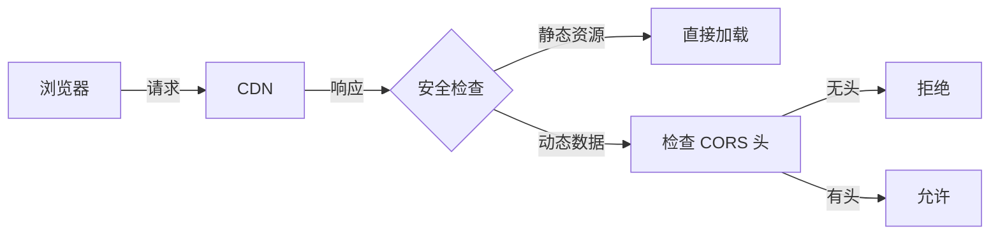

## 10. 浏览器有同源策略，但是为何 cdn 请求资源的时候不会有跨域限制

浏览器同源策略（Same-Origin Policy）确实存在，但 CDN 资源请求不受跨域限制的核心原因在于 **资源分类** 和 **CORS 机制** 的协同作用。以下是深度解析：

---

### 一、根本原因：同源策略的豁免范围
同源策略主要限制以下行为：
1. **数据访问**：`XMLHttpRequest`/`fetch` 请求响应
2. **DOM 操作**：`iframe` 跨域访问
3. **存储操作**：`localStorage`/`IndexedDB` 访问

**但以下资源默认豁免**：
- `<script src="...">`
- `<link rel="stylesheet" href="...">`
- ``, `<video>`, `<audio>`
- `<iframe>` (部分限制)
- 字体文件（需 CORS）

---

### 二、CDN 资源加载原理
#### 1. 静态资源标签的天然跨域
```html
<!-- 这些标签加载 CDN 资源时不受同源策略限制 -->
<script src="https://cdn.example.com/jquery.js"></script>
<link rel="stylesheet" href="https://cdn.example.com/style.css">

```

#### 2. 资源类型与限制对比
| 资源类型       | 默认跨域 | 特殊限制                  |
|----------------|----------|---------------------------|
| JS/CSS         | ✅ 允许  | 无                        |
| 图片/音视频    | ✅ 允许  | 无                        |
| 字体文件       | ❌ 禁止  | 需 CDN 返回 `Access-Control-Allow-Origin` |
| JSON/XHR       | ❌ 禁止  | 需 CORS 或 JSONP          |

---

### 三、关键机制：CORS 与 CDN 配置
当涉及需要跨域访问的内容时（如字体、XHR），CDN 会通过以下方式解决：

#### 1. CORS 响应头配置
CDN 服务商会自动添加响应头：
```http
Access-Control-Allow-Origin: *
Access-Control-Allow-Methods: GET, OPTIONS
```

#### 2. 示例：字体文件加载
```css
@font-face {
  font-family: 'MyFont';
  src: url('https://cdn.example.com/font.woff') format('woff');
}
```
要求 CDN 必须返回：
```http
Access-Control-Allow-Origin: https://yourdomain.com
```

---

### 四、特殊场景处理
#### 1. 跨域 JavaScript 的细节
虽然可以加载 JS 文件，但以下情况会受限：
```javascript
// 尝试读取 CDN 返回的 JSONP 数据
fetch('https://cdn.example.com/data.json') // 需要 CORS
  .then(res => res.json())
```

#### 2. 带凭据的请求
如果需要传递 Cookie：
```javascript
fetch('https://cdn.example.com/user-data', {
  credentials: 'include'
})
```
CDN 必须响应：
```http
Access-Control-Allow-Origin: https://yourdomain.com
Access-Control-Allow-Credentials: true
```

---

### 五、CDN 服务商实践方案
#### 1. AWS CloudFront 配置
```json
{
  "ResponseHeadersPolicy": {
    "CORS": {
      "Access-Control-Allow-Origin": ["*"],
      "Access-Control-Allow-Methods": ["GET", "HEAD"],
      "Access-Control-Max-Age": "86400"
    }
  }
}
```

#### 2. 自建 Nginx CDN 配置
```nginx
location ~* \.(ttf|woff|woff2)$ {
  add_header Access-Control-Allow-Origin *;
}
```

---

### 六、安全边界示意图


---

### 七、开发者注意事项
1. **字体文件**：必须确认 CDN 支持 CORS
2. **HTTPS 混合内容**：避免 `https` 页面加载 `http` CDN 资源
3. **子资源完整性（SRI）**：
   ```html
   <script 
     src="https://cdn.example.com/jquery.js"
     integrity="sha256-xxxxx"
     crossorigin="anonymous">
   </script>
   ```

---

### 总结
CDN 资源能绕过同源策略的本质原因是：
1. 浏览器对静态资源的默认豁免
2. CDN 对特殊资源（如字体）的 CORS 支持
3. 不涉及敏感数据读取的场景限制

理解这一机制，可以更安全高效地利用 CDN 加速，同时避免潜在的跨域问题。
