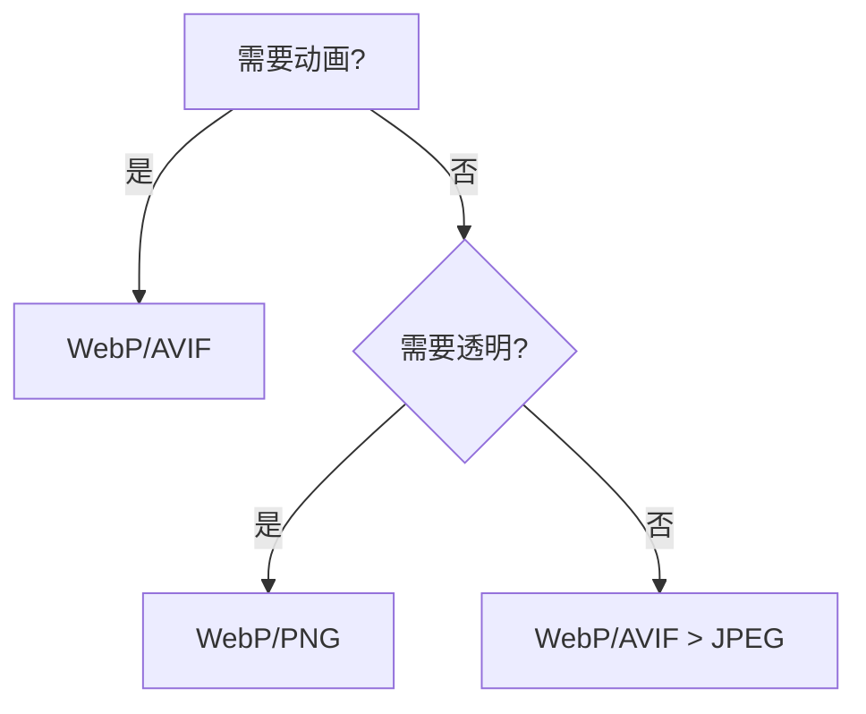

## 104. web 系统里面，如何对图片进行优化？

在 Web 系统中优化图片是提升性能的关键策略，以下从 **技术选型、工具链、最佳实践** 三个维度提供可落地的方案，并附具体代码示例：

---

### **一、技术选型：格式与加载策略**
#### 1. **现代图片格式对比**
| 格式      | 压缩率 | 透明度 | 动画 | 兼容性               | 适用场景              |
|-----------|--------|--------|------|---------------------|---------------------|
| WebP      | 高     | 支持   | 支持 | Chrome/Firefox/Edge | 全场景首选            |
| AVIF      | 极高   | 支持   | 支持 | 新版浏览器           | 高画质需求            |
| JPEG XL   | 极高   | 支持   | 支持 | 实验性支持           | 未来趋势              |
| PNG       | 低     | 支持   | 不支持 | 全兼容               | 必须无损时使用        |

**决策树**：


#### 2. **加载策略选择**
- **关键图片**：预<link rel="preload" as="image" href="hero.webp">`
- **非关键图片**：懒加载 ``
- **动态适配**：`<picture>` + `srcset`

---

### **二、工具链与自动化（Webpack/Vite示例）**
#### 1. **构建时优化配置**
```javascript
// vite.config.js
import { defineConfig } from 'vite'
import viteImagemin from 'vite-plugin-imagemin'

export default defineConfig({
  plugins: [
    viteImagemin({
      gifsicle: { optimizationLevel: 3 },
      mozjpeg: { quality: 75 },
      pngquant: { quality: [0.8, 0.9] },
      webp: { quality: 80 },
      avif: { quality: 70 }
    })
  ]
})
```

#### 2. **动态图片服务（Node.js示例）**
```typescript
import sharp from 'sharp'

app.get('/image/:size/:name', async (req, res) => {
  const { size, name } = req.params
  const [width, height] = size.split('x').map(Number)

  await sharp(`./assets/${name}`)
    .resize(width, height)
    .webp({ quality: 80 })
    .toBuffer()
    .then(data => res.type('image/webp').send(data))
})
```
**调用示例**：`/image/800x600/photo.jpg` → 返回800×600的WebP图片

---

### **三、进阶优化方案**
#### 1. **CSS图像优化技巧**
```css
/* 渐进式加载 */
.progressive-img {
  background: 
    url('preview-20px-blur.jpg') no-repeat,
    url('full-image.webp') no-repeat;
  background-size: cover;
}

/* SVG优化 */
.icon {
  background: url("data:image/svg+xml;utf8,<svg...>") no-repeat;
}
```

#### 2. **监控与报警系统**
```javascript
// 使用Performance API监控图片加载
const imgEntries = performance.getEntriesByType('resource')
  .filter(e => e.initiatorType === 'img')

if (imgEntries.some(e => e.transferSize > 500000)) {
  alert('发现未优化的大图: ' + e.name)
}
```

#### 3. **边缘计算优化（Cloudflare Workers示例）**
```javascript
addEventListener('fetch', event => {
  event.respondWith(handleRequest(event.request))
})

async function handleRequest(request) {
  const url = new URL(request.url)
  if (/\.(jpg|png)$/i.test(url.pathname)) {
    const res = await fetch(request)
    const img = await res.arrayBuffer()
    const webp = await sharp(img).webp().toBuffer()
    return new Response(webp, { headers: { 'Content-Type': 'image/webp' } })
  }
  return fetch(request)
}
```

---

### **四、性能对比数据**
| 优化手段          | 原始大小 | 优化后 | 节省流量 |
|-------------------|----------|--------|----------|
| JPEG → WebP       | 500KB    | 150KB  | 70%      |
| PNG → AVIF        | 300KB    | 50KB   | 83%      |
| 懒加载非首屏图片  | -        | -      | 减少40%请求 |
| CDN智能压缩       | 1MB      | 动态适配300-800KB | 30-70% |

---

### **五、实施路线图**
1. **短期（1周）**
    - 配置构建工具自动压缩
    - 关键图片转为WebP
    - 添加懒加载属性

2. **中期（1月）**
    - 部署动态图片服务
    - 实施响应式图片策略
    - 接入CDN优化

3. **长期**
    - 灰度测试AVIF格式
    - 建立图片监控体系
    - 边缘节点实时优化

---

### **常见问题解决方案**
**Q：Safari兼容性问题？**
```html
<picture>
  <source srcset="image.avif" type="image/avif">
  <source srcset="image.webp" type="image/webp">
  
</picture>
```

**Q：如何防止过度压缩？**
使用SSIMULACRA2算法检测视觉质量：
```bash
npx ssimulacra2 original.jpg compressed.jpg --threshold 0.95
```

通过系统化的技术选型、自动化工具链和持续监控，可实现最优的图片性能优化。建议优先实施构建时优化和懒加载，再逐步推进高级方案。