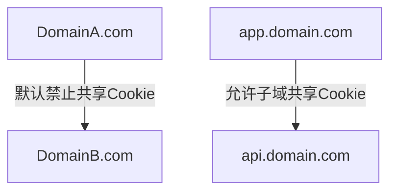
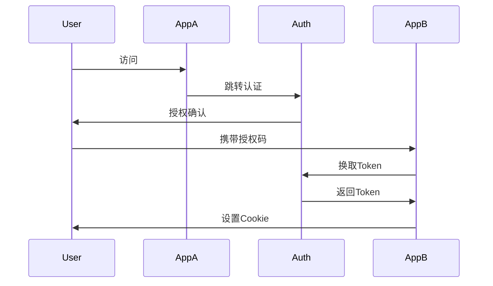

## 11. cookie 可以实现不同域共享吗

# Cookie 跨域共享的完整解决方案

Cookie 默认情况下**不能**直接在不同域之间共享，因为浏览器遵循同源策略的安全限制。但通过以下技术方案可以实现跨域共享需求：

## 一、基础限制原理



- **同源策略**：Cookie 只能被创建它的域名及其子域访问
- **关键属性**：
    - `Domain`：指定作用域（默认为当前域名）
    - `Path`：指定路径范围
    - `SameSite`：控制跨站发送

## 二、跨域共享解决方案

### 1. 同主域不同子域共享

**适用场景**：
- `www.domain.com` 和 `api.domain.com` 之间共享

**实现方式**：
```javascript
// 后端设置Cookie时指定主域
Set-Cookie: token=abc123; Domain=.domain.com; Path=/; Secure
```

**注意事项**：
- 必须设置 `Domain` 为 `.domain.com`（包含前导点）
- 子域间需协议相同（全HTTPS或全HTTP）

### 2. 跨全域共享方案

#### 方案A：OAuth2.0 授权码模式


#### 方案B：前端中继存储
```javascript
// 域A设置数据
localStorage.setItem('sharedData', JSON.stringify(data));

// 通过iframe传递给域B
const iframe = document.createElement('iframe');
iframe.src = 'https://domainB.com/receiver.html';
document.body.appendChild(iframe);
```

### 3. 服务端代理转发

**Nginx 配置示例**：
```nginx
location /api/shared-cookie {
    proxy_pass https://domainB.com/api;
    proxy_cookie_domain domainB.com domainA.com;
    proxy_set_header Host $host;
    proxy_set_header X-Real-IP $remote_addr;
}
```

### 4. CORS + withCredentials

**前端**：
```javascript
fetch('https://domainB.com/api', {
  credentials: 'include'
});
```

**后端**：
```http
Access-Control-Allow-Origin: https://domainA.com
Access-Control-Allow-Credentials: true
Set-Cookie: sessionId=xyz789; SameSite=None; Secure
```

## 三、现代浏览器安全限制

| 方案               | Chrome 80+ | Firefox | Safari |
|--------------------|------------|---------|--------|
| SameSite=Lax       | ✅         | ✅      | ✅     |
| SameSite=None      | 需Secure   | ✅      | 部分   |
| 第三方Cookie       | 逐步淘汰   | 限制    | 完全禁用 |

## 四、最佳实践建议

1. **优先使用Token方案**：
   ```javascript
   // 所有域共享的认证方案
   Authorization: Bearer <JWT>
   ```

2. **临时共享方案**：
   ```javascript
   // 生成一次性共享码
   const shareCode = crypto.randomUUID();
   // 存储到中央缓存服务
   redis.set(`share:${shareCode}`, data, 'EX', 300);
   // 跨域传递code
   location.href = `https://domainB.com/accept?code=${shareCode}`;
   ```

3. **企业级方案架构**：
   ```
   ┌─────────────┐     ┌─────────────┐
   │    Web      │────▶│  Gateway    │
   └─────────────┘     └─────────────┘
                            │
                            ▼
   ┌─────────────┐     ┌─────────────┐
   │  Mobile App │◀───▶│  SSO服务    │
   └─────────────┘     └─────────────┘
   ```

## 五、安全注意事项

1. **CSRF防护**：
   ```html
   <form>
     <input type="hidden" name="_csrf" value="<token>">
   </form>
   ```

2. **Cookie安全设置**：
   ```http
   Set-Cookie: sess=value; HttpOnly; Secure; SameSite=Lax; Path=/; Domain=.company.com
   ```

3. **监控措施**：
   ```javascript
   // 检查Cookie篡改
   if (document.cookie !== expectedCookie) {
     reportSuspiciousActivity();
   }
   ```

选择具体方案时，需根据业务场景、安全要求和浏览器兼容性进行权衡。对于新项目，建议采用基于JWT或OAuth2.0的现代身份验证方案。
