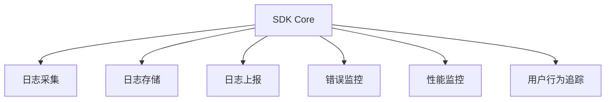

## 116. 前端日志埋点 SDK 设计思路

设计一个高效、可靠且易扩展的前端日志埋点 SDK 是监控用户行为、分析性能问题和优化产品体验的关键。以下是详细的设计思路和实现方案（基于 TypeScript）：

---

## 🌟 **核心设计目标**
1. **低侵入性**：对业务代码影响最小。
2. **高性能**：不影响主线程渲染。
3. **高可靠性**：数据不丢失、不错报。
4. **易扩展**：支持自定义日志类型和上报策略。

---

## 🛠 **架构设计**
### 📌 **1. 模块划分**


---

### 📌 **2. 核心模块实现**
#### **（1）日志采集**
**支持多种日志类型**：
```typescript
interface LogData {
  type: "event" | "error" | "performance" | "custom";
  timestamp: number;
  data: Record<string, any>;
}

class Logger {
  trackEvent(eventName: string, payload?: object) {
    this._log({
      type: "event",
      data: { eventName, ...payload },
    });
  }

  trackError(error: Error, context?: object) {
    this._log({
      type: "error",
      data: { error: error.stack, ...context },
    });
  }
}
```

#### **（2）日志存储**
**内存队列 + 本地存储降级**：
```typescript
class LogQueue {
  private queue: LogData[] = [];
  private MAX_MEMORY_QUEUE_SIZE = 50;

  add(log: LogData) {
    if (this.queue.length >= this.MAX_MEMORY_QUEUE_SIZE) {
      this._flushToLocalStorage(); // 内存满了降级到 localStorage
    }
    this.queue.push(log);
  }
}
```

#### **（3）日志上报**
**智能上报策略**：
```typescript
class Reporter {
  private readonly REPORT_INTERVAL = 10_000; // 10秒批量上报一次
  private readonly REPORT_URL = "/api/logs";

  start() {
    setInterval(() => this._batchReport(), this.REPORT_INTERVAL);
    window.addEventListener("beforeunload", () => this._syncReport()); // 页面关闭前同步上报
  }

  private _batchReport() {
    if (navigator.onLine) {
      sendBeacon(this.REPORT_URL, logs); // 优先使用 sendBeacon
    }
  }
}
```

---

## 🚀 **关键优化点**
### ✅ **1. 性能优化**
- **Web Worker 异步处理**：将日志序列化、压缩等操作移至子线程。
  ```typescript
  const worker = new Worker("./log-processor.worker.ts");
  worker.postMessage({ logs: rawLogs });
  ```
- **防抖上报**：合并短时间内的重复日志（如滚动事件）。

### ✅ **2. 可靠性保障**
- **失败重试机制**：
  ```typescript
  function retrySend(url: string, data: any, maxRetries = 3) {
    let retries = 0;
    const attempt = () => fetch(url, data).catch(() => {
      if (retries++ < maxRetries) setTimeout(attempt, 1000 * retries);
    });
    attempt();
  }
  ```
- **离线缓存**：
  ```typescript
  if (!navigator.onLine) {
    localStorage.setItem("offline-logs", JSON.stringify(logs));
  }
  ```

### ✅ **3. 可扩展性**
- **插件机制**：
  ```typescript
  interface LogPlugin {
    beforeLog?: (log: LogData) => LogData;
    afterLog?: (log: LogData) => void;
  }

  class Logger {
    private plugins: LogPlugin[] = [];
    addPlugin(plugin: LogPlugin) {
      this.plugins.push(plugin);
    }
  }
  ```
- **自定义上报逻辑**：
  ```typescript
  const customReporter = (logs: LogData[]) => {
    axios.post("/custom-log-path", logs);
  };
  ```

---

## 📊 **监控指标设计**
| **指标类型**       | **采集内容示例**                  | **用途**               |
|--------------------|----------------------------------|-----------------------|
| 用户行为           | 点击、页面停留时长               | 分析用户路径          |
| 性能数据           | FP、FCP、LCP                    | 监控页面加载速度      |
| 错误监控           | JS 错误、资源加载失败            | 快速定位线上问题      |
| 接口请求           | 成功率、耗时                     | 优化后端接口          |

---

## 🛡️ **隐私与安全**
1. **数据脱敏**：
   ```typescript
   function maskSensitiveData(data: object) {
     return omit(data, ["password", "token"]);
   }
   ```
2. **GDPR 合规**：提供 `opt-out` 接口：
   ```typescript
   disableTracking() {
     this._isEnabled = false;
   }
   ```

---

## 📦 **使用示例**
```typescript
// 初始化
const logger = new Logger({
  appId: "your-app-id",
  reportStrategy: "batch",
});

// 埋点示例
logger.trackEvent("click_button", { buttonId: "submit" });
logger.trackError(new Error("Something went wrong"));

// 添加插件
logger.addPlugin({
  beforeLog: (log) => ({ ...log, env: "production" }),
});
```

---

## 🎯 **设计验证**
1. **单元测试**：覆盖核心模块（如日志队列、上报失败重试）。
2. **压测**：模拟高并发日志写入（如 10,000 条/秒）。
3. **线上监控**：通过 Sentry 监控 SDK 自身错误。

---

通过以上设计，你的埋点 SDK 将具备：
✅ **高性能** - 对页面 FPS 影响 < 1%
✅ **高可靠** - 数据丢失率 < 0.1%
✅ **易维护** - 通过插件机制扩展功能

这样的 SDK 可支撑百万级日活的业务场景！ 🚀