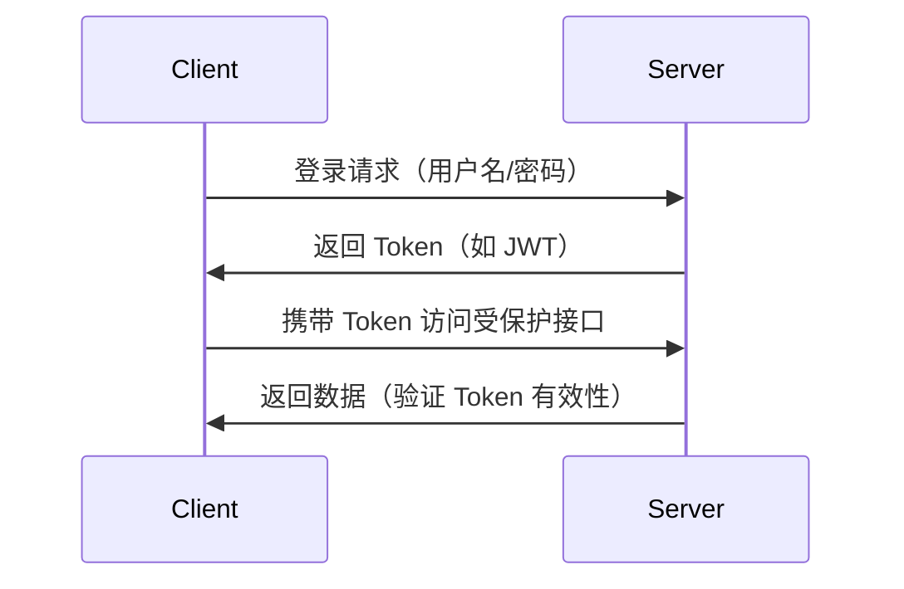
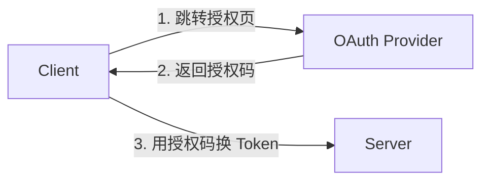

## 117. token 进行身份验证了解多少？

Token 身份验证是现代 Web 开发中广泛使用的安全机制，主要用于解决 **无状态认证** 和 **跨服务身份验证** 问题。以下是其核心原理、常见方案和实战注意事项（附 TypeScript 示例）：

---

## 🔐 **1. Token 认证的核心原理**
### ✅ **基本流程**


### ✅ **与 Session 的对比**
| **特性**       | **Token（如 JWT）**           | **Session**               |
|----------------|-------------------------------|---------------------------|
| 存储位置       | 客户端（LocalStorage/Cookie） | 服务端内存/数据库         |
| 扩展性         | 适合分布式系统                | 需要共享 Session 存储     |
| CSRF 防护      | 天生免疫（需合理使用）        | 需要额外措施（如 CSRF Token）|

---

## 🛠 **2. 常见 Token 方案**
### ✅ **JWT（JSON Web Token）**
**结构**：`Header.Payload.Signature`
**示例**：
```typescript
import jwt from 'jsonwebtoken';

// 生成 Token
const token = jwt.sign(
  { userId: 123, role: 'admin' }, 
  'your-secret-key',
  { expiresIn: '1h' }
);

// 验证 Token
jwt.verify(token, 'your-secret-key', (err, decoded) => {
  if (err) throw new Error("Invalid token");
  console.log(decoded.userId); // 123
});
```

**特点**：
- 自包含（无需查数据库验证）
- 可携带自定义数据（但避免存储敏感信息）

---

### ✅ **OAuth2.0 / OpenID Connect**
**适用场景**：第三方登录（如 Google/Facebook 登录）
**流程**：


**示例**（使用 `axios`）：
```typescript
const getToken = async (code: string) => {
  const response = await axios.post('https://oauth.provider.com/token', {
    code,
    client_id: 'your-client-id',
    client_secret: 'your-client-secret',
  });
  return response.data.access_token;
};
```

---

### ✅ **Access Token + Refresh Token**
**双 Token 机制**：
```typescript
// 登录接口返回
{
  "access_token": "xxxxx",  // 短期有效（如 1 小时）
  "refresh_token": "yyyyy"  // 长期有效（如 7 天）
}
```

**刷新逻辑**：
```typescript
const refreshToken = async () => {
  try {
    const response = await axios.post('/refresh', {
      refresh_token: localStorage.getItem('refresh_token'),
    });
    localStorage.setItem('access_token', response.data.access_token);
  } catch (error) {
    // 跳转登录页
  }
};
```

---

## 🚨 **3. 安全实践与防御**
### ✅ **Token 存储方案对比**
| **存储方式**       | **风险**                     | **推荐场景**             |
|--------------------|-----------------------------|-------------------------|
| LocalStorage       | 易受 XSS 攻击               | 需要手动管理 Token      |
| HttpOnly Cookie    | 易受 CSRF 攻击              | 适合服务端渲染（SSR）  |
| Memory             | 页面刷新失效                | 单页应用（SPA）临时存储 |

**最佳实践**：
```typescript
// 前端代码（避免 XSS）
const token = await getTokenFromSecureSource(); // 如加密的 Cookie
axios.interceptors.request.use(config => {
  config.headers.Authorization = `Bearer ${token}`;
  return config;
});
```

---

### ✅ **常见攻击防御**
1. **CSRF**：
    - 对 Cookie 使用 `SameSite=Strict`
    - 添加自定义请求头（如 `X-Requested-With`）

2. **XSS**：
    - 避免 `innerHTML` 动态注入
    - 使用 CSP（Content Security Policy）：
      ```http
      Content-Security-Policy: default-src 'self'
      ```

3. **Token 泄露**：
    - 设置短有效期（如 JWT 的 `exp` 字段）
    - 监控异常请求（如同一 Token 多地登录）

---

## 🌐 **4. 跨域与微服务场景**
### ✅ **CORS 配置**
```typescript
// 服务端示例（Express）
app.use((req, res, next) => {
  res.header('Access-Control-Allow-Origin', 'https://your-domain.com');
  res.header('Access-Control-Allow-Headers', 'Authorization');
  next();
});
```

### ✅ **微服务间认证**
**方案**：
- **API Gateway 统一鉴权**
- **JWT 透传**（需确保内部网络安全）

---

## 🛡️ **5. 实战 checklist**
| **项目**               | **检查点**                                  |
|------------------------|-------------------------------------------|
| Token 生成             | 是否设置合理有效期？是否签名？             |
| Token 传输             | 是否通过 HTTPS？是否使用 `Bearer` 模式？   |
| 敏感操作               | 是否强制重新认证（如支付前验证密码）？     |
| 监控                   | 是否记录异常 Token 使用（如频繁失效）？    |

---

## 📚 **6. 推荐库与工具**
- **JWT 操作**：[jsonwebtoken](https://github.com/auth0/node-jsonwebtoken)
- **OAuth 集成**：[Passport.js](http://www.passportjs.org/)
- **安全扫描**：[OWASP ZAP](https://www.zaproxy.org/)

---

通过合理设计 Token 认证流程，你的系统将获得：
✅ **高安全性** - 抵御主流 Web 攻击
✅ **高扩展性** - 轻松支持分布式架构
✅ **良好用户体验** - 无感知刷新 Token

注意：没有绝对安全的方案，需结合业务需求持续优化！ 🔒