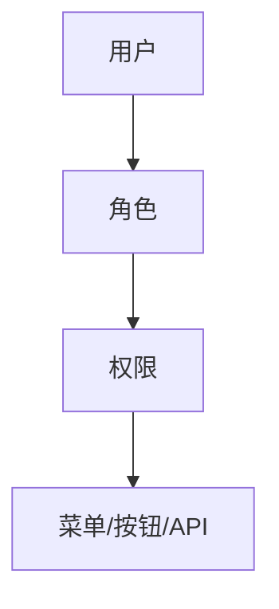

## 118. 在前端应用如何进行权限设计？

在前端应用中设计权限系统是确保应用安全性和用户体验的关键。权限设计需要结合 **路由控制**、**UI 展示**、**API 拦截** 等多个维度，同时考虑 **动态权限** 和 **静态权限** 的需求。以下是详细的设计思路和实现方案（基于 TypeScript 和现代前端框架）：

---

## 🌟 **核心设计目标**
1. **安全性**：防止未授权访问敏感功能或数据。
2. **灵活性**：支持动态权限配置（如 RBAC 模型）。
3. **用户体验**：无权限时友好提示或隐藏功能。
4. **可维护性**：权限逻辑清晰，易于扩展。

---

## 🛠 **权限设计方案**
### 📌 **1. 权限模型选择**
#### ✅ **RBAC（基于角色的访问控制）**

- **角色**：如 `admin`、`editor`、`guest`。
- **权限**：如 `user:delete`、`dashboard:view`。

#### ✅ **ABAC（基于属性的访问控制）**
- 更细粒度（如限制 `部门=财务` 的用户访问财务数据）。

---

### 📌 **2. 前端权限控制实现**
#### ✅ **路由级权限**
**方案**：动态生成路由表（根据用户权限过滤无效路由）。
```typescript
// 路由配置示例
const routes = [
  { path: '/dashboard', component: Dashboard, meta: { requiredPermission: 'dashboard:view' } },
  { path: '/admin', component: Admin, meta: { roles: ['admin'] } },
];

// 动态过滤路由
function filterRoutes(userPermissions: string[]) {
  return routes.filter(route => {
    return !route.meta?.requiredPermission || 
           userPermissions.includes(route.meta.requiredPermission);
  });
}
```

#### ✅ **组件/按钮级权限**
**方案**：自定义指令或高阶组件。
```vue
<!-- Vue 自定义指令示例 -->
<template>
  <button v-permission="'user:delete'">删除用户</button>
</template>

<script>
// 注册指令
app.directive('permission', {
  mounted(el, binding) {
    if (!checkPermission(binding.value)) {
      el.remove();
    }
  },
});
</script>
```

#### ✅ **API 级权限**
**方案**：请求拦截器 + 统一错误处理。
```typescript
axios.interceptors.response.use(
  response => response,
  error => {
    if (error.response.status === 403) {
      showToast('无权限操作');
    }
    return Promise.reject(error);
  }
);
```

---

### 📌 **3. 权限数据管理**
#### ✅ **静态权限（前端配置）**
```typescript
// permissions.ts
export const PERMISSIONS = {
  VIEW_DASHBOARD: 'dashboard:view',
  DELETE_USER: 'user:delete',
} as const;
```

#### ✅ **动态权限（后端返回）**
**接口示例**：
```json
{
  "roles": ["editor"],
  "permissions": ["dashboard:view", "post:edit"]
}
```

**存储方案**：
- **Pinia/Vuex**：全局状态管理。
- **LocalStorage**：持久化（需加密敏感字段）。

---

### 📌 **4. 动态菜单生成**
**方案**：根据权限过滤菜单项。
```typescript
// 原始菜单配置
const menus = [
  { name: 'Dashboard', path: '/dashboard', permission: 'dashboard:view' },
  { name: '用户管理', path: '/users', permission: 'user:manage' },
];

// 过滤后的菜单
const visibleMenus = menus.filter(menu => 
  !menu.permission || userPermissions.includes(menu.permission)
);
```

---

## 🚀 **关键优化点**
### ✅ **性能优化**
- **按需加载权限模块**：
  ```typescript
  const AdminPage = () => import('@/views/AdminPage.vue');
  ```

### ✅ **安全性增强**
- **Token 过期处理**：
  ```typescript
  axios.interceptors.response.use(null, error => {
    if (error.response.status === 401) {
      logoutAndRedirectToLogin();
    }
  });
  ```
- **敏感操作二次验证**：如支付前要求输入密码。

### ✅ **用户体验**
- **无权限提示**：
  ```vue
  <template>
    <Teleport to="#permission-toast">
      <Toast v-if="showPermissionDenied" />
    </Teleport>
  </template>
  ```

---

## 🛡️ **防御性设计**
| **攻击类型**   | **防御措施**                                  |
|----------------|---------------------------------------------|
| **越权访问**   | 后端必须校验权限（前端权限仅用于展示优化）    |
| **XSS**        | 避免动态渲染权限数据（如 `v-html`）          |
| **数据泄露**   | 本地存储加密（如 `CryptoJS`）                |

---

## 📦 **完整实现示例（Vue3 + TypeScript）**
```typescript
// permission.ts
export function checkPermission(required: string, userPermissions: string[]) {
  return userPermissions.includes(required);
}

// main.ts
app.directive('permission', {
  mounted(el, binding) {
    const { value, instance } = binding;
    const userPermissions = instance?.$store.state.user.permissions || [];
    if (!checkPermission(value, userPermissions)) {
      el.style.display = 'none';
    }
  },
});

// 路由守卫
router.beforeEach((to, from, next) => {
  const requiredRole = to.meta.role;
  if (requiredRole && !user.roles.includes(requiredRole)) {
    next('/403'); // 无权限页面
  } else {
    next();
  }
});
```

---

## 📊 **权限系统验证**
1. **单元测试**：覆盖 `checkPermission` 等核心函数。
2. **E2E 测试**：模拟不同角色用户操作流程（如 Cypress）。
3. **监控**：记录权限异常事件（如频繁 403 错误）。

---

## 🎯 **设计原则总结**
1. **最小权限原则**：用户仅拥有必要权限。
2. **前后端分离校验**：前端优化体验，后端保证安全。
3. **灰度发布**：新权限逐步开放。

---

通过以上设计，你的前端权限系统将具备：
✅ **高安全性** - 结合后端校验杜绝越权
✅ **高灵活性** - 支持 RBAC/ABAC 动态配置
✅ **优雅降级** - 无权限时自然隐藏而非报错

适用于中后台系统、SaaS 平台等复杂场景！ 🚀