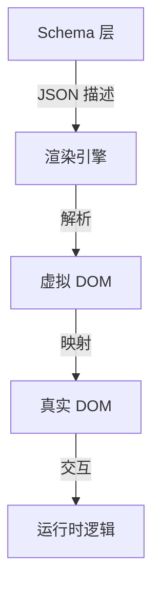

## 119. [低代码] 代码平台一般渲染是如何设计的？

低代码平台的渲染设计是其核心能力之一，旨在通过可视化配置快速生成可运行的页面或应用。以下是低代码平台渲染设计的详细原理、技术方案和优化策略（附关键代码示例）：

---

## 🌟 **核心设计目标**
1. **可视化与实时性**：配置即所见，修改后立即生效。
2. **高性能渲染**：支持复杂页面的快速加载。
3. **扩展性**：允许自定义组件和逻辑。
4. **跨平台输出**：生成 Web、移动端或多端代码。

---

## 🛠 **渲染架构设计**
### 📌 **1. 分层架构**


---

### 📌 **2. 关键模块实现**
#### ✅ **（1）Schema 设计**
**描述 UI 和逻辑的 JSON 结构**：
```typescript
interface ComponentSchema {
  id: string;
  type: "button" | "table" | "custom";
  props: Record<string, any>;
  children?: ComponentSchema[];
  events?: {
    onClick?: { action: "submit" | "navigate"; payload: any };
  };
}
```

**示例 Schema**：
```json
{
  "type": "container",
  "children": [
    {
      "type": "button",
      "props": { "text": "提交", "color": "blue" },
      "events": { "onClick": { "action": "submit" } }
    }
  ]
}
```

---

#### ✅ **（2）渲染引擎**
**核心流程**：
```typescript
class RenderEngine {
  render(schema: ComponentSchema, parentEl: HTMLElement) {
    const component = this._createComponent(schema);
    parentEl.appendChild(component);
  }

  private _createComponent(schema: ComponentSchema): HTMLElement {
    const el = document.createElement(this._getTagName(schema.type));
    this._applyProps(el, schema.props);
    this._bindEvents(el, schema.events);
    schema.children?.forEach(child => this.render(child, el));
    return el;
  }
}
```

---

#### ✅ **（3）动态数据绑定**
**实现响应式更新**：
```typescript
function observeData(data: object, onUpdate: (key: string) => void) {
  return new Proxy(data, {
    set(target, key, value) {
      target[key] = value;
      onUpdate(key as string);
      return true;
    },
  });
}

// 使用示例
const state = observeData({ count: 0 }, (key) => {
  console.log(`数据变化: ${key}=${state[key]}`);
});
```

---

#### ✅ **（4）跨平台渲染**
**抽象渲染接口**：
```typescript
interface PlatformRenderer {
  renderButton(props: ButtonProps): void;
  renderText(props: TextProps): void;
}

class WebRenderer implements PlatformRenderer {
  renderButton(props) {
    return `<button class="btn">${props.text}</button>`;
  }
}

class MobileRenderer implements PlatformRenderer {
  renderButton(props) {
    return `<android-button android:text="${props.text}" />`;
  }
}
```

---

## 🚀 **性能优化策略**
### ✅ **1. 懒加载与按需渲染**
```typescript
// 动态加载组件
const componentMap = {
  button: () => import('./components/Button'),
  table: () => import('./components/Table'),
};

async function renderComponent(type: string) {
  const module = await componentMap[type]();
  return module.default;
}
```

### ✅ **2. 虚拟 DOM Diff**
```typescript
function diff(oldVNode, newVNode) {
  // 比较差异后只更新变化部分
  if (oldVNode.props.color !== newVNode.props.color) {
    patch(oldVNode.el, 'color', newVNode.props.color);
  }
}
```

### ✅ **3. 缓存策略**
- **Schema 缓存**：对解析后的 JSON 进行哈希缓存。
- **组件实例复用**：通过 `key` 标识相同组件。

---

## 🔧 **扩展性设计**
### ✅ **1. 自定义组件注册**
```typescript
class ComponentRegistry {
  private components = new Map<string, ComponentDefinition>();

  register(type: string, definition: ComponentDefinition) {
    this.components.set(type, definition);
  }

  get(type: string) {
    return this.components.get(type);
  }
}

// 使用示例
registry.register('custom-chart', {
  render: (props) => `<div class="chart">${props.data}</div>`,
});
```

### ✅ **2. 逻辑扩展（DSL）**
**支持表达式求值**：
```typescript
function evalExpression(expr: string, context: object) {
  return new Function('ctx', `return ${expr}`)(context);
}

// 示例：{{ ctx.count > 0 ? 'positive' : 'negative' }}
```

---

## 🛡️ **稳定性保障**
| **问题**          | **解决方案**                              |
|-------------------|-----------------------------------------|
| Schema 解析失败   | 严格校验 + 降级默认组件                  |
| 循环依赖          | 检测组件引用关系并告警                   |
| 性能瓶颈          | 监控渲染耗时，拆分大组件                 |

---

## 📦 **完整工作流示例**
1. **用户拖拽组件** → 生成 Schema JSON。
2. **引擎解析 Schema** → 创建虚拟 DOM。
3. **数据绑定** → 响应式更新视图。
4. **发布** → 生成多端代码或直接运行。

```typescript
// 示例：从 Schema 到渲染
const schema = fetchSchema();
const engine = new RenderEngine();
engine.render(schema, document.getElementById('app'));

// 动态更新
watch(schema, (newSchema) => {
  engine.rerender(newSchema);
});
```

---

## 🎯 **设计验证**
1. **功能测试**：覆盖组件渲染、事件绑定、数据更新。
2. **性能测试**：模拟 1000+ 组件渲染耗时（目标 < 1s）。
3. **兼容性测试**：多端输出一致性校验。

---

通过以上设计，低代码平台可实现：
✅ **快速渲染** - 支持千级组件秒级加载
✅ **灵活扩展** - 自定义组件和逻辑
✅ **稳定输出** - 多端代码生成或直接运行

适用于企业级中后台、营销页面搭建等场景！ 🚀