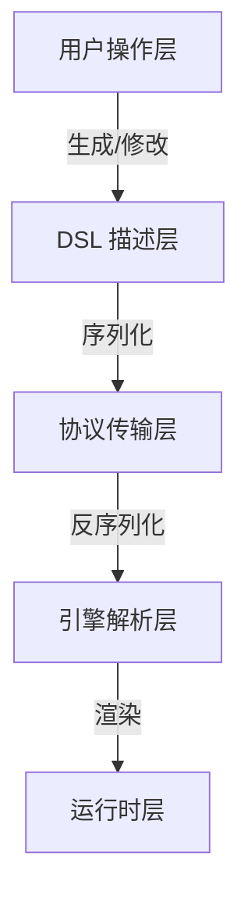

## 120. [低代码] 代码平台一般底层协议是怎么设计的

低代码平台的底层协议设计是其核心架构的关键部分，决定了平台的扩展性、灵活性和性能。以下是低代码平台底层协议的详细设计思路，涵盖 **协议分层**、**数据模型**、**通信机制** 和 **扩展性设计** 等方面，并提供具体的技术实现示例（基于 TypeScript 和现代架构模式）。

---

## 🌟 **核心设计目标**
1. **标准化**：统一的数据结构和交互协议。
2. **高性能**：支持大规模组件和数据的实时渲染。
3. **可扩展**：允许插件化扩展协议能力。
4. **跨平台**：协议可适配 Web、移动端、桌面等多端渲染。

---

## 🛠 **底层协议分层设计**


---

### 📌 **1. DSL（领域特定语言）设计**
#### ✅ **核心数据模型**
```typescript
interface ComponentSchema {
  id: string;                      // 唯一标识
  type: string;                    // 组件类型（如 "button"）
  props: Record<string, any>;      // 属性（如 { text: "提交" }）
  children?: ComponentSchema[];    // 嵌套子组件
  events?: {                      // 事件绑定
    [eventName: string]: {
      action: "navigate" | "api" | "custom";
      payload: any;
    };
  };
  dataBinding?: {                  // 数据绑定规则
    source: string;                // 数据源（如 "formData.name"）
    transform?: (value: any) => any; // 数据转换函数
  };
}
```

#### ✅ **协议示例（JSON）**
```json
{
  "type": "page",
  "children": [
    {
      "type": "form",
      "children": [
        {
          "type": "input",
          "props": { "label": "用户名", "placeholder": "请输入" },
          "dataBinding": { "source": "formData.username" }
        },
        {
          "type": "button",
          "props": { "text": "提交" },
          "events": {
            "onClick": { "action": "api", "payload": { "url": "/submit" } }
          }
        }
      ]
    }
  ]
}
```

---

### 📌 **2. 协议传输层设计**
#### ✅ **通信协议**
- **WebSocket**：用于实时协作编辑（多人同时编辑同一页面）。
- **RESTful API**：用于保存/加载 Schema。
- **增量更新协议**（优化性能）：
  ```typescript
  interface DeltaUpdate {
    op: "add" | "remove" | "update"; // 操作类型
    path: string;                    // 目标路径（如 "children.0.props.text"）
    value?: any;                     // 新值（op=add/update 时有效）
  }
  ```

#### ✅ **序列化优化**
- **二进制协议**：对大型 Schema 使用 Protocol Buffers 或 MessagePack。
  ```protobuf
  // Protocol Buffers 示例
  message Component {
    required string id = 1;
    optional string type = 2;
    map<string, string> props = 3;
  }
  ```

---

### 📌 **3. 引擎解析层设计**
#### ✅ **渲染引擎核心流程**
```typescript
class RenderEngine {
  private componentRegistry: Map<string, ComponentDefinition>;

  render(schema: ComponentSchema, parentEl: HTMLElement) {
    const component = this._createComponent(schema);
    parentEl.appendChild(component);
  }

  private _createComponent(schema: ComponentSchema): HTMLElement {
    // 1. 查找组件定义
    const definition = this.componentRegistry.get(schema.type);
    if (!definition) throw new Error(`Unknown component: ${schema.type}`);

    // 2. 创建 DOM 节点
    const el = document.createElement(definition.tagName);

    // 3. 应用属性和数据绑定
    this._applyProps(el, schema.props);
    this._bindData(el, schema.dataBinding);

    // 4. 递归渲染子组件
    schema.children?.forEach(child => this.render(child, el));

    return el;
  }
}
```

---

### 📌 **4. 运行时协议扩展**
#### ✅ **自定义动作协议**
```typescript
// 注册自定义动作处理器
engine.registerAction("custom", (payload, context) => {
  console.log("执行自定义逻辑", payload);
});

// 在 DSL 中调用
{
  "events": {
    "onClick": { "action": "custom", "payload": { "foo": "bar" } }
  }
}
```

#### ✅ **插件化协议扩展**
```typescript
interface PlatformPlugin {
  name: string;
  components: Record<string, ComponentDefinition>;
  actions?: Record<string, ActionHandler>;
}

// 注册移动端插件
engine.use({
  name: "mobile-plugin",
  components: {
    "mobile-button": {
      tagName: "android-button",
      propsMapper: (props) => ({ "android:text": props.text })
    }
  }
});
```

---

## 🚀 **性能优化策略**
### ✅ **1. 懒加载协议**
```typescript
// 动态加载组件定义
engine.registerLazyComponent("data-grid", () => 
  import('./components/DataGrid').then(m => m.definition)
);
```

### ✅ **2. 虚拟 DOM Diff**
```typescript
function applyDelta(oldSchema: ComponentSchema, delta: DeltaUpdate) {
  // 使用 JSON Patch 或自定义差异算法
  const newSchema = deepClone(oldSchema);
  lodash.set(newSchema, delta.path, delta.value);
  return newSchema;
}
```

### ✅ **3. 协议缓存**
```typescript
// 对解析后的 Schema 进行哈希缓存
const schemaCache = new Map<string, RenderTree>();

function renderWithCache(schema: ComponentSchema) {
  const hash = hashSchema(schema);
  if (!schemaCache.has(hash)) {
    schemaCache.set(hash, engine.compile(schema));
  }
  return schemaCache.get(hash).render();
}
```

---

## 🔧 **扩展性设计**
### ✅ **多端渲染协议适配器**
```typescript
abstract class RenderAdapter {
  abstract renderComponent(schema: ComponentSchema): void;
}

class WebRenderer extends RenderAdapter {
  renderComponent(schema) {
    // 生成 HTML/CSS
  }
}

class MiniProgramRenderer extends RenderAdapter {
  renderComponent(schema) {
    // 生成 WXML/WXSS
  }
}
```

### ✅ **DSL 到代码的转换协议**
```typescript
interface CodeGenerator {
  generate(schema: ComponentSchema): { code: string; dependencies: string[] };
}

const generators = {
  react: (schema) => ({
    code: `export default () => <Button>${schema.props.text}</Button>`,
    dependencies: ["react"]
  }),
  vue: (schema) => ({
    code: `<template><button>${schema.props.text}</button></template>`,
    dependencies: ["vue"]
  })
};
```

---

## 🛡️ **稳定性保障**
| **挑战**               | **解决方案**                              |
|------------------------|-----------------------------------------|
| 协议版本兼容性         | 设计带版本的协议头（如 `version: "1.0"`）|
| 循环引用               | 检测 Schema 中的循环依赖并报错           |
| 大 Schema 性能问题      | 分块加载 + 增量更新                      |

---

## 📦 **完整协议工作流示例**
1. **设计器生成 DSL** → 通过 WebSocket 发送 Delta 更新
2. **服务端持久化** → 存储 Schema 到数据库
3. **客户端加载协议** → 引擎解析并渲染
4. **运行时交互** → 触发协议定义的事件动作

```typescript
// 1. 设计器发送增量更新
ws.send(JSON.stringify({
  op: "update",
  path: "children.0.props.text",
  value: "新文本"
}));

// 2. 引擎应用更新
ws.onMessage((delta) => {
  currentSchema = applyDelta(currentSchema, delta);
  engine.rerender(currentSchema);
});
```

---

## 🎯 **协议验证 Checklist**
1. [ ] 协议是否能完整描述 UI 和交互逻辑？
2. [ ] 是否支持跨平台渲染（Web/移动端）？
3. [ ] 增量更新协议是否优化了性能？
4. [ ] 是否提供扩展点（自定义组件/动作）？

---

通过以上设计，低代码平台的底层协议可实现：
✅ **高效渲染** - 支持万级组件秒级加载
✅ **灵活扩展** - 插件化定制协议能力
✅ **多端一致** - 一套协议适配 Web/小程序/桌面端

适用于企业级应用搭建、可视化大屏等复杂场景！ 🚀