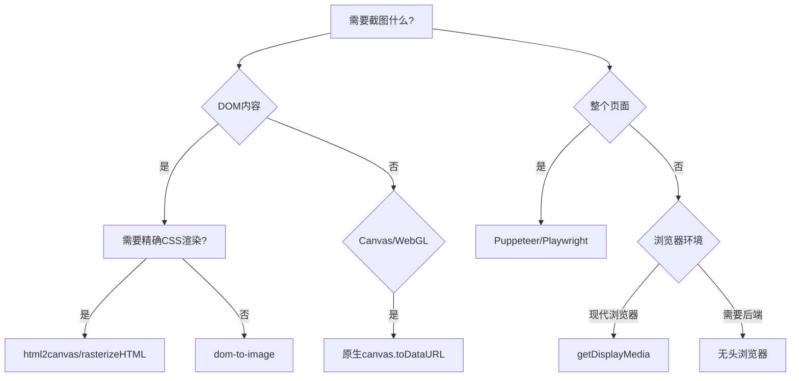

## 27. 前端如何实现截图？

前端实现截图有多种方案，根据场景需求和技术栈的不同，可选择以下方法实现精准、高效的截图功能。以下是专业级解决方案：

---

### 一、浏览器原生API方案
#### 1. **`html2canvas` 库（最常用）**
```typescript
import html2canvas from 'html2canvas';

const captureElement = async (element: HTMLElement) => {
  const canvas = await html2canvas(element, {
    useCORS: true, // 处理跨域图片
    scale: 2,      // 提高分辨率
    logging: false,
    backgroundColor: null // 透明背景
  });

  // 转换为图片
  return canvas.toDataURL('image/png', 1.0);
};

// 使用示例
const screenshot = await captureElement(document.getElementById('target'));
```

**优化技巧**：
- 使用 `scale` 参数实现视网膜屏高清截图
- 对动态内容添加 `await new Promise(resolve => setTimeout(resolve, 500))` 等待渲染
- 通过 `ignoreElements` 排除不需要的元素

#### 2. **`dom-to-image` 库**
```typescript
import domtoimage from 'dom-to-image';

domtoimage.toPng(element, {
  quality: 0.95,
  filter: node => node.tagName !== 'IFRAME'
}).then(dataUrl => {
  // 处理结果
});
```

**对比优势**：
- 更小的包体积（~12KB vs html2canvas的~50KB）
- 对SVG支持更好

---

### 二、现代浏览器API方案
#### 1. **`MediaDevices.getDisplayMedia()` (屏幕录制API)**
```typescript
async function captureScreen() {
  const stream = await navigator.mediaDevices.getDisplayMedia({
    video: { 
      cursor: "always", 
      displaySurface: "window" 
    },
    audio: false
  });

  const videoTrack = stream.getVideoTracks()[0];
  const imageCapture = new ImageCapture(videoTrack);
  return await imageCapture.grabFrame();
}
```

#### 2. **`CanvasRenderingContext2D.drawWindow()` (Firefox专用)**
```javascript
// 仅Firefox支持
canvas.drawWindow(window, 0, 0, width, height, 'white');
```

---

### 三、专业级截图方案
#### 1. **`rasterizeHTML.js` (精准CSS渲染)**
```typescript
import { rasterizeHTML } from 'rasterizehtml';

rasterizeHTML.drawHTML(htmlString, canvas, {
  width: 1200,
  height: 800,
  executeScripts: false
});
```

**适用场景**：
- 需要保留所有CSSOM计算结果的截图
- 对伪元素(:before/:after)支持更好

#### 2. **`Puppeteer/Playwright` 无头浏览器**
```typescript
// 后端服务中运行
import puppeteer from 'puppeteer';

const browser = await puppeteer.launch();
const page = await browser.newPage();
await page.goto('https://example.com');
await page.screenshot({
  path: 'screenshot.png',
  fullPage: true,
  omitBackground: true
});
await browser.close();
```

**优势**：
- 100%还原度
- 支持PDF生成
- 可处理复杂登录状态

---

### 四、特殊场景处理
#### 1. **SVG截图方案**
```typescript
function svgToImage(svgElement: SVGSVGElement) {
  const svgData = new XMLSerializer().serializeToString(svgElement);
  const svgBlob = new Blob([svgData], {type: 'image/svg+xml'});
  return URL.createObjectURL(svgBlob);
}
```

#### 2. **WebGL/Canvas游戏截图**
```typescript
// Three.js示例
const renderer = new THREE.WebGLRenderer();
const screenshot = renderer.domElement.toDataURL();

// 普通Canvas
canvas.toBlob(blob => {
  const imgUrl = URL.createObjectURL(blob);
}, 'image/jpeg', 0.95);
```

#### 3. **视频帧捕获**
```typescript
const video = document.querySelector('video');
const canvas = document.createElement('canvas');
canvas.width = video.videoWidth;
canvas.height = video.videoHeight;
canvas.getContext('2d')!.drawImage(video, 0, 0);
```

---

### 五、企业级优化方案
#### 1. **截图性能优化**
```typescript
// 分块渲染避免主线程阻塞
async function parallelScreenshot(elements: HTMLElement[]) {
  const canvases = await Promise.all(
    elements.map(el => html2canvas(el))
  );

  const finalCanvas = document.createElement('canvas');
  // 合并所有分块canvas...
  return finalCanvas;
}
```

#### 2. **内存管理**
```typescript
// 释放大图内存
function captureAndClean(element: HTMLElement) {
  const dataUrl = await html2canvas(element);
  element.remove(); // 移除DOM引用
  return dataUrl;
}
```

#### 3. **Worker多线程**
```typescript
// 在Web Worker中运行截图逻辑
const worker = new Worker('screenshot.worker.js');
worker.postMessage({ elementId: 'target' });
worker.onmessage = e => {
  const image = URL.createObjectURL(e.data);
};
```

---

### 六、安全与权限处理
| 场景                  | 解决方案                      |
|-----------------------|-----------------------------|
| 跨域图片              | 配置 `useCORS: true` + 服务器CORS头 |
| 隐私内容模糊          | 截图后使用Canvas像素处理       |
| 敏感DOM元素排除        | `html2canvas` 的 `ignoreElements` 回调 |
| 用户授权              | 配合 `Permissions API` 请求屏幕捕获权限 |

---

### 七、输出格式控制
```typescript
// 质量参数对比
canvas.toDataURL('image/jpeg', 0.92);  // 92%质量JPEG
canvas.toDataURL('image/webp', 0.8);  // WebP格式
canvas.toDataURL('image/png');        // 无损PNG

// 二进制输出
canvas.toBlob(blob => {
  const file = new File([blob], 'screenshot.png');
}, 'image/png');
```

---

### 八、框架集成方案
#### 1. **React 专用组件**
```tsx
function Screenshot({ targetRef }: { targetRef: RefObject<HTMLElement> }) {
  const [image, setImage] = useState('');

  const capture = useCallback(async () => {
    if(targetRef.current) {
      const canvas = await html2canvas(targetRef.current);
      setImage(canvas.toDataURL());
    }
  }, [targetRef]);

  return ;
}
```

#### 2. **Vue 自定义指令**
```javascript
Vue.directive('capture', {
  async inserted(el, binding) {
    const canvas = await html2canvas(el);
    binding.value(canvas.toDataURL());
  }
});
```

---

### 九、调试工具推荐
1. **`html2canvas` 调试模式**：
   ```javascript
   html2canvas(element, { 
     onclone: clonedDoc => {
       console.log('克隆后的DOM', clonedDoc);
     }
   });
   ```

2. **Canvas Inspection**：
    - 使用Chrome DevTools的Canvas面板
    - 调用 `canvas.getContext('2d', { willReadFrequently: true })` 启用优化

---

### 十、方案选型决策树


---

### 总结最佳实践
1. **普通网页截图**：优先使用 `html2canvas` + `scale: 2` 方案
2. **企业级应用**：采用 Puppeteer 服务端渲染
3. **性能敏感场景**：使用 Web Worker 分块处理
4. **特殊内容**：
    - SVG → XMLSerializer
    - 视频 → Canvas帧捕获
5. 始终添加 **加载状态** 和 **错误边界** 处理

通过组合这些技术，可以实现从简单元素截图到复杂业务场景的全方位覆盖，同时兼顾性能和用户体验。
