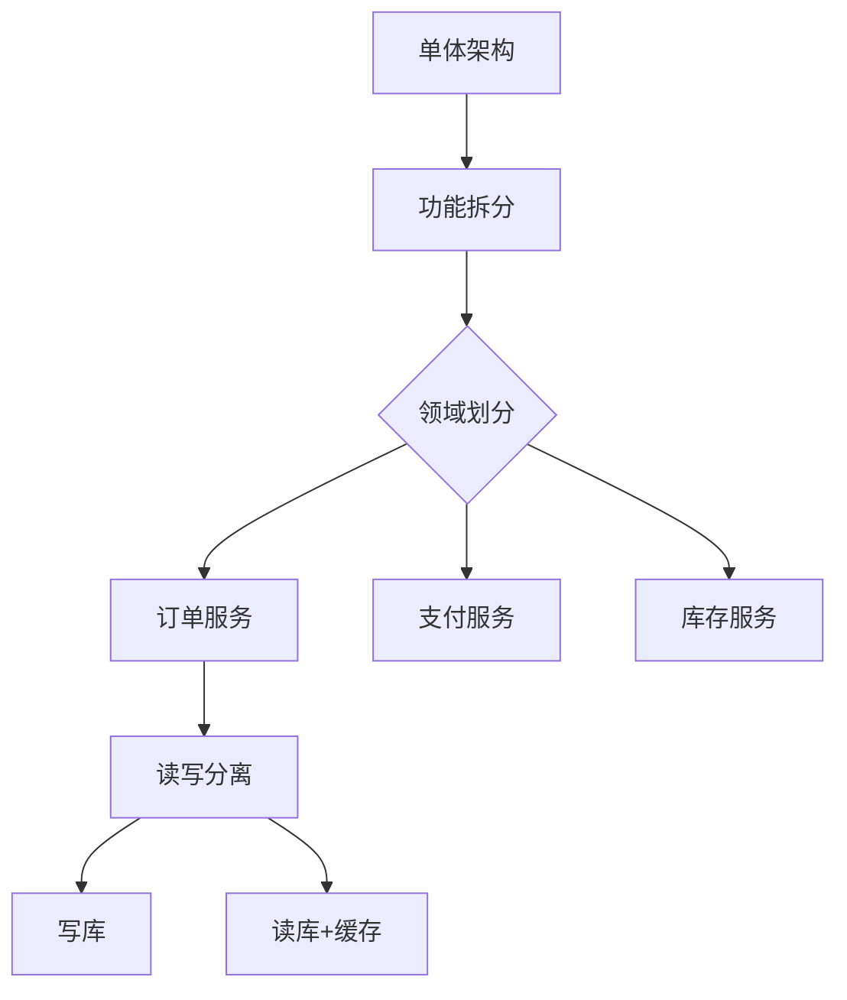

## 28. 当 QPS 达到峰值时，该如何处理？

当QPS（每秒查询率）达到峰值时，系统可能面临响应变慢、超时甚至崩溃的风险。处理核心原则是“**先保可用，再优性能**”，通过“限流、削峰、扩容、降级”等手段，优先保证核心业务正常运行，再逐步优化系统承载能力。以下是具体处理方案：

### **一、紧急应对：快速降低系统压力**
当QPS突增导致系统濒临过载时，需第一时间采取“止损”措施，避免雪崩。

#### 1. **限流：控制入口流量，拒绝过载请求**
通过限制单位时间内的请求量，确保系统处理能力与请求量匹配，防止被“压垮”。
- **实现层面**：
    - **网关层限流**：在API网关（如Nginx、Kong、Spring Cloud Gateway）设置全局限流规则，例如“每秒最多处理10万请求”，超出部分直接返回`503 Service Unavailable`。
      ```nginx
      # Nginx限流示例（限制每秒10万请求， burst=2万为突发缓冲）
      limit_req_zone $binary_remote_addr zone=qps_limit:10m rate=100000r/s;
      server {
        location / {
          limit_req zone=qps_limit burst=20000 nodelay; # 超出burst的请求直接拒绝
        }
      }
      ```  
    - **服务端限流**：在应用层通过代码实现细粒度限流（如基于用户、接口），常用算法：
        - 令牌桶：允许一定突发流量（如Guava的`RateLimiter`）；
        - 漏桶：严格控制流量速率，平滑输出；
        - 计数器：简单统计单位时间请求数，超出则拒绝。
    - **服务网格限流**
        ```yaml
        # Istio限流配置
        apiVersion: config.istio.io/v1alpha2
        kind: memquota
        metadata:
          name: handler
        spec:
          quotas:
          - name: requestcount.quota.istio-system
            maxAmount: 5000
            validDuration: 1s
            overrides:
            - dimensions:
                destination: order-service
              maxAmount: 1000
        ```
- **策略**：优先保证核心接口（如电商的下单、支付），对非核心接口（如商品评论、浏览记录）限流更严格。


#### 2. **降级：牺牲非核心功能，保核心流程**
当系统资源不足时，主动关闭或简化非核心功能，将资源集中到核心业务。
- **常见场景**：
    - 电商平台：峰值时关闭“商品推荐”“用户评价”等非核心功能，只保留“浏览商品、下单、支付”；
    - 社交App：关闭“实时在线状态”“历史消息搜索”，只保留“发送消息、刷新Feed流”。
- **实现方式**：
    - 配置中心动态开关（如Apollo）：一键关闭非核心接口；
    - 熔断机制（如Sentinel、Hystrix）：当非核心接口响应超时/错误率过高时，自动返回默认值（如“当前服务繁忙，请稍后再试”）。


#### 3. **削峰：缓冲突发流量，避免瞬间冲击**
通过中间件缓冲请求，将“脉冲式峰值”转化为“平缓的流量”，让系统有时间逐步处理。
- **核心工具：消息队列（MQ）**  
  例如秒杀场景，用户下单请求先发送到MQ（如RabbitMQ、Kafka），业务系统再从MQ中消费消息，按自身处理能力匀速处理：
  ```java
  // 伪代码：将请求放入MQ，而非直接处理
  @PostMapping("/seckill")
  public Result seckill(String goodsId, String userId) {
      // 1. 简单校验（如用户是否已抢购）
      if (checkAlreadySeckilled(userId, goodsId)) {
          return Result.fail("已抢购");
      }
      // 2. 发送到MQ，异步处理
      mqTemplate.send("seckill_topic", new SeckillMessage(userId, goodsId));
      return Result.success("排队中，请稍后查询结果");
  }
  
  // 消费者：按系统能力匀速处理
  @RabbitListener(queues = "seckill_queue")
  public void handleSeckill(SeckillMessage msg) {
      // 实际扣库存、创建订单的逻辑
      processSeckill(msg.getUserId(), msg.getGoodsId());
  }
  ```  


### **二、扩容：提升系统承载能力**
限流和降级是“节流”，扩容是“开源”，通过增加资源提升系统处理能力，适合**可预期的峰值**（如电商大促、节假日）。

#### 1. **水平扩容：增加节点数量**
通过增加服务器/容器数量，分摊请求压力，是应对高QPS的主要手段。
- **适用场景**：无状态服务（如API服务、微服务），可通过负载均衡（如Nginx、K8s Service）将流量分发到新增节点。
- **实现方式**：
    - 容器化部署（Docker+K8s）：配置HPA（Horizontal Pod Autoscaler），当CPU使用率超过70%或QPS达到阈值时，自动增加Pod数量；
    - 云服务弹性伸缩：如AWS Auto Scaling、阿里云弹性伸缩，根据监控指标自动增减ECS实例。

- **注意**：扩容需提前预热（如预热缓存），避免新节点刚启动就承接大量请求导致初始化失败。

```yaml
# Kubernetes HPA配置示例
apiVersion: autoscaling/v2
kind: HorizontalPodAutoscaler
metadata:
  name: order-service
spec:
  scaleTargetRef:
    apiVersion: apps/v1
    kind: Deployment
    name: order-service
  minReplicas: 3
  maxReplicas: 50
  metrics:
  - type: Resource
    resource:
      name: cpu
      target:
        type: Utilization
        averageUtilization: 70
```

**集群部署拓扑**
```text
                          [SLB]
                            |
        +-------------------+-------------------+
        |                   |                   |
     [AZ1]               [AZ2]               [AZ3]
      / \                 / \                 / \
   [App][DB]          [App][DB]          [App][DB]
```

#### 2. **垂直扩容：提升单节点性能**
短期内增加单个服务器的硬件配置（如CPU、内存、带宽），适合**无法水平扩容的有状态服务**（如数据库主库）。
- 示例：将数据库服务器从“4核8G”升级为“16核32G”，临时提升单机处理能力；
- 局限：有上限（硬件性能不可能无限提升），长期需配合水平拆分（如分库分表）。

### **三、优化：从根源提升系统效率**
峰值过后，需通过优化减少资源消耗，提升系统在同等资源下的QPS承载能力。

#### 1. **缓存优化：减少后端计算/IO**
将高频访问的数据（如商品详情、用户信息）缓存到内存中，减少对数据库/后端服务的请求。
- **多层缓存策略**：
    - 本地缓存（如Caffeine）：缓存热点中的热点（如首页Banner），减少网络请求；
    - 分布式缓存（如Redis）：缓存用户会话、商品库存等需跨节点共享的数据；
    - CDN：缓存静态资源（图片、JS、CSS），将请求引流到边缘节点。
- **注意**：缓存需设置合理的过期时间，避免缓存雪崩（大量缓存同时失效）、缓存穿透（请求不存在的数据）。


#### 2. **数据库优化：缓解IO瓶颈**
数据库往往是高QPS下的瓶颈，需针对性优化：
- **读写分离**：主库负责写操作，从库负责读操作（通过MyCat、ShardingSphere实现），分散读压力；
- **分库分表**：将大表按用户ID、地域等维度拆分（如水平分表），或按业务模块拆分数据库（如订单库、用户库）；
- **索引与SQL优化**：避免全表扫描（加索引）、减少`JOIN`和`SELECT *`，降低单条SQL的执行时间；
- **批量操作**：将多次小请求合并为批量请求（如批量插入、批量更新），减少数据库交互次数。


#### 3. **代码与架构优化**
- **异步化**：将非实时流程（如日志记录、消息推送）异步处理，减少主线程阻塞；
- **无状态设计**：服务端不存储本地状态（如会话信息放到Redis），便于水平扩容；
- **资源复用**：使用连接池（数据库连接池、线程池）减少资源创建销毁的开销；
- **静态化**：将动态页面（如商品详情）预渲染为静态HTML，直接通过CDN分发。


#### 4. **服务拆分优化**


### **四、预防：提前做好峰值应对准备**
对于可预期的峰值（如618、双11），需提前规划，避免临时手忙脚乱：
1. **压测评估**：通过JMeter、LoadRunner模拟峰值流量，测试系统瓶颈（如数据库最大QPS、单节点极限承载）；
2. **容量规划**：根据压测结果，提前扩容服务器、缓存集群，确保资源储备是预期峰值的1.5-2倍；
3. **预案演练**：提前演练限流、降级、回滚流程，确保关键时刻团队能快速执行；
4. **监控预警**：通过Prometheus+Grafana监控QPS、响应时间、错误率、CPU/内存使用率，设置多级预警阈值（如QPS达到80%阈值时报警）。


### **总结**
处理QPS峰值的核心逻辑是“**分层防御**”：
- 第一层（入口）：限流+削峰，控制进入系统的流量；
- 第二层（资源）：扩容，提升系统处理能力；
- 第三层（功能）：降级，确保核心业务可用；
- 第四层（根源）：优化，提升系统效率。

同时，“预防”比“应对”更重要，通过压测、预案和监控，将峰值风险控制在可预期范围内。

快速应对QPS峰值的处理流程：
1. **短期应急**：
    - 快速扩容云实例
    - 启用静态降级页面
    - 实施严格限流

2. **中期优化**：
    - 引入读写分离
    - 优化SQL查询
    - 增加缓存层级

3. **长期架构**：
    - 服务网格化改造
    - 实现自动弹性伸缩
    - 建设多活数据中心

**黄金法则**：始终遵循"监控->限流->扩容->优化"的处理流程，通过全链路压测验证系统极限，最终构建弹性可扩展的分布式架构。
