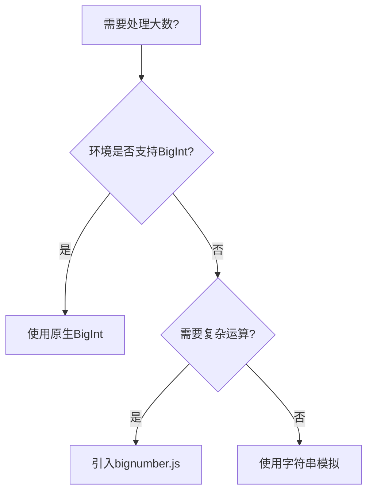

## 29. js 超过 Number 最大值的数怎么处理？

在 JavaScript 中处理超过 `Number.MAX_SAFE_INTEGER`（即 2^53 - 1）的大数时，需要采用特殊的技术方案。以下是专业级的完整解决方案：

---

### 一、问题本质分析
JavaScript 的 `Number` 类型采用 IEEE 754 双精度浮点数标准，导致：
```javascript
console.log(Number.MAX_SAFE_INTEGER); // 9007199254740991
console.log(9007199254740992 === 9007199254740993); // true (精度丢失)
```

---

### 二、核心解决方案

#### 1. **使用 BigInt 类型（ES2020+ 官方方案）**
```typescript
// 字面量写法
const bigNum = 9007199254740993n;

// 转换写法
const fromString = BigInt("123456789012345678901234567890");
const fromNumber = BigInt(Number.MAX_SAFE_INTEGER) + 1n;

// 运算示例
console.log(bigNum * 2n); // 18014398509481986n
```

**特性对比**：
| 特性          | Number         | BigInt          |
|---------------|----------------|-----------------|
| 精度范围       | ±2^53 -1       | 任意精度         |
| 运算符         | +-*/%          | 必须加n后缀      |
| JSON序列化     | 支持           | 需自定义处理     |
| 浏览器兼容性   | 全支持         | IE不支持         |

#### 2. **第三方大数库（兼容旧环境）**
```typescript
// 使用bignumber.js
import BigNumber from 'bignumber.js';

const x = new BigNumber("123456789012345678901234567890");
const y = x.plus("987654321098765432109876543210");
console.log(y.toString()); // "1111111110111111111011111111100"
```

**库对比**：
| 库名           | 体积   | 特性                          | TS支持 |
|----------------|--------|-------------------------------|--------|
| bignumber.js   | 8KB    | 小数运算、配置丰富             | 完善    |
| decimal.js     | 12KB   | 高精度小数、多种舍入模式       | 完善    |
| jsbi           | 3KB    | 模拟原生BigInt的API            | 内置    |

---

### 三、特殊场景处理

#### 1. **JSON序列化方案**
```typescript
// 自定义序列化
const obj = { 
  id: BigInt('12345678901234567890') 
};

const jsonString = JSON.stringify(obj, (key, value) => 
  typeof value === 'bigint' ? value.toString() : value
);

// 反序列化
const parsed = JSON.parse(jsonString, (key, value) => 
  key === 'id' ? BigInt(value) : value
);
```

#### 2. **与Number的互操作**
```typescript
// BigInt转Number（可能丢失精度）
const safeConvert = (big: bigint) => {
  if (big > BigInt(Number.MAX_SAFE_INTEGER)) {
    throw new Error('Value exceeds safe integer range');
  }
  return Number(big);
};

// 混合运算处理
const result = BigInt(5) + BigInt(Number(10)); // 必须统一类型
```

#### 3. **浏览器兼容方案**
```typescript
// 检测+polyfill方案
if (typeof BigInt === 'undefined') {
  // 动态加载polyfill
  await import('jsbi').then(JSBI => {
    window.BigInt = JSBI.BigInt;
  });
}
```

---

### 四、TypeScript 强化实践

#### 1. **类型守卫**
```typescript
function isBigInt(value: unknown): value is bigint {
  return typeof value === 'bigint';
}

function processValue(value: number | bigint) {
  if (isBigInt(value)) {
    console.log('BigInt value:', value + 1n);
  } else {
    console.log('Number value:', value + 1);
  }
}
```

#### 2. **运算工具类型**
```typescript
type SafeMath<T extends number | bigint> = 
  T extends bigint ? bigint : number;

function add<T extends number | bigint>(a: T, b: T): SafeMath<T> {
  return (typeof a === 'bigint' ? a + (b as bigint) : a + (b as number)) as SafeMath<T>;
}
```

---

### 五、性能优化方案

#### 1. **内存管理**
```typescript
// 避免频繁创建大数
const cache = new Map<string, bigint>();

function getCachedBigInt(str: string): bigint {
  if (!cache.has(str)) {
    cache.set(str, BigInt(str));
  }
  return cache.get(str)!;
}
```

#### 2. **WebAssembly 加速**
```typescript
// 调用Rust编写的大数运算模块
const { bigIntAdd } = await WebAssembly.instantiateStreaming(
  fetch('math.wasm')
);

console.log(bigIntAdd(2n**100n, 3n**50n));
```

---

### 六、企业级应用方案

#### 1. **金融计算场景**
```typescript
// 高精度货币计算
class Money {
  private readonly amount: bigint; // 以最小单位存储（如分）

  constructor(value: string | number, private scale: number = 2) {
    const [int, frac = '00'] = String(value).split('.');
    this.amount = BigInt(int + frac.padEnd(scale, '0'));
  }

  add(other: Money): Money {
    return new Money(
      (this.amount + other.amount).toString().slice(0, -this.scale) + 
      '.' + 
      (this.amount + other.amount).toString().slice(-this.scale)
    );
  }
}
```

#### 2. **区块链地址处理**
```typescript
// 以太坊地址校验
function isValidEthAddress(address: string): boolean {
  if (!/^0x[0-9a-fA-F]{40}$/.test(address)) return false;

  const addrBigInt = BigInt(`0x${address.slice(2)}`);
  return addrBigInt < 2n**160n;
}
```

---

### 七、调试与错误处理

#### 1. **精度丢失检测**
```typescript
function isPrecisionLoss(value: bigint | number): boolean {
  return typeof value === 'number' && 
         Math.abs(value) > Number.MAX_SAFE_INTEGER;
}
```

#### 2. **自定义错误类型**
```typescript
class BigIntError extends Error {
  constructor(public originalValue: string) {
    super(`BigInt conversion failed for value: ${originalValue}`);
  }
}

function safeBigInt(value: string): bigint {
  if (!/^-?\d+$/.test(value)) {
    throw new BigIntError(value);
  }
  return BigInt(value);
}
```

---

### 最佳实践总结
1. **现代浏览器/Node.js**：优先使用原生 `BigInt`
2. **兼容旧环境**：选择 `bignumber.js` 或 `decimal.js`
3. **TypeScript项目**：严格区分 `number` 和 `bigint` 类型
4. **关键业务逻辑**：实现自定义校验和错误处理
5. **性能敏感场景**：考虑WASM方案或内存缓存

**处理流程决策树**：


通过合理选择技术方案，可以完美解决JavaScript中的大数处理问题，同时保证类型安全和运行性能。
