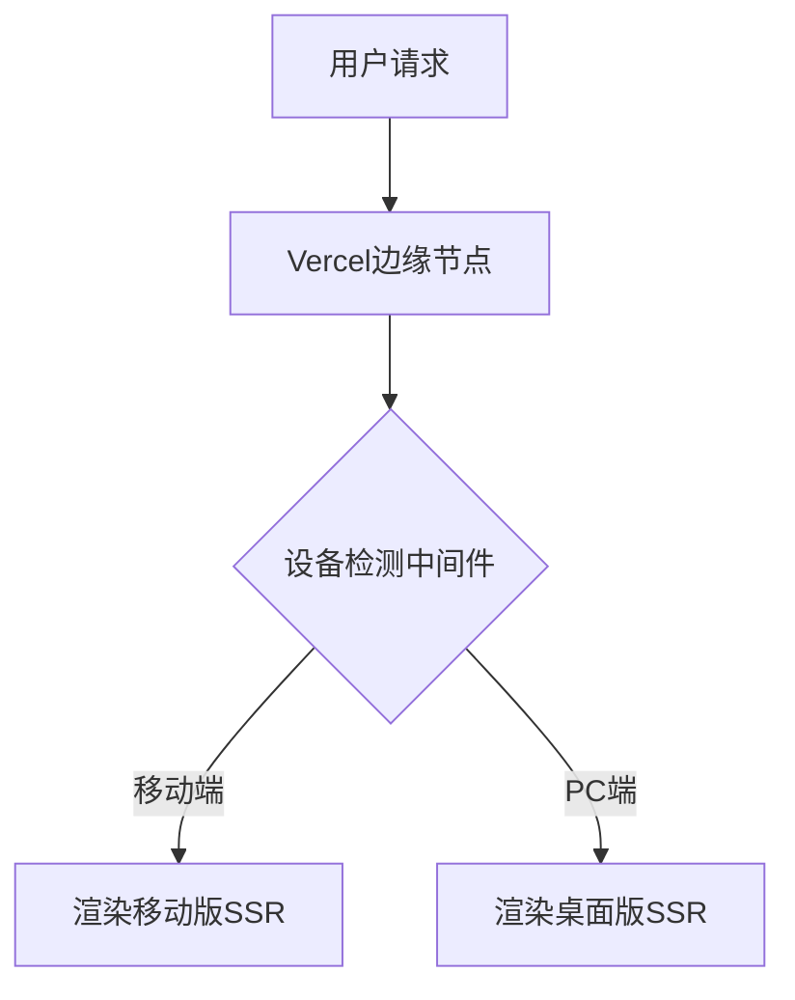
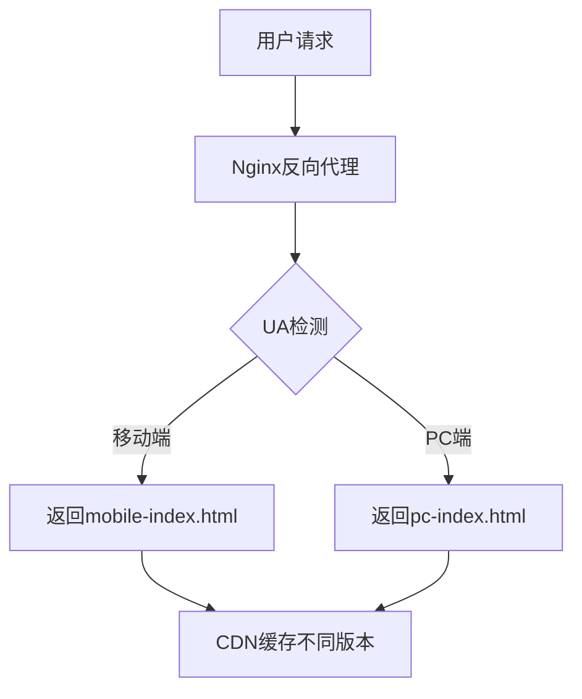

## 使用同一个链接，如何实现 PC 打开是 web 应用、手机打开是一个 H5 应用？ 

> 请针对 nextjs ssr 项目或者 spa nginx 项目补充

针对 Next.js SSR 项目和 SPA + Nginx 项目的不同技术栈，以下是专业级的实现方案：

---

### 一、Next.js SSR 项目方案

#### 1. **中间件设备检测（Next.js 12+）**
```typescript
// middleware.ts
import { NextRequest, NextResponse } from 'next/server';
import { isMobile } from 'react-device-detect';

export function middleware(request: NextRequest) {
  const url = request.nextUrl;
  const ua = request.headers.get('user-agent') || '';

  // 移动端重定向到/h5路由（保持URL不变）
  if (isMobile(ua)) {
    url.pathname = `/h5${url.pathname}`;
    return NextResponse.rewrite(url);
  }

  return NextResponse.next();
}
```

#### 2. **动态页面渲染（SSR）**
```typescript
// pages/[...slug].tsx
import { GetServerSideProps } from 'next';

export const getServerSideProps: GetServerSideProps = async (ctx) => {
  const ua = ctx.req.headers['user-agent'] || '';
  const isMobile = /Mobile|Android|iPhone/i.test(ua);

  return {
    props: {
      isMobile,
      // 加载不同数据
      data: isMobile 
        ? await fetchMobileData() 
        : await fetchPCData()
    }
  };
};

const Page = ({ isMobile, data }) => (
  isMobile ? <MobileLayout data={data} /> : <PCLayout data={data} />
);
```

#### 3. **共享组件差异化**
```typescript
// components/ResponsiveHeader.tsx
const Header = () => {
  const { isMobile } = useDeviceDetect(); // 自定义hook

  return (
    <header>
      {isMobile ? (
        <MobileNav />
      ) : (
        <div className="flex space-x-8">
          <DesktopNav />
          <SearchBar />
        </div>
      )}
    </header>
  );
};
```

#### 4. **配置优化（next.config.js）**
```javascript
module.exports = {
  async rewrites() {
    return [
      // 保持URL不变内部路由
      { source: '/h5/:path*', destination: '/:path*' }
    ]
  },
  // 按设备加载chunk
  webpack(config) {
    config.plugins.push(new DevicePlugin());
    return config;
  }
}
```

---

### 二、SPA + Nginx 项目方案

#### 1. **Nginx 设备路由规则**
```nginx
server {
  listen 80;
  server_name yourdomain.com;

  set $mobile_rewrite do_not_perform;

  # 设备检测（支持自定义规则）
  if ($http_user_agent ~* "(android|iphone|mobile)") {
    set $mobile_rewrite perform;
  }

  # Cookie强制覆盖
  if ($cookie_force_desktop = "true") {
    set $mobile_rewrite do_not_perform;
  }

  location / {
    # 动态路由到不同HTML入口
    if ($mobile_rewrite = perform) {
      rewrite ^ /mobile-index.html break;
    }
  
    try_files $uri $uri/ /pc-index.html;
  }

  # 移动版资源单独缓存
  location ~* \.(js|css)$ {
    if ($mobile_rewrite = perform) {
      expires 7d;
      add_header Vary User-Agent;
    }
  }
}
```

#### 2. **前端设备同步（SPA）**
```typescript
// src/utils/device.js
export const initDeviceMode = () => {
  const ua = navigator.userAgent;
  const isMobile = /Mobile|Android|iPhone/i.test(ua);

  // 持久化设备类型
  if (!localStorage.getItem('forceView')) {
    localStorage.setItem('isMobile', isMobile);
  }

  return isMobile;
};

// 主入口文件
const renderApp = () => {
  const root = document.getElementById('root');
  root.innerHTML = initDeviceMode() 
    ? '<div id="mobile-app"></div>' 
    : '<div id="pc-app"></div>';

  // 动态加载对应JS
  const script = document.createElement('script');
  script.src = initDeviceMode() ? 'mobile.bundle.js' : 'pc.bundle.js';
  document.body.appendChild(script);
};
```

#### 3. **响应式资源加载**
```html
<!-- pc-index.html -->
<head>
  <script>
    if (/Mobile|Android|iPhone/i.test(navigator.userAgent)) {
      window.location.href = '/mobile-index.html';
    }
  </script>
  <link rel="preload" href="pc.bundle.js" as="script">
</head>

<!-- mobile-index.html -->
<head>
  <meta name="viewport" content="width=device-width, initial-scale=1.0">
  <link rel="preload" href="mobile.bundle.js" as="script">
</head>
```

---

### 三、通用优化策略

#### 1. **设备检测优化**
```typescript
// 更精准的检测逻辑
const detectDevice = (ua) => {
  const isMobile = /(iPhone|iPod|iPad|Android|Mobile)/i.test(ua);
  const isTablet = /(iPad|Tablet)/i.test(ua);

  return {
    isMobile: isMobile && !isTablet,
    isTablet,
    isDesktop: !isMobile && !isTablet
  };
};
```

#### 2. **状态同步方案**
```typescript
// 使用URL参数保持状态
const syncDeviceState = () => {
  const params = new URLSearchParams(location.search);

  // 允许手动切换
  if (params.has('mobile')) {
    localStorage.setItem('forceView', 'mobile');
  } else if (params.has('desktop')) {
    localStorage.setItem('forceView', 'desktop');
  }
};
```

#### 3. **性能监控埋点**
```javascript
// 收集各版本性能数据
const perfObserver = new PerformanceObserver((list) => {
  const deviceType = initDeviceMode() ? 'mobile' : 'desktop';
  const metrics = {
    FCP: list.getEntriesByName('first-contentful-paint')[0],
    LCP: list.getEntriesByName('largest-contentful-paint')[0]
  };

  analytics.send(`perf_${deviceType}`, metrics);
});
```

---

### 四、部署架构建议

#### Next.js 项目部署：


#### SPA + Nginx 部署：


---

### 五、异常处理方案

#### 1. **降级策略**
```nginx
# Nginx降级配置
location / {
  error_page 500 502 503 504 @fallback;
}

location @fallback {
  if ($http_user_agent ~* "Mobile") {
    return 302 /mobile-fallback.html;
  }
  return 302 /pc-fallback.html;
}
```

#### 2. **版本强制切换**
```javascript
// 添加切换按钮（需服务端配合）
const ForceSwitch = () => (
  <button onClick={() => {
    localStorage.setItem('forceView', isMobile ? 'desktop' : 'mobile');
    window.location.reload();
  }}>
    {isMobile ? '切换到PC版' : '切换到移动版'}
  </button>
);
```

---

### 最佳实践建议

1. **Next.js 项目优先选择**：
    - 使用中间件实现设备检测
    - 保持URL结构一致
    - 通过`getServerSideProps`加载不同数据

2. **SPA项目注意**：
    - Nginx层做好缓存隔离（`Vary: User-Agent`）
    - 预加载关键资源
    - 提供手动切换入口

3. **通用原则**：
   ```text
   设备检测流程：
   UA检测 -> Cookie覆盖 -> 本地存储记忆 -> 媒体查询兜底
   ```

4. **性能指标**：
    - 移动版首屏加载控制在1.5秒内
    - PC版保持90+的Lighthouse分数
    - 设备检测耗时<50ms

通过以上方案，可以实现在保持URL不变的前提下，智能适配不同终端设备，同时保证最佳的性能和用户体验。
