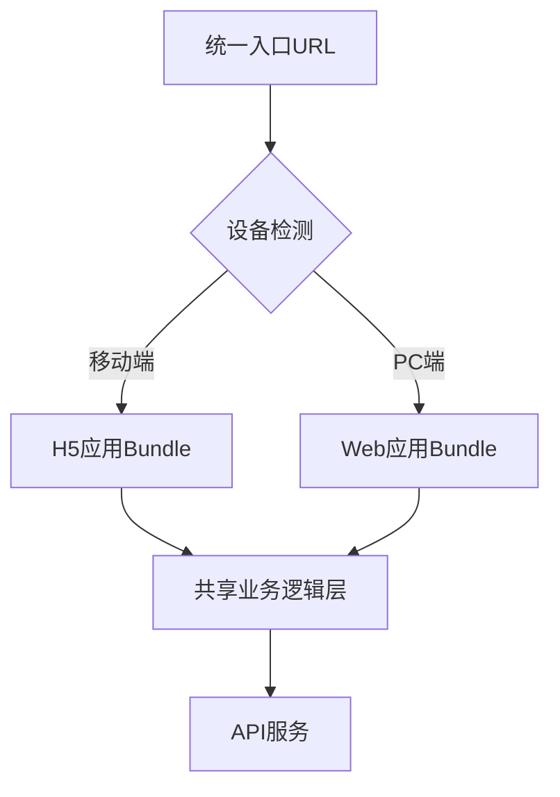
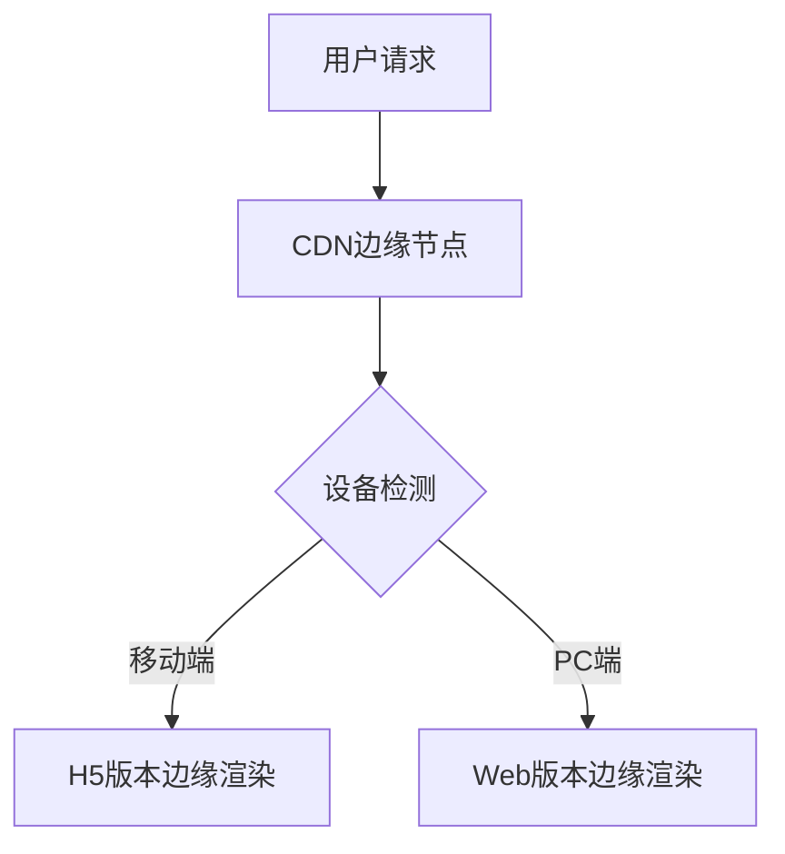

## 30. 使用同一个链接，如何实现 PC 打开是 web 应用、手机打开是一个 H5 应用？

要实现同一个URL在PC和移动端展示不同形态的应用，需要综合运用响应式设计、设备检测、动态渲染等技术。以下是专业级解决方案：

---

### 一、核心实现方案

#### 1. **服务端用户代理检测（SSR动态渲染）**
```typescript
// Node.js中间件示例（Express/Koa）
import { isMobile } from 'mobile-device-detect';

app.get('*', (req, res) => {
  const userAgent = req.headers['user-agent'];

  if (isMobile({ ua: userAgent })) {
    // 返回H5版本
    res.render('mobile-h5', { 
      layout: 'h5-layout',
      data: await getMobileData() 
    });
  } else {
    // 返回PC Web应用
    res.render('pc-web', {
      layout: 'web-layout',
      data: await getPCData()
    });
  }
});
```

**设备检测库推荐**：
- `mobile-device-detect`：轻量级检测库（3KB）
- `express-device`：支持详细设备分类
- `ua-parser-js`：深度解析UA字符串

#### 2. **客户端自适应渲染（CSR混合方案）**
```typescript
// React组件示例
const App = () => {
  const [isMobile, setIsMobile] = useState(false);

  useEffect(() => {
    const checkDevice = () => {
      setIsMobile(window.matchMedia('(max-width: 768px)').matches);
    };
  
    checkDevice();
    window.addEventListener('resize', checkDevice);
    return () => window.removeEventListener('resize', checkDevice);
  }, []);

  return isMobile ? <MobileH5 /> : <PCWebApp />;
};
```

---

### 二、架构设计模式

#### 1. **同构应用架构**


#### 2. **动态资源加载**
```html
<!-- 根据设备加载不同JS -->
<script>
  if (/Mobi|Android|iPhone/i.test(navigator.userAgent)) {
    document.write('<script src="h5.bundle.js"><\/script>');
  } else {
    document.write('<script src="web.bundle.js"><\/script>');
  }
</script>
```

---

### 三、关键技术实现

#### 1. **响应式路由系统**
```typescript
// Next.js动态路由示例
// pages/[...slug].tsx
export const getServerSideProps = async (context) => {
  const isMobile = context.req.headers['user-agent']?.match(/Mobile/i);

  return {
    props: {
      // 注入设备标识
      __isMobile: !!isMobile
    }
  };
};

const Page = ({ __isMobile }) => (
  __isMobile ? <MobileRouter /> : <PCRouter />
);
```

#### 2. **CSS媒体查询兜底**
```css
/* 保证基础样式兼容 */
.pc-only {
  display: block;
}

.mobile-only {
  display: none;
}

@media (max-width: 768px) {
  .pc-only {
    display: none !important;
  }

  .mobile-only {
    display: block !important;
  }
}
```

---

### 四、优化策略

#### 1. **缓存策略优化**
```nginx
# Nginx设备识别缓存规则
map $http_user_agent $device_type {
  default "web";
  ~*(android|iphone|ipod) "h5";
}

server {
  location / {
    proxy_cache_key "$uri|$device_type";
    proxy_cache my_cache;
  }
}
```

#### 2. **AB测试方案**
```javascript
// 通过Cookie控制显示版本
function getVersion() {
  const forcedVersion = getCookie('force_version');
  if (forcedVersion) return forcedVersion;

  return isMobile() ? 'h5' : 'web';
}
```

---

### 五、SEO处理方案

#### 1. **动态元标签**
```typescript
// 服务端渲染不同meta
export const MetaTags = ({ isMobile }) => (
  <Head>
    {isMobile ? (
      <meta name="description" content="移动端专属描述" />
    ) : (
      <meta name="description" content="PC端专属描述" />
    )}
  </Head>
);
```

#### 2. **统一SEO关键元素**
```html
<!-- 保证搜索引擎抓取一致性 -->
<div class="seo-content">
  <h1>统一的主标题</h1>
  <p>共用的核心描述内容...</p>
</div>
```

---

### 六、企业级解决方案

#### 1. **边缘计算动态路由**


#### 2. **微前端架构集成**
```typescript
// 通过qiankun加载不同子应用
import { loadMicroApp } from 'qiankun';

const loadApp = () => {
  const apps = {
    pc: { name: 'pc-web', entry: '/pc/', container: '#app' },
    mobile: { name: 'mobile-h5', entry: '/h5/', container: '#app' }
  };

  loadMicroApp(isMobile() ? apps.mobile : apps.pc);
};
```

---

### 七、调试与测试方案

#### 1. **设备模拟测试**
```javascript
// Puppeteer多设备测试
const devices = require('puppeteer/DeviceDescriptors');

async function test() {
  for (const device of [devices['iPhone X'], devices['Desktop Chrome']]) {
    const browser = await puppeteer.launch();
    const page = await browser.newPage();
    await page.emulate(device);
    await page.goto('https://your-site.com');
    await page.screenshot({ path: `${device.name}.png` });
    await browser.close();
  }
}
```

#### 2. **可视化回归测试**
```bash
# 使用BackstopJS进行多设备截图对比
{
  "scenarios": [
    {
      "label": "PC首页",
      "url": "http://localhost:3000",
      "misMatchThreshold": 0.1,
      "userAgent": "Mozilla/5.0 (Windows NT 10.0)"
    },
    {
      "label": "Mobile首页",
      "url": "http://localhost:3000",
      "misMatchThreshold": 0.1,
      "userAgent": "Mozilla/5.0 (iPhone; CPU iPhone OS 11_0)"
    }
  ]
}
```

---

### 最佳实践总结

1. **核心原则**：
    - 服务端优先识别设备（User-Agent + Viewport）
    - 客户端二次校验兜底
    - 保持URL一致性

2. **技术选型矩阵**：

| 场景 | 推荐方案 | 优点 |
|------|----------|------|
| 简单展示差异 | CSS媒体查询 | 零JS、高性能 |
| 中度交互差异 | 动态组件加载 | 灵活可控 |
| 完全独立体验 | 服务端路由 | 最佳性能 |

3. **性能优化要点**：
    - 设备检测控制在5ms内
    - 关键资源预加载
    - 共享核心业务逻辑

4. **异常处理**：
   ```typescript
   // 设备识别失败兜底
   function getSafeVersion() {
     try {
       return detectDevice();
     } catch (e) {
       return window.innerWidth < 768 ? 'h5' : 'web';
     }
   }
   ```

通过以上方案，可以实现：
- 同一URL自动适配不同设备
- 保持SEO友好性
- 维护成本最低的代码结构
- 流畅的用户体验过渡
