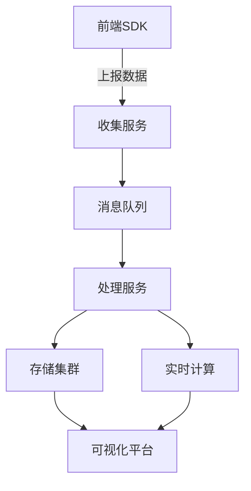
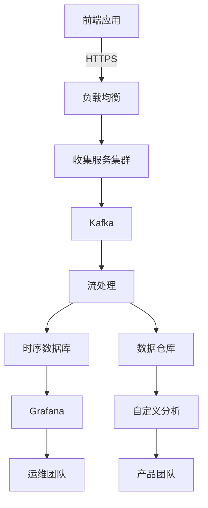

## 33. 设计一套全站请求耗时统计工具

# 全站请求耗时统计工具设计方案

## 一、核心架构设计



## 二、前端SDK实现（TypeScript）

### 1. 基础监控SDK

```typescript
interface RequestMetrics {
  url: string;
  method: string;
  status: number;
  duration: number;
  requestSize?: number;
  responseSize?: number;
  timestamp: number;
  userId?: string;
  sessionId: string;
  appVersion: string;
}

class PerformanceMonitor {
  private readonly sessionId = crypto.randomUUID();
  private readonly reportUrl: string;
  private readonly sampleRate: number;
  private queue: RequestMetrics[] = [];

  constructor(config: {
    reportUrl: string;
    sampleRate?: number;
    appVersion: string;
  }) {
    this.reportUrl = config.reportUrl;
    this.sampleRate = config.sampleRate || 1.0;
  }

  init() {
    this.interceptFetch();
    this.interceptXHR();
    this.setupUnloadHandler();
  }

  private interceptFetch() {
    const originalFetch = window.fetch;
  
    window.fetch = async (...args) => {
      const [input, init] = args;
      const url = typeof input === 'string' ? input : input.url;
      const method = init?.method || 'GET';
      const startTime = performance.now();
    
      try {
        const response = await originalFetch(...args);
        const duration = performance.now() - startTime;
      
        this.track({
          url,
          method,
          status: response.status,
          duration,
          timestamp: Date.now()
        });
      
        return response;
      } catch (error) {
        const duration = performance.now() - startTime;
        this.track({
          url,
          method,
          status: 0,
          duration,
          timestamp: Date.now()
        });
        throw error;
      }
    };
  }

  private track(metrics: Omit<RequestMetrics, 'sessionId' | 'appVersion'>) {
    if (Math.random() > this.sampleRate) return;
  
    this.queue.push({
      ...metrics,
      sessionId: this.sessionId,
      appVersion: this.appVersion
    });
  
    if (this.queue.length >= 5) {
      this.flush();
    }
  }

  private flush() {
    if (!this.queue.length) return;
  
    const data = [...this.queue];
    this.queue = [];
  
    navigator.sendBeacon(this.reportUrl, JSON.stringify(data));
  }
}
```

### 2. 增强版性能指标采集

```typescript
interface EnhancedMetrics extends RequestMetrics {
  dnsTime?: number;
  tcpTime?: number;
  sslTime?: number;
  ttfb?: number;
  downloadTime?: number;
  redirectTime?: number;
}

class EnhancedPerformanceMonitor extends PerformanceMonitor {
  private resourceTimingBuffer: PerformanceEntry[] = [];

  constructor(config: { reportUrl: string }) {
    super(config);
    this.setupResourceTiming();
  }

  private setupResourceTiming() {
    const observer = new PerformanceObserver(list => {
      this.resourceTimingBuffer.push(...list.getEntries());
    });
    observer.observe({ type: 'resource', buffered: true });
  }

  private getResourceTiming(url: string): EnhancedMetrics | null {
    const entry = this.resourceTimingBuffer.find(e => e.name === url);
    if (!entry) return null;
  
    const rt = entry as PerformanceResourceTiming;
    return {
      dnsTime: rt.domainLookupEnd - rt.domainLookupStart,
      tcpTime: rt.connectEnd - rt.connectStart,
      sslTime: rt.secureConnectionStart ? 
        rt.connectEnd - rt.secureConnectionStart : 0,
      ttfb: rt.responseStart - rt.requestStart,
      downloadTime: rt.responseEnd - rt.responseStart,
      redirectTime: rt.redirectEnd - rt.redirectStart
    };
  }
}
```

## 三、后端收集服务

### 1. Node.js 收集端点示例

```typescript
import express from 'express';
import { Kafka } from 'kafkajs';

const app = express();
const kafka = new Kafka({
  brokers: ['kafka:9092']
});
const producer = kafka.producer();

app.use(express.json());

app.post('/collect', async (req, res) => {
  const metrics = req.body as RequestMetrics[];

  // 基础验证
  if (!Array.isArray(metrics) || !metrics.length) {
    return res.status(400).end();
  }

  // 发送到Kafka
  await producer.send({
    topic: 'perf-metrics',
    messages: metrics.map(m => ({
      value: JSON.stringify(m),
      timestamp: `${m.timestamp}`
    }))
  });

  res.status(202).end();
});

// 启动服务
(async () => {
  await producer.connect();
  app.listen(3000);
})();
```

### 2. 数据清洗处理服务

```typescript
class MetricsProcessor {
  private readonly anomalyThresholds = {
    duration: 5000,
    errorRate: 0.1
  };

  process(metrics: RequestMetrics[]) {
    // 1. 数据清洗
    const cleaned = metrics.filter(m => 
      m.url && m.method && m.timestamp
    );
  
    // 2. 异常检测
    const anomalies = cleaned.filter(m => 
      m.duration > this.anomalyThresholds.duration || 
      (m.status >= 400 && m.status !== 404)
    );
  
    // 3. 聚合统计
    const stats = this.aggregateStats(cleaned);
  
    return { cleaned, anomalies, stats };
  }

  private aggregateStats(metrics: RequestMetrics[]) {
    const byEndpoint = metrics.reduce((acc, m) => {
      const key = `${m.method} ${m.url}`;
      acc[key] = acc[key] || { count: 0, totalDuration: 0 };
      acc[key].count++;
      acc[key].totalDuration += m.duration;
      return acc;
    }, {} as Record<string, { count: number; totalDuration: number }>);
  
    return Object.entries(byEndpoint).map(([endpoint, data]) => ({
      endpoint,
      count: data.count,
      avgDuration: data.totalDuration / data.count,
      p95: this.calculatePercentile(
        metrics.filter(m => `${m.method} ${m.url}` === endpoint),
        95
      )
    }));
  }

  private calculatePercentile(metrics: RequestMetrics[], percentile: number) {
    const sorted = [...metrics].sort((a, b) => a.duration - b.duration);
    const index = Math.ceil(sorted.length * percentile / 100) - 1;
    return sorted[index]?.duration || 0;
  }
}
```

## 四、存储与查询设计

### 1. 时序数据库方案（InfluxDB）

```sql
-- 创建保留策略
CREATE RETENTION POLICY "perf_30days" ON "monitoring" 
DURATION 30d REPLICATION 1

-- 示例查询：获取API平均响应时间
SELECT MEAN("duration") FROM "http_requests" 
WHERE time > now() - 1h 
GROUP BY "endpoint", time(5m)

-- 错误率查询
SELECT COUNT("status") AS total,
SUM(CASE WHEN "status" >= 400 THEN 1 ELSE 0 END) AS errors,
SUM(CASE WHEN "status" >= 400 THEN 1 ELSE 0 END) / COUNT("status") AS error_rate
FROM "http_requests" 
GROUP BY time(1h), "endpoint"
```

### 2. Elasticsearch 索引映射

```json
{
  "mappings": {
    "properties": {
      "timestamp": { "type": "date" },
      "url": { "type": "keyword" },
      "method": { "type": "keyword" },
      "status": { "type": "integer" },
      "duration": { "type": "float" },
      "userId": { "type": "keyword" },
      "sessionId": { "type": "keyword" },
      "geoip": {
        "type": "object",
        "properties": {
          "country": { "type": "keyword" },
          "region": { "type": "keyword" }
        }
      }
    }
  }
}
```

## 五、可视化方案

### 1. Grafana 仪表板配置

```json
{
  "panels": [
    {
      "title": "API响应时间",
      "type": "graph",
      "targets": [{
        "expr": "SELECT mean(\"duration\") FROM \"http_requests\" WHERE $timeFilter GROUP BY time($__interval), \"endpoint\"",
        "format": "time_series"
      }],
      "options": {
        "legend": { "show": true },
        "tooltip": { "shared": true }
      }
    },
    {
      "title": "错误率TOP 10",
      "type": "table",
      "targets": [{
        "expr": "SELECT endpoint, count(status) as total, sum(case when status >= 400 then 1 else 0 end) as errors FROM \"http_requests\" WHERE $timeFilter GROUP BY endpoint ORDER BY errors DESC LIMIT 10"
      }]
    }
  ]
}
```

### 2. 自定义分析视图功能

```typescript
interface AnalysisView {
  timeRange: [Date, Date];
  filters: {
    endpoints?: string[];
    statusCodes?: number[];
    minDuration?: number;
  };
  breakdownBy: 'endpoint' | 'region' | 'appVersion';
}

class AnalyticsEngine {
  constructor(private dbClient: DatabaseClient) {}

  async getPerformanceReport(view: AnalysisView) {
    const { timeRange, filters, breakdownBy } = view;
  
    const baseQuery = this.dbClient
      .from('request_metrics')
      .whereBetween('timestamp', timeRange);
  
    if (filters.endpoints) {
      baseQuery.whereIn('endpoint', filters.endpoints);
    }
  
    if (filters.statusCodes) {
      baseQuery.whereIn('status', filters.statusCodes);
    }
  
    if (filters.minDuration) {
      baseQuery.where('duration', '>=', filters.minDuration);
    }
  
    return baseQuery
      .select([
        breakdownBy,
        this.dbClient.raw('COUNT(*) as request_count'),
        this.dbClient.raw('AVG(duration) as avg_duration'),
        this.dbClient.raw('PERCENTILE_CONT(0.95) WITHIN GROUP (ORDER BY duration) as p95')
      ])
      .groupBy(breakdownBy)
      .orderBy('avg_duration', 'desc');
  }
}
```

## 六、告警系统设计

### 1. 告警规则配置

```yaml
rules:
  - name: "high_error_rate"
    condition: "error_rate > 0.1 for 5m"
    severity: "warning"
    channels: ["slack#alerts"]
  
  - name: "slow_responses"
    condition: "avg_duration > 2000 for 10m"
    severity: "critical"
    channels: ["sms", "email"]
```

### 2. 告警触发逻辑

```typescript
class AlertEngine {
  private activeAlerts = new Map<string, Alert>();

  async evaluateRules() {
    const rules = await this.getActiveRules();
    const metrics = await this.getRecentMetrics();
  
    for (const rule of rules) {
      const isTriggered = this.evaluateCondition(rule.condition, metrics);
    
      if (isTriggered && !this.activeAlerts.has(rule.name)) {
        const alert = this.triggerAlert(rule);
        this.activeAlerts.set(rule.name, alert);
      } else if (!isTriggered && this.activeAlerts.has(rule.name)) {
        this.resolveAlert(rule.name);
      }
    }
  }

  private evaluateCondition(condition: string, metrics: Metric[]) {
    // 实现条件表达式解析
    // 示例实现简单条件：
    if (condition.includes('error_rate >')) {
      const threshold = parseFloat(condition.split('>')[1]);
      return metrics.some(m => m.errorRate > threshold);
    }
    return false;
  }
}
```

## 七、部署架构建议



## 八、性能优化策略

1. **前端采样策略**：
    - 动态采样率：根据请求量自动调整（1%~100%）
    - 关键路径优先：对核心接口100%采样

2. **后端批处理**：
   ```go
   // Go示例批处理处理器
   func processBatch(messages []kafka.Message) {
       var batch []RequestMetric
       for _, msg := range messages {
           var m RequestMetric
           json.Unmarshal(msg.Value, &m)
           batch = append(batch, m)
       }
     
       // 批量插入数据库
       db.BulkInsert(batch)
   }
   ```

3. **缓存层设计**：
    - 热数据缓存：Redis缓存最近1小时的聚合结果
    - 查询缓存：对相同分析查询缓存5分钟

## 九、安全考虑

1. 数据脱敏：
   ```typescript
   function sanitizeUrl(url: string) {
     return url.replace(/\/users\/\d+/g, '/users/{id}')
               .replace(/\/orders\/[a-z0-9-]+/g, '/orders/{id}');
   }
   ```

2. 访问控制：
    - 基于角色的数据访问（RBAC）
    - 敏感操作审计日志

3. 速率限制：
   ```nginx
   location /collect {
     limit_req zone=api burst=100 nodelay;
     proxy_pass http://collect_service;
   }
   ```

## 十、演进路线

1. **V1 基础版**：
    - 前端SDK采集
    - 简单后端存储
    - 基础可视化

2. **V2 增强版**：
    - 分布式追踪
    - 智能异常检测
    - 用户行为关联

3. **V3 智能版**：
    - 预测性分析
    - 自动根因分析
    - 自愈建议系统
