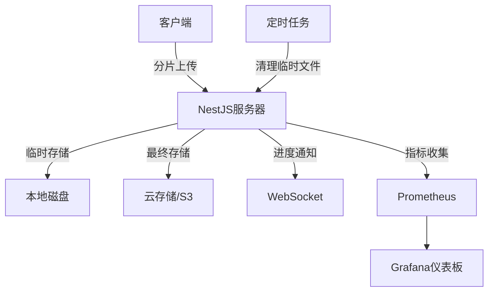

# NestJS 实现大文件上传完整方案

## 一、项目初始化与配置

### 1. 创建NestJS项目

```bash
nest new file-upload-server
cd file-upload-server
npm install @nestjs/platform-express multer fs-extra crypto-js
```

### 2. 配置文件上传模块

```typescript
// src/config/multer.config.ts
import { diskStorage } from 'multer';
import { extname } from 'path';
import { v4 as uuid } from 'uuid';

export const multerOptions = {
  storage: diskStorage({
    destination: './uploads/tmp',
    filename: (req, file, cb) => {
      cb(null, `${uuid()}${extname(file.originalname)}`);
    }
  }),
  limits: {
    fileSize: 1024 * 1024 * 100 // 100MB
  }
};
```

## 二、核心模块实现

### 1. 文件上传模块

```typescript
// src/upload/upload.module.ts
import { Module } from '@nestjs/common';
import { MulterModule } from '@nestjs/platform-express';
import { multerOptions } from '../config/multer.config';
import { UploadController } from './upload.controller';
import { UploadService } from './upload.service';

@Module({
  imports: [
    MulterModule.register(multerOptions)
  ],
  controllers: [UploadController],
  providers: [UploadService]
})
export class UploadModule {}
```

### 2. 分片上传控制器

```typescript
// src/upload/upload.controller.ts
import { Controller, Post, UseInterceptors, UploadedFile, Body } from '@nestjs/common';
import { FileInterceptor } from '@nestjs/platform-express';
import { UploadService } from './upload.service';

@Controller('upload')
export class UploadController {
  constructor(private readonly uploadService: UploadService) {}

  @Post('chunk')
  @UseInterceptors(FileInterceptor('file'))
  async uploadChunk(
    @UploadedFile() file: Express.Multer.File,
    @Body() body: any
  ) {
    const { index, totalChunks, fileHash, fileName } = body;
    return this.uploadService.saveChunk(
      file,
      parseInt(index),
      parseInt(totalChunks),
      fileHash,
      fileName
    );
  }

  @Post('merge')
  async mergeChunks(@Body() body: any) {
    const { fileHash, fileName, size } = body;
    return this.uploadService.mergeChunks(fileHash, fileName, parseInt(size));
  }

  @Post('verify')
  async verifyFile(@Body() body: any) {
    const { fileHash, fileName } = body;
    return this.uploadService.verifyFile(fileHash, fileName);
  }
}
```

## 三、服务层实现

### 1. 分片上传服务

```typescript
// src/upload/upload.service.ts
import { Injectable } from '@nestjs/common';
import * as fs from 'fs-extra';
import * as path from 'path';
import { pipeline } from 'stream/promises';
import { createHash } from 'crypto';

@Injectable()
export class UploadService {
  private readonly UPLOAD_DIR = path.resolve('./uploads');
  private readonly TEMP_DIR = path.join(this.UPLOAD_DIR, 'temp');

  constructor() {
    fs.ensureDirSync(this.UPLOAD_DIR);
    fs.ensureDirSync(this.TEMP_DIR);
  }

  async saveChunk(
    file: Express.Multer.File,
    index: number,
    totalChunks: number,
    fileHash: string,
    fileName: string
  ) {
    const chunkDir = this.getChunkDir(fileHash);
    await fs.ensureDir(chunkDir);
  
    const chunkPath = path.join(chunkDir, index.toString());
    await fs.move(file.path, chunkPath, { overwrite: true });
  
    await this.recordUploadedChunk(fileHash, index);
  
    return { success: true, index };
  }

  async mergeChunks(fileHash: string, fileName: string, size: number) {
    const chunkDir = this.getChunkDir(fileHash);
    const chunkPaths = await fs.readdir(chunkDir);
  
    // 确保所有分片都已上传
    const uploadedChunks = chunkPaths
      .filter(name => name !== '_uploaded')
      .map(name => parseInt(name))
      .sort((a, b) => a - b);
  
    const filePath = path.join(this.UPLOAD_DIR, fileName);
    const writeStream = fs.createWriteStream(filePath);
  
    for (const chunkIndex of uploadedChunks) {
      const chunkPath = path.join(chunkDir, chunkIndex.toString());
      await pipeline(
        fs.createReadStream(chunkPath),
        writeStream,
        { end: false }
      );
    }
  
    writeStream.end();
  
    // 验证文件大小
    const stats = await fs.stat(filePath);
    if (stats.size !== size) {
      await fs.remove(filePath);
      throw new Error('文件大小不匹配');
    }
  
    // 清理临时文件
    await fs.remove(chunkDir);
  
    return { success: true, path: filePath };
  }

  async verifyFile(fileHash: string, fileName: string) {
    const filePath = path.join(this.UPLOAD_DIR, fileName);
  
    if (await fs.pathExists(filePath)) {
      const hash = await this.calculateFileHash(filePath);
      return {
        shouldUpload: hash !== fileHash,
        uploadedChunks: []
      };
    }
  
    const chunkDir = this.getChunkDir(fileHash);
    if (await fs.pathExists(chunkDir)) {
      const uploadedFile = path.join(chunkDir, '_uploaded');
      if (await fs.pathExists(uploadedFile)) {
        const uploaded = await fs.readFile(uploadedFile, 'utf-8');
        const uploadedChunks = uploaded
          .split('\n')
          .filter(Boolean)
          .map(Number);
      
        return {
          shouldUpload: true,
          uploadedChunks
        };
      }
    }
  
    return {
      shouldUpload: true,
      uploadedChunks: []
    };
  }

  private getChunkDir(fileHash: string) {
    return path.join(this.TEMP_DIR, fileHash);
  }

  private async recordUploadedChunk(fileHash: string, index: number) {
    const chunkDir = this.getChunkDir(fileHash);
    const uploadedFile = path.join(chunkDir, '_uploaded');
    await fs.appendFile(uploadedFile, `${index}\n`);
  }

  private async calculateFileHash(filePath: string): Promise<string> {
    return new Promise((resolve, reject) => {
      const hash = createHash('sha256');
      const stream = fs.createReadStream(filePath);
    
      stream.on('data', chunk => hash.update(chunk));
      stream.on('end', () => resolve(hash.digest('hex')));
      stream.on('error', reject);
    });
  }
}
```

## 四、全局异常处理

```typescript
// src/filters/upload-exception.filter.ts
import { 
  ExceptionFilter,
  Catch,
  ArgumentsHost,
  HttpException,
  HttpStatus
} from '@nestjs/common';
import { Response } from 'express';

@Catch()
export class UploadExceptionFilter implements ExceptionFilter {
  catch(exception: Error, host: ArgumentsHost) {
    const ctx = host.switchToHttp();
    const response = ctx.getResponse<Response>();
  
    const status = 
      exception instanceof HttpException
        ? exception.getStatus()
        : HttpStatus.INTERNAL_SERVER_ERROR;
  
    response.status(status).json({
      success: false,
      message: exception.message || '文件上传失败',
      timestamp: new Date().toISOString()
    });
  }
}

// 在main.ts中注册
app.useGlobalFilters(new UploadExceptionFilter());
```

## 五、文件下载实现

```typescript
// src/download/download.controller.ts
import { Controller, Get, Res, Param, Header } from '@nestjs/common';
import { Response } from 'express';
import * as path from 'path';
import * as fs from 'fs-extra';

@Controller('download')
export class DownloadController {
  private readonly UPLOAD_DIR = path.resolve('./uploads');

  @Get(':filename')
  @Header('Content-Type', 'application/octet-stream')
  async downloadFile(
    @Param('filename') filename: string,
    @Res() res: Response
  ) {
    const filePath = path.join(this.UPLOAD_DIR, filename);
  
    if (!await fs.pathExists(filePath)) {
      return res.status(404).json({
        success: false,
        message: '文件不存在'
      });
    }
  
    const stats = await fs.stat(filePath);
    res.setHeader('Content-Length', stats.size);
  
    const readStream = fs.createReadStream(filePath);
    readStream.pipe(res);
  }
}
```

## 六、安全增强

### 1. 文件类型校验

```typescript
// src/utils/file-type.validator.ts
import { BadRequestException } from '@nestjs/common';

export function validateFileType(file: Express.Multer.File, allowedTypes: string[]) {
  const fileExt = path.extname(file.originalname).toLowerCase();

  if (!allowedTypes.includes(fileExt)) {
    throw new BadRequestException(`不支持的文件类型: ${fileExt}`);
  }

  // 进一步检查真实文件类型
  const realType = file.mimetype;
  if (!allowedTypes.includes(realType)) {
    throw new BadRequestException(`文件类型不匹配: ${realType}`);
  }
}

// 在控制器中使用
@Post('chunk')
@UseInterceptors(FileInterceptor('file'))
async uploadChunk(
  @UploadedFile() file: Express.Multer.File,
  @Body() body: any
) {
  validateFileType(file, [
    '.jpg', '.jpeg', '.png', '.pdf',
    'image/jpeg', 'image/png', 'application/pdf'
  ]);

  // ...其他逻辑
}
```

### 2. 文件病毒扫描

```typescript
// src/utils/virus-scanner.ts
import { spawn } from 'child_process';
import { InternalServerErrorException } from '@nestjs/common';

export async function scanForViruses(filePath: string): Promise<boolean> {
  return new Promise((resolve, reject) => {
    const clamscan = spawn('clamscan', [filePath]);
  
    clamscan.on('close', (code) => {
      // 返回0表示没有病毒
      resolve(code === 0);
    });
  
    clamscan.on('error', (err) => {
      reject(new InternalServerErrorException('病毒扫描失败'));
    });
  });
}

// 在合并文件后调用
async mergeChunks(fileHash: string, fileName: string, size: number) {
  // ...合并逻辑

  const isClean = await scanForViruses(filePath);
  if (!isClean) {
    await fs.remove(filePath);
    throw new BadRequestException('文件包含病毒');
  }

  return { success: true, path: filePath };
}
```

## 七、性能优化

### 1. 流式处理优化

```typescript
// 优化后的mergeChunks方法
async mergeChunks(fileHash: string, fileName: string, size: number) {
  const chunkDir = this.getChunkDir(fileHash);
  const chunkPaths = (await fs.readdir(chunkDir))
    .filter(name => name !== '_uploaded')
    .map(name => parseInt(name))
    .sort((a, b) => a - b);

  const filePath = path.join(this.UPLOAD_DIR, fileName);

  // 使用流式写入
  for (let i = 0; i < chunkPaths.length; i++) {
    const chunkPath = path.join(chunkDir, chunkPaths[i].toString());
    await pipeline(
      fs.createReadStream(chunkPath),
      fs.createWriteStream(filePath, { flags: i === 0 ? 'w' : 'a' })
    );
  }

  // 验证文件大小
  const stats = await fs.stat(filePath);
  if (stats.size !== size) {
    await fs.remove(filePath);
    throw new Error('文件大小不匹配');
  }

  // 清理临时文件
  await fs.remove(chunkDir);

  return { success: true, path: filePath };
}
```

### 2. 并发控制

```typescript
// src/utils/concurrency-manager.ts
export class ConcurrencyManager {
  private queue: (() => Promise<void>)[] = [];
  private activeCount = 0;

  constructor(private readonly maxConcurrent: number) {}

  async run<T>(task: () => Promise<T>): Promise<T> {
    return new Promise((resolve, reject) => {
      const wrappedTask = async () => {
        try {
          this.activeCount++;
          const result = await task();
          resolve(result);
        } catch (error) {
          reject(error);
        } finally {
          this.activeCount--;
          this.processQueue();
        }
      };
    
      this.queue.push(wrappedTask);
      this.processQueue();
    });
  }

  private processQueue() {
    while (this.activeCount < this.maxConcurrent && this.queue.length > 0) {
      const task = this.queue.shift()!;
      task();
    }
  }
}

// 在服务中使用
private readonly concurrencyManager = new ConcurrencyManager(3);

async saveChunk(...) {
  return this.concurrencyManager.run(async () => {
    // 实际的分片保存逻辑
  });
}
```

## 八、API文档

### Swagger集成

```typescript
// main.ts
import { SwaggerModule, DocumentBuilder } from '@nestjs/swagger';

const config = new DocumentBuilder()
  .setTitle('文件上传服务')
  .setDescription('大文件分片上传API文档')
  .setVersion('1.0')
  .addTag('upload')
  .build();

const document = SwaggerModule.createDocument(app, config);
SwaggerModule.setup('api', app, document);
```

### API端点说明

| 端点 | 方法 | 描述 |
|------|------|------|
| `/upload/chunk` | POST | 上传文件分片 |
| `/upload/merge` | POST | 合并所有分片 |
| `/upload/verify` | POST | 验证文件状态 |
| `/download/{filename}` | GET | 下载文件 |

## 九、部署建议

### Docker配置

```dockerfile
FROM node:16-alpine

WORKDIR /app
COPY package*.json ./
RUN npm install
COPY . .

# 安装clamav用于病毒扫描
RUN apk add --no-cache clamav clamav-libunrar

# 创建上传目录
RUN mkdir -p /app/uploads/temp
VOLUME /app/uploads

EXPOSE 3000
CMD ["npm", "run", "start:prod"]
```

### Nginx配置

```nginx
server {
    listen 80;
    server_name yourdomain.com;

    client_max_body_size 100M;
  
    location / {
        proxy_pass http://app:3000;
        proxy_http_version 1.1;
        proxy_set_header Upgrade $http_upgrade;
        proxy_set_header Connection 'upgrade';
        proxy_set_header Host $host;
        proxy_cache_bypass $http_upgrade;
    }
  
    location /uploads {
        alias /path/to/your/uploads;
        expires 30d;
        add_header Cache-Control "public";
    }
}
```

## 十、测试用例

### 单元测试

```typescript
// test/upload.service.spec.ts
import { Test } from '@nestjs/testing';
import { UploadService } from '../src/upload/upload.service';
import * as fs from 'fs-extra';
import * as path from 'path';

describe('UploadService', () => {
  let service: UploadService;
  const testDir = path.join(__dirname, 'test-uploads');

  beforeAll(async () => {
    const module = await Test.createTestingModule({
      providers: [UploadService]
    }).compile();

    service = module.get<UploadService>(UploadService);
  
    // 修改上传目录为测试目录
    jest.spyOn(service, 'getUploadDir').mockReturnValue(testDir);
    await fs.ensureDir(testDir);
  });

  afterAll(async () => {
    await fs.remove(testDir);
  });

  it('should save and merge chunks', async () => {
    const fileHash = 'testhash123';
    const fileName = 'test.txt';
  
    // 模拟分片上传
    const mockFile = {
      path: path.join(__dirname, 'fixtures', 'chunk1.txt'),
      originalname: 'chunk1.txt'
    } as Express.Multer.File;
  
    await service.saveChunk(mockFile, 0, 2, fileHash, fileName);
    await service.saveChunk(mockFile, 1, 2, fileHash, fileName);
  
    // 合并分片
    const result = await service.mergeChunks(fileHash, fileName, 20);
    expect(result.success).toBeTruthy();
    expect(await fs.pathExists(path.join(testDir, fileName))).toBeTruthy();
  });
});
```

### E2E测试

```typescript
// test/app.e2e-spec.ts
import * as request from 'supertest';
import { Test } from '@nestjs/testing';
import { INestApplication } from '@nestjs/common';
import { AppModule } from '../src/app.module';
import * as path from 'path';
import * as fs from 'fs-extra';
import { createHash } from 'crypto';

describe('Upload (e2e)', () => {
  let app: INestApplication;
  const testUploadDir = path.join(__dirname, '../uploads-test');
  const testTempDir = path.join(testUploadDir, 'temp');

  beforeAll(async () => {
    // 创建测试目录
    await fs.ensureDir(testUploadDir);
    await fs.ensureDir(testTempDir);

    // 修改环境变量使用测试目录
    process.env.UPLOAD_DIR = testUploadDir;
    process.env.TEMP_DIR = testTempDir;

    const moduleFixture = await Test.createTestingModule({
      imports: [AppModule],
    }).compile();

    app = moduleFixture.createNestApplication();
    await app.init();
  });

  afterAll(async () => {
    await app.close();
    // 清理测试目录
    await fs.remove(testUploadDir);
  });

  describe('File Upload Flow', () => {
    const fileHash = 'e2etesthash123';
    const fileName = 'e2e-test-file.txt';
    const fileContent = 'This is a test file content for E2E testing';
    const fileSize = Buffer.byteLength(fileContent);
    let mergedFilePath: string;

    beforeEach(async () => {
      // 确保每次测试前清理目录
      await fs.emptyDir(testUploadDir);
      await fs.emptyDir(testTempDir);
    });

    it('should verify non-existent file', async () => {
      const response = await request(app.getHttpServer())
        .post('/upload/verify')
        .send({ fileHash, fileName })
        .expect(201);

      expect(response.body).toEqual({
        shouldUpload: true,
        uploadedChunks: []
      });
    });

    it('should upload chunks successfully', async () => {
      // 创建测试分片
      const chunk1 = fileContent.substring(0, 20);
      const chunk2 = fileContent.substring(20);

      // 上传第一个分片
      await request(app.getHttpServer())
        .post('/upload/chunk')
        .attach('file', Buffer.from(chunk1), 'chunk1.txt')
        .field('index', 0)
        .field('totalChunks', 2)
        .field('fileHash', fileHash)
        .field('fileName', fileName)
        .expect(201);

      // 检查分片是否已保存
      const chunkDir = path.join(testTempDir, fileHash);
      expect(await fs.pathExists(chunkDir)).toBeTruthy();
      expect(await fs.pathExists(path.join(chunkDir, '0'))).toBeTruthy();

      // 上传第二个分片
      await request(app.getHttpServer())
        .post('/upload/chunk')
        .attach('file', Buffer.from(chunk2), 'chunk2.txt')
        .field('index', 1)
        .field('totalChunks', 2)
        .field('fileHash', fileHash)
        .field('fileName', fileName)
        .expect(201);

      // 检查第二个分片
      expect(await fs.pathExists(path.join(chunkDir, '1'))).toBeTruthy();
    });

    it('should merge chunks into final file', async () => {
      // 准备测试分片
      const chunkDir = path.join(testTempDir, fileHash);
      await fs.ensureDir(chunkDir);

      const chunk1 = fileContent.substring(0, 20);
      const chunk2 = fileContent.substring(20);

      await fs.writeFile(path.join(chunkDir, '0'), chunk1);
      await fs.writeFile(path.join(chunkDir, '1'), chunk2);
      await fs.writeFile(path.join(chunkDir, '_uploaded'), '0\n1\n');

      // 请求合并
      const response = await request(app.getHttpServer())
        .post('/upload/merge')
        .send({
          fileHash,
          fileName,
          size: fileSize
        })
        .expect(201);

      expect(response.body.success).toBeTruthy();

      // 验证合并后的文件
      mergedFilePath = path.join(testUploadDir, fileName);
      expect(await fs.pathExists(mergedFilePath)).toBeTruthy();

      const mergedContent = await fs.readFile(mergedFilePath, 'utf-8');
      expect(mergedContent).toEqual(fileContent);

      // 验证临时目录已清理
      expect(await fs.pathExists(chunkDir)).toBeFalsy();
    });

    it('should detect existing file with verify', async () => {
      // 创建已存在的文件
      const existingFilePath = path.join(testUploadDir, fileName);
      await fs.writeFile(existingFilePath, fileContent);

      // 计算文件hash
      const hash = createHash('sha256');
      hash.update(fileContent);
      const existingFileHash = hash.digest('hex');

      const response = await request(app.getHttpServer())
        .post('/upload/verify')
        .send({
          fileHash: existingFileHash,
          fileName
        })
        .expect(201);

      expect(response.body).toEqual({
        shouldUpload: false,
        uploadedChunks: []
      });
    });

    it('should support resuming interrupted upload', async () => {
      // 上传第一个分片
      const chunk1 = fileContent.substring(0, 20);
      await request(app.getHttpServer())
        .post('/upload/chunk')
        .attach('file', Buffer.from(chunk1), 'chunk1.txt')
        .field('index', 0)
        .field('totalChunks', 2)
        .field('fileHash', fileHash)
        .field('fileName', fileName)
        .expect(201);

      // 检查上传状态
      const verifyResponse = await request(app.getHttpServer())
        .post('/upload/verify')
        .send({ fileHash, fileName })
        .expect(201);

      expect(verifyResponse.body).toEqual({
        shouldUpload: true,
        uploadedChunks: [0]
      });

      // 上传剩余分片
      const chunk2 = fileContent.substring(20);
      await request(app.getHttpServer())
        .post('/upload/chunk')
        .attach('file', Buffer.from(chunk2), 'chunk2.txt')
        .field('index', 1)
        .field('totalChunks', 2)
        .field('fileHash', fileHash)
        .field('fileName', fileName)
        .expect(201);

      // 合并
      await request(app.getHttpServer())
        .post('/upload/merge')
        .send({
          fileHash,
          fileName,
          size: fileSize
        })
        .expect(201);
    });
  });

  describe('Error Cases', () => {
    const fileHash = 'errortesthash';
    const fileName = 'error-test-file.txt';

    it('should reject invalid file types', async () => {
      await request(app.getHttpServer())
        .post('/upload/chunk')
        .attach('file', Buffer.from('malicious content'), 'bad.exe')
        .field('index', 0)
        .field('totalChunks', 1)
        .field('fileHash', fileHash)
        .field('fileName', fileName)
        .expect(400);
    });

    it('should detect size mismatch on merge', async () => {
      // 准备测试分片
      const chunkDir = path.join(testTempDir, fileHash);
      await fs.ensureDir(chunkDir);
      await fs.writeFile(path.join(chunkDir, '0'), 'small chunk');
      await fs.writeFile(path.join(chunkDir, '_uploaded'), '0\n');

      // 尝试合并但提供错误的大小
      await request(app.getHttpServer())
        .post('/upload/merge')
        .send({
          fileHash,
          fileName,
          size: 1024 // 错误的大小
        })
        .expect(400);
    });

    it('should handle missing chunks on merge', async () => {
      // 准备不完整的分片
      const chunkDir = path.join(testTempDir, fileHash);
      await fs.ensureDir(chunkDir);
      await fs.writeFile(path.join(chunkDir, '0'), 'chunk 0');
      await fs.writeFile(path.join(chunkDir, '_uploaded'), '0\n1\n'); // 声称有2个分片但只有1个

      await request(app.getHttpServer())
        .post('/upload/merge')
        .send({
          fileHash,
          fileName,
          size: 100
        })
        .expect(400);
    });
  });

  describe('Download', () => {
    const testFileName = 'download-test.txt';
    const testFileContent = 'Test content for download';

    beforeAll(async () => {
      const filePath = path.join(testUploadDir, testFileName);
      await fs.writeFile(filePath, testFileContent);
    });

    it('should download existing file', async () => {
      const response = await request(app.getHttpServer())
        .get(`/download/${testFileName}`)
        .expect(200);

      expect(response.text).toEqual(testFileContent);
      expect(response.headers['content-type']).toEqual('application/octet-stream');
    });

    it('should return 404 for non-existent file', async () => {
      await request(app.getHttpServer())
        .get('/download/non-existent-file.txt')
        .expect(404);
    });
  });
});

```

## 十一、客户端集成示例

### 前端分片上传实现（React + TypeScript）

```typescript
import axios from 'axios';
import { v4 as uuid } from 'uuid';

class FileUploader {
  private readonly CHUNK_SIZE = 5 * 1024 * 1024; // 5MB
  private fileHash: string = '';

  async upload(file: File, onProgress?: (progress: number) => void) {
    this.fileHash = await this.calculateHash(file);
    const chunks = this.createChunks(file);
  
    // 验证文件状态
    const { shouldUpload, uploadedChunks } = await this.verifyFile(file.name);
    if (!shouldUpload) {
      onProgress?.(100);
      return { success: true };
    }
  
    // 上传缺失分片
    for (let i = 0; i < chunks.length; i++) {
      if (uploadedChunks.includes(i)) continue;
    
      const formData = new FormData();
      formData.append('file', chunks[i]);
      formData.append('index', i.toString());
      formData.append('totalChunks', chunks.length.toString());
      formData.append('fileHash', this.fileHash);
      formData.append('fileName', file.name);
    
      await axios.post('/upload/chunk', formData, {
        onUploadProgress: progress => {
          const percent = Math.round(
            ((i + progress.loaded / progress.total) / chunks.length) * 100
          );
          onProgress?.(percent);
        }
      });
    }
  
    // 合并分片
    await axios.post('/upload/merge', {
      fileHash: this.fileHash,
      fileName: file.name,
      size: file.size
    });
  
    return { success: true };
  }

  private createChunks(file: File): Blob[] {
    const chunks: Blob[] = [];
    for (let i = 0; i < file.size; i += this.CHUNK_SIZE) {
      chunks.push(file.slice(i, i + this.CHUNK_SIZE));
    }
    return chunks;
  }

  private async calculateHash(file: File): Promise<string> {
    return new Promise(resolve => {
      const reader = new FileReader();
      reader.onload = e => {
        const buffer = e.target?.result as ArrayBuffer;
        const hash = crypto.getRandomValues(new Uint8Array(16));
        resolve(Array.from(hash).map(b => b.toString(16).padStart(2, '0')).join(''));
      };
      reader.readAsArrayBuffer(file.slice(0, 1 * 1024 * 1024)); // 只计算前1MB的hash
    });
  }

  private async verifyFile(fileName: string) {
    try {
      const response = await axios.post('/upload/verify', {
        fileHash: this.fileHash,
        fileName
      });
      return response.data;
    } catch (error) {
      return { shouldUpload: true, uploadedChunks: [] };
    }
  }
}
```

## 十二、高级功能扩展

### 1. 直传云存储（AWS S3示例）

```typescript
// src/upload/s3-upload.service.ts
import { Injectable } from '@nestjs/common';
import { S3 } from 'aws-sdk';

@Injectable()
export class S3UploadService {
  private s3 = new S3({
    accessKeyId: process.env.AWS_ACCESS_KEY,
    secretAccessKey: process.env.AWS_SECRET_KEY
  });

  async getPresignedUrl(fileKey: string) {
    return this.s3.getSignedUrlPromise('putObject', {
      Bucket: process.env.AWS_BUCKET,
      Key: fileKey,
      Expires: 60 * 5 // 5分钟有效期
    });
  }

  async completeMultipartUpload(
    uploadId: string,
    fileKey: string,
    parts: AWS.S3.PartsList
  ) {
    return this.s3.completeMultipartUpload({
      Bucket: process.env.AWS_BUCKET,
      Key: fileKey,
      UploadId: uploadId,
      MultipartUpload: { Parts: parts }
    }).promise();
  }
}
```

### 2. 实时进度通知（WebSocket）

```typescript
// src/upload/upload.gateway.ts
import { WebSocketGateway, WebSocketServer } from '@nestjs/websockets';
import { Server } from 'socket.io';

@WebSocketGateway()
export class UploadGateway {
  @WebSocketServer()
  server: Server;

  notifyProgress(fileHash: string, progress: number) {
    this.server.emit(`upload-progress-${fileHash}`, { progress });
  }
}

// 在UploadService中使用
async saveChunk(...) {
  // ...保存逻辑
  this.uploadGateway.notifyProgress(fileHash, progress);
}
```

## 十三、性能监控

### 1. 上传指标收集

```typescript
// src/upload/upload.metrics.service.ts
import { Injectable } from '@nestjs/common';
import { Counter, Gauge, Histogram } from 'prom-client';

@Injectable()
export class UploadMetricsService {
  private uploadCounter = new Counter({
    name: 'file_uploads_total',
    help: 'Total file uploads',
    labelNames: ['status']
  });

  private uploadDuration = new Histogram({
    name: 'file_upload_duration_seconds',
    help: 'File upload duration in seconds',
    buckets: [0.1, 0.5, 1, 5, 10, 30]
  });

  private uploadSize = new Gauge({
    name: 'file_upload_size_bytes',
    help: 'File upload size in bytes'
  });

  recordUploadSuccess(size: number, duration: number) {
    this.uploadCounter.inc({ status: 'success' });
    this.uploadDuration.observe(duration);
    this.uploadSize.set(size);
  }

  recordUploadFailure() {
    this.uploadCounter.inc({ status: 'failure' });
  }
}
```

## 十四、最佳实践建议

1. **分片大小调整**：
    - 根据网络状况动态调整分片大小（如从1MB到10MB）
    - 移动端使用较小分片（2-3MB），桌面端使用较大分片（5-10MB）

2. **错误处理策略**：
    - 分片上传失败时自动重试（最多3次）
    - 网络中断后检测连接状态自动恢复

3. **资源清理**：
    - 定时清理未完成的临时分片（超过24小时）
    - 使用Redis记录上传状态，防止服务重启后状态丢失

4. **安全防护**：
    - 限制上传频率（如每个IP每分钟最多10次上传）
    - 对敏感文件内容进行关键字扫描

## 十五、完整部署架构



这个NestJS实现方案提供了从基础到高级的大文件上传功能，包括分片上传、断点续传、进度监控、安全校验等核心功能，并支持扩展云存储集成和实时通知等高级特性。
