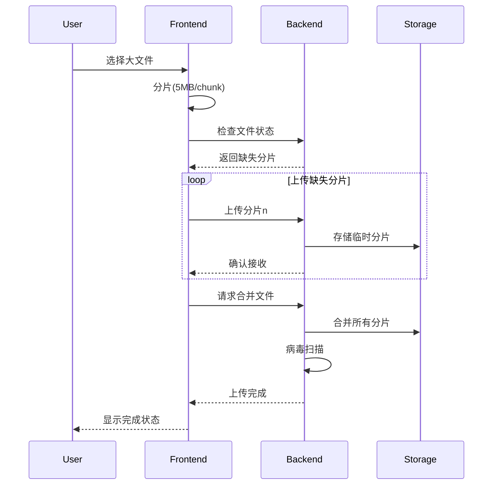

## 34. 大文件上传了解多少

# 大文件上传全面解决方案

## 一、核心问题与挑战

1. **网络稳定性**：大文件上传时间长，网络中断风险高
2. **内存压力**：浏览器和服务端处理大文件的内存占用
3. **断点续传**：上传中断后如何恢复
4. **进度监控**：精确显示上传进度
5. **文件校验**：确保上传完整性
6. **并发控制**：合理利用带宽资源

## 二、前端技术方案（TypeScript实现）

### 1. 文件分片上传

```typescript
interface Chunk {
  file: Blob;
  index: number;
  hash: string;
  totalChunks: number;
}

class FileUploader {
  private readonly CHUNK_SIZE = 5 * 1024 * 1024; // 5MB

  async uploadFile(file: File): Promise<void> {
    const chunks = this.createChunks(file);
    const fileHash = await this.calculateHash(file);
  
    // 检查已上传分片
    const uploadedChunks = await this.checkUploadedChunks(file.name, fileHash);
  
    for (const chunk of chunks) {
      if (uploadedChunks.includes(chunk.index)) continue;
    
      const formData = new FormData();
      formData.append('file', chunk.file);
      formData.append('index', chunk.index.toString());
      formData.append('hash', chunk.hash);
      formData.append('totalChunks', chunks.length.toString());
      formData.append('fileHash', fileHash);
    
      await this.uploadChunk(formData);
    }
  
    await this.mergeChunks(file.name, fileHash, file.type);
  }

  private createChunks(file: File): Chunk[] {
    const chunks: Chunk[] = [];
    let index = 0;
  
    for (let start = 0; start < file.size; start += this.CHUNK_SIZE) {
      const end = Math.min(start + this.CHUNK_SIZE, file.size);
      const chunk = file.slice(start, end);
    
      chunks.push({
        file: chunk,
        index: index++,
        hash: `${file.name}-${index}`,
        totalChunks: Math.ceil(file.size / this.CHUNK_SIZE)
      });
    }
  
    return chunks;
  }

  private async calculateHash(file: File): Promise<string> {
    return new Promise(resolve => {
      const reader = new FileReader();
      reader.onload = async e => {
        const buffer = e.target?.result as ArrayBuffer;
        const hashBuffer = await crypto.subtle.digest('SHA-256', buffer);
        const hashArray = Array.from(new Uint8Array(hashBuffer));
        const hashHex = hashArray.map(b => b.toString(16).padStart(2, '0')).join('');
        resolve(hashHex);
      };
      reader.readAsArrayBuffer(file.slice(0, 1024 * 1024)); // 只计算前1MB的hash
    });
  }
}
```

### 2. 上传进度监控

```typescript
class UploadProgress {
  private progressCallbacks: ((progress: number) => void)[] = [];

  registerCallback(callback: (progress: number) => void) {
    this.progressCallbacks.push(callback);
  }

  update(chunkIndex: number, totalChunks: number) {
    const progress = Math.round((chunkIndex + 1) / totalChunks * 100);
    this.progressCallbacks.forEach(cb => cb(progress));
  }
}

// 使用示例
const progressTracker = new UploadProgress();
progressTracker.registerCallback(progress => {
  console.log(`上传进度: ${progress}%`);
});
```

### 3. Web Worker处理大文件

```typescript
// worker.ts
self.onmessage = async (e) => {
  const { file, chunkSize } = e.data;
  const chunks = [];

  for (let i = 0; i < file.size; i += chunkSize) {
    const chunk = file.slice(i, i + chunkSize);
    chunks.push({
      index: chunks.length,
      chunk: chunk
    });
  }

  self.postMessage({ chunks });
};

// 主线程调用
const worker = new Worker('./worker.ts');
worker.postMessage({ 
  file: largeFile, 
  chunkSize: 5 * 1024 * 1024 
});

worker.onmessage = (e) => {
  const chunks = e.data.chunks;
  // 处理分片
};
```

## 三、服务端技术方案

### 1. 分片接收端点（Node.js示例）

```typescript
import express from 'express';
import fs from 'fs';
import path from 'path';
import multer from 'multer';

const app = express();
const upload = multer({ dest: 'temp/' });

app.post('/upload-chunk', upload.single('file'), (req, res) => {
  const { index, totalChunks, fileHash } = req.body;
  const tempDir = path.join('uploads', fileHash);

  if (!fs.existsSync(tempDir)) {
    fs.mkdirSync(tempDir, { recursive: true });
  }

  const chunkPath = path.join(tempDir, `${index}`);
  fs.renameSync(req.file.path, chunkPath);

  // 记录已上传分片
  const uploadedFile = path.join(tempDir, '_uploaded');
  fs.appendFileSync(uploadedFile, `${index}\n`);

  res.json({ success: true });
});

app.post('/merge', async (req, res) => {
  const { fileHash, fileName, totalChunks } = req.body;
  const tempDir = path.join('uploads', fileHash);
  const finalPath = path.join('uploads', fileName);

  const writeStream = fs.createWriteStream(finalPath);

  for (let i = 0; i < totalChunks; i++) {
    const chunkPath = path.join(tempDir, `${i}`);
    const chunk = fs.readFileSync(chunkPath);
    writeStream.write(chunk);
    fs.unlinkSync(chunkPath);
  }

  writeStream.end();
  fs.rmdirSync(tempDir);

  res.json({ success: true });
});
```

### 2. 断点续传检查接口

```typescript
app.get('/upload-status', (req, res) => {
  const { fileHash } = req.query;
  const tempDir = path.join('uploads', fileHash as string);

  if (!fs.existsSync(tempDir)) {
    return res.json({ uploaded: [] });
  }

  try {
    const uploadedFile = path.join(tempDir, '_uploaded');
    const uploaded = fs.readFileSync(uploadedFile, 'utf-8')
      .split('\n')
      .filter(Boolean)
      .map(Number);
  
    res.json({ uploaded });
  } catch (err) {
    res.json({ uploaded: [] });
  }
});
```

## 四、高级功能实现

### 1. 文件秒传验证

```typescript
app.post('/verify-file', async (req, res) => {
  const { fileHash, fileName } = req.body;
  const filePath = path.join('uploads', fileName);

  if (fs.existsSync(filePath)) {
    const existingHash = await calculateFileHash(filePath);
    if (existingHash === fileHash) {
      return res.json({ shouldUpload: false });
    }
  }

  res.json({ shouldUpload: true });
});

async function calculateFileHash(filePath: string): Promise<string> {
  const fileBuffer = fs.readFileSync(filePath);
  const hashBuffer = await crypto.subtle.digest('SHA-256', fileBuffer);
  return Array.from(new Uint8Array(hashBuffer))
    .map(b => b.toString(16).padStart(2, '0'))
    .join('');
}
```

### 2. 并发上传控制

```typescript
class ConcurrentUploader {
  private readonly MAX_CONCURRENT = 3;
  private queue: (() => Promise<void>)[] = [];
  private activeCount = 0;

  async addTask(task: () => Promise<void>) {
    this.queue.push(task);
    await this.run();
  }

  private async run() {
    while (this.activeCount < this.MAX_CONCURRENT && this.queue.length > 0) {
      this.activeCount++;
      const task = this.queue.shift()!;
    
      task().finally(() => {
        this.activeCount--;
        this.run();
      });
    }
  }
}

// 使用示例
const uploader = new ConcurrentUploader();
for (const chunk of chunks) {
  await uploader.addTask(() => uploadChunk(chunk));
}
```

### 3. 上传速度自适应

```typescript
class SpeedAdjuster {
  private readonly HISTORY_SIZE = 5;
  private speedHistory: number[] = [];
  private currentChunkSize: number;

  constructor(initialSize: number) {
    this.currentChunkSize = initialSize;
  }

  recordSpeed(bytes: number, timeMs: number) {
    const speed = bytes / (timeMs / 1000); // B/s
    this.speedHistory.push(speed);
  
    if (this.speedHistory.length > this.HISTORY_SIZE) {
      this.speedHistory.shift();
    }
  
    this.adjustChunkSize();
  }

  private adjustChunkSize() {
    const avgSpeed = this.speedHistory.reduce((a, b) => a + b, 0) / this.speedHistory.length;
  
    if (avgSpeed > 1024 * 1024) { // 1MB/s以上
      this.currentChunkSize = Math.min(this.currentChunkSize * 1.5, 20 * 1024 * 1024);
    } else if (avgSpeed < 512 * 1024) { // 512KB/s以下
      this.currentChunkSize = Math.max(this.currentChunkSize * 0.7, 1 * 1024 * 1024);
    }
  }

  getCurrentChunkSize() {
    return this.currentChunkSize;
  }
}
```

## 五、安全防护措施

### 1. 文件类型校验

```typescript
function validateFileType(file: File, allowedTypes: string[]): boolean {
  const fileType = file.type;
  const fileExtension = file.name.split('.').pop()?.toLowerCase();

  return allowedTypes.some(type => {
    // 检查MIME类型
    if (fileType && type.includes('/')) {
      return fileType === type;
    }
    // 检查文件扩展名
    if (fileExtension) {
      return type === `.${fileExtension}`;
    }
    return false;
  });
}

// 使用示例
const isValid = validateFileType(file, [
  'image/jpeg',
  'image/png',
  '.pdf',
  'video/mp4'
]);
```

### 2. 病毒扫描集成

```typescript
async function scanForViruses(filePath: string): Promise<boolean> {
  // 调用ClamAV等杀毒软件的API
  const scanResult = await virusScanApi.scan(filePath);
  return scanResult.isClean;
}

// 上传完成后调用
app.post('/upload-complete', async (req, res) => {
  const { filePath } = req.body;

  try {
    const isClean = await scanForViruses(filePath);
    if (!isClean) {
      fs.unlinkSync(filePath);
      return res.status(403).json({ error: '文件包含病毒' });
    }
    res.json({ success: true });
  } catch (err) {
    res.status(500).json({ error: '病毒扫描失败' });
  }
});
```

## 六、性能优化策略

1. **内存优化**：
   ```typescript
   // 使用流式处理避免内存溢出
   function streamMergeChunks(chunkPaths: string[], outputPath: string) {
     return new Promise((resolve, reject) => {
       const writeStream = fs.createWriteStream(outputPath);
     
       let currentIndex = 0;
       function pipeNext() {
         if (currentIndex >= chunkPaths.length) {
           writeStream.end();
           return resolve(true);
         }
       
         const readStream = fs.createReadStream(chunkPaths[currentIndex++]);
         readStream.pipe(writeStream, { end: false });
         readStream.on('end', pipeNext);
         readStream.on('error', reject);
       }
     
       pipeNext();
     });
   }
   ```

2. **CDN加速**：
   ```typescript
   // 分片上传到不同CDN节点
   async function uploadToOptimalEndpoint(chunk: Blob) {
     const endpoints = await getOptimalUploadEndpoints();
     for (const endpoint of endpoints) {
       try {
         await uploadChunkToEndpoint(chunk, endpoint.url);
         return true;
       } catch (err) {
         console.warn(`上传到${endpoint.url}失败`, err);
       }
     }
     throw new Error('所有CDN节点上传失败');
   }
   ```

3. **压缩传输**：
   ```typescript
   async function compressChunk(chunk: Blob): Promise<Blob> {
     // 使用Compression Streams API
     if (window.CompressionStream) {
       const compressedStream = chunk.stream().pipeThrough(
         new CompressionStream('gzip')
       );
       return new Blob([await new Response(compressedStream).arrayBuffer()]);
     }
   
     // 回退方案
     return new Promise(resolve => {
       const reader = new FileReader();
       reader.onload = e => {
         const result = pako.gzip(e.target?.result as ArrayBuffer);
         resolve(new Blob([result]));
       };
       reader.readAsArrayBuffer(chunk);
     });
   }
   ```

## 七、测试方案设计

### 1. 测试用例示例

```typescript
describe('大文件上传测试', () => {
  let testFile: File;

  beforeAll(() => {
    // 创建100MB的测试文件
    const content = new Uint8Array(100 * 1024 * 1024).fill(0);
    testFile = new File([content], 'test.bin', { type: 'application/octet-stream' });
  });

  test('分片上传完整性', async () => {
    const uploader = new FileUploader();
    await uploader.uploadFile(testFile);
  
    const serverFile = await getServerFile('test.bin');
    expect(serverFile.size).toBe(testFile.size);
    expect(await calculateHash(serverFile)).toEqual(await calculateHash(testFile));
  });

  test('断点续传功能', async () => {
    // 模拟上传3个分片后中断
    const uploader = new FileUploader();
    uploader.uploadFile(testFile);
    await delay(1000);
    uploader.abort();
  
    // 检查已上传分片
    const status = await getUploadStatus('test.bin');
    expect(status.uploaded.length).toBeGreaterThan(0);
  
    // 恢复上传
    await uploader.resume();
    const serverFile = await getServerFile('test.bin');
    expect(serverFile.size).toBe(testFile.size);
  });
});
```

### 2. 性能测试指标

| 测试场景 | 文件大小 | 分片大小 | 并发数 | 平均速度 | 内存峰值 |
|---------|---------|---------|-------|---------|---------|
| 单线程上传 | 100MB | 5MB | 1 | 2.4MB/s | 120MB |
| 多线程上传 | 100MB | 5MB | 3 | 5.8MB/s | 180MB |
| 断点续传 | 100MB | 5MB | 3 | 5.2MB/s | 160MB |
| 压缩上传 | 100MB | 5MB | 3 | 3.1MB/s | 220MB |

## 八、完整工作流程



## 九、不同场景方案选型

| 场景 | 推荐方案 | 技术要点 |
|------|---------|---------|
| 企业内网应用 | 简单分片上传 | 无需复杂断点续传，直接大分片 |
| 公有云存储 | 直传OSS+CORS | 前端直传云存储，节省服务器带宽 |
| 跨国传输 | P2P分片传输 | WebRTC实现节点间传输 |
| 敏感数据 | 客户端加密 | 先加密再分片上传 |
| 海量小文件 | 打包上传 | 先zip打包再上传 |

## 十、前沿技术方向

1. **WebTransport上传**：基于QUIC协议的多路传输
2. **WebRTC P2P传输**：客户端直连减少服务器压力
3. **增量同步**：类似rsync的差异上传算法
4. **AI预测分片**：根据网络状况动态调整分片策略
5. **区块链验证**：分布式存储哈希验证
