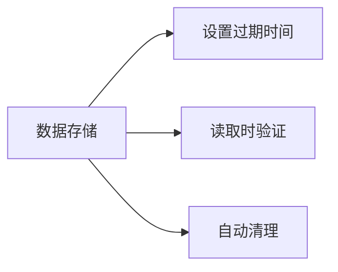

## 53. 如何通过设置失效时间清除本地存储的数据？

在 Web 开发中，可以通过以下方案实现带失效时间的本地数据存储，以下是完整实现方案（使用 TypeScript）：

---

### 🌟 **解决方案全景图**


---

### 一、**基础实现方案**
#### 1. 封装 localStorage 带过期时间
```typescript
// lib/storage.ts
interface StorageItem<T> {
  value: T
  expiry: number // 时间戳
}

export const setWithExpiry = <T>(key: string, value: T, ttl: number): void => {
  const now = new Date()
  const item: StorageItem<T> = {
    value,
    expiry: now.getTime() + ttl * 1000 // 转换为毫秒
  }
  localStorage.setItem(key, JSON.stringify(item))
}

export const getWithExpiry = <T>(key: string): T | null => {
  const itemStr = localStorage.getItem(key)
  if (!itemStr) return null

  const item: StorageItem<T> = JSON.parse(itemStr)
  const now = new Date()

  // 数据已过期
  if (now.getTime() > item.expiry) {
    localStorage.removeItem(key)
    return null
  }

  return item.value
}

// 使用示例
setWithExpiry('user_token', 'abc123', 3600) // 1小时后过期
const token = getWithExpiry<string>('user_token')
```

#### 2. 封装 sessionStorage 版本
```typescript
export const setSessionWithExpiry = <T>(key: string, value: T, ttl: number): void => {
  const item: StorageItem<T> = {
    value,
    expiry: Date.now() + ttl * 1000
  }
  sessionStorage.setItem(key, JSON.stringify(item))
}
```

---

### 二、**高级功能扩展**
#### 1. 自动清理机制
```typescript
// 启动时清理过期项目
export const cleanupExpiredItems = (): void => {
  Object.keys(localStorage).forEach(key => {
    getWithExpiry(key) // 读取时会自动清理过期项
  })
}

// 应用初始化时调用
if (typeof window !== 'undefined') {
  cleanupExpiredItems()
}
```

#### 2. 支持加密存储（敏感数据）
```typescript
import CryptoJS from 'crypto-js'

const SECRET_KEY = 'your-secret-key'

export const setEncryptedWithExpiry = <T>(
  key: string,
  value: T,
  ttl: number
): void => {
  const item: StorageItem<T> = {
    value,
    expiry: Date.now() + ttl * 1000
  }
  const ciphertext = CryptoJS.AES.encrypt(
    JSON.stringify(item),
    SECRET_KEY
  ).toString()
  localStorage.setItem(key, ciphertext)
}
```

---

### 三、**React Hook 封装**
```typescript
// hooks/useExpiryStorage.ts
import { useEffect, useState } from 'react'

export function useExpiryStorage<T>(
  key: string,
  initialValue: T,
  ttl?: number
): [T, (value: T) => void] {
  const [storedValue, setStoredValue] = useState<T>(() => {
    if (typeof window === 'undefined') return initialValue

    const item = getWithExpiry<T>(key)
    return item ?? initialValue
  })

  const setValue = (value: T) => {
    if (typeof window === 'undefined') return

    if (ttl) {
      setWithExpiry(key, value, ttl)
    } else {
      localStorage.setItem(key, JSON.stringify(value))
    }
    setStoredValue(value)
  }

  useEffect(() => {
    const handleStorageChange = (e: StorageEvent) => {
      if (e.key === key) {
        setStoredValue(e.newValue ? JSON.parse(e.newValue) : initialValue)
      }
    }

    window.addEventListener('storage', handleStorageChange)
    return () => window.removeEventListener('storage', handleStorageChange)
  }, [key])

  return [storedValue, setValue]
}

// 使用示例
const [token, setToken] = useExpiryStorage('auth_token', null, 3600)
```

---

### 四、**替代方案对比**
| 方案                | 优点                      | 缺点                     |
|---------------------|--------------------------|--------------------------|
| 自定义封装          | 完全控制逻辑              | 需要手动实现所有功能      |
| store2 库           | 内置过期时间支持          | 依赖第三方库              |
| IndexedDB           | 存储量大                  | API 复杂                 |
| Cookies             | 自动过期                  | 存储空间小(4KB)          |

#### 使用 store2 库实现
```typescript
import store from 'store2'

// 设置带过期时间的数据（单位：秒）
store.set('user_data', { name: 'John' }, 3600)

// 获取数据（自动处理过期）
const user = store.get('user_data')
```

---

### 五、**TypeScript 类型增强**
```typescript
// types/storage.d.ts
declare module '@/lib/storage' {
  export function setWithExpiry<T>(
    key: string,
    value: T,
    ttl: number
  ): void

  export function getWithExpiry<T>(
    key: string
  ): T | null
}
```

---

### 六、**实际应用场景**
#### 1. 用户登录凭证
```typescript
// 登录成功后
setWithExpiry('auth_token', response.token, response.expires_in)

// 路由守卫检查
const token = getWithExpiry<string>('auth_token')
if (!token) {
  router.push('/login')
}
```

#### 2. 接口数据缓存
```typescript
async function fetchProducts() {
  const cached = getWithExpiry<Product[]>('products_cache')
  if (cached) return cached

  const products = await api.getProducts()
  setWithExpiry('products_cache', products, 300) // 5分钟缓存
  return products
}
```

---

### ⚠️ **注意事项**
1. **SSR 兼容性**：
   ```typescript
   if (typeof window !== 'undefined') {
     // 客户端代码
   }
   ```

2. **存储限制**：
    - localStorage 约 5MB
    - sessionStorage 约 5MB
    - 超出限制会抛出 `QuotaExceededError`

3. **敏感信息安全**：
   ```typescript
   // 不要存储未加密的敏感信息
   setWithExpiry('credit_card', cardNumber, 3600) // ❌ 危险！
   ```

需要针对特定框架（如 Next.js、React Native）的特殊处理方案吗？或者需要更详细的安全加密实现？