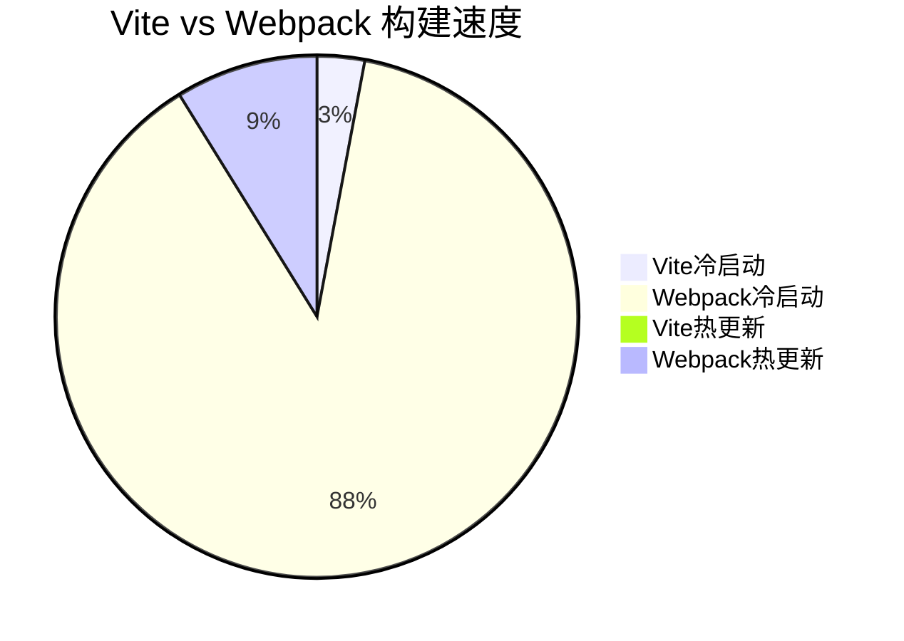

## 54-1. 如果不使用脚手架，如果用 vite 构建一个自己的 react 应用

不使用脚手架，手动通过 Vite 构建 React 应用的完整指南（TypeScript 版）：

---

### 🚀 **项目初始化**
```bash
mkdir react-vite-manual
cd react-vite-manual
npm init -y
git init
```

---

### 📦 **核心依赖安装**
```bash
# React 基础
npm install react react-dom
npm install @types/react @types/react-dom --save-dev

# Vite 核心
npm install vite @vitejs/plugin-react --save-dev

# 样式处理
npm install sass --save-dev

# 工具链
npm install typescript @types/node --save-dev
```

---

### ⚙️ **Vite 配置**
#### 1. `vite.config.ts` (完整配置)
```typescript
import { defineConfig } from 'vite'
import react from '@vitejs/plugin-react'
import path from 'path'

export default defineConfig({
  plugins: [
    react({
      babel: {
        plugins: [
          ['@babel/plugin-transform-react-jsx', { runtime: 'automatic' }]
        ]
      }
    })
  ],
  resolve: {
    alias: {
      '@': path.resolve(__dirname, './src'),
      '~': path.resolve(__dirname, './public')
    }
  },
  css: {
    modules: {
      localsConvention: 'camelCaseOnly',
      generateScopedName: '[name]__[local]--[hash:base64:5]'
    },
    preprocessorOptions: {
      scss: {
        additionalData: `@import "@/styles/variables.scss";`
      }
    }
  },
  server: {
    port: 5173,
    open: true,
    cors: true,
    proxy: {
      '/api': {
        target: 'http://localhost:3000',
        changeOrigin: true,
        rewrite: path => path.replace(/^\/api/, '')
      }
    }
  },
  build: {
    outDir: 'dist',
    assetsInlineLimit: 4096,
    rollupOptions: {
      output: {
        assetFileNames: 'assets/[name].[hash].[ext]',
        chunkFileNames: 'chunks/[name].[hash].js',
        entryFileNames: 'entries/[name].[hash].js'
      }
    }
  },
  optimizeDeps: {
    include: ['react', 'react-dom']
  }
})
```

#### 2. 环境变量配置
```bash
# 创建环境文件
touch .env .env.development .env.production
```

`.env.development` 示例：
```ini
VITE_API_BASE=/api
VITE_DEBUG=true
```

`.env.production` 示例：
```ini
VITE_API_BASE=https://api.example.com
```

---

### 📁 **项目结构**
```bash
├── src/
│   ├── assets/            # 静态资源
│   ├── components/        # 通用组件
│   ├── hooks/             # 自定义Hook
│   ├── styles/            # 全局样式
│   │   └── variables.scss # SCSS变量
│   ├── utils/             # 工具函数
│   ├── App.tsx            # 根组件
│   └── main.tsx           # 入口文件
├── public/                # 公共资源
│   ├── favicon.ico
│   └── robots.txt
├── index.html             # 入口HTML
├── tsconfig.json
└── vite.config.ts
```

---

### 🖥️ **关键文件实现**
#### 1. `index.html` (Vite入口)
```html
<!DOCTYPE html>
<html lang="zh-CN">
<head>
  <meta charset="UTF-8">
  <meta name="viewport" content="width=device-width, initial-scale=1.0">
  <title>Vite + React</title>
</head>
<body>
  <div id="root"></div>
  <script type="module" src="/src/main.tsx"></script>
</body>
</html>
```

#### 2. `src/main.tsx`
```typescript
import React from 'react'
import ReactDOM from 'react-dom/client'
import App from './App'
import './styles/main.scss'

ReactDOM.createRoot(document.getElementById('root')!).render(
  <React.StrictMode>
    <App />
  </React.StrictMode>
)
```

#### 3. `src/App.tsx` (带CSS Modules)
```typescript
import { useState } from 'react'
import styles from './App.module.scss'
import logo from './assets/vite.svg'

function App() {
  const [count, setCount] = useState(0)

  return (
    <div className={styles.container}>
      
      <h1>Vite + React</h1>
      <button 
        onClick={() => setCount(c => c + 1)}
        className={styles.button}
      >
        Count: {count}
      </button>
    </div>
  )
}

export default App
```

#### 4. `src/App.module.scss`
```scss
.container {
  text-align: center;
  padding: 2rem;

  .logo {
    height: 6em;
    will-change: filter;
    transition: filter 300ms;

    &:hover {
      filter: drop-shadow(0 0 2em #646cffaa);
    }
  }

  .button {
    padding: 0.6em 1.2em;
    font-size: 1em;
    font-weight: 500;
    background: linear-gradient(90deg, #646cff, #61dafb);
  }
}
```

---

### 🔧 **TypeScript 配置**
#### `tsconfig.json`
```json
{
  "compilerOptions": {
    "target": "ESNext",
    "module": "ESNext",
    "moduleResolution": "node",
    "jsx": "react-jsx",
    "strict": true,
    "baseUrl": "./",
    "paths": {
      "@/*": ["src/*"]
    },
    "types": ["vite/client"],
    "esModuleInterop": true,
    "skipLibCheck": true,
    "forceConsistentCasingInFileNames": true
  },
  "include": ["src", "vite.config.ts"],
  "exclude": ["node_modules"]
}
```

---

### 📜 **NPM 脚本配置**
```json
{
  "scripts": {
    "dev": "vite",
    "build": "tsc && vite build",
    "preview": "vite preview",
    "type-check": "tsc --noEmit",
    "lint": "eslint src --ext .ts,.tsx"
  }
}
```

---

### 🛠️ **高级功能扩展**
#### 1. 环境变量智能提示
```typescript
// src/env.d.ts
interface ImportMetaEnv {
  readonly VITE_API_BASE: string
  readonly VITE_DEBUG: string
}

interface ImportMeta {
  readonly env: ImportMetaEnv
}
```

#### 2. SVG组件化
```bash
npm install @vitejs/plugin-react-svg --save-dev
```

```typescript
// vite.config.ts
import svgr from '@vitejs/plugin-react-svg'

plugins: [
  svgr({
    svgrOptions: {
      icon: true
    }
  })
]
```

使用示例：
```typescript
import { ReactComponent as Logo } from './logo.svg'
<Logo className="icon" />
```

#### 3. 性能优化配置
```typescript
// vite.config.ts
build: {
  chunkSizeWarningLimit: 1000,
  rollupOptions: {
    output: {
      manualChunks(id) {
        if (id.includes('node_modules')) {
          return 'vendor'
        }
      }
    }
  }
}
```

---

### 🔍 **开发与生产差异**
| 功能         | 开发模式                      | 生产模式                     |
|--------------|-----------------------------|----------------------------|
| 源码         | 未编译                       | 压缩+混淆                  |
| 错误提示     | 完整堆栈                     | 简化信息                   |
| 环境变量     | .env.development             | .env.production            |
| 热更新       | 支持                         | 无                        |
| 资源路径     | /src/...                    | /assets/...               |

---

### ⚡ **性能优化技巧**
1. **图片压缩**
   ```bash
   npm install vite-plugin-imagemin --save-dev
   ```
   ```typescript
   import imagemin from 'vite-plugin-imagemin'
   plugins: [
     imagemin({
       gifsicle: { optimizationLevel: 3 },
       mozjpeg: { quality: 75 },
       pngquant: { quality: [0.8, 0.9] }
     })
   ]
   ```

2. **按需加载**
   ```typescript
   const HeavyComponent = React.lazy(() => import('./HeavyComponent'))
   <Suspense fallback={<Loading />}>
     <HeavyComponent />
   </Suspense>
   ```

3. **CDN 引入**
   ```typescript
   // vite.config.ts
   import { splitVendorChunkPlugin } from 'vite'
   plugins: [
     splitVendorChunkPlugin()
   ]
   ```

---

### 🛡️ **安全加固方案**
1. **CSP 策略**
   ```html
   <!-- index.html -->
   <meta http-equiv="Content-Security-Policy" content="default-src 'self'">
   ```

2. **敏感信息保护**
   ```bash
   npm install vite-plugin-env-compatible --save-dev
   ```
   ```typescript
   // vite.config.ts
   import envCompatible from 'vite-plugin-env-compatible'
   plugins: [
     envCompatible({ prefix: 'VITE_' })
   ]
   ```

---

### ⚠️ **常见问题解决**
1. **热更新失效**：
   ```typescript
   server: {
     watch: {
       usePolling: true // 解决WSL2下的HMR问题
     }
   }
   ```

2. **路径别名报错**：
   ```bash
   npm install @types/node --save-dev
   ```

3. **SCSS变量全局注入**：
   ```typescript
   css: {
     preprocessorOptions: {
       scss: {
         additionalData: `@import "@/styles/variables.scss";`
       }
     }
   }
   ```

---

### 🌟 **Vite 优势体现**


通过这套配置，你将获得：
- 闪电般的启动和热更新
- 开箱即用的TypeScript支持
- 现代化的CSS处理方案
- 高度可定制的构建流程
- 生产级优化配置

需要扩展测试配置(Jest/Vitest)、状态管理(Redux/Zustand)或路由方案(React Router)的实现吗？可以进一步探讨具体需求。